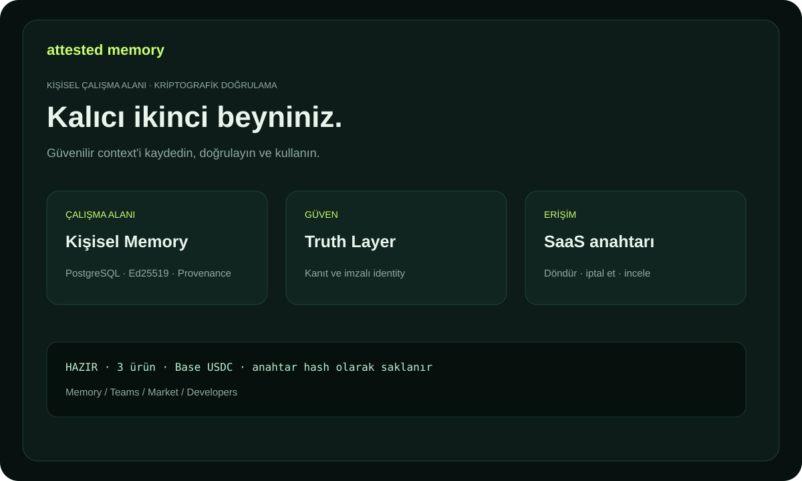

# Attested Memory — belgeler

İnsanlar, ekipler ve ajanlar için kalıcı ve doğrulanabilir bilgi altyapısıdır.
Her Memory Unit imzalı actor identity, kaynaklar, truth status ve provenance içerebilir.

## Ürünler

- **Personal Attested Memory** — kişisel kararlar ve araştırma.
- **Team Memory OS** — korumalı namespace içinde şirket bilgisi.
- **Expert Memory Market** — kaynaklı, ücretli uzman bilgisi.

## İlk beş dakika

1. `/billing` adresini açıp bir plan seçin.
2. Herkese açık EVM adresiyle tam bir invoice oluşturun.
3. Base üzerinde canonical USDC gönderip transaction hash'i onaylayın.
4. `ask_...` anahtarını saklayın; checkout üzerinden 48 saat kurtarılabilir.
5. Bir actor identity bağlayıp ilk Memory Unit'i oluşturun.

Tam rehber: [USER_GUIDE.md](USER_GUIDE.md). Kullanım örnekleri: [USE_CASES.md](USE_CASES.md). Terimler: [GLOSSARY.md](GLOSSARY.md). Trial: [TRIAL.md](TRIAL.md). KOVA federation: [KOVA_CAPABILITIES.md](KOVA_CAPABILITIES.md).

Expert Memory Market için [alıcı, publisher ve entegrasyon rehberi](MARKET_GUIDE.md) ile [Market kullanım örneklerine](MARKET_USE_CASES.md) bakın.

API entegrasyonu ve capability yayını için [geliştirici rehberine](DEVELOPER_GUIDE.md) bakın.
