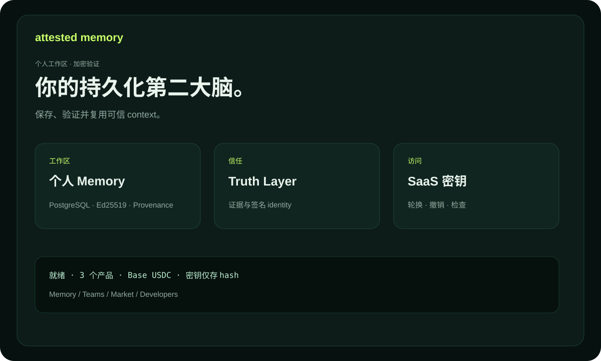

# Attested Memory — 文档

面向个人、团队和智能体的持久化、可验证知识系统。每个 Memory Unit 都可以包含签名的 actor identity、来源、truth status 和 provenance。

## 产品

- **Personal Attested Memory** — 个人决策与研究。
- **Team Memory OS** — 受保护 namespace 内的团队知识。
- **Expert Memory Market** — 带来源的付费专家知识。

## 前五分钟

1. 打开 `/billing` 并选择套餐。
2. 使用公开 EVM 地址创建精确 invoice。
3. 在 Base 上发送 canonical USDC，并确认 transaction hash。
4. 保存 `ask_...` 密钥；checkout 可在48小时内恢复。
5. 连接 actor identity，创建第一个 Memory Unit。

完整指南见 [USER_GUIDE.md](USER_GUIDE.md)，实践场景见 [USE_CASES.md](USE_CASES.md)，术语见 [GLOSSARY.md](GLOSSARY.md)，trial 见 [TRIAL.md](TRIAL.md)，KOVA federation 见 [KOVA_CAPABILITIES.md](KOVA_CAPABILITIES.md)。

Expert Memory Market 请参阅[购买者、publisher 与集成指南](MARKET_GUIDE.md)和[市场使用场景](MARKET_USE_CASES.md)。

API 集成与 capability 发布请参阅[开发者指南](DEVELOPER_GUIDE.md)。
