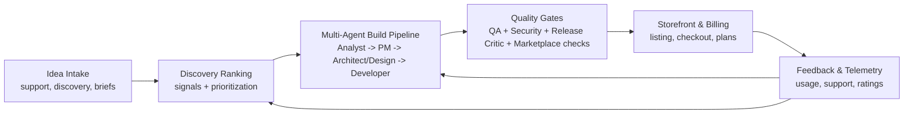
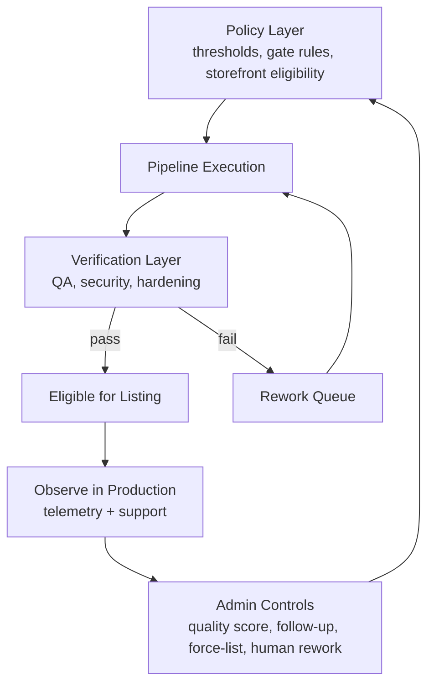
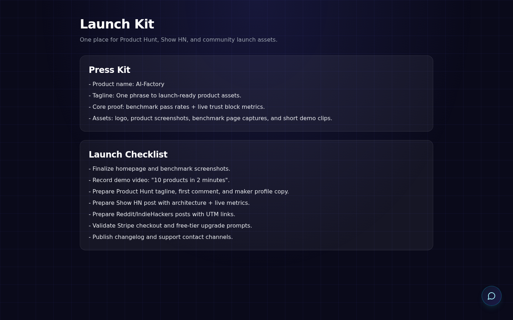
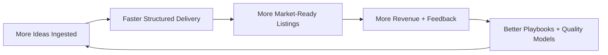

# AI-Factory Investor Deck (Current State)

This document is the investor-facing narrative of the platform as it exists today: what the system does, how control loops work, and why this is commercially scalable.

---

## 1) Executive Snapshot

AI-Factory is an autonomous product engine, not a single app generator.

It combines:
- continuous idea intake and discovery ranking;
- a staged multi-agent delivery pipeline;
- strict quality gates before storefront listing;
- human override controls for governance;
- feedback loops that push real usage signals back into production.

**Core investment thesis:** the moat is operational quality at scale (policy + telemetry + recovery), not one-off generation.

---

## 2) Product System (Block Diagram)

**Mechanic:** products flow forward only when passing quality policy; failures and weak outputs are routed back into controlled rework loops.

---

## 3) Governance Mechanics (How Quality Is Enforced)

### Key mechanics investors should note
- **Storefront conversion is explicit:** `Completed` and `On storefront` are separate metrics by design.
- **Automated remediation exists:** completed-but-not-listed products can be auto-routed for rework (with configurable limits/modes).
- **Human governance exists:** operators can set follow-up (`planned` / `not_pursuing`), assign quality score, force-list, or trigger manual rework.
- **No blind automation:** policy and admin decisions are persisted and observable in admin APIs and operational logs.

---

## 4) Live Product Surfaces (Screenshots)

### Admin dashboard and conversion visibility

### Pipeline monitor (stateful product flow + controls)

### Discovery queue (ranked opportunities)

### LLM observability (provider/model/task-level logs)

### Public growth surface (launch/distribution content)

---

## 5) Unit Economics Flywheel (Mechanics)

**Why this matters:** every shipped product improves future throughput and conversion by feeding policy, prompts, and rework heuristics.

---

## 6) What Is Already Operational

- Multi-agent staged execution across product lifecycle.
- Persisted pipeline state and recovery/requeue logic.
- Marketplace/listing quality gates with explicit reasons.
- Admin observability stack (pipeline, logs, security, director/discovery).
- Public commercialization surfaces (plans, checkout, referral, launch pages).
- Build/runtime hardening: frontend data loading supports build-safe local fallback to avoid loopback API coupling in image/build phase.

---

## 7) Current Control Plane for Scale

### Human-in-the-loop controls
- mark non-listed outputs as `planned` or `not_pursuing`;
- assign human quality scores;
- force-list selectively when business context justifies it;
- inject manual rework into pipeline for targeted correction.

### Automated control loops
- auto-detect products stuck at `completed` but not eligible for storefront;
- configurable remediation mode (`full` vs `annotate_only`);
- per-cycle caps to avoid unstable mass reprocessing.

**Result:** growth pressure and quality pressure are balanced by policy, not ad hoc operator work.

---

## 8) Due Diligence Talking Points

- **Defensibility:** policy + telemetry + recovery loops produce compounding operational advantage.
- **Scalability:** one control plane governs many generated products with consistent quality criteria.
- **Governability:** admin controls can override or defer automation without losing auditability.
- **Commercial readiness:** listing, distribution pages, and billing stack are integrated with production pipeline outputs.

---

## 9) Related Docs

- `docs/investor-functional-overview.md` — concise functional snapshot.
- `docs/factory-capabilities.md` — complete capability map.
- `docs/factory-metrics-reference.md` — metric definitions and interpretation.
- `docs/admin-guide.md` — admin surfaces and operations reference.
