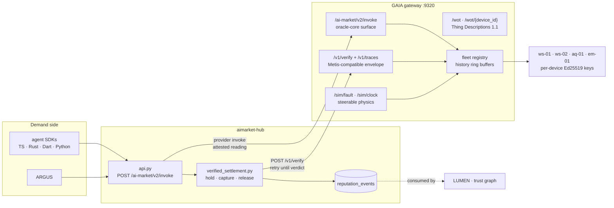
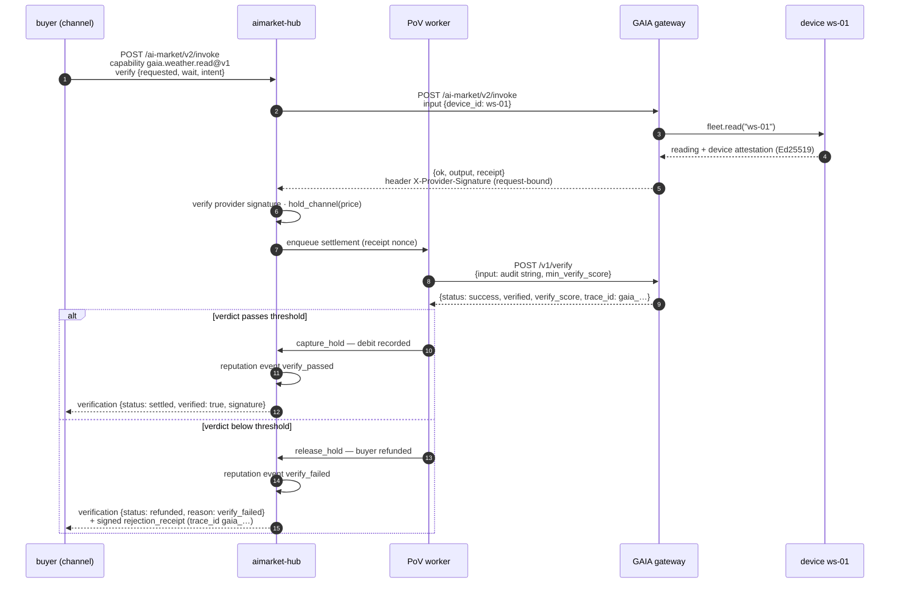
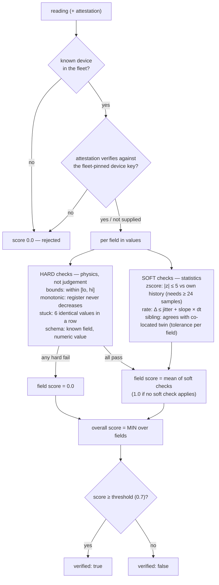
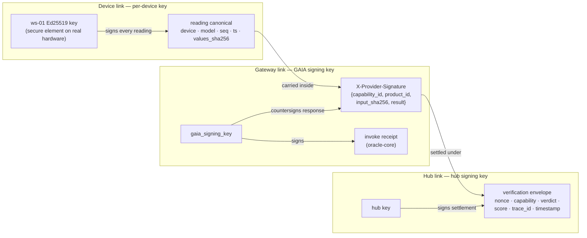
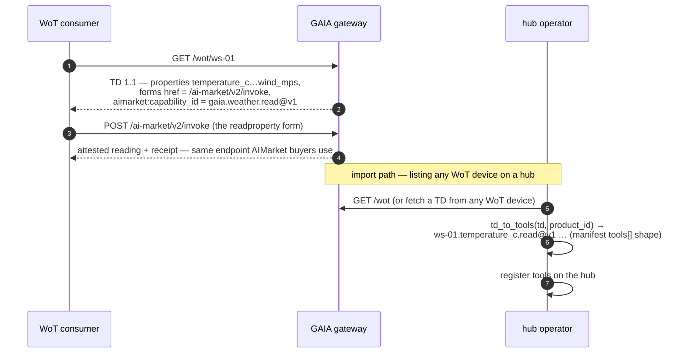

# IoT / physical oracles — GAIA ⇄ AIMarket integration

**GAIA** ([`gaia/`](https://github.com/alexar76/gaia)) is the ecosystem's **physical-world oracle gateway** — virtual
IoT devices sold as paid, Ed25519-attested AIMarket v2 capabilities, plus a statistical
plausibility verifier that speaks the same `/v1/verify` envelope as Metis, so the hub's
[Pay-on-Verified](./pay-on-verified.md) escrow can settle sensor readings: an honest reading
captures the hold, a lying sensor refunds the buyer with a signed rejection receipt and a
`verify_failed` reputation event.

This document describes how physical data plugs into the market: the oracle-class taxonomy,
the full paid-and-verified reading path, the plausibility math, the device identity chain,
the W3C WoT bridge, and the micro-billing pattern for sub-cent readings.

> 📖 Satellite view: [`gaia/README.md`](https://github.com/alexar76/gaia/blob/main/README.md)
> 📖 Map surface: [`atlas/`](https://github.com/alexar76/atlas) — [atlas.modelmarket.dev](https://atlas.modelmarket.dev/) plots GAIA LIVE/SIM pins + ATLAS Analyst
> 📖 **Add a sensor (dev):** [`add-gaia-atlas-sensor.md`](./add-gaia-atlas-sensor.md) (EN · RU · ES · FR · ZH)
> 📖 Protocol profile: [`aimarket-protocol/spec.md` § 4.3 IoT / Physical-Oracle Profile](https://github.com/alexar76/aimarket-protocol/blob/main/spec.md)
> 📖 Escrow mechanics: [`pay-on-verified.md`](./pay-on-verified.md)

---

## 1. The third oracle class

The ecosystem already sells two kinds of ground truth. GAIA adds the third — and the hardest,
because the physical world offers no proofs, only evidence:

| Class | Satellites | Ground truth | How a claim is checked | Verdict shape |
|---|---|---|---|---|
| **Mathematical** | [`oracles/`](https://github.com/alexar76/oracles) ×17, oracle-family | provable computation | proof re-verified deterministically, byte-for-byte | true / false |
| **Cognitive** | [Metis](https://github.com/alexar76/metis) | LLM judgement vs buyer intent | Understanding Council → MoA → verifier | `verify_score` ∈ [0, 1] |
| **Physical** | **GAIA** | sensors observing the world | statistical plausibility: physics bounds, history, co-located siblings, attested identity | `verify_score` ∈ [0, 1] |

A math oracle's answer is right or wrong. A sensor's answer can only be *plausible* — consistent
with physics, with its own past, and with the co-located device next to it. GAIA turns that
plausibility into the same machine verdict the escrow already understands.



The demo fleet: two weather stations (`ws-01`, `ws-02`) sharing one simulated site truth —
the sibling check needs a twin — one air-quality node (`aq-01`), one energy meter (`em-01`).
Models imitate BME280/SDS011/SCD30/Shelly-EM-class hardware.

Code: [`gaia/gaia/capabilities.py`](https://github.com/alexar76/gaia/blob/main/gaia/capabilities.py) (runtime + capability spec) ·
[`gaia/gaia/app.py`](https://github.com/alexar76/gaia/blob/main/gaia/app.py) (HTTP surface) ·
devices in [`gaia/gaia/devices/`](https://github.com/alexar76/gaia/tree/main/gaia/devices/).

---

## 2. A paid, verified reading — end to end

The buyer opts in with the standard [`verify` block](./pay-on-verified.md#2-the-wire-surface);
nothing GAIA-specific is on the buyer's wire. The hub holds the channel funds, GAIA delivers the
attested reading immediately, and the Pay-on-Verified worker asks GAIA's *verifier* endpoint
whether the reading is plausible before any money moves.



Wiring is one env var on the hub — the verifier slot is an **interface**, not a Metis lock-in:

```bash
export AIMARKET_VERIFY_METIS_URL=http://gaia-host:9320
```

Details that matter:

- **The envelope is byte-compatible with Metis.** GAIA returns the full
  `{answer, status, verified, verify_score, route, depth, iterations, clarifications, usage,
  trace_id}` shape, parses the hub's composed audit string (`Task (buyer intent): … Delivered
  result (JSON): …`), and mirrors Metis's engine-error semantics — unparseable input is HTTP
  200 with `status: "error"`, never a 5xx, so the hub's bounded-retry + fail-open/closed
  policy applies unchanged. Operators name the actual verdict source via
  `AIMARKET_VERIFY_VERIFIER_ID` (e.g. `gaia.verify@v1`), so the settlement envelope
  attributes the verdict honestly instead of defaulting to `metis.verify@v1`.
- **Verdicts are auditable.** `GET /v1/traces/{trace_id}` returns the named checks — a refund
  says *which physics* convicted the sensor (`zscore:temperature_c`,
  `sibling:temperature_c`, …), not just a score.
- **An offline device costs nothing.** A `dropout` fault raises 503 at GAIA; the hub maps
  provider 5xx to 502 and neither debits nor holds.

Guaranteed by tests: [`gaia/tests/test_hub_e2e.py`](https://github.com/alexar76/gaia/blob/main/tests/test_hub_e2e.py) — a full
in-process hub + GAIA world with the supply-security handshake ON: honest reading → capture at
the 1¢ ledger quantum + `verify_passed`; spiked sensor → output delivered but hold released,
signed `verification_rejection`, `verify_failed`; dropout → 502 and an untouched balance.
Envelope shape and error semantics:
[`gaia/tests/test_app_and_wot.py`](https://github.com/alexar76/gaia/blob/main/tests/test_app_and_wot.py).

Code: [`gaia/gaia/verifier.py`](https://github.com/alexar76/gaia/blob/main/gaia/verifier.py) (envelope + audit-string parsing) ·
hub side in
[`aimarket-hub/aimarket_hub/verified_settlement.py`](https://github.com/alexar76/aimarket-hub/blob/main/aimarket_hub/verified_settlement.py).

---

## 3. The plausibility verifier

Deterministic, sub-millisecond, no LLM. Identity is checked first and is decisive; then every
field in the reading is judged independently; then the *worst* field decides.



Design choices worth naming:

- **MIN over fields, not mean** — a sensor lies one field at a time; averaging would let three
  honest channels launder one fabricated one.
- **Hard checks disqualify** — a bounds violation, a rolled-back energy register, or the
  dead-sensor signature (a continuous field frozen to 4 decimals for 6 readings) are physics
  violations, not statistical judgement calls.
- **Statistics that know when to abstain** — z-scores are skipped below 24 samples of history
  and for legitimately bursty fields (`wind_mps`, `current_a`, `power_w` — an honest kettle
  would be convicted); std is floored per field so noise-free history can't divide by zero;
  a reading is never judged against its own history entry.
- **Siblings share truth** — `ws-01` and `ws-02` sample one simulated site, so their
  temperature/humidity/pressure/wind must agree within per-field tolerances (only when the
  sibling reading is fresh, ≤ 10 min).

The fault-injection surface maps each realistic sensor failure onto the check that catches it:

| Fault (`POST /sim/fault`) | Simulates | Caught by |
|---|---|---|
| `stuck` | dead sensor, ADC latch-up | `stuck:*` — run of identical values on a continuous field |
| `spike` | loose wire, EMI burst | `zscore:*` + `rate:*` + `sibling:*` (and `bounds:*` if absurd enough) |
| `drift` | miscalibration, ageing | `sibling:*` divergence — slow drift evades z-score and rate |
| `dropout` | power / radio loss | no reading at all: 503 → hub 502, no hold, no debit |

Guaranteed by tests:
[`gaia/tests/test_attestation_and_plausibility.py`](https://github.com/alexar76/gaia/blob/main/tests/test_attestation_and_plausibility.py) —
honest readings on all four devices score ≥ 0.9; spike, stuck, drift-vs-honest-twin, and
energy-register rollback are each caught by the named check; a forged attestation zeroes the
score; an unknown device is rejected.

Code: [`gaia/gaia/plausibility.py`](https://github.com/alexar76/gaia/blob/main/gaia/plausibility.py) (physics table + checks +
scoring) · [`gaia/gaia/fleet.py`](https://github.com/alexar76/gaia/blob/main/gaia/fleet.py) (history ring buffers, sibling
registry).

---

## 4. The device identity chain

Plausible numbers from an unproven sensor are worth nothing, so identity is layered under the
statistics. Three keys sign three different claims:



- **Device → reading**: `seq` + `ts` in the canonical make replays evident; the values hash
  makes tampering evident. Verification pins the expected pubkey from the fleet registry
  (published by the free `gaia.fleet.status@v1`) — an attestation that only verifies against
  its self-carried key proves consistency, not identity, so the wrong key or a tampered value
  fails outright and zeroes the plausibility score.
- **Gateway → response**: the `X-Provider-Signature` header signs a *request-bound* canonical
  (input hash included), mirroring the hub's extraction rule
  (`payload.get("result", payload.get("output", payload))`) byte-for-byte — so the hub's
  `AIMARKET_SUPPLY_REQUIRE_RESPONSE_SIG=1` handshake verifies against GAIA unmodified. The
  oracle-core receipt signs what was sold and billed.
- **Hub → settlement**: the verification envelope carries its own Ed25519 signature with the
  `gaia_…` trace id, closing the chain buyer-side.

On real hardware the device link moves into a secure element / TEE — the slot the AIMarket
protocol already reserves via `tee_attestation`
([spec § 4.3](https://github.com/alexar76/aimarket-protocol/blob/main/spec.md)).

Guaranteed by tests: attestation round-trip / wrong-key / tamper cases in
[`gaia/tests/test_attestation_and_plausibility.py`](https://github.com/alexar76/gaia/blob/main/tests/test_attestation_and_plausibility.py);
the request-bound provider signature is recomputed and verified in
[`gaia/tests/test_app_and_wot.py`](https://github.com/alexar76/gaia/blob/main/tests/test_app_and_wot.py) and enforced end-to-end
(hub side) in [`gaia/tests/test_hub_e2e.py`](https://github.com/alexar76/gaia/blob/main/tests/test_hub_e2e.py).

Code: [`gaia/gaia/attestation.py`](https://github.com/alexar76/gaia/blob/main/gaia/attestation.py) ·
[`gaia/gaia/middleware.py`](https://github.com/alexar76/gaia/blob/main/gaia/middleware.py) (pure-ASGI response signer).

---

## 5. The W3C WoT bridge

GAIA devices are simultaneously WoT Things and AIMarket capabilities — one JSON-LD document,
two consumer worlds. Export: every device publishes a [Thing Description 1.1](https://www.w3.org/TR/wot-thing-description11/)
whose property forms point at the AIMarket invoke endpoint, with `aimarket:capability_id`,
`aimarket:price_per_call_usd`, `aimarket:device_pubkey` extension terms. Import:
`gaia.wot.td_to_tools()` turns *any* TD into the tool dicts a hub manifest accepts.



The import direction produces schema, not service: each property becomes
`<thing>.<property>.read@v1`, each action `<thing>.<action>@v1`, prices from
`aimarket:price_per_call_usd` with a caller default — actually serving the invokes needs a
proxy to the Thing's own forms, which is deployment wiring, not schema. The demo TDs declare
`nosec` security — see § 7.

Guaranteed by tests: export/re-import round-trip (4 properties → 4 tools, prices and units
preserved) in [`gaia/tests/test_app_and_wot.py`](https://github.com/alexar76/gaia/blob/main/tests/test_app_and_wot.py).

Code: [`gaia/gaia/wot.py`](https://github.com/alexar76/gaia/blob/main/gaia/wot.py) · endpoints in
[`gaia/gaia/app.py`](https://github.com/alexar76/gaia/blob/main/gaia/app.py).

---

## 6. Micro-billing: cents, bundles, and (not yet) streams

Sensor readings are sub-cent goods inside a whole-cent economy:

- **The ledger quantum.** Channel accounting bills in whole cents (ceiling): a $0.001
  `gaia.weather.read@v1` invoke debits 1¢. Polling a sensor read-by-read overpays 10×.
- **The escrow floor.** Pay-on-Verified skips invokes cheaper than
  `AIMARKET_VERIFY_MIN_PRICE_USD` (default **$0.05**) with `reason: below_price_floor` — a
  single $0.001 read is only verified if the operator lowers the floor (the e2e test sets
  $0.0005 to exercise exactly this).
- **The answer: bundles.** `gaia.window@v1` sells N readings (1–500) in one $0.05 invoke —
  one debit that lands exactly on the ledger quantum *and* clears the default escrow floor,
  so a window of sensor data can be bought verified with no operator tuning. At N = 50 the
  per-reading price matches the single-read price; beyond that, bulk is cheaper.
- **Not specified: per-event streaming.** Server-push with per-message micro-debit is
  deliberately out of the v2 protocol — the invoke surface is request/response, and a
  conforming gateway emulates subscription by bundle polling. The
  [IoT / Physical-Oracle Profile in `aimarket-protocol/spec.md` § 4.3](https://github.com/alexar76/aimarket-protocol/blob/main/spec.md)
  sketches a future `subscribe` primitive (SSE/WebSocket forms debiting a channel-backed
  quota) as additive future work.

Guaranteed by tests: the 1¢ debit for a $0.001 verified read in
[`gaia/tests/test_hub_e2e.py`](https://github.com/alexar76/gaia/blob/main/tests/test_hub_e2e.py); window bundle ordering and
count in [`gaia/tests/test_app_and_wot.py`](https://github.com/alexar76/gaia/blob/main/tests/test_app_and_wot.py).

---

## 7. Simulation control and configuration

GAIA is a simulator satellite — steerable physics is the point, so the sim surface is mounted
openly (a real-hardware GAIA would not mount it):

The `/sim/*` control plane steers the physics — it is the point of a *simulator* gateway.
Because it mutates the shared runtime that also backs the PAID capabilities, it is
**fail-closed in production**: the routes are only mounted when `sim_control_enabled()` is
true (on by default, off when `AIFACTORY_PROD=1`, always overridable with `GAIA_SIM_CONTROL`),
and when `GAIA_SIM_TOKEN` is set every call must present a matching `X-Sim-Token`. A
real-hardware GAIA never mounts them.

| Endpoint | Body | Effect |
|---|---|---|
| `POST /sim/fault` | `{device_id, kind: none·stuck·spike·drift·dropout, fields?, magnitude?}` | Turn a device into a liar (or heal it) — gated |
| `POST /sim/clock` | `{advance_s}` | Advance the shared simulated clock — gated |

All devices sample one `SimClock`, so co-located simulators stay physically consistent and a
day of weather can pass in a millisecond, reproducibly. In autotick mode each read advances
time by `GAIA_TICK_S`.

| Variable | Default | Description |
|---|---|---|
| `GAIA_PORT` | `9320` | HTTP port (`python -m gaia.main`) |
| `GAIA_PUBLIC_URL` | `http://localhost:9320` | Base URL advertised in the manifest and WoT forms |
| `GAIA_KEY_DIR` | `data/devices` | Per-device Ed25519 key files |
| `GAIA_SIGNING_KEY_PATH` | `data/gaia_signing_key` | Gateway key — receipts + `X-Provider-Signature` |
| `GAIA_TICK_S` | `60` | Simulated seconds the clock advances per read (autotick) |
| `GAIA_CORS_ORIGINS` | `*` | CORS origins for the FastAPI app |
| `GAIA_SIM_CONTROL` | (auto) | Force the `/sim/*` control plane on/off; auto = off under `AIFACTORY_PROD` |
| `GAIA_SIM_TOKEN` | — | When set, `/sim/*` requires a matching `X-Sim-Token` |
| `GAIA_VERIFY_RATE_LIMIT` | `120` | Per-client `/v1/verify` requests per minute |
| `GAIA_AUX_RATE_LIMIT` | `240` | Per-client limit for `/wot`, `/v1/traces` |
| `GAIA_SIM_RATE_LIMIT` | `30` | Per-client limit for `/sim/*` |

Hub-side wiring (all standard [Pay-on-Verified knobs](./pay-on-verified.md), nothing
GAIA-specific):

| Variable | Default | Role here |
|---|---|---|
| `AIMARKET_VERIFY_METIS_URL` | — | Point it at GAIA to gate escrow with plausibility |
| `AIMARKET_VERIFY_VERIFIER_ID` | `metis.verify@v1` | Set to `gaia.verify@v1` so envelopes attribute the verdict honestly |
| `AIMARKET_VERIFY_MIN_PRICE_USD` | `0.05` | Floor — lower it to verify sub-cent single reads |
| `AIMARKET_VERIFY_SCORE_THRESHOLD` | `0.7` | Capture threshold (matches GAIA's default) |
| `AIMARKET_SUPPLY_REQUIRE_RESPONSE_SIG` | `0` | `1` enforces the `X-Provider-Signature` handshake |

---

## 7a. Security posture (audited)

An adversarial audit hardened the escrow path before exposure; the guarantees that matter:

- **Attestation is mandatory, fail-closed.** The verifier rejects any reading without a
  valid device attestation (`verified: false`, score `0.0`) — omitting the signature is never
  cheaper than forging it. This enforces the spec §4.3 MUST at the gate, not just on paper.
- **The buyer intent can't hijack the verdict.** The hub rejects a `verify.intent` containing
  the reserved audit-prompt delimiters (`400 verify_invalid`), and GAIA's text parser keys off
  the *last* delimiter, so a smuggled `Delivered result (JSON):` block cannot redirect the parse.
- **Settled readings can't be replayed.** The escrow verifier tracks a per-device sequence
  high-water; a genuine attested reading replayed to double-settle is rejected as stale.
- **The hub owns its money bar.** Capture requires `verified` **and** `verify_score ≥
  threshold`, so a buggy or compromised verifier returning `verified: true` at a low score
  cannot move money.
- **The control plane is production-gated.** `/sim/*` is fail-closed under `AIFACTORY_PROD`
  and optionally shared-secret gated; every GAIA-added route is per-client rate-limited;
  adversarially deep or oversized verify input returns an error envelope, never a 5xx.

Guaranteed by tests:
[`gaia/tests/test_security.py`](https://github.com/alexar76/gaia/blob/main/tests/test_security.py) and the hub regressions in
[`aimarket-hub/tests/test_verified_settlement.py`](https://github.com/alexar76/aimarket-hub/blob/main/tests/test_verified_settlement.py)
(`test_intent_with_reserved_marker_rejected`, `test_hub_requires_score_above_threshold_not_just_verified`).

---

## 8. What it gives — honestly

- **Settlement grounded in physics** — the escrow verdict cites named checks
  (`sibling:temperature_c`, `monotonic:energy_wh`), auditable at `/v1/traces/{trace_id}`,
  instead of an opaque score.
- **The verifier slot proven to be an interface** — the same hub, the same `verify` block,
  the same envelope; only the URL changes between an LLM auditor and a statistical service.
- **Standards-bridged supply** — any WoT Thing Description imports to a hub listing
  mechanically; every GAIA device exports one.

And the honest limits:

- **Simulators, not hardware.** The physics is modelled, the "secure element" is a key file.
  The wire surfaces are real; the sensors are not.
- **Seller-hosted verification is a conflict of interest.** GAIA judging GAIA demonstrates
  the mechanism, not a trust topology — production runs the plausibility verifier on a
  separate operator (or N-of-M composed with Metis), exactly as the
  [protocol profile](https://github.com/alexar76/aimarket-protocol/blob/main/spec.md) requires (SHOULD NOT be the seller).
- **Thresholds are sim-calibrated.** Bounds, jitter floors, slopes, and sibling tolerances in
  the physics table match the simulators; real sensors need per-datasheet calibration or
  honest hardware gets convicted by statistics.
- **Plausibility is not truth.** A calibrated, colluding fleet can lie consistently within all
  tolerances; statistics bound *how much* a sensor can lie, they do not eliminate it.
  Independent siblings, separate operators, and TEE-backed device keys each shrink the gap.
- **`nosec` WoT security scheme is demo-only** — payment gating lives at the hub, and a real
  deployment declares a proper TD security scheme.
