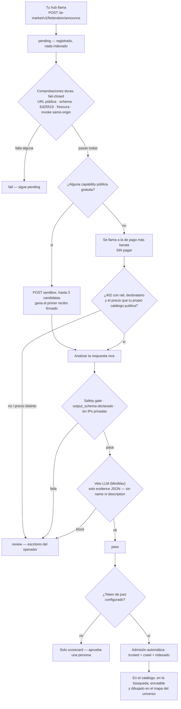
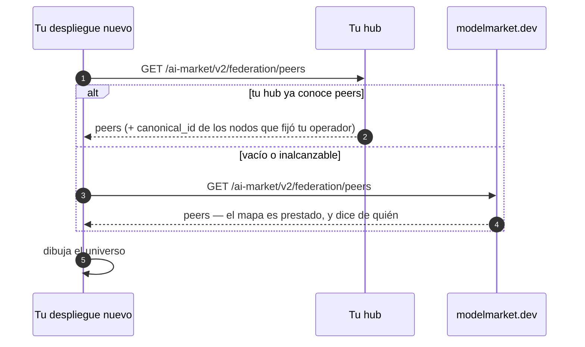

# Levantar tu hub y unirte a la federación

> **English:** [join-the-federation.md](./join-the-federation.md) · **Русский:** [join-the-federation.ru.md](./join-the-federation.ru.md) · **Français:** [join-the-federation.fr.md](./join-the-federation.fr.md) · **中文:** [join-the-federation.zh.md](./join-the-federation.zh.md)
>
> Dos comandos para arrancar un hub. Una cabecera para que te vean. La admisión después es automática: el sandbox puntúa lo que el hub *hace*, no lo que *dice*.

---

## 1. Arrancar un hub

```bash
pip install aimarket-hub
aimarket serve          # → http://localhost:9083
```

Comprueba que responde:

```bash
curl -s http://localhost:9083/.well-known/ai-market.json | jq .
```

Docker: `Dockerfile.standalone` y `docker-compose.yml` van en el paquete.

Tienes un hub vacío. Lo que sigue es conectarlo a otros.

## 2. Señalar un hub que quieras leer

El discovery es un crawl BFS desde una lista de seeds. Las seeds son **URL completas
`.well-known`**, separadas por comas.

```bash
AIMARKET_HUB_URL=https://your-hub.example \
AIMARKET_SEED_LIST=https://modelmarket.dev/.well-known/ai-market.json \
aimarket serve
```

Tu hub crawlea ese peer, verifica el manifiesto firmado e indexa sus capabilities **después**
de que el ensayo sandbox del peer pase (o tras un pin de seed). La confianza no es simétrica.

## 3. Que te vean

El crawler se identifica en cada fetch de discovery:

```
GET /.well-known/ai-market.json
X-AIMarket-Crawler: https://your-hub.example
```

El hub de referencia lo envía solo si `AIMARKET_HUB_URL` es tu URL pública real.

Anuncio explícito:

```bash
curl -X POST https://their-hub.example/ai-market/v2/federation/announce \
  -H 'Content-Type: application/json' \
  -d '{"hub_url": "https://your-hub.example", "hub_name": "Your Hub"}'
```

Respuesta `200` con `status: pending`, `trusted: false`, `assay_scheduled: true`.
No hace falta credencial para ser visible. El golpe a la puerta no te hace trusted.

## 4. Qué ocurre después del golpe (automático)


Nada en ese camino lee lo que escribiste sobre ti. Un nombre y una descripción son
afirmaciones; un recibo firmado y un 402 que cita tu propio catálogo son evidencia.


Visible y trusted son cosas distintas. El hueco es cuarentena, no una bandeja humana.
El operador **no** pulsa Approve por cada capability.

| | `pending` | `active` + trusted |
|---|---|---|
| `/federation/peers` | sí, array `pending` | sí |
| Terminal del hub y Alien Monitor | sí, rail **Knocking** / panel **KNOCKS** | sí |
| Manifiesto | solo preview, si está activo | sí |
| Búsqueda | **no** | sí |
| Invoke / enrutado | **no** | sí |
| `.well-known` publicado | `observed_hubs` | `peers` |

El hub receptor ejecuta solo un **ensayo sandbox**:

1. **Cuarentena:** announce → `pending`, nada indexado.
2. **Comprobaciones duras (fail-closed):** HTTPS público, esquema, coherencia Ed25519,
   frescura, invoke same-origin.
3. **POST sandbox** de una capability **pública y gratuita**. El recibo firmado debe
   verificar contra la misma clave. Idea de la fábrica: puntuar la salida *en ejecución*,
   no el folleto (`product_automated_verify`).
4. **Análisis** del payload vivo (safety gate, `output_schema`, sin IPs privadas).
   Nombres y descripciones **no** se puntúan.
5. **Veto LLM opcional** (`AIMARKET_FEDERATION_JUDGE_URL`): el juez ve un JSON de evidencia
   sin `name` / `description`. `block` → `review`. `ok` no anula un fail duro.
6. **`pass` admite solo** si hay un **token del juez** (`AIMARKET_FEDERATION_JUDGE_KEY` o
   `OPENROUTER_API_KEY` de MiniMax). Sin token, `pass` es un scorecard: Approve manual.
   `fail` / `review` siguen pending.

El **escritorio del operador** (`/operator`) es la vía de excepción: hubs solo de pago
(sin SKU gratis para el sandbox), vetos del juez y dismiss.

Detalles (EN·RU·ES·FR·ZH): [`aimarket-hub/docs/federation-admission.es.md`](https://github.com/alexar76/aimarket-hub/blob/main/docs/federation-admission.es.md).

## 4b. De dónde sale tu mapa

Un hub recién desplegado tiene su federación vacía, así que su Alien Monitor dibujaría un
universo vacío — hasta que le pregunta a alguien que ya tiene uno. Para eso existe una lista
de arranque versionada (`alien-monitor/config/map_sources.json`), con una regla: **primero
tu propio hub; otro solo cuando el tuyo no tiene nada que mostrar.**



Sustituye los respaldos con `ALIEN_MAP_SOURCES`. La lista es **semilla, nunca autoridad**:
cada URL devuelta pasa el control SSRF y la identidad sigue viniendo de los seeds fijados
por tu operador.

## 5. Gossip de observación y previews

La visibilidad de direcciones está siempre on. Variables: `AIMARKET_FEDERATION_ASSAY` (default `1`),
`AIMARKET_FEDERATION_AUTO_ADMIT` (`1`), `AIMARKET_FEDERATION_JUDGE_URL` (vacío),
`AIMARKET_FEDERATION_ASSAY_REQUIRE` (`0`).

El golpe no indexa. Indexa un `pass` del sandbox (o una excepción humana).

## 6. Quién hay ahí fuera

```bash
curl -s https://your-hub.example/ai-market/v2/federation/peers | jq '{count, pending_count, pending}'
curl -s "https://your-hub.example/ai-market/v2/federation/assay?url=https://stranger.example" | jq .
```

En el navegador: terminal del hub y **Alien Monitor** (mapa LIVE, etiqueta `pending`).
**UNI** los filtra.

## 7. Clientes x402

Cada `402` lleva el payload x402 V2 en `PAYMENT-REQUIRED` (base64). El hub **no** acepta
`PAYMENT-SIGNATURE`. Catálogo: `GET /discovery/resources`. Hace falta `AIFACTORY_CRYPTO_ENABLED=1`
y un destinatario de pago.

## 8. Si quieres que compren tus capabilities

1. `.well-known` y manifiesto válidos.
2. Firmar el manifiesto.
3. `generated_at` fresco.
4. Al menos una capability **pública gratuita** para el sandbox. Un hub solo de pago
   se queda en `review` hasta una excepción humana.
5. Announce (o crawlearlos). El resto es automático.

## 9. Relacionado

- Protocolo §2.4 / §2.5 / §2.6 — [`aimarket-protocol/spec.md`](https://github.com/alexar76/aimarket-protocol/blob/main/spec.md)
- Admisión — [`aimarket-hub/docs/federation-admission.es.md`](https://github.com/alexar76/aimarket-hub/blob/main/docs/federation-admission.es.md)
- Governance — [`aimarket-protocol/GOVERNANCE.md`](https://github.com/alexar76/aimarket-protocol/blob/main/GOVERNANCE.md)
