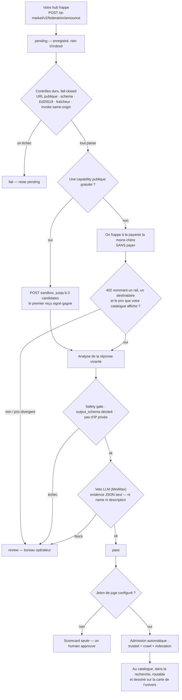
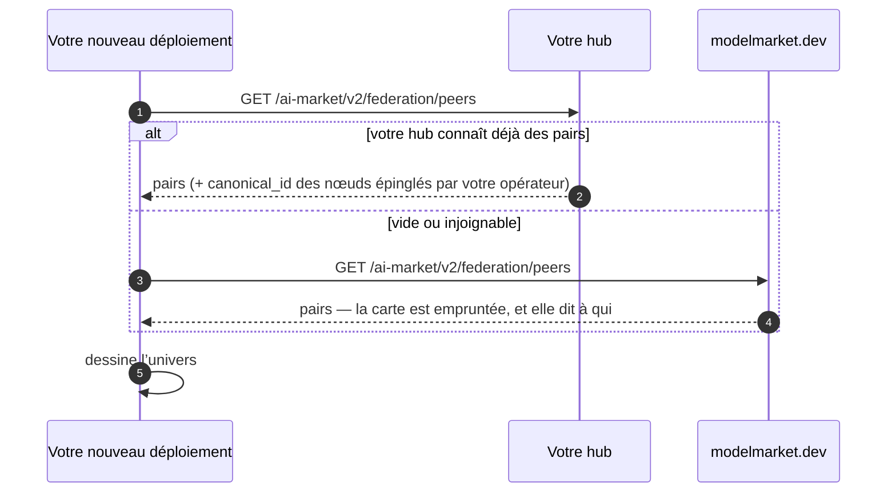

# Lancer votre hub et rejoindre la fédération

> **English:** [join-the-federation.md](./join-the-federation.md) · **Русский:** [join-the-federation.ru.md](./join-the-federation.ru.md) · **Español:** [join-the-federation.es.md](./join-the-federation.es.md) · **中文:** [join-the-federation.zh.md](./join-the-federation.zh.md)
>
> Deux commandes pour lancer un hub. Un en-tête pour être vu. L’admission ensuite est automatique : le sandbox note ce que le hub *fait*, pas ce qu’il *écrit*.

---

## 1. Lancer un hub

```bash
pip install aimarket-hub
aimarket serve          # → http://localhost:9083
```

Vérifier :

```bash
curl -s http://localhost:9083/.well-known/ai-market.json | jq .
```

Docker : `Dockerfile.standalone` et `docker-compose.yml` sont dans le paquet.

## 2. Pointer vers un hub à lire

Le discovery est un crawl BFS depuis une liste de seeds — **URL `.well-known` complètes**,
séparées par des virgules.

```bash
AIMARKET_HUB_URL=https://your-hub.example \
AIMARKET_SEED_LIST=https://modelmarket.dev/.well-known/ai-market.json \
aimarket serve
```

Votre hub crawle ce pair, vérifie le manifeste signé et indexe ses capabilities **après**
que l’essai sandbox du pair a passé (ou après un pin de seed). La confiance n’est pas
symétrique.

## 3. Être vu

Le crawler s’identifie à chaque fetch :

```
GET /.well-known/ai-market.json
X-AIMarket-Crawler: https://your-hub.example
```

Annonce explicite :

```bash
curl -X POST https://their-hub.example/ai-market/v2/federation/announce \
  -H 'Content-Type: application/json' \
  -d '{"hub_url": "https://your-hub.example", "hub_name": "Your Hub"}'
```

Réponse `200` : `status: pending`, `trusted: false`, `assay_scheduled: true`.
Aucun credential n’est requis pour devenir visible. Le knock ne vous rend pas trusted.

## 4. Après le knock (automatique)


Rien dans ce chemin ne lit ce que vous avez écrit sur vous-même. Un nom et une description
sont des affirmations ; un reçu signé et un 402 qui cite votre propre catalogue sont des
preuves.


Visible et trusted sont distincts. L’écart est la quarantaine, pas une boîte humaine.
L’opérateur **ne** clique **pas** Approve pour chaque capability.

| | `pending` | `active` + trusted |
|---|---|---|
| `/federation/peers` | oui, tableau `pending` | oui |
| Terminal du hub et Alien Monitor | oui, rail **Knocking** / panneau **KNOCKS** | oui |
| Manifeste | preview seulement, si activé | oui |
| Recherche | **non** | oui |
| Invoke / routage | **non** | oui |
| `.well-known` publié | `observed_hubs` | `peers` |

Le hub destinataire lance tout seul un **essai sandbox** :

1. **Quarantaine :** announce → `pending`, rien n’est indexé.
2. **Contrôles durs (fail-closed) :** HTTPS public, schéma, cohérence Ed25519, fraîcheur,
   invoke same-origin.
3. **POST sandbox** d’une capability **publique et gratuite**. Le reçu signé doit
   vérifier contre la même clé. Idée usine : noter la sortie *en cours d’exécution*,
   pas la brochure (`product_automated_verify`).
4. **Analyse** du payload vivant (safety gate, `output_schema`, pas d’IP privées).
   Noms et descriptions **ne** sont **pas** notés.
5. **Veto LLM optionnel** (`AIMARKET_FEDERATION_JUDGE_URL`) : le juge voit un JSON
   d’évidence sans `name` / `description`. `block` → `review`. `ok` ne surmonte pas un fail dur.
6. **`pass` admet tout seul** seulement s’il y a un **jeton juge**
   (`AIMARKET_FEDERATION_JUDGE_KEY` ou `OPENROUTER_API_KEY` MiniMax). Sans jeton,
   `pass` est un scorecard : Approve manuel. `fail` / `review` restent pending.

Le **bureau opérateur** (`/operator`) est la voie d’exception : hubs payants-only
(pas de SKU gratuit pour le sandbox), vetos du juge, dismiss.

Détails (EN·RU·ES·FR·ZH) : [`aimarket-hub/docs/federation-admission.fr.md`](https://github.com/alexar76/aimarket-hub/blob/main/docs/federation-admission.fr.md).

## 4b. D’où vient votre carte

Un hub tout juste déployé a sa propre fédération vide : son Alien Monitor dessinerait un
univers vide — jusqu’à ce qu’il demande à quelqu’un qui en a déjà une. D’où une liste
d’amorçage versionnée (`alien-monitor/config/map_sources.json`), avec une règle : **votre
hub d’abord, un autre seulement quand le vôtre n’a rien à montrer.**



Remplacez les secours avec `ALIEN_MAP_SOURCES`. La liste est une **graine, jamais une
autorité** : chaque URL rendue passe le contrôle SSRF, et l’identité vient toujours des
seeds épinglés par votre opérateur.

## 5. Gossip d’observation et previews

La visibilité des adresses est toujours on. Variables : `AIMARKET_FEDERATION_ASSAY` (`1`),
`AIMARKET_FEDERATION_AUTO_ADMIT` (`1`), `AIMARKET_FEDERATION_JUDGE_URL` (vide),
`AIMARKET_FEDERATION_ASSAY_REQUIRE` (`0`).

Le knock n’indexe pas. Un `pass` sandbox (ou une exception humaine) le fait.

## 6. Voir qui est là

```bash
curl -s https://your-hub.example/ai-market/v2/federation/peers | jq '{count, pending_count, pending}'
curl -s "https://your-hub.example/ai-market/v2/federation/assay?url=https://stranger.example" | jq .
```

Navigateur : terminal du hub et **Alien Monitor** (carte LIVE, tag `pending`). **UNI** les filtre.

## 7. Clients x402

Chaque `402` porte le payload x402 V2 dans `PAYMENT-REQUIRED` (base64). Le hub **n’accepte pas**
`PAYMENT-SIGNATURE`. Catalogue : `GET /discovery/resources`. Il faut `AIFACTORY_CRYPTO_ENABLED=1`
et un destinataire de paiement.

## 8. Pour que vos capabilities soient achetées

1. `.well-known` et manifeste valides.
2. Signer le manifeste.
3. `generated_at` frais.
4. Au moins une capability **publique gratuite** pour le sandbox. Un hub payant-only
   reste en `review` jusqu’à une exception humaine.
5. Announce (ou crawlez-les). Le reste est automatique.

## 9. Liens

- Protocole §2.4 / §2.5 / §2.6 — [`aimarket-protocol/spec.md`](https://github.com/alexar76/aimarket-protocol/blob/main/spec.md)
- Admission — [`aimarket-hub/docs/federation-admission.fr.md`](https://github.com/alexar76/aimarket-hub/blob/main/docs/federation-admission.fr.md)
- Governance — [`aimarket-protocol/GOVERNANCE.md`](https://github.com/alexar76/aimarket-protocol/blob/main/GOVERNANCE.md)
