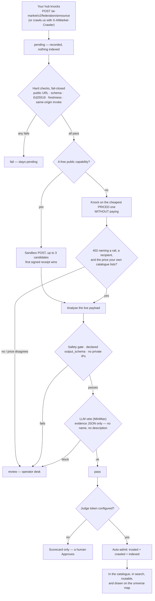
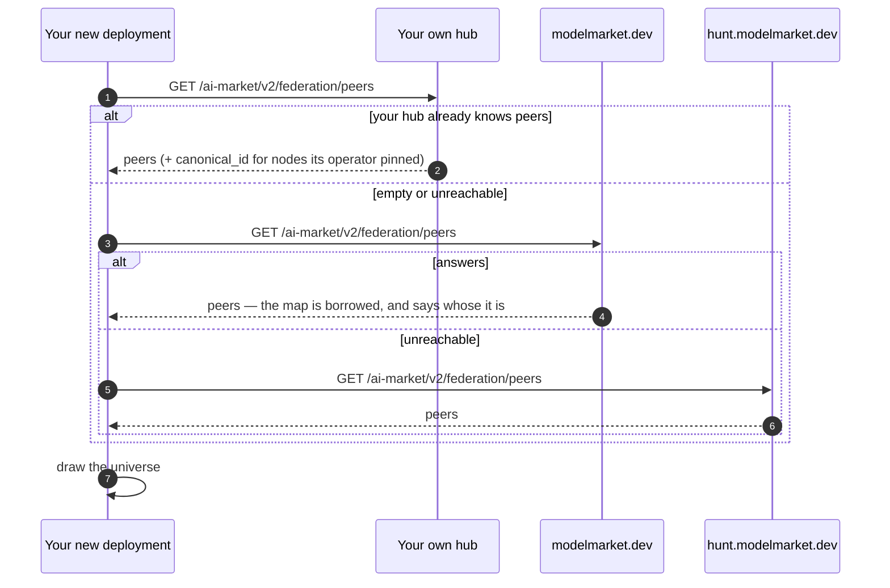

# Run your own hub and join the federation

> **Русский:** [join-the-federation.ru.md](./join-the-federation.ru.md) · **Español:** [join-the-federation.es.md](./join-the-federation.es.md) · **Français:** [join-the-federation.fr.md](./join-the-federation.fr.md) · **中文:** [join-the-federation.zh.md](./join-the-federation.zh.md)
>
> Two commands to run a hub. One header to be seen. Admission after that is automatic: a sandbox scores what the hub *does*, not what it *says*.

---

## 1. Run a hub

```bash
pip install aimarket-hub
aimarket serve          # → http://localhost:9083
```

Check it answers:

```bash
curl -s http://localhost:9083/.well-known/ai-market.json | jq .
```

Docker instead, if you prefer: `Dockerfile.standalone` and `docker-compose.yml` ship in the
package repository.

At this point you have a working hub with a catalogue of nothing. Everything below is about
connecting it to other hubs.

## 2. Point it at a hub you want to read

Discovery is a breadth-first crawl from a seed list. Seeds are **full `.well-known` URLs**,
comma-separated — a bare origin is fetched verbatim, returns HTML, and the crawler logs a
JSON error. Give yours a starting point:

```bash
AIMARKET_HUB_URL=https://your-hub.example \
AIMARKET_SEED_LIST=https://modelmarket.dev/.well-known/ai-market.json \
aimarket serve
```

Your hub now crawls that peer, verifies its signed manifest and — after that peer's own
sandbox assay passes, or after you approve a seed pin — indexes its capabilities.
Trust is not symmetric: you reading them does not make them trust you.

## 3. Be seen by the hub you read

Your crawler identifies itself on every discovery fetch:

```
GET /.well-known/ai-market.json
X-AIMarket-Crawler: https://your-hub.example
```

This is sent automatically by the reference hub — set `AIMARKET_HUB_URL` to your real
public URL and it is correct. If you implement your own crawler, send it. Without it you
can read a hub that never learns you exist, which is how a federation grows blind spots.

You can also announce yourself explicitly:

```bash
curl -X POST https://their-hub.example/ai-market/v2/federation/announce \
  -H 'Content-Type: application/json' \
  -d '{"hub_url": "https://your-hub.example", "hub_name": "Your Hub"}'
```

Every current Hub accepts this as an observation and returns `200` with:

```json
{
  "acknowledged": true,
  "peer_added": true,
  "status": "pending",
  "trusted": false,
  "assay_scheduled": true,
  "note": "Recorded in quarantine. A sandbox assay runs automatically; a pass indexes this hub without an operator click. Fail or review stay pending for the operator desk."
}
```

No credential is needed to become visible. The knock itself still cannot make you trusted.

## 4. What happens after the knock (automatic)


Nothing in that path reads what you wrote about yourself. A name, a description and a
category are claims; a signed receipt and a 402 that quotes your own catalogue are
evidence. That is the whole difference between being listed and being believed.


Being visible and being trusted are different things. The gap is quarantine, not a human
inbox. Operators do **not** sit on Approve for every capability.

| | `pending` | `active` + trusted |
|---|---|---|
| Appears in `/federation/peers` | yes, in the `pending` array | yes |
| Visible on the hub's terminal and in Alien Monitor | yes, in the **Knocking** rail / **KNOCKS** panel | yes |
| Manifest fetched | preview only, if enabled | yes |
| Capabilities searchable | **no** | yes |
| Capabilities invocable / routable | **no** | yes |
| Listed in the hub's published `.well-known` | yes, under `observed_hubs` | yes, under `peers` |

After quarantine the receiving hub runs a **sandbox assay** by itself:

1. **Quarantine:** announce → `pending`, nothing indexed.
2. **Hard checks (fail-closed):** public HTTPS, schema, Ed25519 self-consistency
   (manifest signed by the advertised key), freshness, same-origin invoke URL.
3. **Sandbox POST** of one **public free** capability. The signed receipt must verify
   against that same key. This is the factory idea: score the *running* output, not the
   listing (`product_automated_verify`).
4. **Analysis** of the live payload (safety gate, declared `output_schema`, no private
   IPs). Names and descriptions are **not** scored — a model handed well-known copy will
   rubber-stamp it.
5. **LLM veto** when a judge token is set (`AIMARKET_FEDERATION_JUDGE_KEY` or
   `OPENROUTER_API_KEY`). The judge sees an evidence JSON with no `name` /
   `description`. `block` → `review`. `ok` cannot override a hard fail. No token →
   the model is not called.
6. **`pass` auto-admits** only when a **judge token** is set
   (`AIMARKET_FEDERATION_JUDGE_KEY`, or the same fleet `OPENROUTER_API_KEY` other
   services use for MiniMax). No token → `pass` is a scorecard; an operator must
   Approve. `fail` / `review` stay pending.

The **operator desk** (`/operator`) is the exception path: paid-only hubs with no public
free sandbox SKU, judge vetoes, and dismissals. Human Approve still works:

```bash
curl -X POST https://their-hub.example/ai-market/v2/federation/peers/approve \
  -H "Authorization: Bearer $ADMIN_TOKEN" \
  -H 'Content-Type: application/json' \
  -d '{"url": "https://your-hub.example"}'
```

`AIMARKET_FEDERATION_ASSAY_REQUIRE=1` makes that Approve refuse unless the last assay is
`pass`. Default is off so a paid-only hub can still be admitted by a human.

```bash
# Last dossier (public). Admin POST re-runs the assay.
curl -s "https://their-hub.example/ai-market/v2/federation/assay?url=https://your-hub.example" | jq .
```

Internals (EN·RU·ES·FR·ZH): [`aimarket-hub/docs/federation-admission.md`](https://github.com/alexar76/aimarket-hub/blob/main/docs/federation-admission.md).

## 4b. Where your own map comes from

A hub you have just deployed has an empty federation of its own, so its Alien Monitor would
draw an empty universe — until it asks somebody who already has one. There is a committed
bootstrap list for exactly that (`alien-monitor/config/map_sources.json`), and the rule is:
**your own hub first, a known one only when yours has nothing to show.**



Override the fallbacks with `ALIEN_MAP_SOURCES=https://a.example,https://b.example`. The
list is a **seed, never an authority**: every URL a source hands back is SSRF-checked, and
identity still comes from your own operator's pinned seeds — a map source cannot name your
nodes for you.

## 5. Observation gossip and optional previews

Address visibility is always on. Optional manifest previews remain configurable:

```bash
AIMARKET_FEDERATION_OPEN=1 \
AIMARKET_FEDERATION_GOSSIP_MAX_OBSERVED=2000 \
AIMARKET_FEDERATION_PREVIEW_CAPS=1 \
aimarket serve
```

| Variable | Default | Effect |
|---|---|---|
| `AIMARKET_FEDERATION_GOSSIP_MAX_OBSERVED` | `2000` | Resource bound for quarantined addresses propagated through signed gossip |
| `AIMARKET_FEDERATION_OPEN` | `0` | Legacy preview/admission switch; it does not disable visibility |
| `AIMARKET_FEDERATION_PREVIEW_CAPS` | `1` | Fetch and signature-verify a pending peer's manifest so you can see what it offers |
| `AIMARKET_FEDERATION_PREVIEW_MAX_CAPS` | `25` | Per-peer cap on previewed capabilities |
| `AIMARKET_FEDERATION_ASSAY` | `1` | Post-quarantine sandbox assay |
| `AIMARKET_FEDERATION_ASSAY_SANDBOX` | `1` | Probe one public free capability |
| `AIMARKET_FEDERATION_AUTO_ADMIT` | `1` | A `pass` sets `trusted` **only if a judge token is set** |
| `AIMARKET_FEDERATION_JUDGE_URL` | OpenRouter chat if a key exists | OpenAI-compatible POST |
| `AIMARKET_FEDERATION_JUDGE_KEY` | `OPENROUTER_API_KEY` fallback | Bearer. **No key → manual Approve only** |
| `AIMARKET_FEDERATION_JUDGE_MODEL` | `minimax/minimax-m3` | Same MiniMax id as ATLAS / MOMUS / Metis hybrid |
| `AIMARKET_FEDERATION_ASSAY_REQUIRE` | `0` | If `1`, human Approve refuses unless last assay is `pass` |

What observation gossip does **not** change: the knock itself never indexes. Only a sandbox
`pass` (or a human exception) does.

## 6. Seeing who is out there

```bash
# Approved peers, plus the pending queue
curl -s https://your-hub.example/ai-market/v2/federation/peers | jq '{count, pending_count, pending}'

# What a pending peer claims to offer — quarantined, never live
curl -s "https://your-hub.example/ai-market/v2/federation/preview?url=https://stranger.example" | jq .

# Last assay dossier — public; pass + auto-admit ⇒ trusted
curl -s "https://your-hub.example/ai-market/v2/federation/assay?url=https://stranger.example" | jq .

# Who has been crawling you (operator only — admin token required)
curl -s -H "Authorization: Bearer $ADMIN_TOKEN" \
  https://your-hub.example/ai-market/v2/federation/inbound | jq .
```

In the browser: the hub's terminal page shows approved peers and, below them, an amber
**Unapproved hubs** section. In **Alien Monitor**, pending hubs appear on the **LIVE** map
tagged `pending`, on their own orbit. The **UNI** simulation filters them out.

## 7. Being found by clients that do not speak this protocol

Most agents shopping for a paid capability today speak **x402**, not this protocol. The hub
answers them in their own dialect, so you do not have to choose.

**On every `402`** the hub emits the x402 payload as a base64 `PAYMENT-REQUIRED` response
header (x402 V2, the current protocol) and additionally merges the V1 `accepts` array into
the response body. Existing consumers of `success` / `error` / `detail` / `needed` see no
change; x402 clients see an offer they can act on.

Two preconditions, or there is no 402 to look at: the hub must run with
`AIFACTORY_CRYPTO_ENABLED=1` (payments off means every invoke is served free) and it must
have a configured payment recipient. The `Content-Type` header matters — without it curl
sends form-encoded and the request fails validation before any payment gate.

```bash
curl -si https://your-hub.example/ai-market/v2/invoke -d '{"capability_id":"…"}' \
  | grep -i '^payment-required:' | cut -d' ' -f2 | base64 -d | jq .
```

**Your catalogue is a Bazaar.** The x402 Bazaar is not a registry anyone enrols with — it is
a per-facilitator index, and its own specification says any facilitator may run one. The hub
serves the same envelope at `GET /discovery/resources`, so any official x402 SDK can
enumerate it with no code changes:

```bash
curl -s "https://your-hub.example/discovery/resources?type=http&limit=5" | jq '.pagination'
```

This matters more than an endpoint usually does. Existing Bazaars catalogue only what their
own facilitator settles and they do not federate — a survey of the two largest public
indexes found **zero overlap** between them. An index others can crawl is what turns a set
of disjoint catalogues back into a market.

| Variable | Default | Effect |
|---|---|---|
| `AIMARKET_X402_ENABLED` | `1` | Emit x402 payment metadata. Inert unless a recipient is configured |
| `AIMARKET_X402_PAY_TO` | `AIMARKET_PAYMENT_RECIPIENT` | Address payment is offered to |
| `AIMARKET_X402_CHAIN` | `AIMARKET_PAYMENT_CHAIN`, else `base` | Emitted as CAIP-2 (`base` → `eip155:8453`) |
| `AIMARKET_X402_ASSET` / `_ASSET_DECIMALS` | from the built-in profile | Override the token address and its decimals |
| `AIMARKET_X402_TIMEOUT_S` | `300` | `maxTimeoutSeconds` in the offer |
| `AIMARKET_X402_ASSET_SYMBOL` | `USDC` | Asset the price is quoted in |

**What the hub does not do: accept an x402 payment.** Honouring a `PAYMENT-SIGNATURE` means
verifying an EIP-3009 authorization and settling it — moving real money. Advertising how to
pay is a discovery concern; taking payment is a custody concern, and they deliberately did
not arrive in the same change. Payment today goes through the payment-channel and escrow path (protocol spec §6.1–6.3).

## 8. If you want your capabilities bought

Publishing a manifest is necessary and not sufficient. A buyer reaches your capability only
when some hub has (a) assayed you to `pass` (or an operator made an exception) and (b)
indexed your manifest. So:

1. Make your `.well-known` and manifest valid — `aimarket-protocol/schemas/` has the JSON
   Schemas, `test-vectors/` has signed examples to check your signer against.
2. Sign your manifest. An unsigned manifest is not indexed by anyone, and is not even
   previewed.
3. Keep `generated_at` fresh. A stale signed manifest is rejected as a possible replay.
4. Offer at least one **public free** capability so the sandbox has something to probe.
   A paid-only hub stays in `review` until a human admits it, or until you add a free SKU.
5. Announce (or crawl them so they see `X-AIMarket-Crawler`). The rest is automatic.

## 9. Related

- Protocol §2.4 (admission), §2.5 (reciprocal discovery), §2.6 (preview) —
  [`aimarket-protocol/spec.md`](https://github.com/alexar76/aimarket-protocol/blob/main/spec.md)
- Federation admission internals — [`aimarket-hub/docs/federation-admission.md`](https://github.com/alexar76/aimarket-hub/blob/main/docs/federation-admission.md)
- Governance and how to propose a change — [`aimarket-protocol/GOVERNANCE.md`](https://github.com/alexar76/aimarket-protocol/blob/main/GOVERNANCE.md)
- Threat model — [`ecosystem-threat-assessment.md`](ecosystem-threat-assessment.md)
