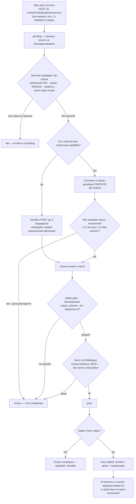
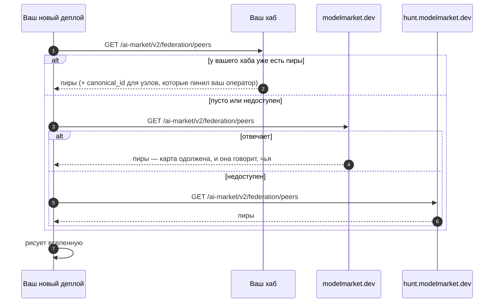

# Поднять свой хаб и войти в федерацию

> **English:** [join-the-federation.md](./join-the-federation.md) · **Español:** [join-the-federation.es.md](./join-the-federation.es.md) · **Français:** [join-the-federation.fr.md](./join-the-federation.fr.md) · **中文:** [join-the-federation.zh.md](./join-the-federation.zh.md)
>
> Две команды, чтобы запустить хаб. Один заголовок, чтобы вас увидели. Дальше допуск автоматический: песочница оценивает, что хаб *делает*, а не что он *пишет*.

---

## 1. Запустить хаб

```bash
pip install aimarket-hub
aimarket serve          # → http://localhost:9083
```

Проверка:

```bash
curl -s http://localhost:9083/.well-known/ai-market.json | jq .
```

Docker: в репозитории пакета есть `Dockerfile.standalone` и `docker-compose.yml`.

Сейчас это рабочий хаб с пустым каталогом. Ниже — как связать его с другими.

## 2. Указать хаб, который хотите читать

Discovery — BFS от списка seed. Seed — **полные URL `.well-known`**, через запятую.
Голый origin отдаст HTML, crawler залогирует JSON-ошибку.

```bash
AIMARKET_HUB_URL=https://your-hub.example \
AIMARKET_SEED_LIST=https://modelmarket.dev/.well-known/ai-market.json \
aimarket serve
```

Ваш хаб обходит пира, проверяет подписанный манифест и индексирует capability **после**
того, как у пира пройдёт sandbox-assay (или после seed-пина). Доверие не симметрично:
то, что вы их читаете, не делает их доверяющими вам.

## 3. Чтобы вас увидели

Краулер на каждом discovery-запросе представляется:

```
GET /.well-known/ai-market.json
X-AIMarket-Crawler: https://your-hub.example
```

Эталонный хаб шлёт это сам — задайте `AIMARKET_HUB_URL` на реальный публичный URL.
Свой crawler должен слать то же. Иначе вы читаете хаб, который о вас не узнает.

Явный анонс:

```bash
curl -X POST https://their-hub.example/ai-market/v2/federation/announce \
  -H 'Content-Type: application/json' \
  -d '{"hub_url": "https://your-hub.example", "hub_name": "Your Hub"}'
```

Ответ `200`:

```json
{
  "acknowledged": true,
  "peer_added": true,
  "status": "pending",
  "trusted": false,
  "assay_scheduled": true,
  "note": "Recorded in quarantine. A sandbox assay runs automatically; a pass indexes this hub without an operator click. Fail or review stay pending for the operator desk."
}
```

Учётные данные не нужны, чтобы стать видимым. Сам стук по-прежнему не делает вас trusted.

## 4. Что происходит после стука (автомат)


Ни один шаг не читает то, что вы написали о себе. Имя, описание и категория — это
заявления; подписанная квитанция и 402 с ценой из вашего же каталога — улики. В этом вся
разница между «числиться» и «быть принятым».


Видимость и доверие — разные вещи. Разрыв — карантин, а не очередь на Approve.
Оператор **не** сидит и не кликает Approve на каждую capability.

| | `pending` | `active` + trusted |
|---|---|---|
| `/federation/peers` | да, массив `pending` | да |
| Терминал хаба и Alien Monitor | да, рельс **Knocking** / панель **KNOCKS** | да |
| Манифест | только preview, если включён | да |
| Поиск capability | **нет** | да |
| Invoke / маршрутизация | **нет** | да |
| Опубликованный `.well-known` | `observed_hubs` | `peers` |

Принимающий хаб сам гоняет **sandbox assay**:

1. **Карантин:** announce → `pending`, ничего не индексируется.
2. **Жёсткие проверки (fail-closed):** публичный HTTPS, схема, самосогласованность Ed25519
   (манифест подписан заявленным ключом), свежесть, invoke на том же origin.
3. **Sandbox POST** одной **публичной бесплатной** capability. Подписанная квитанция должна
   сходиться с тем же ключом. Идея фабрики: оценивать *живой* выход, а не карточку
   (`product_automated_verify`).
4. **Анализ** живого payload (safety gate, заявленный `output_schema`, без частных IP).
   Имена и описания **не** скорятся — модель, которой дали текст well-known, поставит штамп.
5. **LLM-вето**, если задан токен судьи (`AIMARKET_FEDERATION_JUDGE_KEY` или
   флотский `OPENROUTER_API_KEY` для MiniMax). Судья видит evidence JSON без
   `name` / `description`. `block` → `review`. `ok` не перекрывает жёсткий fail.
6. **`pass` автоматически допускает** только при наличии токена. Без токена
   `pass` — scorecard, нужен ручной Approve. `fail` / `review` остаются pending.

**Стол оператора** (`/operator`) — исключения: хабы только с платными SKU (нечего прогнать
в песочнице), вето судьи, dismiss. Ручной Approve по-прежнему работает.

`AIMARKET_FEDERATION_ASSAY_REQUIRE=1` запрещает ручной Approve без последнего `pass`.
По умолчанию выкл., чтобы платный-only хаб мог принять человек.

Внутренности (EN·RU·ES·FR·ZH): [`aimarket-hub/docs/federation-admission.ru.md`](https://github.com/alexar76/aimarket-hub/blob/main/docs/federation-admission.ru.md).

## 4b. Откуда берётся ваша карта

У только что развёрнутого хаба своя федерация пуста, поэтому его Alien Monitor нарисовал бы
пустую вселенную — пока не спросит того, у кого карта уже есть. Для этого есть
закоммиченный список источников (`alien-monitor/config/map_sources.json`), и правило такое:
**сначала свой хаб, чужой — только когда своему нечего показать.**



Заменить запасные адреса: `ALIEN_MAP_SOURCES=https://a.example,https://b.example`. Список —
**семя, а не авторитет**: каждый URL, который отдаёт источник, проходит SSRF-проверку, а
идентичность по-прежнему берётся из пинов вашего оператора — источник карты не может
назвать за вас ваши узлы.

## 5. Gossip наблюдений и preview

Видимость адресов всегда включена. Preview манифеста настраивается:

```bash
AIMARKET_FEDERATION_OPEN=1 \
AIMARKET_FEDERATION_GOSSIP_MAX_OBSERVED=2000 \
AIMARKET_FEDERATION_PREVIEW_CAPS=1 \
aimarket serve
```

| Variable | Default | Эффект |
|---|---|---|
| `AIMARKET_FEDERATION_GOSSIP_MAX_OBSERVED` | `2000` | Потолок карантинных адресов в подписанном gossip |
| `AIMARKET_FEDERATION_OPEN` | `0` | Наследие preview/admission; видимость не выключает |
| `AIMARKET_FEDERATION_PREVIEW_CAPS` | `1` | Подтянуть и проверить манифест pending-пира |
| `AIMARKET_FEDERATION_PREVIEW_MAX_CAPS` | `25` | Потолок preview на пира |
| `AIMARKET_FEDERATION_ASSAY` | `1` | Sandbox-assay после карантина |
| `AIMARKET_FEDERATION_ASSAY_SANDBOX` | `1` | Прогнать одну публичную бесплатную capability |
| `AIMARKET_FEDERATION_AUTO_ADMIT` | `1` | `pass` ставит `trusted` **только если есть токен судьи** |
| `AIMARKET_FEDERATION_JUDGE_URL` | OpenRouter chat, если есть ключ | OpenAI-compatible POST |
| `AIMARKET_FEDERATION_JUDGE_KEY` | fallback `OPENROUTER_API_KEY` | Bearer. **Нет ключа → только ручной Approve** |
| `AIMARKET_FEDERATION_JUDGE_MODEL` | `minimax/minimax-m3` | MiniMax, как у остальных сервисов флота |
| `AIMARKET_FEDERATION_ASSAY_REQUIRE` | `0` | Если `1`, ручной Approve без `pass` отказывается |

Стук сам по себе не индексирует. Индексирует только sandbox `pass` (или исключение оператора).

## 6. Кто уже есть

```bash
curl -s https://your-hub.example/ai-market/v2/federation/peers | jq '{count, pending_count, pending}'
curl -s "https://your-hub.example/ai-market/v2/federation/preview?url=https://stranger.example" | jq .
curl -s "https://your-hub.example/ai-market/v2/federation/assay?url=https://stranger.example" | jq .
curl -s -H "Authorization: Bearer $ADMIN_TOKEN" \
  https://your-hub.example/ai-market/v2/federation/inbound | jq .
```

В браузере: терминал хаба и **Alien Monitor** (LIVE-карта, тег `pending`). Симуляция **UNI**
их отфильтровывает.

## 7. Клиенты, которые говорят x402

На каждом `402` хаб отдаёт payload x402 V2 в заголовке `PAYMENT-REQUIRED` (base64) и
массив V1 `accepts` в теле. Принимать `PAYMENT-SIGNATURE` хаб **не** умеет — это custody.
Каталог: `GET /discovery/resources`.

Нужны `AIFACTORY_CRYPTO_ENABLED=1` и получатель платежа.

## 8. Чтобы ваши capability покупали

1. Валидные `.well-known` и манифест (`aimarket-protocol/schemas/`, `test-vectors/`).
2. Подписать манифест. Без подписи его никто не индексирует и не preview.
3. Свежий `generated_at`.
4. Хотя бы одна **публичная бесплатная** capability — иначе песочнице нечего прогнать,
   и хаб останется в `review`, пока человек не сделает исключение.
5. Announce (или crawl их, чтобы увидели `X-AIMarket-Crawler`). Дальше автомат.

## 9. Связанное

- Протокол §2.4 / §2.5 / §2.6 — [`aimarket-protocol/spec.md`](https://github.com/alexar76/aimarket-protocol/blob/main/spec.md)
- Внутренности допуска — [`aimarket-hub/docs/federation-admission.ru.md`](https://github.com/alexar76/aimarket-hub/blob/main/docs/federation-admission.ru.md)
- Governance — [`aimarket-protocol/GOVERNANCE.md`](https://github.com/alexar76/aimarket-protocol/blob/main/GOVERNANCE.md)
- Threat model — [`ecosystem-threat-assessment.md`](ecosystem-threat-assessment.md)
