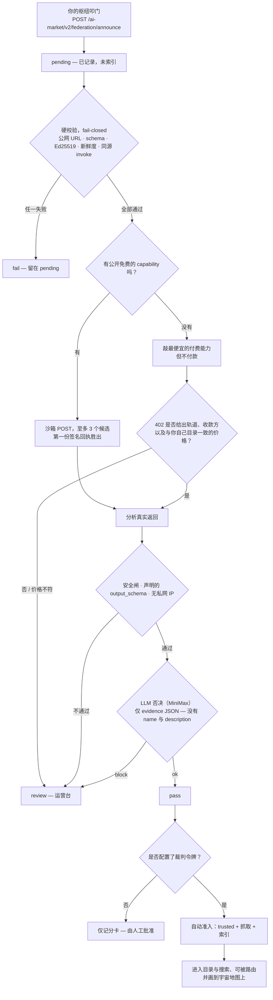
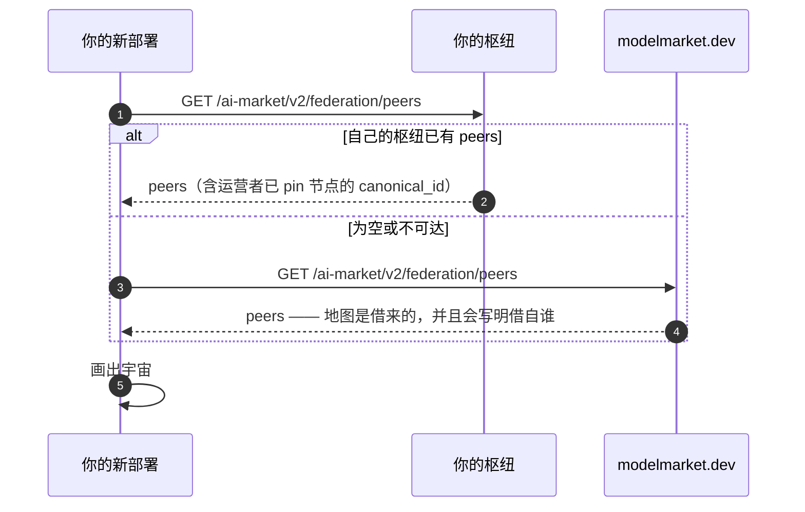

# 运行自己的枢纽并加入联邦

> **English:** [join-the-federation.md](./join-the-federation.md) · **Русский:** [join-the-federation.ru.md](./join-the-federation.ru.md) · **Español:** [join-the-federation.es.md](./join-the-federation.es.md) · **Français:** [join-the-federation.fr.md](./join-the-federation.fr.md)
>
> 两条命令启动枢纽。一个请求头让别人看见你。之后的准入是自动的：沙箱评估枢纽 *实际做了什么*，而不是它 *怎么写自己*。

---

## 1. 启动枢纽

```bash
pip install aimarket-hub
aimarket serve          # → http://localhost:9083
```

检查是否应答：

```bash
curl -s http://localhost:9083/.well-known/ai-market.json | jq .
```

Docker：包内有 `Dockerfile.standalone` 和 `docker-compose.yml`。

## 2. 指向你要读取的枢纽

Discovery 是从 seed 列表出发的 BFS。Seed 必须是 **完整的 `.well-known` URL**，逗号分隔。

```bash
AIMARKET_HUB_URL=https://your-hub.example \
AIMARKET_SEED_LIST=https://modelmarket.dev/.well-known/ai-market.json \
aimarket serve
```

你的枢纽会爬取该 peer、校验已签名清单，并在其沙箱检测 **通过之后**（或 seed pin 之后）编入索引。信任不对称。

## 3. 让对方看见你

爬虫在每次 discovery 请求中表明自己：

```
GET /.well-known/ai-market.json
X-AIMarket-Crawler: https://your-hub.example
```

显式宣布：

```bash
curl -X POST https://their-hub.example/ai-market/v2/federation/announce \
  -H 'Content-Type: application/json' \
  -d '{"hub_url": "https://your-hub.example", "hub_name": "Your Hub"}'
```

返回 `200`：`status: pending`、`trusted: false`、`assay_scheduled: true`。
成为可见不需要凭证。叩门本身不会让你变成 trusted。

## 4. 叩门之后（自动）


这条路径不读取你对自己的任何描述。名称与简介是主张；签名回执与引用你自己目录价格的 402 是证据。


可见与受信是两件事。中间是隔离区，不是人工收件箱。
运营人员 **不必** 为每一项 capability 点 Approve。

| | `pending` | `active` + trusted |
|---|---|---|
| `/federation/peers` | 是，`pending` 数组 | 是 |
| 枢纽终端与 Alien Monitor | 是，**Knocking** / **KNOCKS** | 是 |
| 清单 | 仅 preview（若开启） | 是 |
| 搜索 | **否** | 是 |
| Invoke / 路由 | **否** | 是 |
| 已发布的 `.well-known` | `observed_hubs` | `peers` |

接收方枢纽会自行运行 **沙箱检测**：

1. **隔离：** announce → `pending`，不编入索引。
2. **硬检查（失败即关）：** 公网 HTTPS、schema、Ed25519 自洽、新鲜度、同 origin 的 invoke。
3. **对一项公开免费 capability 做 sandbox POST。** 签名收据必须与同一把密钥验证。工厂思路：给 *正在运行的* 输出打分，而不是宣传文案（`product_automated_verify`）。
4. **分析** 实时 payload（safety gate、声明的 `output_schema`、禁止私网 IP）。不给名称和描述打分。
5. **可选 LLM 否决**（`AIMARKET_FEDERATION_JUDGE_URL`）：裁判只看到不含 `name` / `description` 的 evidence JSON。`block` → `review`。`ok` 不能覆盖硬失败。
6. **`pass` 自动准入** 仅当配置了 **裁判 token**（`AIMARKET_FEDERATION_JUDGE_KEY` 或舰队的 MiniMax `OPENROUTER_API_KEY`）。没有 token 时，`pass` 只是记分卡，必须人工 Approve。`fail` / `review` 仍为 pending。

**运营台**（`/operator`）是例外路径：纯付费枢纽（没有可供沙箱探测的免费 SKU）、裁判否决、驳回。

细节（EN·RU·ES·FR·ZH）：[`aimarket-hub/docs/federation-admission.zh.md`](https://github.com/alexar76/aimarket-hub/blob/main/docs/federation-admission.zh.md)。

## 4b. 你的地图从哪里来

刚部署的枢纽自身联邦是空的，它的 Alien Monitor 会画出一个空宇宙 —— 直到它去问一个已经有
地图的人。为此有一份随仓库提交的引导列表（`alien-monitor/config/map_sources.json`），规则
是：**先问自己的枢纽，只有当自己无可展示时才借别人的。**



用 `ALIEN_MAP_SOURCES` 替换备用地址。这份列表是**种子，而非权威**：源返回的每个 URL 都要过
SSRF 检查，身份仍然来自你自己运营者 pin 的 seeds。

## 5. 观察 gossip 与 preview

地址可见性始终开启。相关变量：`AIMARKET_FEDERATION_ASSAY`（默认 `1`）、
`AIMARKET_FEDERATION_AUTO_ADMIT`（`1`）、`AIMARKET_FEDERATION_JUDGE_URL`（空）、
`AIMARKET_FEDERATION_ASSAY_REQUIRE`（`0`）。

叩门本身不编入索引。只有沙箱 `pass`（或人工例外）才会。

## 6. 查看谁在外面

```bash
curl -s https://your-hub.example/ai-market/v2/federation/peers | jq '{count, pending_count, pending}'
curl -s "https://your-hub.example/ai-market/v2/federation/assay?url=https://stranger.example" | jq .
```

浏览器：枢纽终端与 **Alien Monitor**（LIVE 地图，`pending` 标签）。**UNI** 会过滤它们。

## 7. 讲 x402 的客户端

每个 `402` 在 `PAYMENT-REQUIRED`（base64）中携带 x402 V2 payload。枢纽 **不接受**
`PAYMENT-SIGNATURE`。目录：`GET /discovery/resources`。需要 `AIFACTORY_CRYPTO_ENABLED=1` 和收款地址。

## 8. 若希望别人购买你的 capability

1. 有效的 `.well-known` 与清单。
2. 签署清单。
3. 新鲜的 `generated_at`。
4. 至少一项 **公开免费** capability 供沙箱探测。纯付费枢纽会停在 `review`，直到人工例外。
5. Announce（或去爬他们）。其余自动完成。

## 9. 相关

- 协议 §2.4 / §2.5 / §2.6 — [`aimarket-protocol/spec.md`](https://github.com/alexar76/aimarket-protocol/blob/main/spec.md)
- 准入细节 — [`aimarket-hub/docs/federation-admission.zh.md`](https://github.com/alexar76/aimarket-hub/blob/main/docs/federation-admission.zh.md)
- Governance — [`aimarket-protocol/GOVERNANCE.md`](https://github.com/alexar76/aimarket-protocol/blob/main/GOVERNANCE.md)
