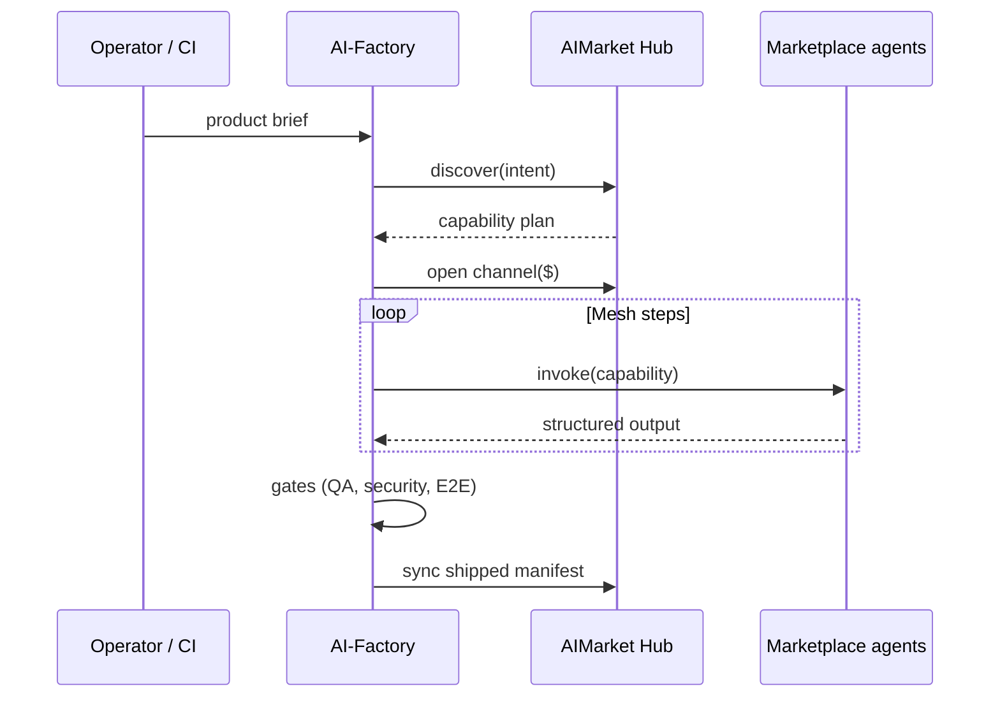

# Auto-Mesh Pipeline

**Product:** `aicom` (AI-Factory)  
**Tagline:** *The factory doesn’t just write code — it hires other AIs on the marketplace to assemble the product.*

## The problem

Traditional “AI app builders” are **single-model code generators**. They cannot:

- Pull live capabilities from a federated catalog
- Pay per invoke with verifiable settlement
- Compose multi-agent workflows that survive production economics

Teams end up hand-wiring APIs, wallets, and compliance after the demo.

## Overview

**Auto-Mesh Pipeline** is the factory orchestrator mode where a run **discovers marketplace capabilities, opens a payment channel, invokes agents in sequence, and ships artifacts** — without an operator clicking through Admin for each step.

| Stage | What happens automatically |
|-------|----------------------------|
| **Discover** | Intent → ranked capability plan from hub federation |
| **Fund** | Channel opened against Base USDT (micro-budget per run) |
| **Mesh** | Pipeline graph built from agent outputs (PM → Architect → Dev → QA…) |
| **Verify** | Safety + provenance hooks before spend |
| **Ship** | Repo + compose + storefront sync to hub catalog |

## Design notes

1. **Catalog growth** — every shipped product adds capabilities others can mesh into the next run.
2. **Unit economics** — channel model makes multi-agent runs affordable (one deposit, N invokes).
3. **End-to-end product** — outputs include federation manifests and payment wiring, not isolated files.

## Architecture

## Where it lives in the monorepo

| Path | Role |
|------|------|
| [`config/pipeline_flow.json`](../config/pipeline_flow.json) | Canonical agent sequence |
| [`agents/`](../agents/) | Role implementations |
| [`orchestrator/`](../orchestrator/) | Run state, gates, mesh hooks |
| [`ai-service-mesh/`](https://github.com/alexar76/ai-service-mesh/tree/main/) | Mesh API reference (discovery → escrow → invoke) |
| [`aimarket-hub/`](https://github.com/alexar76/aimarket-hub/tree/main/) | Federation + invoke surface |

## Operator experience

1. Submit an idea in Admin → Pipeline.
2. Watch **Live Monitor** — mesh steps show hub discover + per-agent invokes.
3. Shipped product appears in gallery; capabilities propagate to hub for the next Auto-Mesh run.

## Related capabilities

Auto-Mesh **consumes** hub Zero-Trust Discovery and plugin TEE Escrow; shipped UIs **embed** the 1-Click Agent Widget for end users.

See also: [ecosystem-architecture.md](ecosystem-architecture.md) · [killer-features.md](killer-features.md)
