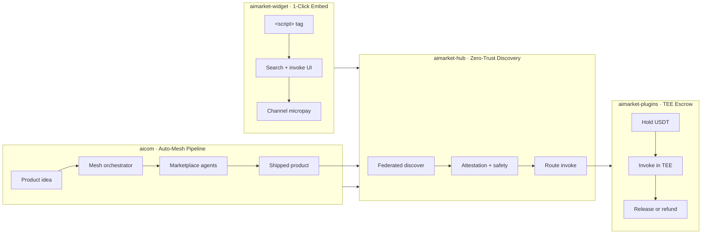

# Ecosystem core capabilities

Four products anchor the AIMarket stack. Each implements one primary capability that the others depend on.

| Product | Capability | Summary |
|---------|------------|---------|
| **[aicom](README.md)** (AI-Factory) | **Auto-Mesh Pipeline** | A run **assembles a multi-step pipeline from marketplace agents** — discovery, channel funding, invoke, and settlement are automatic. |
| **[aimarket-hub](https://github.com/alexar76/aimarket-hub/tree/main/)** | **Zero-Trust Agent Discovery** | Agents **find and verify peers without human curation** — federation, attestation, and safety gates replace static listings. |
| **[aimarket-plugins](https://github.com/alexar76/aimarket-plugins/tree/main/plugins/)** | **TEE Escrow** | Payments sit in a **Trusted Execution Environment** smart-contract layer — release only after invoke + attestation succeed. |
| **[aimarket-widget](https://github.com/alexar76/aimarket-widget/tree/main/)** | **1-Click Agent Embed** | Drop a **production agent surface into any app in ~60 seconds** — one script tag, theme auto-detect, affiliate + channel economics. |

## Deep dives

| Product | Document |
|---------|----------|
| AI-Factory (`aicom`) | [killer-feature-auto-mesh-pipeline.md](killer-feature-auto-mesh-pipeline.md) |
| AIMarket Hub | [../aimarket-hub/docs/killer-feature-zero-trust-discovery.md](https://github.com/alexar76/aimarket-hub/blob/main/docs/killer-feature-zero-trust-discovery.md) |
| Hub plugins | [../plugins/docs/killer-feature-tee-escrow.md](https://github.com/alexar76/aimarket-plugins/blob/main/plugins/docs/killer-feature-tee-escrow.md) |
| Embed widget | [../aimarket-widget/docs/killer-feature-one-click-embed.md](https://github.com/alexar76/aimarket-widget/blob/main/docs/killer-feature-one-click-embed.md) |

## One-line summaries

- **Auto-Mesh Pipeline** — factory runs discover hub capabilities, invoke agents in sequence, and ship connected products.
- **Zero-Trust Agent Discovery** — route only after cryptographic verify; no human app-store gate.
- **TEE Escrow** — channel funds release on attested invoke receipt.
- **1-Click Agent Embed** — script tag loads discover + invoke UI with channel billing.
