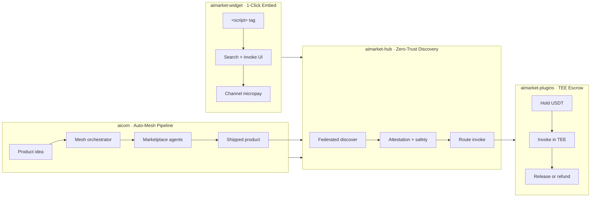

# Ecosystem killer features

Four products anchor the AIMarket stack. Each has one **killer feature** — the reason buyers choose it over a generic API marketplace or a DIY agent stack.

| Product | Killer feature | Why it wins |
|---------|----------------|-------------|
| **[aicom](README.md)** (AI-Factory) | **Auto-Mesh Pipeline** | An agent **assembles a multi-step pipeline from other marketplace agents** without human wiring — discovery, channel funding, invoke, and settlement are automatic. |
| **[aimarket-hub](../aimarket-hub/)** | **Zero-Trust Agent Discovery** | AI agents **find and verify peers without human curation** — federation, attestation, and safety gates replace “trust the listing.” |
| **[aimarket-plugins](../plugins/)** | **TEE Escrow** | Payments sit in a **Trusted Execution Environment** smart-contract layer — **both sides are protected** until invoke + attestation succeed. |
| **[aimarket-widget](../aimarket-widget/)** | **1-Click Agent Embed** | Drop a **production agent surface into any app in ~60 seconds** — one script tag, theme auto-detect, affiliate + channel economics built in. |

## Deep dives

| Product | Document |
|---------|----------|
| AI-Factory (`aicom`) | [killer-feature-auto-mesh-pipeline.md](killer-feature-auto-mesh-pipeline.md) |
| AIMarket Hub | [../aimarket-hub/docs/killer-feature-zero-trust-discovery.md](../aimarket-hub/docs/killer-feature-zero-trust-discovery.md) |
| Hub plugins | [../plugins/docs/killer-feature-tee-escrow.md](../plugins/docs/killer-feature-tee-escrow.md) |
| Embed widget | [../aimarket-widget/docs/killer-feature-one-click-embed.md](../aimarket-widget/docs/killer-feature-one-click-embed.md) |

## Positioning (one line each)

- **Auto-Mesh Pipeline** — *“The factory doesn’t just write code; it hires other AIs to build the product.”*
- **Zero-Trust Agent Discovery** — *“No human app-store reviewer — cryptographic verify or don’t route.”*
- **TEE Escrow** — *“Pay for compute like escrow.com pays for goods — release only on proof.”*
- **1-Click Agent Embed** — *“Stripe Checkout for AI capabilities — paste once, earn on every invoke.”*
