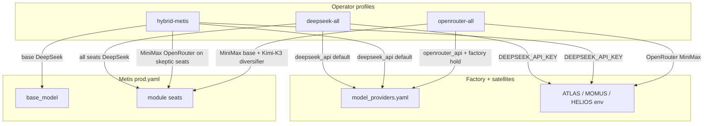

# LLM routing profiles — four-host fleet

Quick switching between **DeepSeek native API**, **canonical Metis hybrid** (DeepSeek + MiniMax on OpenRouter), and **emergency OpenRouter** when DeepSeek billing or API is down.

## Four servers

| Host | SSH alias | AI assistants |
|------|-----------|---------------|
| **Factory** | `my-vps` | Factory pipeline, Alien Monitor, ATLAS Analyst, ARGUS, THEMIS |
| **Metis** | `root@skopos.modelmarket.dev` | Metis council/verify, SKOPOS AI agent |
| **Oracles** | `admin-vps` | MOMUS, HELIOS, DIOSCURI, Platon, LOGOS, ARGUS, Alien Monitor |
| **Hub lab** | `competing-lab` | AIMarket Hub (verify via Metis — no local LLM) |

Inventory: `scripts/llm_fleet.yaml` · scan: `./scripts/switch_llm_profile.sh scan`

## Profiles



| Profile | Factory | Metis | When |
|---------|---------|-------|------|
| **`hybrid-metis`** | `deepseek_api` · v4-pro/flash | Base **DeepSeek**; `intent_parser_b` + `moa_proposer_skeptic` → **MiniMax** via OpenRouter | **Normal production** |
| **`deepseek-all`** | `deepseek_api` | **All seats** → DeepSeek API | DeepSeek restored; remove emergency routing |
| **`openrouter-all`** | `openrouter_api` · MiniMax; **factory on hold** | **All** cloud seats → OpenRouter; `intent_parser_c` → **Kimi-K3** | DeepSeek outage / billing failure |

## Commands

```bash
# Canonical prod (DeepSeek fleet + Metis MiniMax skeptics)
./scripts/switch_llm_profile.sh hybrid-metis

# Restore everything to DeepSeek API (resume factory)
./scripts/switch_llm_profile.sh deepseek-all

# Emergency failover (reads OPENROUTER_API_KEY from Metis .env)
./scripts/switch_llm_profile.sh openrouter-all --from-metis-env

# Inspect running AI containers on all four hosts
./scripts/switch_llm_profile.sh scan

# Single host
./scripts/switch_llm_profile.sh hybrid-metis --metis-only
```

## Metis seat map (hybrid)

| Seat | API | Model |
|------|-----|-------|
| `base_model` | DeepSeek | `deepseek-v4-pro` |
| `intent_parser_a`, `judge`, `verifier`, … | DeepSeek | `deepseek-v4-flash` |
| `intent_parser_c`, `moa_proposer_logician`, … | DeepSeek | `deepseek-v4-pro` |
| **`intent_parser_b`**, **`moa_proposer_skeptic`** | **OpenRouter** | **`minimax/minimax-m3`** |

Evidence: [metis/docs/en/BENCHMARKS.md](https://github.com/alexar76/metis/blob/main/docs/en/BENCHMARKS.md)

## Files

| Path | Role |
|------|------|
| `scripts/switch_llm_profile.sh` | Operator entrypoint |
| `scripts/llm_routing.py` | Profile patch logic |
| `scripts/llm_fleet.yaml` | Host + container inventory |
| `llm/persist_deepseek.py` | Factory DeepSeek sync |
| `llm/persist_openrouter.py` | Factory OpenRouter sync |

## Related

- Emergency detail: [llm-failover-openrouter.md](llm-failover-openrouter.md)
- Factory hold: [pipeline-operations.md](pipeline-operations.md#factory-hold-pause--resume)
