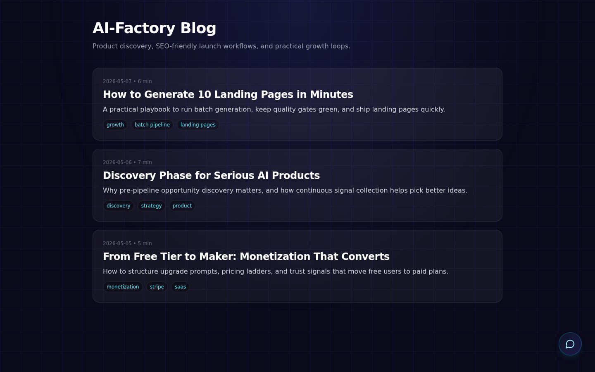
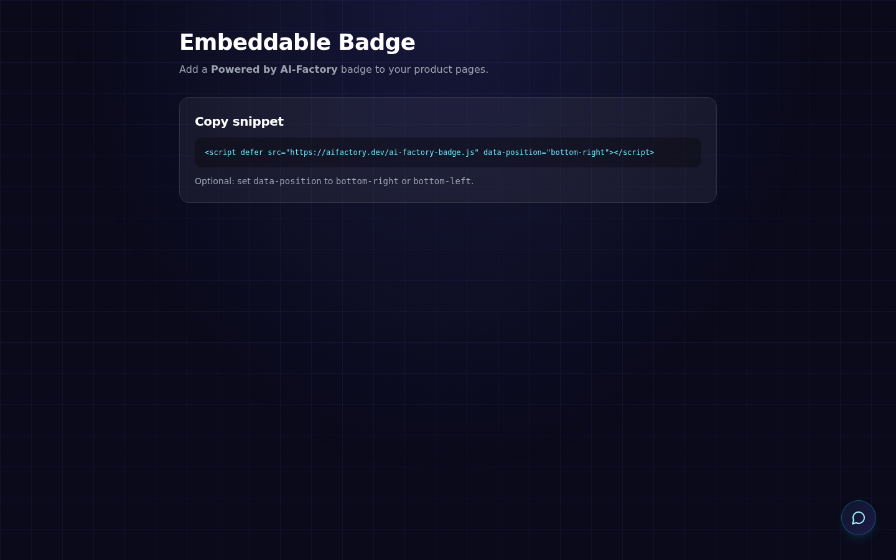
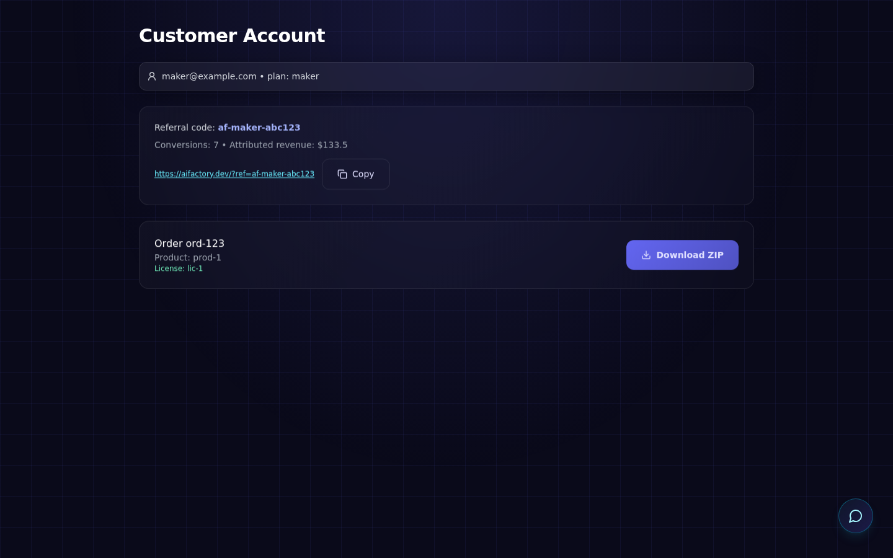

# Marketing and public storefront

Summary: SEO metadata, blog content hub, launch-kit and embeddable badge pages, referral attribution, customer referral dashboard, checkout attribution, and optional GA4.

## Pipeline: autonomous vs on-demand (same engine)

- **Autonomous:** market **research** and **idea generation** run on a schedule (Director / autonomous pipeline). New products are fed from that loop.
- **On-demand (customer phrase):** the **same agent sequence** runs; the **stakeholder brief** is the customer’s text from Admin, API, or lead form — not a reduced or “landing-only” stack. The typical **artifact** is still often a one-page site.

See **[Product concept](./product-concept.md)** (“Same pipeline — two ways to start it”).

## Frontend environment variables

| Variable | Purpose |
|----------|---------|
| `NEXT_PUBLIC_SITE_URL` | Canonical site origin (OG/Twitter URLs, `metadataBase`). Example: `https://example.com` |
| `INTERNAL_API_URL` | HTTP API base for **SSR** (`generateMetadata`, Explore pages): backend requests from the container/CI. Example: `http://api:8081` or `http://127.0.0.1:8081` |
| `NEXT_PUBLIC_GA_MEASUREMENT_ID` | Optional: Google Analytics 4 (gtag), only if you want external analytics |

The browser still reaches the API via the Next.js proxy (`/api/*` → backend); see `web/frontend/next.config.js`.

## Backend API

- `POST /api/marketing/analytics` — browser events (JSON): `event`, `path`, optional `product_id`, `referral`, `meta`.
- `POST /api/marketing/lead` — leads: `email`, `idea`, optional `name`, `company`, `source`.
- Logs: append-only JSONL under `/app/data/logs/marketing/` (`events.jsonl`, `leads.jsonl`).

Payment creation: `POST /api/payment/create` may include **`referral_source`** — the storefront sends the stored `?ref=` (safe characters only; see validation in `web/backend/api/marketing.py`).

Customer growth + monetization APIs:

- `POST /api/customer/billing/stripe/checkout` — create Stripe Checkout Session for plan upgrade.
- `POST /api/customer/billing/stripe/webhook` — entitlement update via verified Stripe webhook.
- `GET /api/customer/referrals/me` — personal referral code + conversions + attributed revenue.

## Homepage → admin (phrase prefill)

The **home page** (`/`) highlights a **single phrase / brief** field. **Continue to admin** stores the text in `sessionStorage` under `aicom_prefill_idea` and opens **`/admin?tab=new-product`**. **Admin → New Product** reads, in order:

1. Query param **`idea`** (if present): `/admin?tab=new-product&idea=…` (URL-encoded).
2. Else **`aicom_prefill_idea`** from `sessionStorage`, then the key is cleared.

Operators can still open **Admin only** without prefill. After **login redirect**, the sessionStorage value persists in the same browser tab.

## Default landing price (storefront)

If neither marketing `monetization_scheme` nor `state/<product_id>/sales_config.json` sets a positive price, product cards and checkout fall back to **~$4.99 USDT** (see `DEFAULT_STOREFRONT_PRICE_USDT` / payment default in the API). Tune per product with Sales agent output or manual `sales_config.json`.

**Paid download:** after on-chain payment is confirmed, the customer downloads the **ZIP** from their **Account** page (orders API); see `web/backend/api/customer.py` and `CommerceService.build_download_archive`.

## Storefront behavior

1. **Referral:** visiting with `?ref=partner` stores the value in `localStorage` and sends it to analytics and as `referral_source` when creating a payment.
2. **Product sharing:** the “Copy share link” button copies a URL with UTM (`utm_source=share`, `utm_medium=link`, `utm_campaign=product`).
3. **Referral dashboard:** account page exposes a shareable referral link and conversion stats (`/api/customer/referrals/me`).
4. **Events:** `page_view`, `product_view`, `checkout_click`, `share_link`, `sandbox_click`, `lead_submit`, etc. — see `trackEvent` calls in the codebase.

## Pages

| Path | Description |
|------|-------------|
| `/about` | About the platform |
| `/lead` | “Idea → pipeline” form |
| `/updates` | Entries from `web/frontend/content/updates.json` |
| `/explore/[slug]` | SEO by category (`ai_ml`, `devtools`, …) |
| `/blog` | Content-marketing hub and SEO entry point |
| `/launch-kit` | Product Hunt / HN launch checklist and press-kit summary |
| `/badge` | Embeddable “Powered by AI-Factory” widget instructions |
| `/benchmark` | Public trust metrics page (24h/7d/trend/readiness) |

### Visual references








Category slugs on the grid and in `/api/products` come from **`canonical_marketplace_category`** (pipeline `product.category` preferred over marketing JSON; see **[Pipeline operations](./pipeline-operations.md)**).

## Local verification

1. Run the backend (default rewrite target for the frontend is port `8081`).
2. `cd web/frontend && npm run build` — ensure `INTERNAL_API_URL` points at a reachable API at build time if you need Explore/metadata data.

## Docker Compose (single `app` container)

`docker-compose.yml` sets `INTERNAL_API_URL=http://127.0.0.1:8081` and `NEXT_PUBLIC_SITE_URL` — Next.js and FastAPI run in **one** container: API on `8081`, storefront on `8080` (host mapping is usually `9080:8080` and `9081:8081`).

**Important:** with `USE_SQLITE=true` the storefront must read products from SQLite (implemented in `web/backend/api/products.py`). Previously the list came only from `pipeline.json`, so the Docker marketplace could appear empty.

Demo product for marketplace and sandbox checks:

```bash
docker-compose exec app python3 /app/scripts/seed_marketplace_demo.py
```

This creates `prod-demo-market-01`, marketing files, `code_manifest.json`, and `index.html` for the sandbox.

Full smoke test (bring up stack, seed, API and sandbox page):

```bash
./scripts/verify_storefront_sandbox.sh
```
