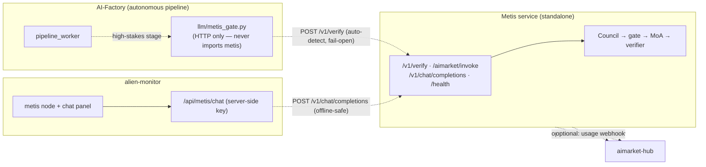
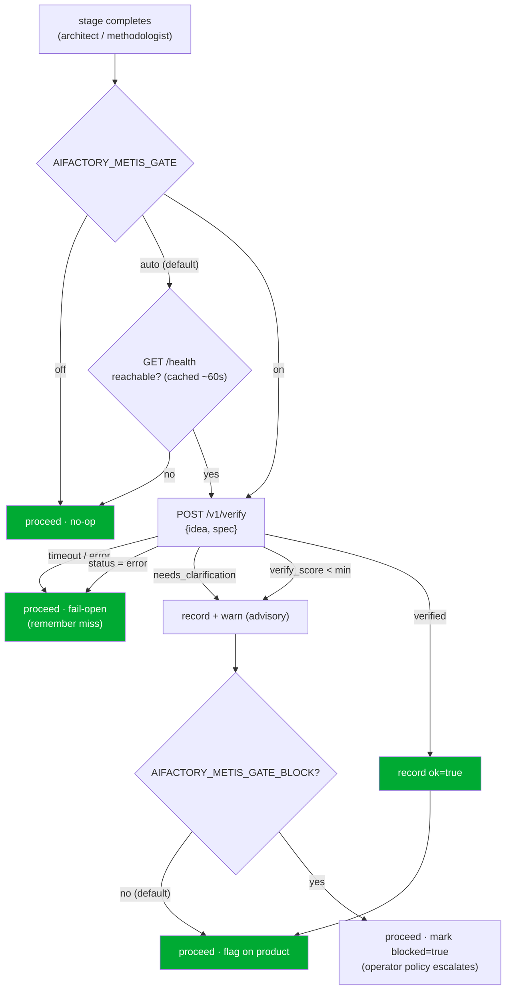

# Integración Metis ⇄ AI-Factory

**Metis** ([`metis/`](https://github.com/alexar76/metis)) es el **nivel de cognición y verificación** del ecosistema — una
capa cognitiva distribuida sobre cualquier LLM. En lugar de responder con una única llamada al LLM, ejecuta un
*Consejo de Comprensión → puerta de confianza (fail-closed) → Mixture-of-Agents en capas → verificador*,
y devuelve un **sobre de verificación**: una respuesta, un `verify_score` y — cuando la petición es
demasiado ambigua para responder con seguridad — un estado `needs_clarification` con las preguntas que necesita
que se respondan.

Este documento describe cómo están conectados la factory y Metis, y la única regla que
gobierna todo el diseño: **son independientes.**

> 🌐 Idiomas: [English](metis-integration.md) · [Русский](metis-integration.ru.md) · **Español** · [Français](metis-integration.fr.md) · [中文](metis-integration.zh.md)
> 📖 Vista del lado de Metis: [`metis/docs/en/ECOSYSTEM.md`](https://github.com/alexar76/metis/blob/main/docs/en/ECOSYSTEM.md)

---

## 1. La independencia es el invariante fuerte

La factory funciona **sin que Metis esté presente**, y Metis funciona **sin que la factory esté presente**. Cada
enlace entre ellos es opcional y degrada a un no-op.



Cada arista discontinua puede cortarse en tiempo de ejecución con impacto **cero** en el otro lado:

| Si esto está caído… | …esto sigue funcionando |
|---|---|
| Metis ausente/inalcanzable | el pipeline de la factory se ejecuta sin cambios (la puerta pasa de largo) |
| factory ausente | Metis sirve `/v1/*` con normalidad |
| Metis ausente | el monitor muestra el nodo `offline`; el chat devuelve una pista legible |
| hub ausente | Metis nunca lo nota (registro + webhook son opcionales) |

Garantizado por tests: [`tests/test_metis_gate.py`](../tests/test_metis_gate.py) (la factory continúa
cuando Metis es inalcanzable), [`metis/tests/test_ecosystem_api.py`](https://github.com/alexar76/metis/blob/main/tests/test_ecosystem_api.py)
(Metis sirve sin variables de entorno del ecosistema) y
[`alien-monitor/tests/test_metis_graph.py`](https://github.com/alexar76/alien-monitor/blob/main/tests/test_metis_graph.py)
(el chat del monitor es seguro sin conexión).

---

## 2. La puerta de confianza

La factory envía productos de forma autónoma. Ya falla en modo **cerrado** ante la infraestructura (proveedores,
mocks, carteras), pero una única llamada al LLM no le da **ninguna señal legible por máquina de "no estoy seguro"** sobre el
*contenido* de una decisión. Metis proporciona exactamente esa señal. Las etapas de alto riesgo (por defecto las
etapas `architect` y `methodologist`) enrutan la idea/spec del producto a través de Metis y registran el
resultado.

### 2.1 Cómo decide — auto-detección + fail-open



El sobre consultivo se almacena en el producto como `product["metis_gate"]` (persistido mediante
`PRODUCT_EXTRA_KEYS`), de modo que sobrevive a un ciclo del pipeline y es visible en las trazas y en el monitor:

```json
{
  "stage": "architect", "ok": false, "status": "needs_clarification",
  "verify_score": 0.0, "verified": false, "route": "council",
  "clarifications": ["Which platform?", "Who are the users?"],
  "blocked": false, "at": 1752096000.0
}
```

### 2.2 Secuencia

```mermaid
sequenceDiagram
    participant PW as pipeline_worker
    participant G as metis_gate (HTTP)
    participant M as Metis /v1/verify
    PW->>G: verify_product_understanding(idea, spec)
    Note over G: mode=auto → GET /health (cached)
    alt Metis detected
        G->>M: POST /v1/verify {input, route, min_verify_score}
        M-->>G: {answer, status, verify_score, verified, clarifications}
        G-->>PW: GateVerdict(ok=…)
        PW->>PW: record product["metis_gate"]; warn if !ok
    else Metis absent / error
        G-->>PW: GateVerdict(ok=true, available=false)  %% fail-open
        PW->>PW: no-op
    end
```

### 2.3 Activar / configurar

El valor por defecto es **auto** — si un servicio Metis es alcanzable, se usa; de lo contrario la factory se comporta
exactamente como lo hace hoy. No hay nada que activar.

```bash
# Point the factory at your Metis (default http://127.0.0.1:8080)
export METIS_URL=https://metis.internal:8080
export METIS_API_KEY=sk-…            # only if your Metis runs with auth

# Optional: force modes / behaviour
export AIFACTORY_METIS_GATE=on       # auto (default) | on | off
export AIFACTORY_METIS_GATE_BLOCK=1  # let a low-confidence verdict escalate (default: advisory only)
```

| Variable de entorno | Por defecto | Significado |
|---|---|---|
| `AIFACTORY_METIS_GATE` | `auto` | `auto` = usar Metis solo si `/health` responde · `on` = intentar siempre · `off` = nunca contactar |
| `AIFACTORY_METIS_GATE_BLOCK` | `0` | `1` permite que un veredicto `ok=false` establezca `blocked=true` para que la política del operador actúe |
| `AIFACTORY_METIS_URL` / `METIS_URL` | `http://127.0.0.1:8080` | URL base de Metis |
| `AIFACTORY_METIS_API_KEY` / `METIS_API_KEY` | — | token bearer (solo si Metis requiere autenticación) |
| `AIFACTORY_METIS_GATE_STAGES` | `architect,methodologist` | qué etapas someter a la puerta |
| `AIFACTORY_METIS_GATE_ROUTE` | `council` | `fast` \| `thinking` \| `council` \| `agent` |
| `AIFACTORY_METIS_GATE_MIN_SCORE` | `0.7` | umbral de verificación para el indicador `verified` |
| `AIFACTORY_METIS_GATE_TIMEOUT` | `300` | timeout de la llamada de verificación (s) — debe superar el límite del servidor Metis (300 s) |
| `AIFACTORY_METIS_PROBE_TIMEOUT` | `2` | timeout del sondeo `/health` (s) |
| `AIFACTORY_METIS_PROBE_TTL` | `60` | segundos para cachear el resultado de la detección |

**¿Por qué auto-detección y no activado-por-defecto-con-bloqueo?** Porque la independencia nunca debe ser teórica.
Un Metis ausente cuesta un sondeo de salud rápido y cacheado — nunca un timeout por etapa — y nunca un fallo.
El bloqueo es opcional para que un despliegue de Metis sin revisar no pueda detener silenciosamente el pipeline.

Código: [`llm/metis_gate.py`](../llm/metis_gate.py) · enganche en
[`pipeline_worker.py`](../pipeline_worker.py) (`_maybe_metis_gate`).

### 2.4 Insignia en admin (actividad de Metis en la factory)

En **Admin → Pipeline** (`/admin?tab=pipeline`), cada tarjeta de producto muestra una insignia **Factory Metis**
en la fila de acciones (junto a pausa / prototipo). Refleja la última instantánea de `product["metis_gate"]` del
**pipeline de la factory** — no si el agente entregado llama a Metis en tiempo de ejecución.

| Insignia | Significado |
|---|---|
| **Metis not checked** / **Metis sin comprobar** | Aún no hay resultado de la puerta (`metis_gate` ausente o sin `at`). Típico antes de que architect/methodologist terminen, o cuando la puerta está off y Metis no se contactó para este producto. |
| **Metis approved ✓** / **Metis aprobado ✓** | La puerta corrió en una etapa de alto riesgo y devolvió `ok: true` (comprensión verificada). |
| **Metis flagged ⚠** / **Metis señalado ⚠** | La puerta corrió y devolvió `ok: false` (puntuación baja, `needs_clarification`, etc.). Consultivo por defecto — el pipeline sigue salvo que `AIFACTORY_METIS_GATE_BLOCK=1` haya puesto `blocked: true`. |

**Panel del ecosistema:** **Admin → Dashboard** muestra una tarjeta **Metis in the ecosystem** (verde **Active** cuando Metis está desplegado y la puerta de la factory está activada; gris **Inactive** en caso contrario) con el estado de despliegue, el uso por la factory y los recuentos agregados de aprobaciones/marcas en todos los productos.

Pase el cursor sobre la insignia para ver la etapa, la ruta, la puntuación y el estado cuando hay veredicto. La API del pipeline
(`GET /api/admin/pipeline/products`) incluye `metis_gate` en cada fila cuando `at` está definido.

UI: [`web/frontend/components/admin/pipeline/MetisGateBadge.tsx`](../web/frontend/components/admin/pipeline/MetisGateBadge.tsx) ·
resolver: [`web/frontend/lib/metisGateBadge.ts`](../web/frontend/lib/metisGateBadge.ts) ·
campo API: [`web/backend/api/admin/dashboard/routes_pipeline.py`](../web/backend/api/admin/dashboard/routes_pipeline.py).
Ver también **[admin-guide.md § Pipeline](./admin-guide.md#pipeline)**.

---

## 3. La superficie de proveedor de Metis (lo que llama la factory)

Metis expone el sobre de verificación en su propia API (añadida por
[`metis/metis/api/ecosystem.py`](https://github.com/alexar76/metis/blob/main/metis/api/ecosystem.py), opcional y autocontenida):

| Ruta | Llamador | Cuerpo → Respuesta |
|---|---|---|
| `POST /v1/verify` | puerta de la factory, cualquier consumidor | `{input, route?, min_verify_score?}` → sobre |
| `POST /aimarket/invoke` | AIMarket Hub | `{input, product_id, capability_id}` → `{result: envelope}` |
| `POST /v1/chat/completions` | chat del monitor | chat compatible con OpenAI |
| `GET /health` | auto-detección de la puerta, monitor | liveness + cluster + recuento de conocimiento |

El **sobre**:

```json
{
  "answer": "…", "status": "success|needs_clarification|error",
  "verified": true, "verify_score": 0.87, "route": "council",
  "depth": "L3_full", "iterations": 1, "clarifications": [], "usage": {}, "trace_id": "…"
}
```

Para registrar Metis como una **capacidad del hub** de pago y descubrible, copia
[`metis/config/aimarket-capability.example.json`](https://github.com/alexar76/metis/blob/main/config/aimarket-capability.example.json),
establece `invoke_url` en tu `…/aimarket/invoke` público, y ejecuta
`aimarket publish aimarket-capability.json`. Esto es opcional — Metis es plenamente funcional sin ello.

---

## 4. Alien-monitor: nodo + chat en vivo

Metis aparece como un nodo `cognition` en el grafo 3D del ecosistema. Al hacer clic en él se abre el panel de detalle
con sus parámetros en vivo (`knowledge_entries`, `cluster_nodes`, `open_breakers`, versión) **y un
cuadro de chat** para hablar con él directamente.

El chat es proxeado por el backend del monitor (`POST /api/metis/chat` →
[`alien-monitor/backend/metis_status.py`](https://github.com/alexar76/alien-monitor/blob/main/backend/metis_status.py)) para que la clave de la
API de Metis nunca llegue al navegador, y un Metis caído produce un mensaje legible en lugar de un error.
Nodo/topología: [`alien-monitor/backend/metis_layers.py`](https://github.com/alexar76/alien-monitor/blob/main/backend/metis_layers.py).

---

## 5. Repositorio y publicación

`metis/` es una subcarpeta del monorepo (fuente de verdad) que se replica hacia fuera como cualquier otro satélite:

| Destino | Cómo |
|---|---|
| GitHub `alexar76/metis` (creado automáticamente al hacer push) | `scripts/mirror_satellites.sh metis` |
| Gitea `alexar76/metis` (Gitea#2) | `scripts/mirror_to_gitea.sh metis` |

El mapeo vive en [`scripts/satellite-map.yaml`](../scripts/satellite-map.yaml) (`exclude_paths`
mantiene `.env`, `.venv`, `data/`, `reports/` fuera del mirror) y
[`scripts/gitea-targets.yaml`](../scripts/gitea-targets.yaml). Los secretos están doblemente protegidos por
`scripts/verify_mirror_secrets.sh`.

---

## 6. Lo que aporta — honestamente

- **Una señal de confianza donde no había ninguna** — las decisiones autónomas ganan un
  `verify_score` / `needs_clarification` legible por máquina en lugar de "confiar en una sola llamada". Consultivo por defecto; el bloqueo
  es opcional.
- **Coste proporcional a la dificultad** — el DGPD de Metis gasta el presupuesto multi-agente solo cuando
  los proponentes discrepan; la puerta solo se ejecuta en etapas de alto riesgo.
- **Un único plano de observabilidad** — cada decisión sometida a la puerta se registra en el producto, es rastreable en
  admin (insignia **Factory Metis** en las tarjetas del pipeline) y en alien-monitor.
- **Adopción sin refactorización y sin riesgo** — solo HTTP, auto-detectado, fail-open. Apagar Metis (o
  no arrancarlo nunca) devuelve la factory a su comportamiento previo exacto.

Advertencia: una llamada a Metis es *más* costosa que una única llamada al LLM (es multi-agente), por lo que se aplica
a pasos de alto riesgo, no como un reemplazo generalizado del LLM.
