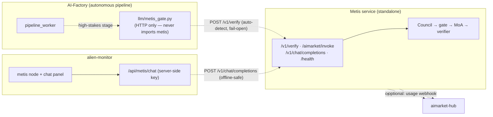
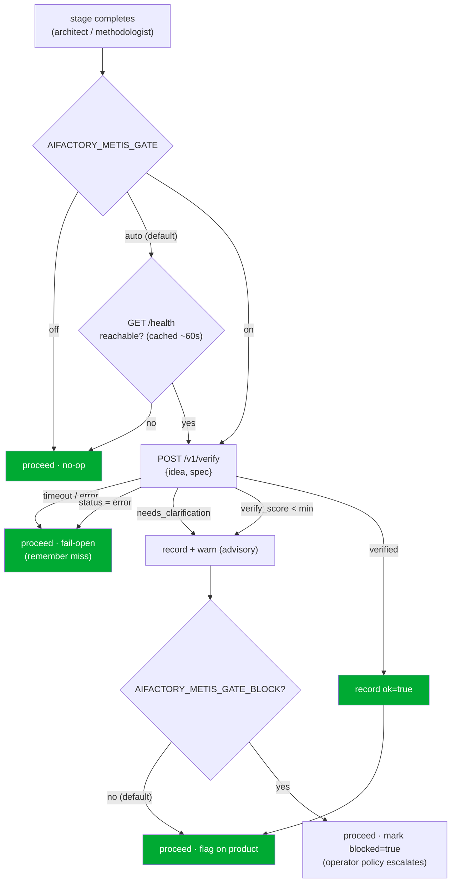

# Intégration Metis ⇄ AI-Factory

**Metis** ([`metis/`](../metis/)) est le **niveau de cognition et de vérification** de l'écosystème — une
couche cognitive distribuée par-dessus n'importe quel LLM. Au lieu de répondre avec un seul appel LLM, il exécute un
*Understanding Council → confidence gate (fail-closed) → Mixture-of-Agents en couches → vérificateur*,
et renvoie une **enveloppe de vérification** : une réponse, un `verify_score` et — lorsque la requête est
trop ambiguë pour y répondre en toute sécurité — un statut `needs_clarification` avec les questions auxquelles il a besoin
de réponses.

Ce document décrit comment la factory et Metis sont reliés, et la seule règle qui
gouverne toute la conception : **ils sont indépendants.**

> 🌐 Langues : [English](metis-integration.md) · [Русский](metis-integration.ru.md) · [Español](metis-integration.es.md) · **Français** · [中文](metis-integration.zh.md)
> 📖 Vue côté Metis : [`metis/docs/en/ECOSYSTEM.md`](../metis/docs/en/ECOSYSTEM.md)

---

## 1. L'indépendance est l'invariant strict

La factory fonctionne **sans aucun Metis présent**, et Metis fonctionne **sans aucune factory présente**. Chaque
lien entre eux est optionnel et se dégrade en no-op.



Chaque arête en pointillés peut être coupée à l'exécution avec un impact **nul** sur l'autre côté :

| Si ceci est hors service… | …ceci fonctionne toujours |
|---|---|
| Metis absent/injoignable | le pipeline de la factory tourne sans changement (le gate passe outre) |
| factory absente | Metis sert `/v1/*` normalement |
| Metis absent | le moniteur affiche le nœud `offline` ; le chat renvoie une indication lisible |
| hub absent | Metis ne le remarque jamais (enregistrement + webhook sont opt-in) |

Garanti par des tests : [`tests/test_metis_gate.py`](../tests/test_metis_gate.py) (la factory poursuit
quand Metis est injoignable), [`metis/tests/test_ecosystem_api.py`](../metis/tests/test_ecosystem_api.py)
(Metis sert sans variables d'environnement d'écosystème) et
[`alien-monitor/tests/test_metis_graph.py`](../alien-monitor/tests/test_metis_graph.py)
(le chat du moniteur est sûr hors ligne).

---

## 2. Le gate de confiance (confidence-gate)

La factory livre des produits de façon autonome. Elle échoue déjà en **fail-closed** sur l'infrastructure (providers,
mocks, wallets), mais un seul appel LLM ne lui donne **aucun signal « je ne suis pas sûr » lisible par la machine** sur le
*contenu* d'une décision. Metis fournit exactement ce signal. Les étapes à enjeux élevés (par défaut les étapes
`architect` et `methodologist`) font passer l'idée/spec du produit par Metis et enregistrent le
résultat.

### 2.1 Comment il décide — auto-detect + fail-open



L'enveloppe consultative est stockée sur le produit sous `product["metis_gate"]` (persistée via
`PRODUCT_EXTRA_KEYS`), de sorte qu'elle survit à un cycle de pipeline et est visible dans les traces et le moniteur :

```json
{
  "stage": "architect", "ok": false, "status": "needs_clarification",
  "verify_score": 0.0, "verified": false, "route": "council",
  "clarifications": ["Which platform?", "Who are the users?"],
  "blocked": false, "at": 1752096000.0
}
```

### 2.2 Séquence

```mermaid
sequenceDiagram
    participant PW as pipeline_worker
    participant G as metis_gate (HTTP)
    participant M as Metis /v1/verify
    PW->>G: verify_product_understanding(idea, spec)
    Note over G: mode=auto → GET /health (cached)
    alt Metis detected
        G->>M: POST /v1/verify {input, route, min_verify_score}
        M-->>G: {answer, status, verify_score, verified, clarifications}
        G-->>PW: GateVerdict(ok=…)
        PW->>PW: record product["metis_gate"]; warn if !ok
    else Metis absent / error
        G-->>PW: GateVerdict(ok=true, available=false)  %% fail-open
        PW->>PW: no-op
    end
```

### 2.3 Activation / configuration

Le mode par défaut est **auto** — si un service Metis est joignable, il est utilisé ; sinon la factory se comporte
exactement comme aujourd'hui. Rien à activer.

```bash
# Point the factory at your Metis (default http://127.0.0.1:8080)
export METIS_URL=https://metis.internal:8080
export METIS_API_KEY=sk-…            # only if your Metis runs with auth

# Optional: force modes / behaviour
export AIFACTORY_METIS_GATE=on       # auto (default) | on | off
export AIFACTORY_METIS_GATE_BLOCK=1  # let a low-confidence verdict escalate (default: advisory only)
```

| Variable d'env | Par défaut | Signification |
|---|---|---|
| `AIFACTORY_METIS_GATE` | `auto` | `auto` = utiliser Metis si `/health` répond · `on` = toujours essayer · `off` = ne jamais contacter |
| `AIFACTORY_METIS_GATE_BLOCK` | `0` | `1` permet à un verdict `ok=false` de définir `blocked=true` pour que la politique de l'opérateur agisse |
| `AIFACTORY_METIS_URL` / `METIS_URL` | `http://127.0.0.1:8080` | URL de base de Metis |
| `AIFACTORY_METIS_API_KEY` / `METIS_API_KEY` | — | jeton bearer (uniquement si Metis exige l'authentification) |
| `AIFACTORY_METIS_GATE_STAGES` | `architect,methodologist` | quelles étapes passer par le gate |
| `AIFACTORY_METIS_GATE_ROUTE` | `council` | `fast` \| `thinking` \| `council` \| `agent` |
| `AIFACTORY_METIS_GATE_MIN_SCORE` | `0.7` | seuil de vérification pour le drapeau `verified` |
| `AIFACTORY_METIS_GATE_TIMEOUT` | `300` | délai d'expiration de l'appel verify (s) — doit dépasser la limite du serveur Metis (300 s) |
| `AIFACTORY_METIS_PROBE_TIMEOUT` | `2` | délai d'expiration de la sonde `/health` (s) |
| `AIFACTORY_METIS_PROBE_TTL` | `60` | secondes de mise en cache du résultat de détection |

**Pourquoi l'auto-detect et non le blocage activé par défaut ?** Parce que l'indépendance ne doit jamais être théorique.
Un Metis absent coûte une seule sonde de santé rapide et mise en cache — jamais un délai d'expiration par étape — et jamais un crash.
Le blocage est opt-in afin qu'un déploiement Metis non vérifié ne puisse pas bloquer silencieusement le pipeline.

Code : [`llm/metis_gate.py`](../llm/metis_gate.py) · hook dans
[`pipeline_worker.py`](../pipeline_worker.py) (`_maybe_metis_gate`).

### 2.4 Badge de pipeline admin (activité Metis de la factory)

Sur **Admin → Pipeline** (`/admin?tab=pipeline`), chaque carte de produit affiche un badge **Factory Metis** dans
la ligne d'actions (à côté des commandes pause / prototype). Il reflète le dernier instantané `product["metis_gate"]`
du **pipeline de la factory** — et non pas si le produit agent livré appelle Metis à
l'exécution.

| Badge | Signification |
|---|---|
| **Metis not checked** / **Metis non vérifié** | Aucun résultat de gate encore enregistré (`metis_gate` absent ou pas d'horodatage `at`). Typique avant que architect/methodologist ne se terminent, ou quand le gate est off et que Metis n'a jamais été contacté pour ce produit. |
| **Metis approved ✓** / **Metis approuvé ✓** | Le gate s'est exécuté sur une étape à enjeux élevés et a renvoyé `ok: true` (compréhension vérifiée). |
| **Metis flagged ⚠** / **Metis signalé ⚠** | Le gate s'est exécuté et a renvoyé `ok: false` (score faible, `needs_clarification`, etc.). Consultatif par défaut — le pipeline se poursuit sauf si `AIFACTORY_METIS_GATE_BLOCK=1` a défini `blocked: true`. |

**Tableau de bord de l'écosystème :** **Admin → Dashboard** affiche une carte **Metis in the ecosystem** (verte **Active** quand Metis est déployé et que le gate de la factory est activé ; grise **Inactive** sinon) avec l'état de déploiement, l'utilisation par la factory et le décompte agrégé des approbations/signalements sur l'ensemble des produits.

Survolez le badge pour voir stage, route, score et status quand un verdict existe. L'API du pipeline
(`GET /api/admin/pipeline/products`) inclut `metis_gate` sur chaque ligne de produit quand `at` est défini.

UI : [`web/frontend/components/admin/pipeline/MetisGateBadge.tsx`](../web/frontend/components/admin/pipeline/MetisGateBadge.tsx) ·
resolver : [`web/frontend/lib/metisGateBadge.ts`](../web/frontend/lib/metisGateBadge.ts) ·
champ API : [`web/backend/api/admin/dashboard/routes_pipeline.py`](../web/backend/api/admin/dashboard/routes_pipeline.py).
Voir aussi **[admin-guide.md § Pipeline](./admin-guide.md#pipeline)**.

---

## 3. La surface fournisseur de Metis (ce que la factory appelle)

Metis expose l'enveloppe de vérification sur sa propre API (ajoutée par
[`metis/metis/api/ecosystem.py`](../metis/metis/api/ecosystem.py), optionnelle et autonome) :

| Route | Appelant | Body → Response |
|---|---|---|
| `POST /v1/verify` | gate de la factory, n'importe quel consommateur | `{input, route?, min_verify_score?}` → enveloppe |
| `POST /aimarket/invoke` | AIMarket Hub | `{input, product_id, capability_id}` → `{result: envelope}` |
| `POST /v1/chat/completions` | chat du moniteur | chat compatible OpenAI |
| `GET /health` | auto-detect du gate, moniteur | liveness + cluster + nombre de connaissances |

L'**enveloppe** :

```json
{
  "answer": "…", "status": "success|needs_clarification|error",
  "verified": true, "verify_score": 0.87, "route": "council",
  "depth": "L3_full", "iterations": 1, "clarifications": [], "usage": {}, "trace_id": "…"
}
```

Pour enregistrer Metis comme **capability de hub** payante et découvrable, copiez
[`metis/config/aimarket-capability.example.json`](../metis/config/aimarket-capability.example.json),
définissez `invoke_url` sur votre `…/aimarket/invoke` public et exécutez
`aimarket publish aimarket-capability.json`. C'est optionnel — Metis est pleinement fonctionnel sans cela.

---

## 4. Alien-monitor : nœud + chat en direct

Metis apparaît comme un nœud `cognition` dans le graphe 3D de l'écosystème. Cliquer dessus ouvre le panneau de détails
avec ses paramètres en direct (`knowledge_entries`, `cluster_nodes`, `open_breakers`, version) **et une
zone de chat** pour lui parler directement.

Le chat est relayé par le backend du moniteur (`POST /api/metis/chat` →
[`alien-monitor/backend/metis_status.py`](../alien-monitor/backend/metis_status.py)) afin que la clé API
Metis n'atteigne jamais le navigateur, et un Metis mort produit un message lisible au lieu d'une erreur.
Nœud/topologie : [`alien-monitor/backend/metis_layers.py`](../alien-monitor/backend/metis_layers.py).

---

## 5. Repo et publication

`metis/` est un sous-dossier du monorepo (source de vérité) qui est mis en miroir comme tout autre satellite :

| Cible | Comment |
|---|---|
| GitHub `alexar76/metis` (créé automatiquement au push) | `scripts/mirror_satellites.sh metis` |
| Gitea `alexar76/metis` (Gitea#2) | `scripts/mirror_to_gitea.sh metis` |

Le mapping se trouve dans [`scripts/satellite-map.yaml`](../scripts/satellite-map.yaml) (`exclude_paths`
empêche `.env`, `.venv`, `data/`, `reports/` d'entrer dans le miroir) et
[`scripts/gitea-targets.yaml`](../scripts/gitea-targets.yaml). Les secrets sont doublement protégés par
`scripts/verify_mirror_secrets.sh`.

---

## 6. Ce que ça apporte — honnêtement

- **Un signal de confiance là où il n'y en avait aucun** — les décisions autonomes gagnent un `verify_score` /
  `needs_clarification` lisible par la machine au lieu de « faire confiance à un seul appel ». Consultatif par défaut ; le blocage
  est opt-in.
- **Un coût proportionnel à la difficulté** — le DGPD de Metis ne dépense le budget multi-agent que lorsque les
  proposeurs sont en désaccord ; le gate ne s'exécute que sur les étapes à enjeux élevés.
- **Un seul plan d'observabilité** — chaque décision passée par le gate est enregistrée sur le produit et traçable dans
  l'admin (badge **Factory Metis** sur les cartes Pipeline) et dans alien-monitor.
- **Une adoption sans refactorisation ni risque** — uniquement HTTP, auto-détecté, fail-open. Désactiver Metis (ou
  ne jamais le démarrer) ramène la factory à son comportement antérieur exact.

Réserve : un appel Metis est *plus* coûteux qu'un seul appel LLM (il est multi-agent), il est donc appliqué
aux étapes à enjeux élevés, et non comme un remplacement généralisé du LLM.
