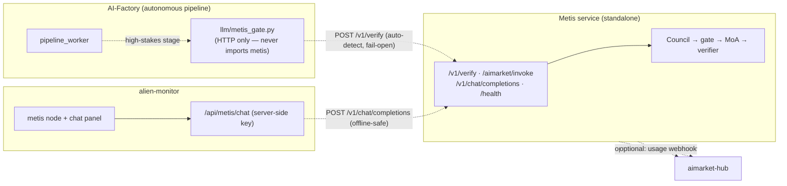
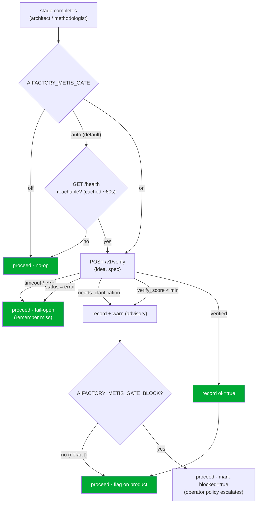

# Metis ⇄ AI-Factory integration

**Metis** ([`metis/`](../metis/)) is the ecosystem's **cognition & verification tier** — a
distributed cognitive layer over any LLM. Instead of answering with one LLM call, it runs an
*Understanding Council → confidence gate (fail-closed) → layered Mixture-of-Agents → verifier*,
and returns a **verification envelope**: an answer, a `verify_score`, and — when the request is
too ambiguous to answer safely — a `needs_clarification` status with the questions it needs
answered.

This document describes how the factory and Metis are wired together, and the one rule that
governs the whole design: **they are independent.**

> 🌐 Languages: **English** · [Русский](metis-integration.ru.md) · [Español](metis-integration.es.md)
> 📖 Metis-side view: [`metis/docs/en/ECOSYSTEM.md`](../metis/docs/en/ECOSYSTEM.md)

---

## 1. Independence is the hard invariant

The factory runs with **no Metis present**, and Metis runs with **no factory present**. Every
link between them is optional and degrades to a no-op.



Every dashed edge can be cut at runtime with **zero** impact on the other side:

| If this is down… | …this still works |
|---|---|
| Metis absent/unreachable | factory pipeline runs unchanged (gate falls through) |
| factory absent | Metis serves `/v1/*` normally |
| Metis absent | monitor shows the node `offline`; chat returns a readable hint |
| hub absent | Metis never notices (registration + webhook are opt-in) |

Guaranteed by tests: [`tests/test_metis_gate.py`](../tests/test_metis_gate.py) (factory proceeds
when Metis is unreachable), [`metis/tests/test_ecosystem_api.py`](../metis/tests/test_ecosystem_api.py)
(Metis serves with no ecosystem env), and
[`alien-monitor/tests/test_metis_graph.py`](../alien-monitor/tests/test_metis_graph.py)
(monitor chat is offline-safe).

---

## 2. The confidence-gate

The factory ships products autonomously. It already fails **closed** on infrastructure (providers,
mocks, wallets), but a single LLM call gives it **no machine-readable "I'm not sure" signal** on the
*content* of a decision. Metis supplies exactly that signal. High-stakes stages (by default the
`architect` and `methodologist` stages) route the product's idea/spec through Metis and record the
result.

### 2.1 How it decides — auto-detect + fail-open



The advisory envelope is stored on the product as `product["metis_gate"]` (persisted via
`PRODUCT_EXTRA_KEYS`), so it survives a pipeline cycle and is visible in traces and the monitor:

```json
{
  "stage": "architect", "ok": false, "status": "needs_clarification",
  "verify_score": 0.0, "verified": false, "route": "council",
  "clarifications": ["Which platform?", "Who are the users?"],
  "blocked": false, "at": 1752096000.0
}
```

### 2.2 Sequence

```mermaid
sequenceDiagram
    participant PW as pipeline_worker
    participant G as metis_gate (HTTP)
    participant M as Metis /v1/verify
    PW->>G: verify_product_understanding(idea, spec)
    Note over G: mode=auto → GET /health (cached)
    alt Metis detected
        G->>M: POST /v1/verify {input, route, min_verify_score}
        M-->>G: {answer, status, verify_score, verified, clarifications}
        G-->>PW: GateVerdict(ok=…)
        PW->>PW: record product["metis_gate"]; warn if !ok
    else Metis absent / error
        G-->>PW: GateVerdict(ok=true, available=false)  %% fail-open
        PW->>PW: no-op
    end
```

### 2.3 Enable / configure

Default is **auto** — if a Metis service is reachable it is used; otherwise the factory behaves
exactly as it does today. Nothing to turn on.

```bash
# Point the factory at your Metis (default http://127.0.0.1:8080)
export METIS_URL=https://metis.internal:8080
export METIS_API_KEY=sk-…            # only if your Metis runs with auth

# Optional: force modes / behaviour
export AIFACTORY_METIS_GATE=on       # auto (default) | on | off
export AIFACTORY_METIS_GATE_BLOCK=1  # let a low-confidence verdict escalate (default: advisory only)
```

| Env var | Default | Meaning |
|---|---|---|
| `AIFACTORY_METIS_GATE` | `auto` | `auto` = use Metis iff `/health` responds · `on` = always try · `off` = never contact |
| `AIFACTORY_METIS_GATE_BLOCK` | `0` | `1` lets an `ok=false` verdict set `blocked=true` for operator policy to act on |
| `AIFACTORY_METIS_URL` / `METIS_URL` | `http://127.0.0.1:8080` | Metis base URL |
| `AIFACTORY_METIS_API_KEY` / `METIS_API_KEY` | — | bearer token (only if Metis requires auth) |
| `AIFACTORY_METIS_GATE_STAGES` | `architect,methodologist` | which stages to gate |
| `AIFACTORY_METIS_GATE_ROUTE` | `council` | `fast` \| `thinking` \| `council` \| `agent` |
| `AIFACTORY_METIS_GATE_MIN_SCORE` | `0.7` | verify threshold for the `verified` flag |
| `AIFACTORY_METIS_GATE_TIMEOUT` | `300` | verify call timeout (s) — must exceed Metis server cap (300s) |
| `AIFACTORY_METIS_PROBE_TIMEOUT` | `2` | `/health` probe timeout (s) |
| `AIFACTORY_METIS_PROBE_TTL` | `60` | seconds to cache the detection result |

**Why auto-detect and not on-by-default-blocking?** Because independence must never be theoretical.
A missing Metis costs one fast, cached health probe — never a per-stage timeout — and never a crash.
Blocking is opt-in so an unreviewed Metis deployment can't silently stall the pipeline.

Code: [`llm/metis_gate.py`](../llm/metis_gate.py) · hook in
[`pipeline_worker.py`](../pipeline_worker.py) (`_maybe_metis_gate`).

### 2.4 Admin pipeline badge (factory Metis activity)

On **Admin → Pipeline** (`/admin?tab=pipeline`), each product card shows a **Factory Metis** badge in
the action row (next to pause / prototype controls). It reflects the latest `product["metis_gate"]`
snapshot from the **factory pipeline** — not whether the shipped agent product calls Metis at
runtime.

| Badge | Meaning |
|---|---|
| **Metis not checked** / **Без проверки Метис** | No gate result recorded yet (`metis_gate` missing or no `at` timestamp). Typical before architect/methodologist complete, or when the gate is off and Metis was never contacted for this product. |
| **Metis approved ✓** / **Одобрено Метис ✓** | Gate ran on a high-stakes stage and returned `ok: true` (verified understanding). |
| **Metis flagged ⚠** / **Замечание Метис ⚠** | Gate ran and returned `ok: false` (low score, `needs_clarification`, etc.). Advisory by default — the pipeline still proceeds unless `AIFACTORY_METIS_GATE_BLOCK=1` set `blocked: true`. |

**Ecosystem dashboard:** **Admin → Dashboard** shows a **Metis in the ecosystem** card (green **Active** when Metis is deployed and the factory gate is on; gray **Inactive** otherwise) with deployment status, factory usage, and aggregate approval/flag counts across products.

Hover the badge for stage, route, score, and status when a verdict exists. The pipeline API
(`GET /api/admin/pipeline/products`) includes `metis_gate` on each product row when `at` is set.

UI: [`web/frontend/components/admin/pipeline/MetisGateBadge.tsx`](../web/frontend/components/admin/pipeline/MetisGateBadge.tsx) ·
resolver: [`web/frontend/lib/metisGateBadge.ts`](../web/frontend/lib/metisGateBadge.ts) ·
API field: [`web/backend/api/admin/dashboard/routes_pipeline.py`](../web/backend/api/admin/dashboard/routes_pipeline.py).
See also **[admin-guide.md § Pipeline](./admin-guide.md#pipeline)**.

---

## 3. Metis's provider surface (what the factory calls)

Metis exposes the verification envelope on its own API (added by
[`metis/metis/api/ecosystem.py`](../metis/metis/api/ecosystem.py), optional & self-contained):

| Route | Caller | Body → Response |
|---|---|---|
| `POST /v1/verify` | factory gate, any consumer | `{input, route?, min_verify_score?}` → envelope |
| `POST /aimarket/invoke` | AIMarket Hub | `{input, product_id, capability_id}` → `{result: envelope}` |
| `POST /v1/chat/completions` | monitor chat | OpenAI-compatible chat |
| `GET /health` | gate auto-detect, monitor | liveness + cluster + knowledge count |

The **envelope**:

```json
{
  "answer": "…", "status": "success|needs_clarification|error",
  "verified": true, "verify_score": 0.87, "route": "council",
  "depth": "L3_full", "iterations": 1, "clarifications": [], "usage": {}, "trace_id": "…"
}
```

To register Metis as a paid, discoverable **hub capability**, copy
[`metis/config/aimarket-capability.example.json`](../metis/config/aimarket-capability.example.json),
set `invoke_url` to your public `…/aimarket/invoke`, and run
`aimarket publish aimarket-capability.json`. This is optional — Metis is fully functional without it.

---

## 4. Alien-monitor: node + live chat

Metis appears as a `cognition` node in the 3D ecosystem graph. Clicking it opens the detail panel
with its live parameters (`knowledge_entries`, `cluster_nodes`, `open_breakers`, version) **and a
chat box** to talk to it directly.

The chat is proxied by the monitor backend (`POST /api/metis/chat` →
[`alien-monitor/backend/metis_status.py`](../alien-monitor/backend/metis_status.py)) so the Metis
API key never reaches the browser, and a dead Metis yields a readable message instead of an error.
Node/topology: [`alien-monitor/backend/metis_layers.py`](../alien-monitor/backend/metis_layers.py).

---

## 5. Repo & publishing

`metis/` is a monorepo subfolder (source of truth) that mirrors out like every other satellite:

| Target | How |
|---|---|
| GitHub `alexar76/metis` (auto-created on push) | `scripts/mirror_satellites.sh metis` |
| Gitea `alexar76/metis` (Gitea#2) | `scripts/mirror_to_gitea.sh metis` |

Mapping lives in [`scripts/satellite-map.yaml`](../scripts/satellite-map.yaml) (`exclude_paths`
keeps `.env`, `.venv`, `data/`, `reports/` out of the mirror) and
[`scripts/gitea-targets.yaml`](../scripts/gitea-targets.yaml). Secrets are double-guarded by
`scripts/verify_mirror_secrets.sh`.

---

## 6. What it gives — honestly

- **A confidence signal where there was none** — autonomous decisions gain a machine-readable
  `verify_score` / `needs_clarification` instead of "trust one call". Advisory by default; blocking
  is opt-in.
- **Cost proportional to difficulty** — Metis's DGPD spends the multi-agent budget only when
  proposers disagree; the gate only runs on high-stakes stages.
- **One observability plane** — every gated decision is recorded on the product and traceable in
  admin (**Factory Metis** badge on Pipeline cards) and in alien-monitor.
- **Zero-refactor, zero-risk adoption** — HTTP-only, auto-detected, fail-open. Turning Metis off (or
  never starting it) returns the factory to its exact prior behaviour.

Caveat: a Metis call is *more* expensive than a single LLM call (it's multi-agent), so it is applied
to high-stakes steps, not as a blanket LLM replacement.
