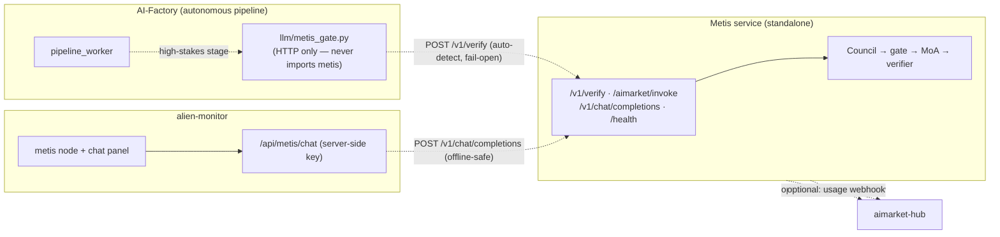
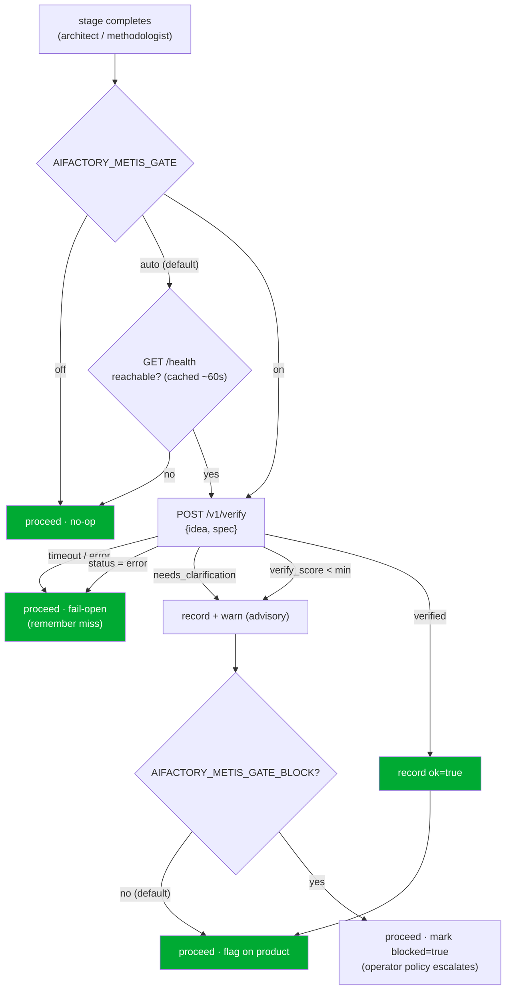

# Интеграция Metis ⇄ AI-Factory

**Metis** ([`metis/`](../metis/)) — это **уровень познания и верификации** экосистемы, распределённый когнитивный слой поверх любой LLM. Вместо того чтобы отвечать одним вызовом LLM, он запускает *Совет понимания (Understanding Council) → шлюз уверенности (fail-closed) → многослойную Mixture-of-Agents → верификатор* и возвращает **конверт верификации (verification envelope)**: ответ, `verify_score` и — когда запрос слишком неоднозначен, чтобы безопасно на него ответить — статус `needs_clarification` с вопросами, на которые ему нужны ответы.

Этот документ описывает, как фабрика и Metis связаны между собой, и единственное правило, которое определяет весь дизайн: **они независимы.**

> 🌐 Languages: [English](metis-integration.md) · **Русский** · [Español](metis-integration.es.md) · [Français](metis-integration.fr.md) · [中文](metis-integration.zh.md)
> 📖 Metis-side view: [`metis/docs/en/ECOSYSTEM.md`](../metis/docs/en/ECOSYSTEM.md)

---

## 1. Независимость — это жёсткий инвариант

Фабрика работает **без присутствия Metis**, а Metis работает **без присутствия фабрики**. Каждая связь между ними опциональна и сводится к no-op.



Любое пунктирное ребро можно разорвать во время работы с **нулевым** влиянием на другую сторону:

| Если это недоступно… | …это по-прежнему работает |
|---|---|
| Metis отсутствует/недостижим | конвейер фабрики работает без изменений (шлюз проваливается насквозь) |
| фабрика отсутствует | Metis обслуживает `/v1/*` в обычном режиме |
| Metis отсутствует | монитор показывает узел `offline`; чат возвращает читаемую подсказку |
| хаб отсутствует | Metis этого не замечает (регистрация + webhook — opt-in) |

Гарантируется тестами: [`tests/test_metis_gate.py`](../tests/test_metis_gate.py) (фабрика продолжает работу, когда Metis недостижим), [`metis/tests/test_ecosystem_api.py`](../metis/tests/test_ecosystem_api.py) (Metis обслуживает без ecosystem-переменных окружения) и [`alien-monitor/tests/test_metis_graph.py`](../alien-monitor/tests/test_metis_graph.py) (чат монитора безопасен в offline).

---

## 2. Шлюз уверенности (confidence-gate)

Фабрика поставляет продукты автономно. Она уже работает по принципу **fail-closed** на уровне инфраструктуры (провайдеры, mock-и, кошельки), но единичный вызов LLM не даёт ей **никакого машиночитаемого сигнала «я не уверен»** относительно *содержания* решения. Metis предоставляет именно этот сигнал. Стадии с высокими ставками (по умолчанию стадии `architect` и `methodologist`) направляют идею/спецификацию продукта через Metis и фиксируют результат.

### 2.1 Как принимается решение — auto-detect + fail-open



Рекомендательный (advisory) конверт сохраняется на продукте как `product["metis_gate"]` (персистится через `PRODUCT_EXTRA_KEYS`), поэтому он переживает цикл конвейера и виден в трассировках и в мониторе:

```json
{
  "stage": "architect", "ok": false, "status": "needs_clarification",
  "verify_score": 0.0, "verified": false, "route": "council",
  "clarifications": ["Which platform?", "Who are the users?"],
  "blocked": false, "at": 1752096000.0
}
```

### 2.2 Последовательность

```mermaid
sequenceDiagram
    participant PW as pipeline_worker
    participant G as metis_gate (HTTP)
    participant M as Metis /v1/verify
    PW->>G: verify_product_understanding(idea, spec)
    Note over G: mode=auto → GET /health (cached)
    alt Metis detected
        G->>M: POST /v1/verify {input, route, min_verify_score}
        M-->>G: {answer, status, verify_score, verified, clarifications}
        G-->>PW: GateVerdict(ok=…)
        PW->>PW: record product["metis_gate"]; warn if !ok
    else Metis absent / error
        G-->>PW: GateVerdict(ok=true, available=false)  %% fail-open
        PW->>PW: no-op
    end
```

### 2.3 Включение / настройка

По умолчанию используется режим **auto** — если сервис Metis достижим, он используется; в противном случае фабрика ведёт себя ровно так же, как сегодня. Ничего включать не нужно.

```bash
# Point the factory at your Metis (default http://127.0.0.1:8080)
export METIS_URL=https://metis.internal:8080
export METIS_API_KEY=sk-…            # only if your Metis runs with auth

# Optional: force modes / behaviour
export AIFACTORY_METIS_GATE=on       # auto (default) | on | off
export AIFACTORY_METIS_GATE_BLOCK=1  # let a low-confidence verdict escalate (default: advisory only)
```

| Env var | Default | Значение |
|---|---|---|
| `AIFACTORY_METIS_GATE` | `auto` | `auto` = использовать Metis, если `/health` отвечает · `on` = всегда пытаться · `off` = никогда не обращаться |
| `AIFACTORY_METIS_GATE_BLOCK` | `0` | `1` позволяет вердикту `ok=false` установить `blocked=true`, чтобы политика оператора могла на это отреагировать |
| `AIFACTORY_METIS_URL` / `METIS_URL` | `http://127.0.0.1:8080` | базовый URL Metis |
| `AIFACTORY_METIS_API_KEY` / `METIS_API_KEY` | — | bearer-токен (только если Metis требует аутентификации) |
| `AIFACTORY_METIS_GATE_STAGES` | `architect,methodologist` | какие стадии проходят через шлюз |
| `AIFACTORY_METIS_GATE_ROUTE` | `council` | `fast` \| `thinking` \| `council` \| `agent` |
| `AIFACTORY_METIS_GATE_MIN_SCORE` | `0.7` | порог верификации для флага `verified` |
| `AIFACTORY_METIS_GATE_TIMEOUT` | `300` | таймаут вызова verify (с) — должен быть не меньше серверного лимита Metis (300 с) |
| `AIFACTORY_METIS_PROBE_TIMEOUT` | `2` | таймаут пробы `/health` (с) |
| `AIFACTORY_METIS_PROBE_TTL` | `60` | время кэширования результата детекции (с) |

**Почему auto-detect, а не режим «включено-по-умолчанию-с-блокировкой»?** Потому что независимость никогда не должна быть теоретической. Отсутствующий Metis обходится в одну быструю кэшируемую пробу health — а не в таймаут на каждой стадии — и никогда не приводит к краху. Блокировка включается по желанию (opt-in), чтобы непроверенное развёртывание Metis не могло молча застопорить конвейер.

Код: [`llm/metis_gate.py`](../llm/metis_gate.py) · хук в [`pipeline_worker.py`](../pipeline_worker.py) (`_maybe_metis_gate`).

### 2.4 Бейдж в админке (активность Metis в фабрике)

На вкладке **Админ → Пайплайн** (`/admin?tab=pipeline`) у каждой карточки продукта в строке действий
(рядом с паузой и «прототип») отображается бейдж **Фабрика Metis**. Он показывает последний снимок
`product["metis_gate"]` из **пайплайна фабрики** — а не то, использует ли готовый агент Metis в
рантайме.

| Бейдж | Значение |
|---|---|
| **Без проверки Метис** | Результат шлюза ещё не записан (`metis_gate` отсутствует или нет поля `at`). Обычно до завершения architect/methodologist или когда шлюз выключен и Metis для этого продукта не вызывался. |
| **Одобрено Метис ✓** | Шлюз отработал на стадии с высокими ставками и вернул `ok: true` (понимание верифицировано). |
| **Замечание Метис ⚠** | Шлюз отработал и вернул `ok: false` (низкий score, `needs_clarification` и т.п.). По умолчанию рекомендательно — конвейер продолжается, если только `AIFACTORY_METIS_GATE_BLOCK=1` не выставил `blocked: true`. |

**Дашборд экосистемы:** **Админ → Дашборд** — карточка **Metis в экосистеме** (зелёный **Активен**, если Metis развёрнут и шлюз фабрики включён; серый **Неактивен** иначе) с показателями развёртывания, использования фабрикой и сводкой одобрений/замечаний по продуктам.

Наведите на бейдж — увидите stage, route, score и status, если вердикт есть. API пайплайна
(`GET /api/admin/pipeline/products`) отдаёт `metis_gate` в строке продукта, когда задано `at`.

UI: [`web/frontend/components/admin/pipeline/MetisGateBadge.tsx`](../web/frontend/components/admin/pipeline/MetisGateBadge.tsx) ·
логика: [`web/frontend/lib/metisGateBadge.ts`](../web/frontend/lib/metisGateBadge.ts) ·
поле API: [`web/backend/api/admin/dashboard/routes_pipeline.py`](../web/backend/api/admin/dashboard/routes_pipeline.py).
См. также **[admin-guide.md § Pipeline](./admin-guide.md#pipeline)**.

---

## 3. Провайдерская поверхность Metis (что вызывает фабрика)

Metis предоставляет конверт верификации через собственный API (добавлен [`metis/metis/api/ecosystem.py`](../metis/metis/api/ecosystem.py), опционально и самодостаточно):

| Маршрут | Вызывающая сторона | Body → Response |
|---|---|---|
| `POST /v1/verify` | шлюз фабрики, любой потребитель | `{input, route?, min_verify_score?}` → envelope |
| `POST /aimarket/invoke` | AIMarket Hub | `{input, product_id, capability_id}` → `{result: envelope}` |
| `POST /v1/chat/completions` | чат монитора | OpenAI-совместимый чат |
| `GET /health` | auto-detect шлюза, монитор | liveness + кластер + количество знаний |

**Конверт (envelope)**:

```json
{
  "answer": "…", "status": "success|needs_clarification|error",
  "verified": true, "verify_score": 0.87, "route": "council",
  "depth": "L3_full", "iterations": 1, "clarifications": [], "usage": {}, "trace_id": "…"
}
```

Чтобы зарегистрировать Metis как платную, обнаруживаемую **capability хаба**, скопируйте [`metis/config/aimarket-capability.example.json`](../metis/config/aimarket-capability.example.json), задайте `invoke_url` равным вашему публичному `…/aimarket/invoke` и выполните `aimarket publish aimarket-capability.json`. Это опционально — Metis полностью функционален без этого.

---

## 4. Alien-monitor: узел + живой чат

Metis отображается как узел `cognition` в 3D-графе экосистемы. Клик по нему открывает панель с деталями и его живыми параметрами (`knowledge_entries`, `cluster_nodes`, `open_breakers`, версия) **и полем чата**, чтобы общаться с ним напрямую.

Чат проксируется бэкендом монитора (`POST /api/metis/chat` → [`alien-monitor/backend/metis_status.py`](../alien-monitor/backend/metis_status.py)), поэтому API-ключ Metis никогда не попадает в браузер, а неработающий Metis выдаёт читаемое сообщение вместо ошибки. Узел/топология: [`alien-monitor/backend/metis_layers.py`](../alien-monitor/backend/metis_layers.py).

---

## 5. Репозиторий и публикация

`metis/` — это подпапка монорепозитория (источник истины), которая зеркалируется наружу, как и любой другой сателлит:

| Target | Как |
|---|---|
| GitHub `alexar76/metis` (создаётся автоматически при push) | `scripts/mirror_satellites.sh metis` |
| Gitea `alexar76/metis` (Gitea#2) | `scripts/mirror_to_gitea.sh metis` |

Соответствие описано в [`scripts/satellite-map.yaml`](../scripts/satellite-map.yaml) (`exclude_paths` не пускает `.env`, `.venv`, `data/`, `reports/` в зеркало) и [`scripts/gitea-targets.yaml`](../scripts/gitea-targets.yaml). Секреты защищены дважды с помощью `scripts/verify_mirror_secrets.sh`.

---

## 6. Что это даёт — честно

- **Сигнал уверенности там, где его не было** — автономные решения получают машиночитаемый `verify_score` / `needs_clarification` вместо «доверься одному вызову». По умолчанию рекомендательный; блокировка — opt-in.
- **Стоимость, пропорциональная сложности** — DGPD в Metis тратит бюджет мультиагентности только когда пропозеры расходятся во мнениях; шлюз запускается только на стадиях с высокими ставками.
- **Единая плоскость наблюдаемости** — каждое пропущенное через шлюз решение фиксируется на продукте, видно в админке (бейдж **Фабрика Metis** на карточках пайплайна) и в alien-monitor.
- **Внедрение без рефакторинга и без риска** — только HTTP, авто-детект, fail-open. Отключение Metis (или если его вовсе не запускать) возвращает фабрику к её точному прежнему поведению.

Оговорка: вызов Metis *дороже*, чем единичный вызов LLM (он мультиагентный), поэтому он применяется к шагам с высокими ставками, а не как повсеместная замена LLM.
