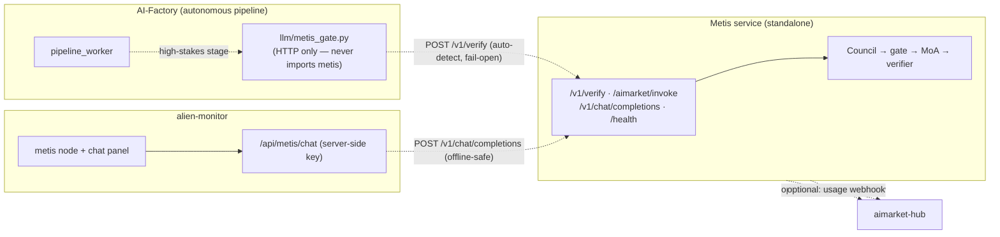
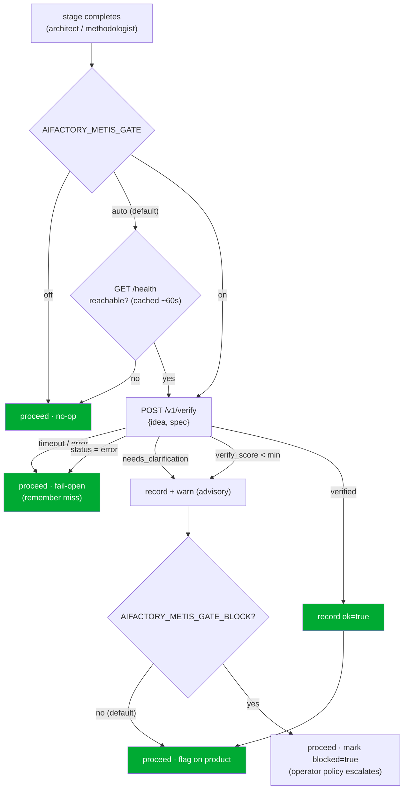

# Metis ⇄ AI-Factory 集成

**Metis**（[`metis/`](../metis/)）是生态系统的**认知与验证层** —— 一个位于任何 LLM 之上的分布式认知层。它不是用单次 LLM 调用来回答，而是运行一个 *Understanding Council → confidence gate（fail-closed）→ 分层 Mixture-of-Agents → 验证器*，并返回一个**验证信封（verification envelope）**：一个答案、一个 `verify_score`，以及 —— 当请求过于模糊而无法安全回答时 —— 一个带有它需要回答的问题的 `needs_clarification` 状态。

本文档描述工厂与 Metis 如何连接在一起，以及支配整个设计的唯一规则：**它们是相互独立的。**

> 🌐 语言：[English](metis-integration.md) · [Русский](metis-integration.ru.md) · [Español](metis-integration.es.md) · [Français](metis-integration.fr.md) · **中文**
> 📖 Metis 侧视图：[`metis/docs/en/ECOSYSTEM.md`](../metis/docs/en/ECOSYSTEM.md)

---

## 1. 独立性是硬性不变式

工厂在**没有 Metis 存在**的情况下运行，Metis 也在**没有工厂存在**的情况下运行。它们之间的每一条链接都是可选的，并会降级为 no-op。



任何虚线边都可以在运行时切断，对另一侧产生**零**影响：

| 若此项不可用… | …此项仍然工作 |
|---|---|
| Metis 缺失/不可达 | 工厂流水线照常运行（gate 直接放行） |
| 工厂缺失 | Metis 正常提供 `/v1/*` |
| Metis 缺失 | 监视器显示节点 `offline`；聊天返回可读的提示 |
| hub 缺失 | Metis 从不察觉（注册 + webhook 均为 opt-in） |

由测试保证：[`tests/test_metis_gate.py`](../tests/test_metis_gate.py)（Metis 不可达时工厂继续运行）、[`metis/tests/test_ecosystem_api.py`](../metis/tests/test_ecosystem_api.py)（Metis 在无生态系统环境变量时提供服务），以及 [`alien-monitor/tests/test_metis_graph.py`](../alien-monitor/tests/test_metis_graph.py)（监视器聊天在离线时安全）。

---

## 2. 置信门控（confidence-gate）

工厂自主交付产品。它在基础设施层面（providers、mocks、wallets）已经采用 **fail-closed**，但单次 LLM 调用无法为决策的*内容*提供**任何机器可读的『我不确定』信号**。Metis 正好提供这个信号。高风险阶段（默认是 `architect` 和 `methodologist` 阶段）将产品的 idea/spec 通过 Metis，并记录结果。

### 2.1 它如何决策 —— auto-detect + fail-open



这个建议性（advisory）信封作为 `product["metis_gate"]` 存储在产品上（通过 `PRODUCT_EXTRA_KEYS` 持久化），因此它能在一个流水线周期后保留，并在追踪和监视器中可见：

```json
{
  "stage": "architect", "ok": false, "status": "needs_clarification",
  "verify_score": 0.0, "verified": false, "route": "council",
  "clarifications": ["Which platform?", "Who are the users?"],
  "blocked": false, "at": 1752096000.0
}
```

### 2.2 时序

```mermaid
sequenceDiagram
    participant PW as pipeline_worker
    participant G as metis_gate (HTTP)
    participant M as Metis /v1/verify
    PW->>G: verify_product_understanding(idea, spec)
    Note over G: mode=auto → GET /health (cached)
    alt Metis detected
        G->>M: POST /v1/verify {input, route, min_verify_score}
        M-->>G: {answer, status, verify_score, verified, clarifications}
        G-->>PW: GateVerdict(ok=…)
        PW->>PW: record product["metis_gate"]; warn if !ok
    else Metis absent / error
        G-->>PW: GateVerdict(ok=true, available=false)  %% fail-open
        PW->>PW: no-op
    end
```

### 2.3 启用 / 配置

默认是 **auto** —— 如果 Metis 服务可达则使用它；否则工厂的行为与今天完全一致。无需开启任何东西。

```bash
# Point the factory at your Metis (default http://127.0.0.1:8080)
export METIS_URL=https://metis.internal:8080
export METIS_API_KEY=sk-…            # only if your Metis runs with auth

# Optional: force modes / behaviour
export AIFACTORY_METIS_GATE=on       # auto (default) | on | off
export AIFACTORY_METIS_GATE_BLOCK=1  # let a low-confidence verdict escalate (default: advisory only)
```

| 环境变量 | 默认值 | 含义 |
|---|---|---|
| `AIFACTORY_METIS_GATE` | `auto` | `auto` = 仅当 `/health` 响应时使用 Metis · `on` = 始终尝试 · `off` = 从不联系 |
| `AIFACTORY_METIS_GATE_BLOCK` | `0` | `1` 允许 `ok=false` 的裁定设置 `blocked=true`，供运营方策略据此处理 |
| `AIFACTORY_METIS_URL` / `METIS_URL` | `http://127.0.0.1:8080` | Metis 基础 URL |
| `AIFACTORY_METIS_API_KEY` / `METIS_API_KEY` | — | bearer 令牌（仅当 Metis 要求认证时） |
| `AIFACTORY_METIS_GATE_STAGES` | `architect,methodologist` | 对哪些阶段设门控 |
| `AIFACTORY_METIS_GATE_ROUTE` | `council` | `fast` \| `thinking` \| `council` \| `agent` |
| `AIFACTORY_METIS_GATE_MIN_SCORE` | `0.7` | `verified` 标志的验证阈值 |
| `AIFACTORY_METIS_GATE_TIMEOUT` | `300` | verify 调用超时（秒）—— 必须超过 Metis 服务器上限（300 秒） |
| `AIFACTORY_METIS_PROBE_TIMEOUT` | `2` | `/health` 探测超时（秒） |
| `AIFACTORY_METIS_PROBE_TTL` | `60` | 缓存检测结果的秒数 |

**为什么用 auto-detect 而不是默认开启且阻断？** 因为独立性绝不能只是理论上的。缺失的 Metis 只花费一次快速、带缓存的健康探测 —— 绝不会是每阶段的超时 —— 也绝不会崩溃。阻断是 opt-in 的，这样未经审查的 Metis 部署就无法悄无声息地卡住流水线。

代码：[`llm/metis_gate.py`](../llm/metis_gate.py) · 钩子位于 [`pipeline_worker.py`](../pipeline_worker.py)（`_maybe_metis_gate`）。

### 2.4 管理员流水线徽章（工厂的 Metis 活动）

在 **Admin → Pipeline**（`/admin?tab=pipeline`）上，每个产品卡片在操作行（暂停 / 原型控件旁）显示一个 **Factory Metis** 徽章。它反映来自**工厂流水线**的最新 `product["metis_gate"]` 快照 —— 而不是交付的代理产品在运行时是否调用 Metis。

| 徽章 | 含义 |
|---|---|
| **Metis not checked** / **Metis 未检查** | 尚未记录门控结果（`metis_gate` 缺失或没有 `at` 时间戳）。通常发生在 architect/methodologist 完成之前，或门控关闭且从未为此产品联系过 Metis 时。 |
| **Metis approved ✓** / **Metis 已批准 ✓** | 门控在高风险阶段运行并返回 `ok: true`（理解已验证）。 |
| **Metis flagged ⚠** / **Metis 已标记 ⚠** | 门控运行并返回 `ok: false`（分数低、`needs_clarification` 等）。默认是建议性的 —— 除非 `AIFACTORY_METIS_GATE_BLOCK=1` 设置了 `blocked: true`，否则流水线仍会继续。 |

**生态系统仪表盘：** **Admin → Dashboard** 显示一张 **Metis in the ecosystem** 卡片（当 Metis 已部署且工厂门控开启时为绿色 **Active**；否则为灰色 **Inactive**），包含部署状态、工厂用量，以及跨产品的批准/标记聚合计数。

当存在裁定时，将鼠标悬停在徽章上可查看 stage、route、score 和 status。流水线 API（`GET /api/admin/pipeline/products`）在设置了 `at` 时会在每个产品行中包含 `metis_gate`。

UI：[`web/frontend/components/admin/pipeline/MetisGateBadge.tsx`](../web/frontend/components/admin/pipeline/MetisGateBadge.tsx) ·
resolver：[`web/frontend/lib/metisGateBadge.ts`](../web/frontend/lib/metisGateBadge.ts) ·
API 字段：[`web/backend/api/admin/dashboard/routes_pipeline.py`](../web/backend/api/admin/dashboard/routes_pipeline.py)。
另见 **[admin-guide.md § Pipeline](./admin-guide.md#pipeline)**。

---

## 3. Metis 的 provider 面（工厂调用的内容）

Metis 在其自己的 API 上暴露验证信封（由 [`metis/metis/api/ecosystem.py`](../metis/metis/api/ecosystem.py) 添加，可选且自包含）：

| 路由 | 调用方 | Body → Response |
|---|---|---|
| `POST /v1/verify` | 工厂 gate、任何消费方 | `{input, route?, min_verify_score?}` → envelope |
| `POST /aimarket/invoke` | AIMarket Hub | `{input, product_id, capability_id}` → `{result: envelope}` |
| `POST /v1/chat/completions` | 监视器聊天 | 兼容 OpenAI 的聊天 |
| `GET /health` | gate 的 auto-detect、监视器 | liveness + 集群 + 知识条目数 |

**信封（envelope）**：

```json
{
  "answer": "…", "status": "success|needs_clarification|error",
  "verified": true, "verify_score": 0.87, "route": "council",
  "depth": "L3_full", "iterations": 1, "clarifications": [], "usage": {}, "trace_id": "…"
}
```

要将 Metis 注册为一个付费的、可发现的 **hub capability**，请复制 [`metis/config/aimarket-capability.example.json`](../metis/config/aimarket-capability.example.json)，将 `invoke_url` 设置为你的公开 `…/aimarket/invoke`，并运行 `aimarket publish aimarket-capability.json`。这是可选的 —— 没有它 Metis 也完全可用。

---

## 4. Alien-monitor：节点 + 实时聊天

Metis 在 3D 生态系统图中显示为一个 `cognition` 节点。点击它会打开详情面板，显示其实时参数（`knowledge_entries`、`cluster_nodes`、`open_breakers`、版本）**以及一个聊天框**，可直接与它对话。

聊天由监视器后端代理（`POST /api/metis/chat` → [`alien-monitor/backend/metis_status.py`](../alien-monitor/backend/metis_status.py)），因此 Metis API 密钥绝不会到达浏览器，而失效的 Metis 会产生可读消息而非错误。节点/拓扑：[`alien-monitor/backend/metis_layers.py`](../alien-monitor/backend/metis_layers.py)。

---

## 5. 仓库与发布

`metis/` 是 monorepo 的子文件夹（源头），它像其他每个卫星一样向外镜像：

| 目标 | 方式 |
|---|---|
| GitHub `alexar76/metis`（push 时自动创建） | `scripts/mirror_satellites.sh metis` |
| Gitea `alexar76/metis`（Gitea#2） | `scripts/mirror_to_gitea.sh metis` |

映射位于 [`scripts/satellite-map.yaml`](../scripts/satellite-map.yaml)（`exclude_paths` 将 `.env`、`.venv`、`data/`、`reports/` 排除在镜像之外）和 [`scripts/gitea-targets.yaml`](../scripts/gitea-targets.yaml)。密钥由 `scripts/verify_mirror_secrets.sh` 双重防护。

---

## 6. 它带来什么 —— 老实说

- **在原本没有的地方给出置信信号** —— 自主决策获得机器可读的 `verify_score` / `needs_clarification`，而不是『信任单次调用』。默认是建议性的；阻断是 opt-in 的。
- **成本与难度成正比** —— Metis 的 DGPD 仅在提议者意见不一致时才花费多智能体预算；门控仅在高风险阶段运行。
- **统一的可观测性平面** —— 每个经过门控的决策都记录在产品上，并可在管理端（Pipeline 卡片上的 **Factory Metis** 徽章）和 alien-monitor 中追踪。
- **零重构、零风险的采用** —— 仅 HTTP、自动检测、fail-open。关闭 Metis（或从不启动它）会让工厂回到其此前的确切行为。

注意：一次 Metis 调用比单次 LLM 调用*更*昂贵（它是多智能体的），因此它应用于高风险步骤，而不是作为对 LLM 的全面替代。
