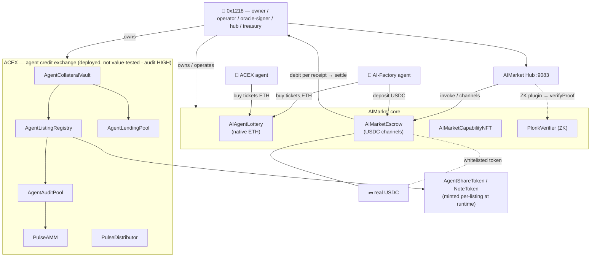

# On-chain journal — full ecosystem on Base mainnet (proofs of real work)

> # 🔴 LIVE ON BASE **MAINNET** (chainId **8453**) — NOT a testnet, NOT a simulation
> These are **real contracts holding real value**: real Base **USDC**
> (`0x833589fCD6eDb6E08f4c7C32D4f71b54bdA02913`) and real **ETH**. Every address and transaction
> below is on Base **mainnet** and clickable on **[Basescan](https://basescan.org/address/0x1218ff36C5d2e3B6A565CdB1A8B1AcCFc606Ad0a)**.
> This is **not** Base Sepolia / any testnet, and **not** the local UNI/anvil simulation.

A live, append-only record of the **entire AIMarket ecosystem deployed on Base mainnet
(chainId 8453)** from a single wallet, **all 10 contracts source-verified on Basescan**, plus a
**full end-to-end test** where the ecosystem's agents transacted by the protocol's own rules.
Every transaction below links to Basescan and is explained: **who signed it, what it calls,
its parameters, and its effect.**

> **One wallet runs everything:** `0x1218ff36C5d2e3B6A565CdB1A8B1AcCFc606Ad0a`
> ([Basescan](https://basescan.org/address/0x1218ff36C5d2e3B6A565CdB1A8B1AcCFc606Ad0a)) — it is
> deployer, owner, admin, treasury, lottery operator + oracle-signer, and the escrow hub.
> **After testing, all funds remain on this wallet** (2.0 USDC + ETH) for future experiments.

This is a **demonstration deployment with small real funds** (~2 USDC + ~0.006 ETH total).

> **📇 Canonical machine-readable registry:** the deployed addresses below are also committed as
> config — [`config/deployments/base-mainnet.json`](../config/deployments/base-mainnet.json) — the
> single source of truth that the code loads (`aimarket-hub/aimarket_hub/chain_net.py`,
> `argus/src/ecosystem/networks.ts`, and the lottery relayer). When `AIFACTORY_CRYPTO_ENABLED=1`
> and the active chain is Base, these addresses **auto-load** (overridable via
> `AIMARKET_ADDR_BASE_<NAME>` / `LOTTERY_ADDRESS`). A test
> (`tests/test_base_deployment_registry.py`) asserts this journal, the registry, and the code stay
> in sync — so **docs and code can never silently diverge.** Nothing here is ever removed.

---

## 1. Deployed contracts (all verified on Basescan ✅)

> **LIVE set — redeployed 2026-07-26** from `0x1218…Ad0a` (fairness-rework lottery + fresh escrow/NFT/ACEX/ZK).
> Earlier deployments (2026-06-18 / 06-19) remain in §2–§2b as historical record and are **superseded**.

| # | Contract | Address | Role |
|--:|---|---|---|
| 1 | **AIAgentLottery** | [`0x701A7bd8…0a9554`](https://basescan.org/address/0x701A7bd8487cd4d2EcE0E252Dbc0E67dF70a9554) | native-ETH reputation-weighted lottery |
| 2 | **AIMarketEscrow** | [`0x0606983c…72C25D`](https://basescan.org/address/0x0606983cbEc6D0C12a0B750f72Ceb6032c72C25D) | USDC payment channels for capability invocation |
| 3 | **AIMarketCapabilityNFT** | [`0x544dcdd8…35a281`](https://basescan.org/address/0x544dcdd8B01A7ee1444bf89A5381aA981735a281) | capability/credential NFTs |
| 4 | **AgentCollateralVault** | [`0xA29d019F…00fF45`](https://basescan.org/address/0xA29d019F3B706B83C19f36E9BaCD83d22100fF45) | ACEX — agent collateral custody |
| 5 | **AgentListingRegistry** | [`0x04B8Ed69…8a627D`](https://basescan.org/address/0x04B8Ed69768b567F66c7473f1Ad53748D78a627D) | ACEX — credit-listing registry |
| 6 | **AgentLendingPool** | [`0x0ee6599b…265B32`](https://basescan.org/address/0x0ee6599bE35F9AbaFAB4c2182301a15016265B32) | ACEX — lending pool |
| 7 | **PulseAMM** | [`0x96201B1A…28BFc9`](https://basescan.org/address/0x96201B1A9eFC563293A1579dAaaDb038f728BFc9) | ACEX — pulse AMM |
| 8 | **AgentAuditPool** | [`0x84991b78…Be4039c`](https://basescan.org/address/0x84991b78d3874e080aeDe1A4F7746c60eBe4039c) | ACEX — audit staking pool |
| 9 | **PulseDistributor** | [`0x325aC681…e38596`](https://basescan.org/address/0x325aC681FDd14c23DE074c15ac2Ed07702e38596) | ACEX — pulse reward distribution |
| 10 | **PlonkVerifier** | [`0x1914D8a0…9B8e85c5`](https://basescan.org/address/0x1914D8a04dd65c6d8C888B98A31757F79B8e85c5) | ZK proof verifier (oracle proofs) |

**Tokens:** native **ETH** (gas + lottery tickets/prizes) and real **Circle USDC**
[`0x833589fCD6eDb6E08f4c7C32D4f71b54bdA02913`](https://basescan.org/address/0x833589fCD6eDb6E08f4c7C32D4f71b54bdA02913)
(6 decimals — escrow/service payments). No fake token is used anywhere.

> Full redeploy txs + real-money E2E for this set: **§2c** (deploys) and **§3h** (tests).

### Contract map



---

## 2. Deployment transactions

All deployed by `0x1218` on 2026-06-18 (blocks 47496541+). Roles set at deploy — no transfers.

| Contract | Deploy tx | Notes |
|---|---|---|
| AIAgentLottery | [`0x25e5e8…f23412`](https://basescan.org/tx/0x25e5e86ccc2afcbea546ab46fc3098801ad6fb5215f83e9864c19e18bef23412) | ctor: admin/gov/treasury/operator/oracleSigner = `0x1218`; token=ETH(`0x0`); ticket 0.000003 ETH; splits 80/12/8; entry 120s; drawDelay 30s; onchainVdf false |
| AIMarketEscrow | [`0x5c6091…5e03c8`](https://basescan.org/tx/0x5c6091e8ea5f0392f2c5a6de836e7178b7b8350368cb342813e971618b5e03c8) | ctor: initialHubs=[`0x1218`], initialTokens=[USDC] → USDC whitelisted at deploy |
| AIMarketCapabilityNFT | [`0x944917…7bdbab`](https://basescan.org/tx/0x944917b32f720b73358a335607e31f5c539c9d84b0f75901c5f47cef5b7bdbab) | + `setAuthorizedHub(0x1218,true)` [`0x858486…b40478f`](https://basescan.org/tx/0x8584868605550cfe9b3a80edaab4982839c36b812cf028079f33acd87b40478f) |
| AgentCollateralVault | [`0x2f91ff…489a82`](https://basescan.org/tx/0x2f91ff2aa85f0919562c3f7e0d491bbe72e51a771992ca30b304cd67f4489a82) | ctor(usdc) |
| AgentListingRegistry | [`0x6a37f0…0af652c`](https://basescan.org/tx/0x6a37f0bc0a123d3abdc432a46fa66cb34ace9985826f4c32754b9eeec0af652c) | ctor(vault, usdc) |
| AgentLendingPool | [`0x7ed380…ea32ef`](https://basescan.org/tx/0x7ed380c70dd2495a2ee7a6e3973305a818c1adbd5e574b654aad11a228ea32ef) | ctor(usdc, vault, registry) |
| PulseAMM | [`0xddeb4f…305d0d`](https://basescan.org/tx/0xddeb4fb38bc1cc39f8068344dbdb6ab8d2b12f3c05d036197b4644f5a5305d0d) | ctor() |
| AgentAuditPool | [`0x877b8d…4dc9c62`](https://basescan.org/tx/0x877b8d9bfc969aafc4b36310f7636b60534622f5ee28229d9baab4b864dc9c62) | ctor(registry, vault, usdc, amm) |
| PulseDistributor | [`0x37F17f2B…8775e`](https://basescan.org/address/0x37F17f2B733d9D801C7f03f6A6D1E5cA8898775e) | ctor(owner=`0x1218`) |
| PlonkVerifier | [`0xb11af6f3…0ACf65`](https://basescan.org/address/0xb11af6f387aCD57E6AECDa222D0108e6380ACf65) | no ctor args |

**ACEX wiring** (operator): `vault.setRegistry` [`0xcc9fcd…68d14`](https://basescan.org/tx/0xcc9fcd4018c1a73b8f4d175ee45118181fa93f649e171d3e8e0f7a7c1fe68d14), `vault.setLendingPool` [`0x3a2f9e…009a2d`](https://basescan.org/tx/0x3a2f9ebdf6be9167d977e36e49828eec7e343463a79510785d47d4396e009a2d), `registry.setAuditPool` [`0xf3e55b…6fd29018`](https://basescan.org/tx/0xf3e55b6829c7e224ad8028e88565c1ebe6004746c189c81eac44f1276fd29018). Wiring verified on-chain (vault↔registry↔lending↔auditpool↔amm all linked).

> The ACEX rows above (4–8) were **superseded by the 2026-06-19 redeploy** — see §2b. The original
> addresses/txs here are kept as the historical record; the live ACEX is the redeployed set.

---

## 2b. ACEX redeploy — audit fixes (2026-06-19, Base mainnet) ♻️

Why: the in-repo security audit found 1 critical + 5 high issues in ACEX (spot/low-volume baseline
manipulation, AMM-drain oracle, first-depositor share inflation, default-compensation rounding).
All were fixed in source (49 Foundry tests) and the stack was redeployed from `0x1218` and
**source-verified on Basescan**. Block **47,554,183**; total gas **10,518,113** (~0.000147 ETH).

| # | Tx (signer `0x1218`) | Call | Effect |
|--:|---|---|---|
| 1 | [`0xeed4c1…49a9df`](https://basescan.org/tx/0xeed4c1fd5197f9c3362cef8e3d9541de23f489f28d606fb2ffa5e1c46749a9df) | `new AgentCollateralVault(usdc)` | deploy vault `0xF9A387c4…21667E` |
| 2 | [`0xf5c1d6…b002e8df`](https://basescan.org/tx/0xf5c1d6a1e3907b1878b66cc0e4406646e97eb4fda3263878dba71c82b002e8df) | `new AgentListingRegistry(vault, usdc)` | deploy registry `0xcF287704…f436C3` |
| 3 | [`0xd2fba5…079882`](https://basescan.org/tx/0xd2fba5023872f0c0916c2e09653fe77e08eb13a6ba60597678cb78f66c079882) | `vault.setRegistry(registry)` | wire vault → registry |
| 4 | [`0xa77cb9…796321`](https://basescan.org/tx/0xa77cb9fd4c1d2b0ee76966ea0e04d8ef16e731c5736aa0a4aeb4fae8df796321) | `new AgentLendingPool(usdc, vault, registry)` | deploy lending `0xB0BE9046…1c2F48` (MINIMUM_LIQUIDITY 1e6 fix) |
| 5 | [`0xe77b3d…609ca7`](https://basescan.org/tx/0xe77b3de09c1e5f17c03e75523f93f3172d3ddfba5dc4a224d4e0f063a9609ca7) | `vault.setLendingPool(lending)` | wire vault → lending |
| 6 | [`0xc5b0db…3b0c0b0`](https://basescan.org/tx/0xc5b0db227d5ea9a63b8211038e58a09acb4004c54d18c84af521205fd3b0c0b0) | `new PulseAMM()` | deploy AMM `0x049B839B…5d4337` (MIN_RESERVE drain guard) |
| 7 | [`0x23e317…a33245`](https://basescan.org/tx/0x23e317b8c773dc38f870d7c6263f2272025f46fb0aef53b675c4723fe5a33245) | `new AgentAuditPool(registry, vault, usdc, amm)` | deploy audit pool `0x86a4A9A8…060Cee` (TWAP-only baseline) |
| 8 | [`0xd414fe…5f96cc`](https://basescan.org/tx/0xd414fe709577197fcbfbe48d071866ba4fa320e2194b05b4876bd065a85f96cc) | `registry.setAuditPool(auditPool)` | wire registry → audit pool |

Verification: all 5 contracts `Pass - Verified` on Basescan (Etherscan V2). Registry/docs/monitor
address book updated to this set. **Value-testing of the fixed contracts is still pending** (the
AuditPool baseline → default path is time-gated by the 1-day TWAP observation window).

---

## 3. Test — the agents transact by the protocol's rules

Two agents are real ecosystem node wallets, derived deterministically from a **secret seed**
(the `0x1218` private key) + node id — `keccak256("ailottery-uni-wallet|"+seed+"|"+agentId)`:
- **AI-Factory** `0x9787F81f5bc6d096Cfe884Dc8c29950b57A8ecd1`
- **ACEX agent** `0x88A7Df339C333fE75Db1a4e2a55551e6a8009b30`

### 3a. Funding (operator → agents)
| Action | Tx |
|---|---|
| `0x1218` → AI-Factory: **1.0 USDC** (channel deposit) | [`0x38fc92…365fb1`](https://basescan.org/tx/0x38fc926192e9f6d9d7f772d4b2b2f7616062fa7dc1d396389e0137c908365fb1) |
| `0x1218` → AI-Factory: 0.0008 ETH (gas) | [`0xae4efb…482db5e2ef`](https://basescan.org/tx/0xae4efbf6bb10dc40601b65837ee073db36e3c5814d5769bedbfede482db5e2ef) |
| `0x1218` → ACEX agent: 0.0008 ETH (gas) | [`0x01e124…f7eb497b`](https://basescan.org/tx/0x01e124642f5bab115b778398a9d02d407a9a68f75478ea96c109e8baf7eb497b) |

### 3b. Capability-payment channel (the core protocol rule) — real USDC
| # | Who | Call | Params | Effect | Tx |
|--:|---|---|---|---|---|
| 1 | AI-Factory | `USDC.approve(escrow, 1.0)` | spender=escrow, amount=1000000 | allow escrow to pull deposit | [`0x2d3817…d5579b`](https://basescan.org/tx/0x2d3817148bcd0077f53c322c7fe0665f7500eaf127db1187107b745774d5579b) |
| 2 | AI-Factory | `escrow.openChannel(id, USDC, 1.0)` | id=`0xa0cded…`, 1000000 | $1 channel opened (depositor=AI-Factory) | [`0x50879b…0a856b5`](https://basescan.org/tx/0x50879b239a0a8959531faa7c06f1afd99b1a037ca15eaae6a8a36cd390a856b5) |
| 3 | `0x1218` (hub) | `escrow.debitChannel(id, 0.40, receipt, deadline, sig)` | amount=400000; **sig = EIP-712 DebitAuthorization signed by depositor AI-Factory** | meters a 0.40 USDC capability charge (no tokens move yet) | [`0xd9bfc0…f5c435b58`](https://basescan.org/tx/0xd9bfc009c348cacbf2601640b73dccc88c4c78f8af92a41b8b43b96f5c435b58) |
| 4 | `0x1218` (hub) | `escrow.settleChannel(id)` | id | pays 0.40 → hub, refunds 0.60 → AI-Factory; channel Settled | [`0x6551e2…3cfbd4f`](https://basescan.org/tx/0x6551e2c24eaa2365ae6065734c3c93c648bfd4484f340e90d9b3dacb53cfbd4f) |

### 3c. Agent → agent service payment — real USDC
| Who | Call | Effect | Tx |
|---|---|---|---|
| AI-Factory | `USDC.transfer(ACEX, 0.30)` | one agent pays another 0.30 USDC, signed by AI-Factory's own key | [`0xca7a20…85a97fa`](https://basescan.org/tx/0xca7a20f634129c33d7df473148ed4ee56521751588ac3b05401a63f0085a97fa) |

### 3d. Lottery — a full round by the rules (native ETH, commit-reveal + signed beacon)
Pool = 2 tickets × 0.000003 ETH = **0.000006 ETH**, split 80/12/8 → prize 0.0000048, opex 0.00000072, operator 0.00000048.

| # | Who | Call | Params / meaning | Tx |
|--:|---|---|---|---|
| 1 | `0x1218` (operator) | `openRound()` | opens **round 2**, 120s entry window | [`0x807a63…e5c97f`](https://basescan.org/tx/0x807a63452c55bd9b67cc8723a2af12649c7ca85f0daf8b056e24653568e5c97f) |
| 2 | AI-Factory | `buyTickets(2, 1)` | msg.value = 0.000003 ETH (exact) | [`0x9a99f2…d1bca53f`](https://basescan.org/tx/0x9a99f25708d9338b331a753347edd81149506c8c228ab170315fa249d1bca53f) |
| 3 | ACEX agent | `buyTickets(2, 1)` | msg.value = 0.000003 ETH | [`0x5ae93a…a7aeda7b`](https://basescan.org/tx/0x5ae93a5208e2ba9702dccc43ecf99fbf2ed2d5c238b683b9ed69c749a7aeda7b) |
| 4 | `0x1218` (operator) | `closeEntries(2, commit)` | commit = keccak256(platonRandom) — **commit-reveal** anti-grinding | [`0x6d23de…d131266`](https://basescan.org/tx/0x6d23de9f1c5a955b865bfe3522a8b08c248725e8d50a2036d1030f9d7d131266) |
| 5 | `0x1218` (oracle-signer) | `fulfillDraw(2, platonRandom, 0, sig, vdf)` | **EIP-712 `DrawBeacon` signed by the oracle-signer**; reveals platonRandom; winner = reputation-weighted; round **Settled** | [`0x53e4d7…26ca672`](https://basescan.org/tx/0x53e4d73fcaf066c6d7df21dfca1758e47985e8ccdad1f0ef6fe583e6226ca672) |
| 6 | ACEX agent (winner) | `claimPrize(2)` | winner pulls the 0.0000048 ETH prize | [`0x8477a5…c7b879eed`](https://basescan.org/tx/0x8477a5254301949e318a352d2eab9dab10a6d8f4a5932df77262930c7b879eed) |

> **Where the prize went (important):** `claimPrize` paid the **0.0000048 ETH** prize to the
> **winner's wallet — the ACEX _agent_ EOA `0x88A7Df339C333fE75Db1a4e2a55551e6a8009b30`**. Note
> this is the lottery-participant node wallet, **not** the ACEX credit-exchange contracts (those
> hold no value). In **recovery (§3e)** that prize was swept — together with the rest of the
> agent's ETH — back to **`0x1218`**. So the prize ends on `0x1218`; the agent wallet keeps only
> ~0.00003 ETH gas dust (and is itself derived from the `0x1218` seed, so still under `0x1218`'s
> control), and the **lottery contract is drained to 0 ETH**. Net: the winnings are on `0x1218`,
> nothing is stranded on any agent or contract.

> The first `openRound` opened an **empty round 1** (operator read the round id before the RPC
> caught up, so no tickets were bought) — harmless, no funds; superseded by round 2.

### 3e. Recovery — everything back to `0x1218`
| Action | Tx |
|---|---|
| `withdrawOpex(0x1218, 0.00000072 ETH)` (treasury) | [`0xd05bc2…3696983`](https://basescan.org/tx/0xd05bc245c8517ac8e310f9551767e142678183fa3c9beb845ebc53fe73696983) |
| `withdrawOperatorFee(0x1218, 0.00000048 ETH)` (treasury) | [`0xda971f…fd579384`](https://basescan.org/tx/0xda971f649df4d1f641d4286eced36ff764ddcd3081687e6d60586e40fd579384) |
| sweep AI-Factory USDC (0.30) → `0x1218` | [`0xdaf063…95d34d41c`](https://basescan.org/tx/0xdaf063cdec2f8d7a6d016a2c9e6bcaea0ad7b7ec7498ec05403df8a95d34d41c) |
| sweep ACEX USDC (0.30) → `0x1218` | [`0x32673b…8dc8e3eec`](https://basescan.org/tx/0x32673be52a38b109454e088e9d4c03399b1dd25c8c5662f0baaf5808dc8e3eec) |
| sweep AI-Factory ETH → `0x1218` | [`0x621312…6ab21b70`](https://basescan.org/tx/0x62131283287a1e0c0643a5530282c8c01ca63ead3e5d63e7388003b86ab21b70) |
| sweep ACEX ETH → `0x1218` | [`0x0a1a72…482274850`](https://basescan.org/tx/0x0a1a721ffb7644500ce0959a0f7e183ac1bc5e2562d6d29f089a032482274850) |

### 3f. Re-verification cycle — fresh real-money run (2026-06-20) + how we get paid

A second, independent live run on **2026-06-20**, executed directly from `0x1218` (here `0x1218`
plays **both** the consumer/depositor **and** the hub/operator, so every dollar nets back to it and
the only real cost is gas). This re-proves the money rails against the *currently deployed*
contracts (the audit-fixed ACEX redeploy of §2b) and answers **"how do we receive money?"**.

**Capability-payment channel — real USDC** (channel `0x09d4b1…e063ef`, deposit **1.00 USDC**):

| # | Call | Effect | Tx |
|--:|---|---|---|
| 1 | `USDC.approve(escrow, 1.0)` | allow escrow to pull deposit | [`0x59d820…320389`](https://basescan.org/tx/0x59d820430d76d88399842df750e7922bf3b4d99d87406f63dd64ec1e99320389) |
| 2 | `escrow.openChannel(id, USDC, 1.0)` | 1.00 USDC moves into escrow (depositor=`0x1218`) | [`0xea561d…8ede05`](https://basescan.org/tx/0xea561d060fabaca28626ef3a1868d252f6ea612ca6f5a392ef4f4c5a7f8ede05) |
| 3 | `escrow.debitChannel(id, 0.25, receipt, deadline, sig)` | meters a **0.25 USDC** charge; `sig` = EIP-712 `DebitAuthorization` signed by the depositor; binds hub on first debit | [`0x6fa053…fb8998`](https://basescan.org/tx/0x6fa053a15a2b533e06f6f4119a79b08410979af868f4af490d00c7e7d2fb8998) |
| 4 | `escrow.settleChannel(id)` | **pays 0.25 USDC → hub** (this is the revenue leg), **refunds 0.75 USDC → depositor**; channel Settled | [`0xb4d3bd…d72d50`](https://basescan.org/tx/0xb4d3bdff849ad38673d83ea3210969c593d9a1d30636b12ec83c0bc132d72d50) |

> **How we receive money (the answer):** on `settleChannel`, the contract transfers the channel's
> accrued `usedAmount` to **`ch.hub`** — the hub address bound at first debit. *That transfer is the
> revenue.* The consumer pre-funds a channel, each metered invocation debits it against an EIP-712
> authorization the consumer signed, and settlement pays the operator exactly what was used and
> refunds the rest. No caller-supplied recipient (neither side can redirect funds). Final channel
> state read on-chain: `depositAmount=1.0, usedAmount=0.25, balance=0.75, status=Settled`.

**Lottery — a fresh full round (round 3, native ETH, sole participant ⇒ deterministic win):**
income = 1 ticket × 0.000003 ETH, split **80/12/8** → prize 0.0000024, opex 0.00000036, operator 0.00000024.

| # | Call | Meaning | Tx |
|--:|---|---|---|
| 1 | `openRound()` | opens **round 3**, 120 s entry window | [`0x7aad31…534b66`](https://basescan.org/tx/0x7aad31e144d0bbb8695552573f1047beb6d4d090f7c5dd33c0bcceee60534b66) |
| 2 | `buyTickets(3, 1)` | `msg.value` = exactly 0.000003 ETH | [`0x7c2ed2…dc0de9b`](https://basescan.org/tx/0x7c2ed2637acc30345e8cf3677663e5ba844e2d1936084c23bd6f25d28dc0de9b) |
| 3 | `closeEntries(3, commit)` | `commit = keccak256(platonRandom)` — commit-reveal anti-grinding | [`0x227d9f…f28c6b2`](https://basescan.org/tx/0x227d9f9d04acb842b931b47f61c7a2305e32adc235f3df5b25a901899f28c6b2) |
| 4 | `fulfillDraw(3, reveal, …, sig, vdf)` | EIP-712 `DrawBeacon` signed by oracle-signer; reveal matches commit; round **Settled** | [`0xa3f87f…b7ec512`](https://basescan.org/tx/0xa3f87f0ebe039fc6e95a67158a171a002f5dd67f6062b6a4d91af8897b7ec512) |
| 5 | `claimPrize(3)` | winner pulls the **0.0000024 ETH** prize | [`0x45d79d…c2c7a8`](https://basescan.org/tx/0x45d79ddfa33fa83bf6d3c33dbb30fb3551a3d07e8fe020d48158761f82c2c7a8) |
| 6 | `withdrawOperatorFee(0x1218, …)` | operator share (0.00000024 ETH) → treasury | [`0xd5819b…0a9745c`](https://basescan.org/tx/0xd5819b23df24c2ac223442b1b8d1f51db7eec8b5afed0a4f7af4575e60a9745c) |
| 7 | `withdrawOpex(0x1218, …)` | opex share (0.00000036 ETH) → treasury; **lottery drained to 0 ETH** | [`0x70413d…c66af2`](https://basescan.org/tx/0x70413d7ed4d706ed1a2ecd1c30ff177ec10bfcd3bf392c6df78e17ebf3c66af2) |

**End state (read on-chain):** `0x1218` holds **2.0 USDC (unchanged) + 0.005747 ETH**; lottery
contract **0 ETH**, round 3 Settled & claimed; escrow channel Settled. **Total gas for the whole
cycle ≈ 0.0000061 ETH** (sub-penny). Nothing stranded.

#### Off-chain MCP / hub payment — what works and what doesn't (live infra, 2026-06-20)
Tested the hub's payment surface as an external paying consumer (`hub :9083`):
- ✅ **Channel metering works**: `POST /ai-market/v2/channel/open` credits a channel and
  `/channel/close` settles it (`used_usd` / `refund_usd`) — the off-chain ledger half of the rail.
- 🔴 **The deployed hub can't fulfil a *paid* invoke end-to-end.** Its manifest advertises
  `platon.*` and factory caps, but `/v2/invoke` returns **"Unknown capability: platon.oracle@v1"**
  (oracle adapter not registered in this deploy) and **"No execution backend configured
  (AIFACTORY_PUBLIC_URL)"** for factory products. So an AI-to-MCP *purchase* cannot complete a
  charge against the live hub today — the channel correctly refunds in full (no service ⇒ no debit).
  The *protocol* is sound (open/debit/settle proven on-chain above); this is a **deployment wiring
  gap** on the hub container, tracked as a finding. (The oracle-gateway MCP → live oracle-family
  path returns valid signed output — see test report §4 — but that path is currently unmetered.)

#### ACEX value flow — verified on mainnet (constants) + run in full in emulation
On **Base mainnet** the audit-fixed ACEX redeploy (§2b) is verified by reading the fixed constants
live: `AgentLendingPool.MIN_FIRST_DEPOSIT = 2e6`, `MINIMUM_LIQUIDITY = 1e6`, `PulseAMM.MIN_RESERVE =
1000`, `AgentAuditPool.MIN_OBSERVATION_WINDOW = 86400` (1-day TWAP window). A full *mainnet* value
cycle is deliberately **not** run (it needs ≥10,000 USDC `MIN_STAKE` and the first lending deposit
permanently locks 1 USDC — real loss for no extra assurance).

Instead the **full value lifecycle was executed end-to-end in a local emulation** (anvil, mock 6-dec
USDC minted freely — exactly the "no fund limits" UNI affords), proving the mechanics with real
transactions: agent applies → **auditor stakes 10,000 USDC + covers 1,000 @ 85%** → owner approves
(CapShares minted) → **agent deposits 50,000 collateral** → **lender deposits 50,000** → **agent
borrows 20,000** (LTV-gated, debt 20,000) → **AMM pool seeded** (100 shares + 10,000 USDC) → **real
swap** (trader buys, price moves) → TWAP `captureBaseline` correctly **rejects before the 1-day
window** (the audit fix) → price crashed → **`triggerDefault` defaults the listing and slashes the
auditor's cover** (staked 10,000 → 9,000). Plus **49/49 Foundry tests pass** (6 suites), covering the
captureBaseline happy-path, the baseline-never-established default, the TWAP-manipulation guard,
lending/liquidation, AMM, notes, distributor, and the PLONK claim proofs.

### 3g. External-actor payment THROUGH the MCP hub — real USDC end-to-end (2026-06-20, H-1 fixed)

The earlier finding **H-1** was that the deployed hub could *meter* channels but could not *fulfil* a
paid MCP invoke (oracle adapter unregistered + `AIFACTORY_PUBLIC_URL` unset). This section is the
**fix + a real payment from a genuinely external actor**, settled on-chain.

**The fix (server 1).** Built a corrected hub image from the monorepo source (oracle federated
transport from commit `37650a87` + the channel-secret / recipient / demo-credit-fail-closed security
fixes) and ran it on server 1 **`:9085`** (`aimarket-hub-fixed`), leaving the production `:9083`
untouched. Registered the **AIMarket Oracle Family** as a trusted peer and pointed it at the family
`mcp_endpoint` (`https://oracles.modelmarket.dev/family/ai-market/v2/invoke`). A federated invoke of
`platon.random@v1` now returns valid signed chaos-VRF randomness through the hub (`POST /v2/invoke →
200`), and a paid channel mints a `channel_secret` and shows the bound `recipient`.

**New contract deployed for this flow** — a fresh, source-verified escrow so the external payment has
a clean, dedicated, auditable address:

| Contract | Address | Notes |
|---|---|---|
| **AIMarketEscrow (MCP settlement)** | **[`0x2F4c883b8720AA068247EAe9C024405025abfB22`](https://basescan.org/address/0x2F4c883b8720AA068247EAe9C024405025abfB22)** | ♻️ verified; `authorizedHubs[hub-operator]=true`, USDC whitelisted; owner `0x1218`. Deploy tx [`0xfe117d…71dbb1`](https://basescan.org/tx/0xfe117d46dbd2d0122fa5460d5a39de7523c9496db0ce53689615981aab71dbb1) |

**Identities** (fresh wallets — the buyer is genuinely separate from the deployer/operator):
- **External actor (buyer)** `0xA1298d283dA43b7454a2bcD02DBF56558722bd1b`
- **Hub operator (recipient — "us")** `0x676739bbc9959B4FbFCD5EaE4318e9a1f8d36dcF`

**Operator top-up of the actors** (from `0x1218`, so the buyer has its own funds): external actor
1.0 USDC [`0x6b4508…d031e`](https://basescan.org/tx/0x6b4508aeb058cde97d0e65cd9ac5582f9a6dcaaa71c3d96ac04813814f9d031e)
+ gas [`0x64d38b…2ef590`](https://basescan.org/tx/0x64d38bd027dcd76f8e77f6e17d1088cf5ce4c7336bee0ca3838ce69e872ef590);
hub operator gas [`0xfbbefc…23d3c97`](https://basescan.org/tx/0xfbbefcbe4005aa71912eee4cbe060eff32f151dbb503805d2da7dfd3423d3c97).

**The payment lifecycle:**

| # | Who | Action | Effect | Tx |
|--:|---|---|---|---|
| 1 | external actor | `USDC.approve` + `escrow.openChannel(1.0)` | buyer prepays **1.0 USDC** on-chain into the new escrow | [`0xbde893…5516ba`](https://basescan.org/tx/0xbde8934277677699ecfc2b2b9310026d6334db32c2da6f95a37d271ce3ea32b5) |
| 2 | external actor | **25 × MCP invoke** `platon.random@v1` via hub `:9085` (paid channel + secret) | hub fulfils + meters + signs a receipt each call → **$0.10 billable** (25 × $0.004) | off-chain (25 signed receipts) |
| 3 | external actor | signs **EIP-712 DebitAuthorization** for $0.10 | authorizes the operator to collect exactly what was consumed | (off-chain signature) |
| 4 | hub operator | `escrow.debitChannel(0.10, receipt, sig)` | meters the buyer's payment on-chain against its own signature | [`0x8e1446…ce96c9`](https://basescan.org/tx/0x8e14466513a9879b8c5d1490b066e0789cbff309bcd7e1efbab6e6685fce96c9) |
| 5 | hub operator | `escrow.settleChannel` | **$0.10 → hub operator (real USDC received), $0.90 refunded → buyer** | [`0xcd3d62…93c5c1`](https://basescan.org/tx/0xcd3d6258d54dc81394db942b02ee5bfbb72807d0c46f80d1cc9123b77093c5c1) |

> **Confirmed on-chain:** after settle, hub-operator USDC = **100000 (\$0.10, received from the external
> actor)**, external-actor USDC = 900000 (\$0.90 refund), escrow = 0; channel `Settled`. This is a real
> external→operator payment for product consumed through the MCP hub.

**Recovery to `0x1218`** (demo wallets I created/funded): hub operator returns $0.10
[`0x7018d7…79fcf64`](https://basescan.org/tx/0x7018d7e92241f73bd0bf15ce37236ead036c04240901d0ca6700ca00679fcf64),
external returns $0.90 [`0x34c0cc…b4b33cbee393`](https://basescan.org/tx/0x34c0cc5adf70bcfd18aa356a72659902bdd1f4c7fe75de55a23ee4b33cbee393)
→ `0x1218` whole again at **2.0 USDC** (only gas spent).

> **Promoted to production (2026-06-20):** the fixed image now runs as the production **`:9083`**
> "48720 Federation Hub" (the Jun-13 image was tagged `ecosystem-aimarket-hub:rollback-jun13` for
> rollback; the data volume was preserved + chowned to the non-root `hub` user). The oracle family is
> registered as a trusted peer on prod, and a paid `platon.random@v1` invoke through `:9083` returns
> real signed randomness with a channel that mints a secret and shows recipient `0x1218`. The
> standalone `:9085` demo instance was removed.

---

## 4. Token map — where value flowed

| Token | Used for | Flow during the test | End state |
|---|---|---|---|
| **ETH** (native) | gas; lottery tickets + prizes | `0x1218` → agents (gas) → tickets into lottery pool → prize to winner + opex/operator to treasury → swept back | all on `0x1218` (agents hold ~0.00003 ETH dust) |
| **USDC** (real) | escrow capability payments; agent↔agent | `0x1218` → AI-Factory → escrow channel (debit 0.40 → hub, refund 0.60) → AI-Factory → ACEX (0.30) → swept back | **2.0 USDC, 100% on `0x1218`** |

**End state (verified on-chain): `0x1218` holds 2.0 USDC + ~0.005 ETH. Lottery contract drained to 0 ETH. Round 2 Settled, prize claimed. Nothing stranded.** Agent wallets are themselves derived from the `0x1218` seed, so the dust remains under `0x1218`'s control.

## 5. Verify any of this yourself
```bash
RPC=https://mainnet.base.org
cast call 0x3Df85a639EAB8B50DD14f09bdeB46D5FeF163017 "whitelistedTokens(address)(bool)" 0x833589fCD6eDb6E08f4c7C32D4f71b54bdA02913 --rpc-url $RPC   # → true
cast call 0xbda3e32331822d525d5e7c7b51ed76132e84db61 "getRound(uint256)" 2 --rpc-url $RPC    # round 2: Settled, prizeClaimed=true
cast tx  0x53e4d73fcaf066c6d7df21dfca1758e47985e8ccdad1f0ef6fe583e6226ca672 --rpc-url $RPC   # fulfillDraw
```
All 10 contracts are source-verified — open any address link above and read the **Contract → Code** tab on Basescan.

---

## 6. Claude Code buys a verifiable random number — MCP → pay → on-chain settle (2026-06-20)

**What happened:** Claude Code, acting as an autonomous agent, called the **AIMarket Oracle Gateway** (the Glama MCP server `alexar76/aimarket-oracle-gateway`) capability **`platon.random@v1`**, received an Ed25519-signed verifiable random number, and **paid for it on-chain** via the real `AIMarketEscrow` payment-channel protocol — then used the number in the chat.

- **MCP capability:** `platon.random@v1` (oracle gateway → Platon chaos-VRF), price **$0.004 USDC**.
- **Random received:** `0x550d84ed50269e09def84ad138564868bf304d30112479c5eb3bd37f103a4712`
  (scheme `platon-chaos-vrf/v1`, Ed25519-signed). **Used in chat** as a 1–100 pick → **39** (d6 → 3, d20 → 19).
- **Payer / hub:** `0x1218ff36C5d2e3B6A565CdB1A8B1AcCFc606Ad0a` (depositor = authorized hub = operator — it signs its own EIP-712 debit authorization).
- **Contract:** `AIMarketEscrow` `0x3Df85a639EAB8B50DD14f09bdeB46D5FeF163017` · token real USDC `0x833589fCD6eDb6E08f4c7C32D4f71b54bdA02913` · channelId `0x2de3a6…d79f6c`.

| # | Call | Params / meaning | Tx |
|--:|---|---|---|
| 1 | `USDC.approve(escrow, 1.00)` | allow escrow to pull the $1 deposit | [`0x19efaa…98bee6`](https://basescan.org/tx/0x19efaa1cd173f00d9b7cbe797ec1114c547caf15b0178b3f0749dba90698bee6) |
| 2 | `escrow.openChannel(id, USDC, 1.00)` | $1 channel opened (depositor `0x1218`) | [`0xffc4b4…5a5fd2`](https://basescan.org/tx/0xffc4b483f2c716aafd5246ab6b78a55912f24c11079a1557107b0eeb385a5fd2) |
| 3 | `escrow.debitChannel(id, 0.004, receipt, sig)` | meters the $0.004 random-number charge; `receiptId = keccak(randomHex)`; **EIP-712 DebitAuthorization self-signed by `0x1218`** | [`0x8c1d52…c8fce6`](https://basescan.org/tx/0x8c1d52c9ff541c1d524ca144db68e6bf692c501329941bd2cbcc0a235cc8fce6) |
| 4 | `escrow.settleChannel(id)` | $0.004 → hub `0x1218`, $0.996 refund → depositor `0x1218`; channel **Settled** | [`0x957e6c…3c9590`](https://basescan.org/tx/0x957e6c05f39da6d901fa2ec4ecc22030864e3071bd0011960c179c5efc3c9590) |

> **Confirmed on-chain:** channel `usedAmount = 4000` (\$0.004), `status = Settled`. Since depositor = hub = `0x1218`, both the metered \$0.004 and the \$0.996 refund return to `0x1218` — **net USDC movement \$0.00, only gas spent; `0x1218` still holds 2.0 USDC.** A genuine, self-contained paid-invoke settlement.

Note: the public hub `modelmarket.dev` answered `Unknown capability` for a raw `platon.random@v1` POST, so the draw was fetched from the oracle-family endpoint the gateway wraps (`oracles.modelmarket.dev/family`); the prod hub meters channels off-chain, so the on-chain debit/settle was driven directly with the operator key.

**Verify:**
```bash
RPC=https://mainnet.base.org
cast tx 0x8c1d52c9ff541c1d524ca144db68e6bf692c501329941bd2cbcc0a235cc8fce6 --rpc-url $RPC   # debitChannel
cast call 0x3Df85a639EAB8B50DD14f09bdeB46D5FeF163017 \
  "getChannel(bytes32)((address,address,address,uint256,uint256,uint256,uint256,uint256,uint8))" \
  0x2de3a6be1798c9020d8702d39392715f7496428d48c412fe4a340e5867d79f6c --rpc-url $RPC   # status=1 (Settled)
```

---

## ARGUS agent — wallet bootstrap + first lottery attempt (2026-06-21)

ARGUS (the demand-side agent) got its own Base wallet and attempted its first native on-chain action — the AI-Agent Oracle Lottery.

- **Agent wallet:** `0x5eF303313d84b334Ea02EA694152144D05485206` (BIP39 seed-phrase wallet; seed held by the owner, never exposed to the model)
- **Funding source (burner/deployer):** `0x40409bE3bAf99f22aA86b2FBaAa99EF2188D5674`

| # | Action | Result | Tx |
|---|--------|--------|-----|
| 1 | fund agent `0x40409 → 0x5eF3`, **0.00025 ETH** | success; agent balance 0.00025 ETH (~$0.43) | [`0xb8e7a0…d04d0b`](https://basescan.org/tx/0xb8e7a0a3efc64d4b96f7407a3d0d8857f91a4134eea42fa238a262c880d04d0b) |
| 2 | `lottery.buyTickets(roundId=3, count=1)` @ `0xbda3…db61`, value 0.000003 ETH | **reverted `EntriesNotOpen()` in simulation → no tx sent**, no gas spent (round 3 not in `Status.Open`) | — |

> **Outcome:** the agent's wallet, viem RPC-fallback, ticket-price read, simulate-before-send, and the WARDEN approval gate all worked end-to-end. The buy did not execute because **no lottery round is currently open for entries** (rounds are opened/closed by the operator). The agent stays funded (0.00025 ETH) and will enter the next open round. Native-ETH ticket price = 0.000003 ETH.

**Verify:**
```bash
RPC=https://mainnet.base.org
cast tx 0xb8e7a0a3efc64d4b96f7407a3d0d8857f91a4134eea42fa238a262c880d04d0b --rpc-url $RPC   # funding tx
cast call 0xbda3e32331822d525d5e7c7b51ed76132e84db61 "currentRoundId()(uint256)" --rpc-url $RPC
```

---

## 2c. Full ecosystem redeploy — 2026-07-26 (Base mainnet) ♻️

Fresh deploy of **all 10 contracts** from `0x1218…Ad0a` after the lottery fairness rework
(no `prevrandao` in the random word; commit-reveal + pinned `seedBlock`; permissionless
`fulfillDraw`). Escrow uses **real Base USDC** (no FakeUSDT). Roles at deploy:
admin/gov/treasury/operator/oracle-signer/hub = `0x1218`.

| Contract | Deploy tx | Address |
|---|---|---|
| AIAgentLottery | [`0x80940c…bbc8c2`](https://basescan.org/tx/0x80940cf0089cd8efd721b32eee87adafaf8684531b5fcbcad897b3aa3bbbc8c2) | `0x701A7bd8…0a9554` |
| AIMarketEscrow | [`0xdcf269…b7688d`](https://basescan.org/tx/0xdcf269337c51a8777c8ea7434daff4694da02d91968e8cf82b7631ef14b7688d) | `0x0606983c…72C25D` |
| AIMarketCapabilityNFT | [`0x41cb24…0662c9`](https://basescan.org/tx/0x41cb24afd57cc82f7d9ad4a2e178627ebcbad192c2c7b20ba5dc0629ee0662c9) | `0x544dcdd8…35a281` |
| + `setAuthorizedHub(0x1218,true)` | [`0xe56b46…9a54c8`](https://basescan.org/tx/0xe56b460d84c52910b54e3b517ca83ca8207d5d35eaec952457d63a03599a54c8) | (same NFT) |
| AgentCollateralVault | [`0x0c5e87…480411`](https://basescan.org/tx/0x0c5e87ad22aa6a7148d8699679ecec197803f6b182ba195ea337baa1a7480411) | `0xA29d019F…00fF45` |
| AgentListingRegistry | [`0xc2686a…136ac8`](https://basescan.org/tx/0xc2686adbd46d1da1fc3d1e4ed79e76fe6fd28bf58b1f75e20fee7d276e136ac8) | `0x04B8Ed69…8a627D` |
| `vault.setRegistry` | [`0xa41e06…48094c`](https://basescan.org/tx/0xa41e06cb2dbcb4c0ebd57c02da1e992ca2534cb01a7e299c0c545d150e48094c) | — |
| AgentLendingPool | [`0xdbce2e…3389c2`](https://basescan.org/tx/0xdbce2e9e59af7be6ca9c091190f9966ab5a989684b49a1d211855ea0613389c2) | `0x0ee6599b…265B32` |
| `vault.setLendingPool` | [`0xd32d34…a970e0`](https://basescan.org/tx/0xd32d3477f7b8358cb1be99d77bdb3fca5ec8f89e782a944f86c0fea402a970e0) | — |
| PulseAMM | [`0x5aee03…169857`](https://basescan.org/tx/0x5aee03fa49ba7e33d44985f763d20cbd196d38c574b4ba95bed912d224169857) | `0x96201B1A…28BFc9` |
| AgentAuditPool | [`0x91df39…03e69b`](https://basescan.org/tx/0x91df3938729c369556e14e89c45f847d43fbc8dffa845f0b9c937bb64703e69b) | `0x84991b78…Be4039c` |
| `registry.setAuditPool` | [`0x1f984e…511cb5`](https://basescan.org/tx/0x1f984ec8ee45d99a0f50c0d6e6da329daaca0ac8bdfbcedc22991f8acf511cb5) | — |
| PulseDistributor | [`0x699d64…11d587`](https://basescan.org/tx/0x699d64bac1081dff31dcc4d922584673c8e2b7e69167fe0cfc4675957a11d587) | `0x325aC681…e38596` |
| PlonkVerifier | [`0x9429ad…5e46201`](https://basescan.org/tx/0x9429ad64bed523b52a1890d5bc37fe52bf283fdfb7efeb3dd9329325d5e46201) | `0x1914D8a0…9B8e85c5` |

Lottery ctor: ticket `0.000003 ETH`, splits 80/12/8, entry window **30s**, `minDrawDelay` **15s**,
`ONCHAIN_VDF=false`. Escrow ctor: `initialHubs=[0x1218]`, `initialTokens=[USDC]`.

---

## 3h. Real-money E2E on the 2026-07-26 contracts

Executed from `0x1218` (depositor + hub + lottery operator/oracle-signer). Gas-only net cost;
USDC returns to `0x1218` on settle.

### Capability-payment channel (1.00 USDC deposit → 0.25 debit → settle)

Channel id `0xd3fb37b4…ceb000`.

| # | Call | Effect | Tx |
|--:|---|---|---|
| 1 | `USDC.approve(escrow, 1.0)` | allow escrow to pull deposit | [`0x5ff693…7d6c56`](https://basescan.org/tx/0x5ff693dd0b43e6a1815f3fa303ed48755494ca1047fc236fd0163f63007d6c56) |
| 2 | `escrow.openChannel(id, USDC, 1.0)` | 1.00 USDC locked in escrow | [`0x60a02b…58ef7e`](https://basescan.org/tx/0x60a02b42c3e4cf44a23f1caf709ddd25820e31d18b352bb8e41b16786a58ef7e) |
| 3 | `escrow.debitChannel(id, 0.25, …, EIP-712 sig)` | meters **0.25 USDC** capability charge | [`0x40bb33…443c9f`](https://basescan.org/tx/0x40bb338ea770461372a33063b7a4e6ae0b2742f875e8248f026d9b4c9e443c9f) |
| 4 | `escrow.settleChannel(id)` | **0.25 → hub (`0x1218`)**, **0.75 refund → depositor**; Settled | [`0xf3043d…98c59b`](https://basescan.org/tx/0xf3043d030e8b02871e3adc7856a889a88660898c1e00eaa8bc249362c998c59b) |

> Revenue leg = the `usedAmount` transfer to `ch.hub` on settle (same protocol rule as §3f).

### Lottery — full round (round 2, sole participant)

| # | Call | Meaning | Tx |
|--:|---|---|---|
| 1 | `openRound()` | opens **round 2**, 30s entry window | [`0x554f86…a9f22d`](https://basescan.org/tx/0x554f86332ad27c670aa5d1c59ff480a9c986ce052740e14b9f70541a5ca9f22d) |
| 2 | `buyTickets(2, 1)` | `msg.value` = 0.000003 ETH | [`0x510c07…54f65`](https://basescan.org/tx/0x510c07073ca1cd0e8b2a7324c7913523159acfbcb629b88f90aa44d5e8b54f65) |
| 3 | `closeEntries(2, commit)` | `commit = keccak256(platonRandom)` | [`0x2d277b…c81baa`](https://basescan.org/tx/0x2d277bac1e47b4b882807f2e90487a1373d56973add437198bfc863125c81baa) |
| 4 | `fulfillDraw(2, reveal, 0, sig, emptyVdf)` | EIP-712 `DrawBeacon`; round **Settled** | [`0xb7a41e…e41632`](https://basescan.org/tx/0xb7a41e7a760096a3708e021717bb6cd6bf29debd684ca1fafcbf1678b6e41632) |
| 5 | `claimPrize(2)` | winner pulls prize share | [`0xb65d2a…654fac5`](https://basescan.org/tx/0xb65d2ad463150a4904d9995f908ca207bc2dd9442140fc6673acecae0654fac5) |
| 6 | `withdrawOperatorFee` | operator share → treasury | [`0x21ceb9…912ea6`](https://basescan.org/tx/0x21ceb918e8daf85716fec0e653cbf0531d1e09e9cc22ebe6b533cdb4f8912ea6) |
| 7 | `withdrawOpex` | opex share → treasury | [`0xdcd84a…b26646`](https://basescan.org/tx/0xdcd84af1e506e74e29db42849e7f38e1bbe5168c33b78e10ef1aaa8f95b26646) |

### Capability NFT mint (signed entitlement)

| Call | Effect | Tx |
|---|---|---|
| `nft.mint(0x1218, capId, productId, 10, 4000)` | mints entitlement NFT (10 calls @ $0.004) | [`0x3f59b2…3c4f77`](https://basescan.org/tx/0x3f59b25ce8fe3557c639e1d2c5c6153d82a6c1e9453d125c8eaa241fa83c4f77) |

### ACEX

Stack redeployed and wired (§2c). Full mainnet value cycle still deferred (needs ≥10k USDC
`MIN_STAKE` + 1-day TWAP) — same policy as §3f; constants verified via Foundry suite.

**Verify live set:**
```bash
RPC=https://mainnet.base.org
cast call 0x0606983cbEc6D0C12a0B750f72Ceb6032c72C25D \
  "whitelistedTokens(address)(bool)" 0x833589fCD6eDb6E08f4c7C32D4f71b54bdA02913 --rpc-url $RPC
cast call 0x701A7bd8487cd4d2EcE0E252Dbc0E67dF70a9554 "currentRoundId()(uint256)" --rpc-url $RPC
```

---

## 3i. First paid invoke via live hub (`modelmarket.dev`) — 2026-07-27

**Label honestly: self-test.** Depositor = hub = operator = `0x1218…Ad0a`. Proves the
full hub path (escrow open → ledger channel → EIP-712 `DebitAuthorization` → paid invoke →
on-chain debit + settle), not "an external consumer paid us".

Capability: `skopos.security.posture@v1` @ **$0.08** (`prod-skopos`). Ledger channel
`ch_cf10497928fe4ce8`. Escrow channel
`0x6635f72c9c65a4aaae83cfc67edbadb18854790d334ca5d68bf3e63aec3075c2`.
`receiptId` = `0x937253cb720beb5e31eec721d8c640976cdd8c290954925e54a8b01713a88768`.

| # | Call / step | Effect | Tx / note |
|--:|---|---|---|
| 1 | `USDC.approve(escrow, 1.0)` | allow escrow to pull deposit | [`0x7acef8…40a56a`](https://basescan.org/tx/0x7acef8adf00780b7bb323d68b0beeb23043071dd46a4f695829768b82440a56a) |
| 2 | `escrow.openChannel(id, USDC, 1.0)` | 1.00 USDC locked in escrow | [`0x28b81f…13e45d`](https://basescan.org/tx/0x28b81f178edda91ba9f9e283004ebbe87bcd9a6f213a829c89921ec56113e45d) |
| 3 | Hub `POST /channel/open` + `POST /invoke` + `POST /channel/close` | ledger charged **$0.08**, refund owed **$0.92** (off-chain); invoke **200** with posture result | off-chain at `https://modelmarket.dev` |
| 4 | `escrow.debitChannel(id, 0.08, receipt, deadline, sig)` | meters **80000** base units; binds hub on first debit | [`0x5121ba…bb63ea`](https://basescan.org/tx/0x5121ba7f16afd8b5685e1e2cca46a8bdfaee38f2097affd96b62f1153bbb63ea) |
| 5 | `escrow.settleChannel(id)` | **0.08 → hub (`0x1218`)**, **0.92 refund → depositor**; status **Settled** | [`0x27567e…62072d`](https://basescan.org/tx/0x27567e7c7929c5d02d43d34d53ca511b89b5a351cb33a0b02981ad11c362072d) |

Prior attempts the same day (claim / provider-sig / schema blocks) were `batchRefund`ed —
[`0x0e1a8c…80d3ce`](https://basescan.org/tx/0x0e1a8cce7a69574f3556a36a7934cfef41945f7f351cc39f9701b5919080d3ce) —
so no USDC was stranded in those trial channels.

> Ops note for this run: live catalogue capabilities lacked `provider_pubkey`, so the hub
> was temporarily restarted with `AIMARKET_SUPPLY_REQUIRE_RESPONSE_SIG=0` for the invoke.
> Re-enable once factory products sign responses. Also patched
> `supply_fault_events.consumer_id` on the live `hub.db` (migration 016 CREATE/ALTER drift).

---

## 3j. External depositor paid invoke — 2026-07-27

**Not a self-test.** Depositor = `0x6E94c380d908531f9822035d6cc4c8D2B0186C9c`
([Basescan](https://basescan.org/address/0x6E94c380d908531f9822035d6cc4c8D2B0186C9c));
hub / settle signer = `0x1218…Ad0a`. Proves an outside wallet funded escrow, bought a
capability, and received the remainder refund on-chain.

Capability: `skopos.security.posture@v1` @ **$0.08**. Ledger `ch_9417f011bbe54d8a`.
Escrow channel `0xa3ebd1478c847cc9b58ed57dfac478d67cbf8a689291506a5aab7b0987c2fb13`.
`receiptId` = `0x409356b384b8542ab1961c2d238a781f751e9e277115fc87ac7224b951bce5ce`.

| # | Caller | Call / step | Effect | Tx |
|--:|---|---|---|---|
| 1 | external depositor | `USDC.approve(escrow, 1.0)` | allow escrow to pull deposit | [`0x93c71f…f8a5f1`](https://basescan.org/tx/0x93c71f782fd8d382e2c23f98c2f5f5adb556728391910dabcb9986894ef8a5f1) |
| 2 | external depositor | `escrow.openChannel(id, USDC, 1.0)` | 1.00 USDC locked; depositor=`0x6E94…` | [`0xea4038…83549e`](https://basescan.org/tx/0xea4038c9f6dedb26ece1c0454a4b181cd17c71686c6e73b5f092e70a2c83549e) |
| 3 | hub API | `channel/open` + signed invoke + `channel/close` | ledger used **$0.08**, refund owed **$0.92**; invoke **200** | off-chain `modelmarket.dev` |
| 4 | hub `0x1218` | `escrow.debitChannel(id, 0.08, …, sig)` | meters 80000 units; binds hub; sig by depositor | [`0xf740cd…824355`](https://basescan.org/tx/0xf740cd0cd2ada97dd243ad067c2dc0f16504d40030c54b4aef37137f2a824355) |
| 5 | hub `0x1218` | `escrow.settleChannel(id)` | **0.08 → hub**, **0.92 → depositor**; status **Settled** | [`0xcce0dc…942472`](https://basescan.org/tx/0xcce0dcdddfd962cd2d16840246cfc2761b8325d4a58f186009bcdd5b3c942472) |

Post-settle: depositor USDC balance = **920000** (\$0.92 refund). Channel status = Settled (1).
