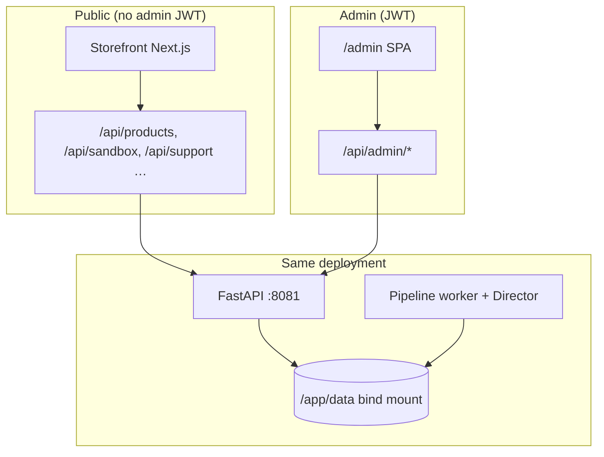
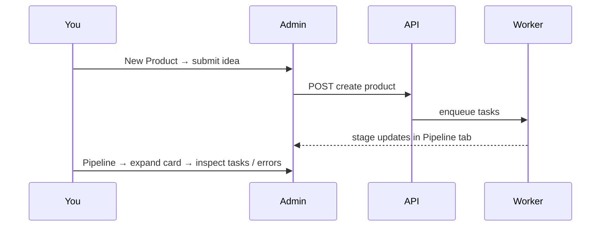
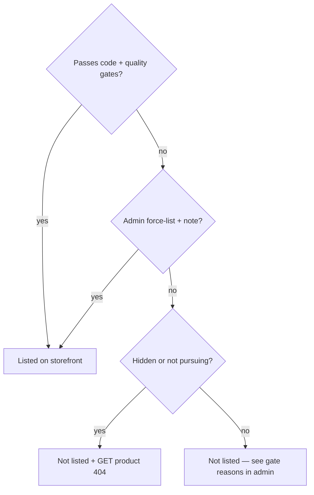

# Platform owner handbook

**Audience:** the person operating a deployed AI-Factory instance — provisioning, LLMs, pipeline health, storefront policy, and buyer-facing support.

**Companion docs:** [admin-guide.md](./admin-guide.md) (every admin tab), [api-integration-guide.md](./api-integration-guide.md), [cli-reference.md](./cli-reference.md), [pipeline-operations.md](./pipeline-operations.md), [production-domain.md](./production-domain.md) (public hostname **magic-ai-factory.com**, nginx, `NEXT_PUBLIC_SITE_URL`).

Visual assets live under [`assets/screenshots/`](./assets/screenshots/). Refresh them anytime:

```bash
cd web/frontend && npm run capture-docs-screenshots
```

That script also copies PNGs into `web/frontend/public/docs-screenshots/` so the in-app **Documentation** page can display the same images.

---

## 1. What you are operating

AI-Factory turns short product briefs into shipped web artifacts through a **multi-agent pipeline**, with optional **crypto checkout**, **sandbox previews**, and a **public storefront**. You run **one container** (or Compose stack); persistent state lives on a **host bind mount** (e.g. `~/aicom-data:/app/data`), not an anonymous Docker volume.

**Messaging vs reality:** the public homepage leads with the **guest landing generator** (`marketing_landing`) because it is the fastest safe try-on without credentials. **Autonomous Director ideas** and **admin-submitted** work commonly use **`full_software`** (backends, data, longer task chains). It is the same pipeline and gates — not a different “real” product hidden only in documentation.

```mermaid
flowchart LR
  Idea[Idea or discovery] --> A[Analyst]
  A --> PM[PM / Spec]
  PM --> AR[Architect + UX brief]
  AR --> DC[Design critic gate]
  DC --> DEV[Developer]
  DEV --> HARD[Hardening]
  HARD --> QA[QA]
  QA --> SEC[Security]
  SEC --> DO[DevOps]
  DO --> MKT[Marketing]
  MKT --> SAL[Sales]
  SAL --> DONE[COMPLETED / Deployed]
```





**Important distinction:** **Lumen** (`/api/support/*`) is **buyer help** for the marketplace — not Microsoft Copilot and not a pipeline agent. It never appears in the **AI Agents** admin roster (that roster is pipeline-only).

---

## 2. Screenshots (step-through)

| Image | Where to click | Purpose |
|-------|----------------|---------|
|  | `/admin/login` | Secure entry; change default password immediately. |
|  | Dashboard tab | Snapshot KPIs — **Completed** ≠ storefront-listed count. |
|  | Full-height capture | Navigation map (icons may be collapsed). |
|  | Pipeline tab | Per-product stages, failures, **storefront** controls on completed rows. |
|  | LLM Providers | Enable keys, routing, latency checks. |
|  | LLM Logs | Trace model failures and timeouts. |

If images are missing locally, run the capture script once while the app is up (`DOCS_SCREENSHOT_BASE_URL`, `ADMIN_PASSWORD`).

---

## 3. First-time setup (owner checklist)

1. **Data directory** — Use `./run.sh` or an explicit bind mount per [README.md](../README.md). Wrong volume type is the #1 “lost data” incident.
2. **Admin password** — Replace defaults; optional TOTP in admin security settings.
3. **LLM providers** — In **LLM Providers**, add at least one working backend (local Ollama via `host.docker.internal`, or cloud OpenAI-compatible). Match **routing rules** to heavy/light models.
4. **Pipeline worker** — Ensure the worker process is running in your deployment (often bundled with the main stack); without it, tasks stay `pending`.
5. **Smoke** — From README: `docker compose exec -T app … full_pipeline_smoke.py <product_id>` when validating gates end-to-end.

---

## 4. Day-to-day operator flows

### 4.1 Ship a one-off product from an idea



**CLI alternative:** see [cli-reference.md](./cli-reference.md) — `create-idea`, `create-ideas-batch`, `discover`.

### 4.2 Fix a stuck or failed stage

1. Open **Pipeline**, expand the product.  
2. Click the **red / amber** stage tile → task modal shows `input_data` / `output_data` and errors.  
3. Option **Human rework** (where enabled) sends instructions back to developer-style repair.  
4. For systemic issues, check **LLM Logs** and provider routing.

### 4.3 Tune the public storefront (policy)

Completed products still need **generated code on disk** and **marketplace quality** checks to list publicly — unless you apply an explicit operator override.

On each **completed** row, the **Storefront** panel lets you:

| Action | Effect |
|--------|--------|
| **Manual follow-up** (`planned` / `not pursuing`) | `not pursuing` **removes** the product from public listing and product detail (404 for shoppers). |
| **Hide from public storefront (admin)** | Same exclusion, without changing follow-up semantics; clears forced listing. |
| **Force public storefront** | Lists despite failing automatic quality gates (still requires code artifacts); requires a short justification. |
| **Marketplace copy** | Edits `marketing_content.json` fields used on cards and detail pages (name, tagline, descriptions). |



### 4.4 Discovery-driven backlog

README documents **Discovery** (`director/discovery_pipeline.py`): CLI `discover`, admin `POST /api/admin/discovery/run`, and ranked ideas files under `/app/data/discovery/`. Use when you want the factory to **propose** what to build next.

### 4.5 Buyer support (Lumen)

The storefront **support chat** calls `/api/support/*`. The assistant **Lumen** classifies messages, can suggest filing pipeline bugs for broken demos, and escalates business threads. Tune RAG baseline under `web/backend/services/support_rag*.py` if you fork branding.

---

## 5. Use-case matrix

| Scenario | Where to act | Primary APIs / tools |
|----------|--------------|----------------------|
| Launch first product | Admin → New Product; watch Pipeline | `POST /api/admin/products/create`, CLI `create-idea` |
| Bulk experiments | CLI batch / discovery enqueue | `create-ideas-batch`, `discover --enqueue` |
| Reduce LLM cost | LLM Providers + routing rules | `model_providers.yaml`, `GET/PATCH /api/admin/providers/*` |
| Product visible but ugly demo | Pipeline storefront panel / rework | Human rework, marketing PATCH, sandbox QA |
| Hide discontinued SKU | Storefront panel | `PATCH .../followup`, `PATCH .../storefront-admin` |
| Incident: tasks not moving | Live Monitor + logs | Worker logs, SQLite/`pipeline.json`, `GET /api/admin/metrics/stream` |
| Payments pilot | Payment / wallet docs | `/api/payment/*`, `docs/marketing.md` |
| Corporate brainstorming | Admin tabs | `/api/admin/discussions/*`, `/api/admin/chat/*` |

---

## 6. Nuances that bite operators

- **Bind mount vs named volume** — see README “CRITICAL” boxes; migrations are painful if you mix them.  
- **`USE_SQLITE`** — When enabled, pipeline reads lean on SQLite; `pipeline.json` may look empty while SQLite is authoritative.  
- **Dashboard “Completed” vs storefront** — Dashboard counts lifecycle completion; the storefront adds **code**, **quality**, and **hide / not pursuing** rules.  
- **Designer row** — UX is embedded in Architect output (`ui_experience`); the Designer card in admin mirrors Architect metrics.  
- **Intermediate agents** — Design critic and hardening **run in the worker** but do not get separate cards in **AI Agents**.  
- **Ports** — Compose often publishes **9080** → app; README tables list both `8080` (in-container) and `9080` (host). Point screenshots scripts at the URL you actually use.  
- **`ai-company` CLI** — May not be on `$PATH`; use `python /app/cli/ai_company_cli.py` inside the container. Some subcommands are **demonstration stubs** (wallet withdraw UI flow, parts of security scan) — see [cli-reference.md](./cli-reference.md).

---

## 7. Where to go deeper

| Topic | Document |
|-------|----------|
| Every admin sidebar tab | [admin-guide.md](./admin-guide.md) |
| REST integration & curl patterns | [api-integration-guide.md](./api-integration-guide.md) |
| CLI truth table | [cli-reference.md](./cli-reference.md) |
| Scheduler, audits, monitoring loops | [pipeline-operations.md](./pipeline-operations.md) |
| Capability map | [factory-capabilities.md](./factory-capabilities.md) |
| Metrics keys | [factory-metrics-reference.md](./factory-metrics-reference.md) |
| Storefront / referrals | [marketing.md](./marketing.md) |

---

*Last reviewed with codebase layout: AI-Factory v2.1 monorepo structure (`web/backend`, `web/frontend`, `cli/`, `agents/`).*
