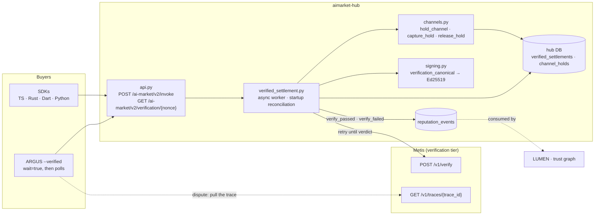
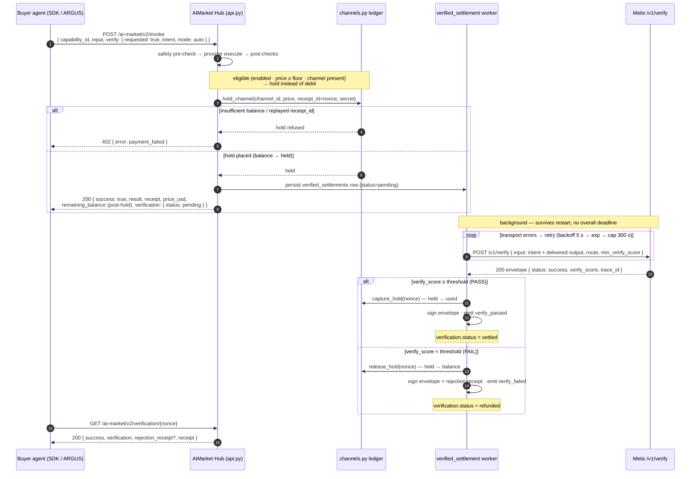
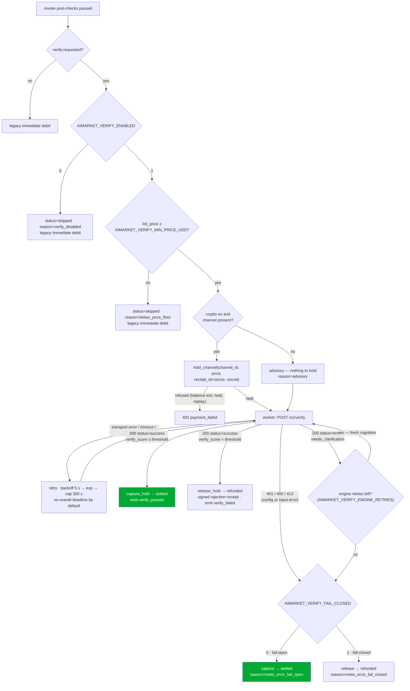
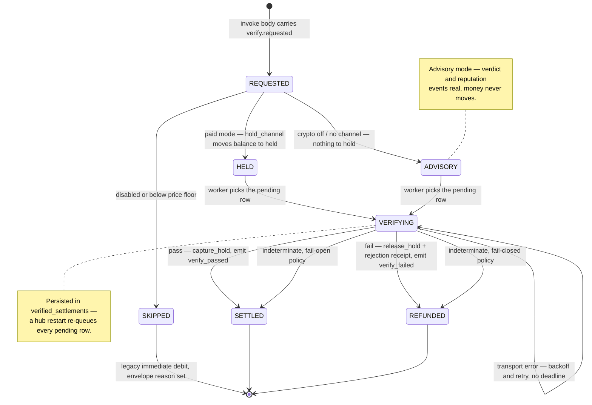
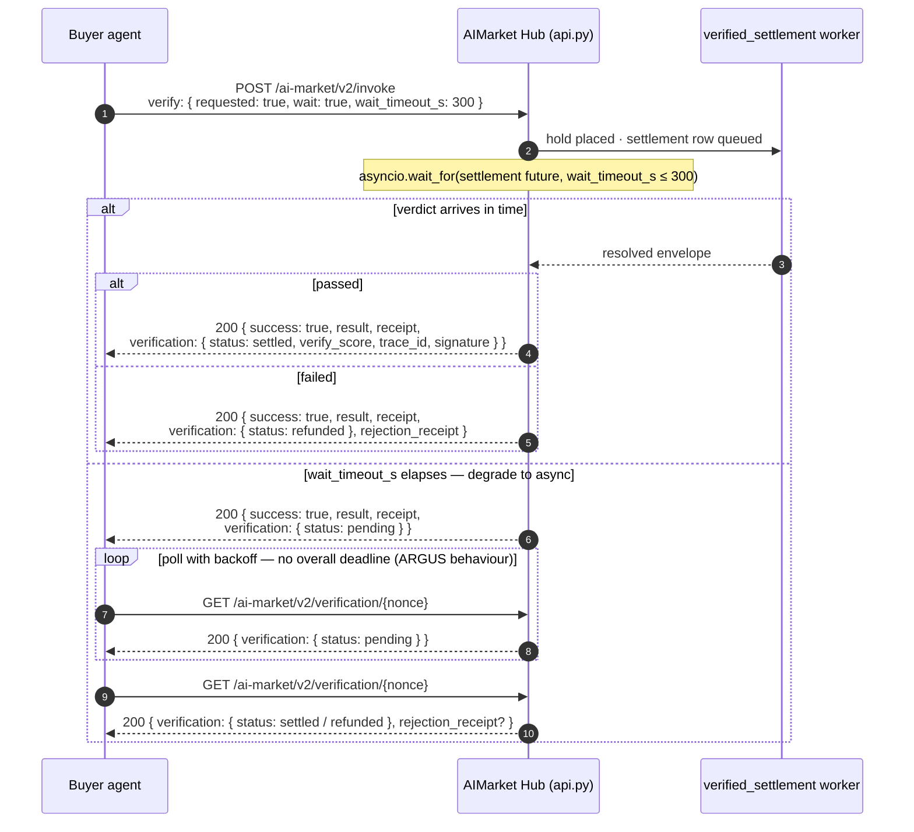

# Pay-on-Verified settlement

**Pay-on-Verified** is a buyer-opt-in settlement mode on the [AIMarket Hub](../aimarket-hub/)
that replaces the immediate channel debit with an **escrow hold** and lets
[Metis](../metis/) — the ecosystem's verification tier — decide whether the provider gets paid.
The provider's output is returned immediately; the money moves only after a verdict:
**pass → capture** (debit recorded, provider paid), **fail → release** (buyer refunded, with a
signed rejection receipt carrying the Metis `trace_id`).

The extension is additive on the v2 wire: an invoke without a `verify` block behaves exactly as
before, and old hubs ignore the block (unknown request keys are tolerated). Every performed
verdict is also emitted as a reputation event, so verified work compounds into provider trust.

> 📖 Hub-side view: [`aimarket-hub/docs/pay-on-verified.md`](../aimarket-hub/docs/pay-on-verified.md)
> 📖 Metis verify surface: [`metis-integration.md`](./metis-integration.md)

---

## 1. Escrow instead of trust

A standard invoke bills on *response*, not on *correctness*: a provider that returns garbage is
paid the same as one that returns the right answer, and the buyer's only recourse is off-band
complaints. Pay-on-Verified moves the debit behind a machine verdict — the hub holds the funds,
an independent judge (Metis) scores the delivered output against the buyer's stated intent, and
only a passing score turns the hold into a debit.



The settlement module is a hub builtin (like `safety_gate.py`), not an entry-point plugin: the
debit decision is inline in the invoke path and needs full request context, which the sync,
context-poor plugin hooks cannot carry.

Code: [`aimarket_hub/verified_settlement.py`](../aimarket-hub/aimarket_hub/verified_settlement.py) ·
hold API in [`aimarket_hub/channels.py`](../aimarket-hub/aimarket_hub/channels.py)
(`hold_channel` / `capture_hold` / `release_hold`) · wiring in
[`aimarket_hub/api.py`](../aimarket-hub/aimarket_hub/api.py).

---

## 2. The wire surface

### 2.1 Requesting verification — the `verify` block

The v2 invoke body gains one optional key:

```
POST /ai-market/v2/invoke
```

```json
{
  "product_id": "demo-hello",
  "capability_id": "demo-hello/greet@v1",
  "input": { "name": "dev" },
  "verify": {
    "requested": true,
    "intent": "Greet the user by name in English",
    "mode": "auto",
    "wait": false,
    "wait_timeout_s": 300
  }
}
```

- `intent` — the buyer's task description; Metis judges the delivered output against it.
- `mode` — `auto` | `fast` | `thinking` | `council` | `agent`. The price-justified route
  is a **ceiling**, not just the `auto` default: `fast` below
  `AIMARKET_VERIFY_COUNCIL_MIN_PRICE_USD`, `council` at or above it. A buyer who names a
  costlier route than the price justifies is clamped down to the ceiling, so a cheap
  capability can never be forced onto an expensive council run (Metis cost-amplification).
- `wait` / `wait_timeout_s` — hold the HTTP response for the verdict (bounded, cap 300 s);
  default is async. See [§ 6](#6-waittrue--bounded-wait-graceful-degradation).
- `min_verify_score` is **not** buyer-settable — the operator threshold
  (`AIMARKET_VERIFY_SCORE_THRESHOLD`) governs money movement.

### 2.2 The verification envelope

The envelope appears in the invoke response, as an **unsigned** `verification` field of the
provenance receipt (the receipt canonical is untouched, so all old receipts still verify), and
at the lookup endpoint. A resolved, passing envelope:

```json
{
  "requested": true,
  "status": "settled",
  "performed": true,
  "verified": true,
  "verify_score": 0.91,
  "threshold": 0.7,
  "trace_id": "tr_9f2c…",
  "verifier": "metis.verify@v1",
  "mode": "fast",
  "settled": true,
  "reason": null,
  "timestamp": "2026-07-14T12:00:07Z",
  "signature": { "algorithm": "ed25519", "value": "…" }
}
```

- `status` — `pending` | `settled` | `refunded` | `skipped`.
- `performed` — true once a Metis envelope was actually obtained; `settled` — whether the
  channel debit (capture) was recorded. They differ in advisory and policy resolutions.
- `signature` — the envelope carries its **own** Ed25519 signature once resolved, over the
  canonical `nonce:{receipt_nonce}|capability_id:{}|verdict:{passed|failed|indeterminate}|verify_score:{}|trace_id:{}|timestamp:{}`
  (nonce + timestamp act as freshness tokens).

| `reason` | Emitted when |
|----------|--------------|
| `below_price_floor` | invoke cheaper than `AIMARKET_VERIFY_MIN_PRICE_USD` — skipped, legacy settle |
| `verify_disabled` | `AIMARKET_VERIFY_ENABLED=0` — skipped, legacy settle |
| `federated_unsupported` | verify block on a federated (peer) invoke — settlement is local-only, so it is skipped and the routing fee is charged normally |
| `advisory` | nothing to hold (crypto off / sandbox / free capability) — verdict and reputation real, money never moves |
| `metis_error_fail_open` | no usable verdict (engine errors through retries, or `AIMARKET_VERIFY_MAX_WAIT_S>0` elapsed), fail-open policy → captured |
| `metis_error_fail_closed` | same indeterminate outcomes under fail-closed policy → released |
| `verify_failed` | performed verdict below threshold → refunded |

### 2.3 Verdict lookup

The receipt nonce (`rcpt_…`) is the settlement key:

```
GET /ai-market/v2/verification/{nonce}
→ 200 { "success": true, "verification": {…}, "rejection_receipt": {…}, "receipt": {…}, "protocol_version": "v2" }
→ 404 { "success": false, "error": "verification_not_found" }
```

`rejection_receipt` is present only when the settlement refunded.

### 2.4 The rejection receipt

A failing verdict also produces a signed rejection receipt, shaped like the safety-gate one:

```json
{
  "type": "verification_rejection",
  "product_id": "demo-hello",
  "capability_id": "demo-hello/greet@v1",
  "channel_id": "ch_abc123",
  "reason": "verify_failed",
  "verify_score": 0.34,
  "trace_id": "tr_9f2c…",
  "timestamp": "2026-07-14T12:00:07Z",
  "refunded": true,
  "nonce": "vfail_1752480007_a1b2c3d4",
  "signature": "…"
}
```

Guaranteed by tests:
[`aimarket-hub/tests/test_verified_settlement.py`](../aimarket-hub/tests/test_verified_settlement.py)
(lookup endpoint 200/404, rejection receipt on fail, envelope canonical registered in the
signing-conformance suite).

Code: envelope + rejection signing in
[`aimarket_hub/signing.py`](../aimarket-hub/aimarket_hub/signing.py) (`verification_canonical`) ·
request/response models in [`aimarket_hub/api_models.py`](../aimarket-hub/aimarket_hub/api_models.py).

---

## 3. The async flow

The default path returns the output at once and settles in the background:



Notes on the shape:

- `remaining_balance` in the invoke response reflects the **post-hold** balance — the held
  amount is unavailable for further spending even though no debit was recorded yet.
- A hold failure (insufficient balance, replayed `receipt_id`) is a
  `402 payment_failed`, exactly like today's debit failure.
- `capture_hold` needs no channel secret — the hold was authorized like a debit (secret hash,
  open channel, balance check including already-held funds), so capture is pre-authorized. The
  hub never stores channel secrets.
- The verify input is composed deterministically from the buyer intent plus the
  JSON-serialized provider output, ending with the instruction to judge whether the delivered
  result correctly and completely fulfils the task — so re-runs judge identical evidence.

Guaranteed by tests:
[`aimarket-hub/tests/test_verified_settlement.py`](../aimarket-hub/tests/test_verified_settlement.py)
(pass → capture, fail → release + rejection receipt, transport retry then pass, hold blocks
double-spend, replayed hold rejected, reputation rows written).

Code: [`aimarket_hub/verified_settlement.py`](../aimarket-hub/aimarket_hub/verified_settlement.py)
(worker) · [`aimarket_hub/channels.py`](../aimarket-hub/aimarket_hub/channels.py)
(`ChannelLedger`, `channel_holds` table) ·
[`aimarket_hub/api.py`](../aimarket-hub/aimarket_hub/api.py) (debit-block replacement).

---

## 4. Decision gates

Eligibility is checked in `api.py` after the post-checks pass, before the debit block; the
verdict classification lives in the worker:



### 4.1 Advisory mode

With crypto off, in sandbox, or with no channel (price 0, no debit) there is nothing to hold —
but verification still runs async, reputation events are still emitted, and the envelope still
transitions `pending → settled|refunded`. `settled` is trivially true (no money to move) and
`reason` records `advisory`. This keeps the trust signal alive on free tiers and dev
deployments.

### 4.2 Verdict classification

A Metis HTTP response is **not** automatically a verdict:

| Metis outcome | Classification | Action |
|---------------|----------------|--------|
| Transport failure / connect error / client timeout | not a verdict | retry forever — backoff 5 s → exponential → cap 300 s; per-attempt timeout 330 s (> the Metis 300 s server cap) |
| HTTP `429` | not a verdict | retry with backoff |
| `200`, `status=success`, `verify_score ≥ threshold` | **pass** | `capture_hold` → `settled`, emit `verify_passed` |
| `200`, `status=success`, `verify_score < threshold` | **fail** | `release_hold` → `refunded`, signed rejection receipt, emit `verify_failed` |
| `200`, `status=error` or `needs_clarification` | indeterminate | re-run up to `AIMARKET_VERIFY_ENGINE_RETRIES` (default 2), then policy |
| HTTP `401` / `400` / `413` | indeterminate (configuration/input) | policy immediately — retrying won't fix it |

**Why fresh cognition on engine retries?** Metis has no idempotency — each re-run is a new
council pass, so a transient engine timeout gets a genuine second opinion, not a cached error.

**Fail-open vs fail-closed.** When retries are exhausted the operator policy decides:
fail-open captures (the provider did deliver; the judge failed, not the work), fail-closed
releases (no verified work, no payment). `AIMARKET_VERIFY_FAIL_CLOSED` unset derives from the
environment — `1` iff `AIFACTORY_PROD`, else `0` — matching the production-interlock convention
([`crypto-switch.md`](./crypto-switch.md)) used across the ecosystem. Indeterminate-policy
resolutions emit **no** reputation event: nothing was earned either way.

Guaranteed by tests:
[`aimarket-hub/tests/test_verified_settlement.py`](../aimarket-hub/tests/test_verified_settlement.py)
(below-floor skip, advisory crypto-off, engine error under both policies).

Code: eligibility gate in [`aimarket_hub/api.py`](../aimarket-hub/aimarket_hub/api.py) ·
classification in
[`aimarket_hub/verified_settlement.py`](../aimarket-hub/aimarket_hub/verified_settlement.py).

---

## 5. Settlement lifecycle



Every settlement is a row in the `verified_settlements` table (nonce-keyed, additive
`CREATE TABLE IF NOT EXISTS`), and every pending row gets an asyncio background task. On
startup the hub re-queues all `pending` rows, so a crash mid-verification loses nothing.

### 5.1 No deadline — and why an unresolved hold is buyer-safe

By default (`AIMARKET_VERIFY_MAX_WAIT_S=0`) there is **no overall deadline** on the verdict:
transport failures retry with backoff indefinitely. This is deliberate. The alternative — a
deadline that force-resolves — must pick a winner without evidence. Under the hold model an
unresolved settlement is the *safe* state for the buyer:

- The held amount was never captured — **no service verdict, no debit**. The provider is the
  party waiting on the money, and the provider's remedy (a reachable Metis) is operational,
  not contractual.
- Held funds are unavailable for further spending (the balance check includes holds), so an
  unresolved hold cannot enable a double-spend.
- Closing a channel with outstanding holds is refused (`channel has N pending verified
  settlement(s)`) — settling around escrowed cents would strand them; close succeeds once the
  holds resolve. The expiry sweep applies the same guard: a channel with a held hold is
  skipped and expires on a later pass once the hold resolves, so held cents are never stranded
  on an expired channel.
- The durable `verified_settlements` row is committed **immediately after** the hold — only
  pure receipt assembly sits between them, and if that registration raises, the orphaned hold
  is released in-request. A crash after the row is committed is recovered by the startup
  reconciler, which re-queues both `pending` and stale `verifying` rows under a row-count-guarded
  claim (so a multi-worker hub resolves each nonce exactly once).

Operators who prefer bounded resolution set `AIMARKET_VERIFY_MAX_WAIT_S>0`, which hands an
unresolved settlement to the fail-open/fail-closed policy
(reason `metis_error_fail_open` / `metis_error_fail_closed`).

**Scope: local settlement only.** The escrow hold and the Metis verdict both live on the hub
that received the invoke, so a verify block is honoured only for local invokes. On a federated
invoke (`source_hub` = a peer) the block is surfaced as `status:"skipped"`,
`reason:"federated_unsupported"` and the routing fee is charged normally — the buyer gets an
explicit signal that no escrow applied rather than being silently charged as if it had.

Guaranteed by tests:
[`aimarket-hub/tests/test_verified_settlement.py`](../aimarket-hub/tests/test_verified_settlement.py)
(startup reconciliation re-queues pending rows, balance check includes held funds).

Code: table + reconciliation in
[`aimarket_hub/verified_settlement.py`](../aimarket-hub/aimarket_hub/verified_settlement.py) ·
`channel_holds` in [`aimarket_hub/channels.py`](../aimarket-hub/aimarket_hub/channels.py).

---

## 6. `wait=true` — bounded wait, graceful degradation

A buyer that wants the verdict inline sets `wait: true`. The hub parks the HTTP response on the
settlement future for at most `wait_timeout_s` (cap 300 s); if the verdict is not ready in time
the response degrades to the async shape — a `pending` envelope, **not** an error:



### 6.1 200 vs 403 — quality escrow, not censorship

A refunded verification returns **HTTP 200**, not 403. This is deliberate and worth contrasting
with the safety gate:

| | Safety block | Verification refund |
|---|---|---|
| HTTP | `403 { error: safety_blocked, rejection_receipt, refund }` | `200 { success: true, result, verification: { status: refunded }, rejection_receipt }` |
| Output | **withheld** — the buyer never sees it | **delivered** — the buyer already has it |
| Money | channel refund | hold released (refund) |
| Meaning | the content must not exist | the service ran; the *quality* failed |

The safety gate is censorship of unacceptable content, so it withholds the output and signals
failure. Verification is a **quality escrow**: the buyer saw the output the moment it was
produced, so the HTTP transaction succeeded — only the money outcome differs, and it lives in
the envelope plus the `rejection_receipt` field. Clients must read `verification.status`, not
the HTTP code, to learn whether the provider was paid.

Guaranteed by tests:
[`aimarket-hub/tests/test_verified_settlement.py`](../aimarket-hub/tests/test_verified_settlement.py)
(wait=true resolved inline, wait timeout → pending envelope, refunded response is HTTP 200 with
rejection receipt).

Code: `wait` handling in [`aimarket_hub/api.py`](../aimarket-hub/aimarket_hub/api.py).

---

## 7. Disputes and reputation

Every performed verdict leaves two independent artifacts:

- **The Metis trace.** Each envelope carries a `trace_id` resolvable at
  `GET /v1/traces/{trace_id}` on the Metis service — the full council reasoning behind the
  score. A buyer or provider who disagrees with a verdict disputes the *trace*, not a black-box
  number. The signed rejection receipt embeds the same `trace_id`, so the refund and its
  justification are permanently linked.
- **Reputation events.** Each performed verdict writes a `verify_passed` / `verify_failed`
  event (event types are free-form TEXT — no migration) directly into the hub's reputation
  store, self-signed over the peer canonical
  `type:{}|provider_hub:{}|timestamp:{}|price_usd:{}|latency_ms:{}` with the verify latency as
  `latency_ms`. The write is hub-local because the federation HTTP endpoint
  (`POST /ai-market/v2/reputation/events`) requires peer signatures. LUMEN and the trust graph
  consume these rows like any other reputation edge.

| Concern | Answer |
|---------|--------|
| Provider ships junk | verdict fails → hold released, buyer keeps output + signed rejection receipt |
| Party disputes the verdict | Metis trace at `GET /v1/traces/{trace_id}` is the audit artifact |
| Hub crash mid-verification | `verified_settlements` row persists; startup reconciliation resumes |
| Metis unreachable for a long time | hold stays escrowed — provider unpaid, buyer funds never captured |
| Replay of a hold | `receipt_id` is replay-protected in `channel_holds` |
| Double-spend against held funds | balance check includes already-held amounts |
| Reputation gaming via indeterminate verdicts | indeterminate resolutions emit no event — no unearned signal |

---

## 8. Client usage

### 8.1 ARGUS — the fail-closed reference buyer

```bash
argus ask "Summarise this contract and list termination clauses" --verified
```

`--verified` on the hire path sets
`verify: { requested: true, intent: <the task>, mode: "auto", wait: true, wait_timeout_s: 300 }`.
ARGUS prefers waiting; on a pending timeout it falls back to polling
`GET /ai-market/v2/verification/{nonce}` with backoff and no overall deadline — mirroring the
hub's own policy. The final envelope (and the rejection receipt, when refunded) is persisted
into the conscience bundle / spend-cert artifacts, so `argus verify` re-checks it offline.

### 8.2 TypeScript SDK

```ts
const result = await agent.invoke({
  capabilityId: 'demo-hello/greet@v1',
  input: { name: 'dev' },
  channelId,
  verify: {
    requested: true,
    intent: 'Greet the user by name in English',
    mode: 'auto',
    wait: true,
    wait_timeout_s: 300,
  },
});
// "settled" | "refunded" | "pending" | "skipped"
console.log(result.verification?.status);
```

### 8.3 Python SDK

```python
from aimarket_agent import AIMarketAgent

with AIMarketAgent(base_url="http://127.0.0.1:9083", budget=1.0) as agent:
    body = agent.invoke_single(
        "demo-hello", "demo-hello/greet@v1", {"name": "dev"},
        verify={
            "requested": True,
            "intent": "Greet the user by name in English",
            "mode": "auto",
        },
    )
    print(body.get("verification", {}).get("status"))  # "pending" — poll the lookup endpoint
```

The Rust and Dart SDKs surface the same `verification` field on `InvokeResult`; the request
side takes the `verify` map verbatim.

---

## 9. Configuration

```bash
# Point the hub at your Metis (default http://127.0.0.1:8080)
export AIMARKET_VERIFY_METIS_URL=https://metis.internal:8080
export AIMARKET_VERIFY_METIS_KEY=sk-…          # only if your Metis runs with auth

# Optional: money-movement policy
export AIMARKET_VERIFY_SCORE_THRESHOLD=0.7     # capture floor
export AIMARKET_VERIFY_FAIL_CLOSED=1           # refund on indeterminate verdicts (prod default)
```

| Variable | Default | Description |
|----------|---------|-------------|
| `AIMARKET_VERIFY_ENABLED` | `1` | Master switch for the verified-settlement module (per-invoke opt-in still required) |
| `AIMARKET_VERIFY_MIN_PRICE_USD` | `0.05` | Price floor — invokes cheaper than this are never verification-taxed |
| `AIMARKET_VERIFY_SCORE_THRESHOLD` | `0.7` | `verify_score` needed to capture (matches the factory gate and the Metis default pass score) |
| `AIMARKET_VERIFY_COUNCIL_MIN_PRICE_USD` | `0.50` | Route ceiling: price ≥ this permits `council`, else the route is clamped to `fast` |
| `AIMARKET_VERIFY_MAX_CONCURRENCY` | `8` | Cap on simultaneous Metis calls across all pending settlements (bounds a startup herd) |
| `AIMARKET_VERIFY_ATTEMPT_TIMEOUT_S` | `330` | Per-attempt HTTP timeout — must exceed the Metis 300 s server cap |
| `AIMARKET_VERIFY_RETRY_BACKOFF_S` | `5` | Initial backoff between transport retries (exponential, cap 300 s) |
| `AIMARKET_VERIFY_ENGINE_RETRIES` | `2` | Re-runs after a definitive engine-error envelope before policy applies |
| `AIMARKET_VERIFY_MAX_WAIT_S` | `0` | `0` = no overall deadline (retry until verdict); `>0` opts into bounded resolution via policy |
| `AIMARKET_VERIFY_FAIL_CLOSED` | derived | Unset → `1` iff `AIFACTORY_PROD`, else `0`; an explicit value wins |
| `AIMARKET_VERIFY_METIS_URL` | `http://127.0.0.1:8080` | Metis base URL; falls back to `METIS_URL` (metis-gate convention) |
| `AIMARKET_VERIFY_METIS_KEY` | — | Bearer key; falls back to `METIS_API_KEY` |
| `AIMARKET_VERIFY_VERIFIER_ID` | `metis.verify@v1` | Envelope `verifier` attribution — set when a non-Metis verifier (e.g. GAIA) serves the slot |

---

## 10. What it gives — honestly

- **Payment follows verified work** — a provider is paid when an independent judge scores the
  delivered output above the operator threshold, not when it merely responds. Buyers keep the
  output either way; only the money outcome changes.
- **A dispute artifact where there was none** — every verdict is backed by a resolvable Metis
  trace and an Ed25519-signed envelope; refunds come with a signed rejection receipt.
- **Reputation grounded in verdicts** — `verify_passed` / `verify_failed` events accumulate
  into provider trust from actual judged work, not self-reported success.
- **Zero cost when unused** — no `verify` block means the legacy debit path, byte for byte;
  old clients and old hubs interoperate unchanged.

Caveats, honestly stated:

- **Verification costs a Metis call** — a council pass can cost more than a cheap invoke.
  That is what the price floor is for: sub-floor invokes are never verification-taxed.
- **Metis is a judge, not an oracle of truth** — a wrong verdict is possible. The trace keeps
  it auditable, and the operator threshold plus fail-open/fail-closed policy bound the damage,
  but the verdict is an LLM-council opinion, not a proof.
- **Providers wait for their money** — under the default no-deadline policy an unreachable
  Metis delays capture indefinitely. That is the buyer-safe trade; operators who need bounded
  settlement latency must opt into `AIMARKET_VERIFY_MAX_WAIT_S>0` and accept policy
  resolutions without a verdict.
