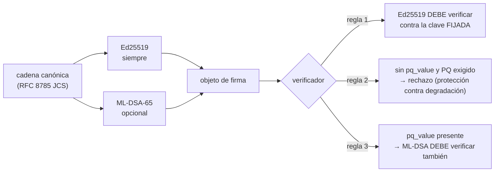

# Firmas post-cuánticas: qué está desplegado y cómo terminar la migración

> Idiomas: [EN](pqc-migration.md) · [RU](pqc-migration.ru.md) · **ES** · [FR](pqc-migration.fr.md) · [ZH](pqc-migration.zh.md)

Cada firma que emite este ecosistema **admite el modo híbrido**: una firma Ed25519 que puede llevar
al lado una segunda firma post-cuántica. Este documento dice exactamente qué está activado hoy, qué
aporta y qué no, y qué falta para que la federación sea post-cuánticamente **segura** y no sólo
preparada para el paso al post-cuántico.

## El formato en el cable

Un objeto de firma lleva siempre los campos clásicos y, opcionalmente, tres más:

| campo | obligatorio | significado |
| --- | --- | --- |
| `algorithm` | sí | `ed25519` |
| `public_key` | sí | clave pública Ed25519 en base64 |
| `value` | sí | firma Ed25519 sobre la cadena canónica, en base64 |
| `pq_algorithm` | no | `ml-dsa-65` (FIPS 204, ML-DSA en categoría 3) |
| `pq_public_key` | no | clave pública ML-DSA-65 en base64 |
| `pq_value` | no | firma ML-DSA-65 sobre la **misma** cadena canónica |

Los campos `pq_*` son **aditivos**. Ambas firmas cubren una única cadena canónica idéntica, así que
un verificador que nunca ha oído hablar de ML-DSA lee `algorithm` y `value`, ignora el resto y
verifica igual que antes. Nada de lo firmado previamente deja de verificarse, y la
[canonicalización](localization-glossary.md) no ha cambiado.



## Por qué híbrido y no sustitución

Ed25519 sigue siendo la autoridad y se comprueba **primero, siempre**. Tres razones, por peso:

1. **Una implementación joven no debe convertirse en una vía de falsificación.** Si la biblioteca
   ML-DSA tuviera un fallo de verificación, un esquema sólo-PQ convertiría ese fallo en
   falsificaciones aceptadas. Con el híbrido, el atacante todavía tiene que vencer también a
   Ed25519.
2. **La amenaza es retrospectiva.** Una firma es una afirmación sobre el pasado: un recibo firmado
   hoy puede disputarse años después, cuando un adversario cuántico sea plausible. Por eso hay que
   proteger las firmas **antes** de que exista el adversario, no después.
3. **La federación son terceros.** Los pares son hubs que no controlamos. Cualquier esquema que
   exija que todos los pares se actualicen a la vez es indesplegable.

## La limitación honesta

**Firmar en híbrido sin una política de exigencia aporta capacidad de migración, no seguridad
post-cuántica.**

Mientras la ausencia de `pq_value` sea aceptable, un adversario capaz de falsificar Ed25519 borra
simplemente los campos `pq_*` y presenta un documento sólo clásico, que todo verificador acepta. Ese
es el *ataque de degradación*, y sólo la fase 3 lo cierra.

Hay un segundo límite, más sutil. Ed25519 se verifica contra una clave que el verificador **fijó**
fuera de banda. La clave PQ, si no se fija también, se lee del propio objeto de firma. Frente al
único adversario para el que existe la capa PQ, una clave PQ autodeclarada no vale nada: falsifica
la firma clásica con la clave fijada ya rota y adjunta un par ML-DSA propio. De ahí:

> Una firma post-cuántica vale exactamente lo que valga la fijación de su clave pública.

Por eso `verify_signature_object` y el `verify_hybrid` del hub aceptan un `pq_public_key_b64` /
`pinned_pq_public_key` opcional. Hoy es opcional porque todavía nada fija claves PQ —véase
[Antes de la fase 3](#antes-de-la-fase-3)— y las baterías de pruebas afirman **ambos**
comportamientos, de modo que la carencia queda registrada y no disimulada.

## Las tres fases, y por qué el orden es forzoso

| fase | acción | interruptor |
| --- | --- | --- |
| 1 | instalar la biblioteca en los **verificadores** | `aimarket-oracle-core[pqc]`, `aimarket-hub[pqc]` (es decir, `dilithium-py`) |
| 2 | activar la **firma** PQ en los firmantes | `ORACLE_PQC=1` |
| 3 | **exigir** PQ en los verificadores | `ORACLE_PQC_REQUIRE=1`, `AIMARKET_PQC_REQUIRE=1` |

El orden no es una preferencia: lo impone una asimetría deliberada. La verificación es
**fail-closed (denegar por defecto)**: un verificador que ve un `pq_value` que no puede evaluar
devuelve `false` en lugar de encogerse de hombros y aceptar la firma clásica. Un verificador al que
se puede engañar con una firma PQ que no entiende es peor que uno que rechaza.

La consecuencia: un firmante que se adelanta a los verificadores **se saca a sí mismo de la
federación**; sus documentos los rechaza todo el que aún no ha instalado la biblioteca.

Esto se midió, no se supuso. Antes de la fase 1, dos verificadores en producción rechazaron un
documento híbrido firmado por un tercero. Después de la fase 1 lo aceptaron los doce, y los doce
rechazaron el mismo documento con un `pq_value` manipulado.

## Ajustes

| variable | lado | por defecto | efecto |
| --- | --- | --- | --- |
| `ORACLE_PQC` | firmante (`oracle_core`) | apagado | firmar en híbrido: añadir `pq_*` a cada objeto de firma |
| `ORACLE_PQC_REQUIRE` | verificador (`oracle_core`) | apagado | rechazar un documento sin `pq_value` |
| `AIMARKET_PQC_REQUIRE` | verificador (hub) | apagado | la misma regla, del lado del hub |

Exigir una prueba que no puedes evaluar es un verificador roto, no estricto: por eso
`ORACLE_PQC_REQUIRE=1` sin la biblioteca lanza **`PQCMisconfigured`** de forma ruidosa en lugar de
cortar tráfico en silencio.

Las anulaciones por llamada (`require_pq=...`) existen para someter un nivel o un emisor concreto a
una política más estricta que la de la federación: así la fase 3 puede desplegarse gradualmente en
vez de globalmente.

### La clave ML-DSA es un ARCHIVO, y `ORACLE_SIGNING_SEED_B64` no la cubre

El par PQ vive junto al clásico, en **`{key_path}_mldsa`**, y se genera en el primer uso.
`ORACLE_SIGNING_SEED_B64` fija la identidad **Ed25519** desde el entorno y no afecta en nada a la
de ML-DSA.

Así que un servicio que deriva su identidad clásica de una variable de semilla y corre sin volumen
persistente para su ruta de claves obtiene una **identidad ML-DSA nueva en cada reinicio**, mientras
su identidad Ed25519 permanece estable. Hoy no se rompe nada, porque nada fija claves PQ; y en la
fase 3 se rompe todo. Dé a cada firmante una ruta de claves persistente **antes** de la fase 2, no
durante.

## Situación de la federación (2026-09-06)

La fase 1 está completa; **ningún firmante emite aún `pq_value`** y ningún verificador lo exige.

| nodo | tipo | despliegue | estado |
| --- | --- | --- | --- |
| `modelmarket.dev` | hub (APEX) | contenedor suelto | fase 1 |
| `uni.modelmarket.dev` | hub (burbuja UNI) | contenedor suelto | fase 1 |
| `independentai.network/hub` | nodo de federación independiente | systemd + venv | fase 1 |
| hub de Signal Hunt | hub | compose (`build:`) | fase 1 |
| segundo hub en el host de hunt | hub | contenedor suelto | fase 1 |
| hub del ecosistema `:9083` | hub (no promovido) | contenedor suelto | fase 1 |
| MOMUS backend / Treasury / verifier | oracle-core | compose (`build:`) | fase 1 |
| BASANOS · LOGOS · GAIA · PRAXIS (×2) · remediación SKOPOS · oracle-family · chronos · canary de MOMUS | oracle-core | mixto | fase 1 |

Verificado en cada nodo: se acepta un documento híbrido firmado en otro sitio; se rechaza un
`pq_value` manipulado; se rechaza un documento sólo clásico cuando se exige PQ; y sigue en pie la
regla de la clave clásica fijada.

### Fuera del alcance

**Firmas en cadena.** Base, como toda cadena EVM, verifica secp256k1, y esa es la elección de la
cadena, no la nuestra. El firmante de política de depósito en garantía (HORKOS) firma llamadas
`debitChannel` con secp256k1 y no puede hacerse post-cuántico desde nuestro lado. Sí está en el
alcance todo lo que verifica el ecosistema mismo: manifiestos, recibos, atestaciones, veredictos,
recibos de trabajo.

### Antes de la fase 3

1. **Fijar las claves PQ por par.** El `PeerRecord` del hub guarda sólo `public_key`. Necesita un
   campo `pq_public_key`, registrado en el primer avistamiento —**ahora**, mientras las firmas
   clásicas todavía pueden autenticarlo. Esa es toda la razón por la que la fase 2 es urgente y no
   cosmética.
2. **Rutas de claves persistentes para cada firmante** (véase la trampa del archivo de clave
   arriba).
3. **Después** la fase 2 en los firmantes, nodo a nodo, vigilando la aceptación de los pares.
4. **Después** la fase 3, por niveles antes que globalmente.

## Cómo verificar un nodo

```bash
# servicio sobre oracle-core (contenedor)
docker exec <name> python -c "from oracle_core.signing import pqc_available, pqc_required; print(pqc_available(), pqc_required())"

# hub (contenedor)
docker exec <name> python -c "from aimarket_hub.signing import pqc_available, pqc_required; print(pqc_available(), pqc_required())"

# hub (systemd + venv)
/opt/independentai/venvs/hub-*/bin/python -c "from aimarket_hub.signing import pqc_available; print(pqc_available())"
```

`True False` es la fase 1: capaz de comprobar una firma PQ, sin exigirla todavía.

## Reversión

La fase 1 es aditiva, así que revertir sólo hace falta si un nodo se comporta mal por un motivo
ajeno.

- **Gestionados por compose** (el trío MOMUS, el hub de Signal Hunt): el Dockerfile y el fichero
  compose previos se conservan al lado como `*.pre-pqc`; restaurar y reconstruir.
- **Contenedores sueltos** (las tres variantes de `modelmarket-hub`, el `:9083` del ecosistema): el
  contenedor anterior se conserva, detenido, como `<name>-rollback-<marca de tiempo>`; elimine el
  nuevo y arránquelo con `docker start`. La etiqueta de imagen anterior también sigue presente.
- **Nodo con systemd**: las copias de `signing.py` previas al cambio están en `/root/pqc-backup/`;
  restaurar y ejecutar `systemctl restart independentai-hub.service`.

## Fuente de verdad

- `oracles/core/oracle_core/signing.py`: firma/verificación híbridas, la política de 4 reglas, las
  fases.
- `aimarket-hub/aimarket_hub/signing.py`: el lado del hub, `verify_hybrid`.
- `oracles/core/docs/SIGNING.md`: el contrato de firma en detalle.
- `oracles/core/tests/test_pqc_hybrid.py`, `aimarket-hub/tests/test_pqc_hybrid_hub.py`: 34 pruebas
  sobre las fases, el ataque de degradación y la sustitución de la clave PQ.
