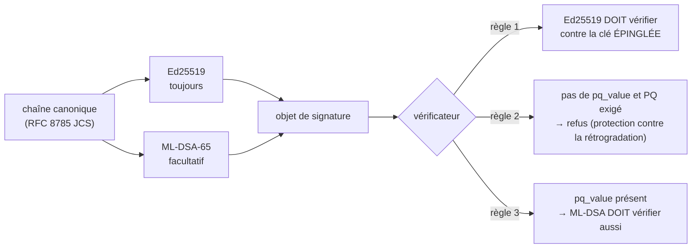

# Signatures post-quantiques — ce qui est déployé, et comment achever la migration

> Langues : [EN](pqc-migration.md) · [RU](pqc-migration.ru.md) · [ES](pqc-migration.es.md) · **FR** · [ZH](pqc-migration.zh.md)

Chaque signature émise par cet écosystème est **capable d'être hybride** : une signature Ed25519
qui peut porter à côté d'elle une seconde signature post-quantique. Ce document dit exactement ce
qui est activé aujourd'hui, ce que cela apporte et ce que cela n'apporte pas, et ce qu'il reste à
faire pour que la fédération soit post-quantiquement **sûre** et non seulement prête pour le
post-quantique.

## Le format sur le fil

Un objet de signature porte toujours les champs classiques, et éventuellement trois de plus :

| champ | obligatoire | signification |
| --- | --- | --- |
| `algorithm` | oui | `ed25519` |
| `public_key` | oui | clé publique Ed25519 en base64 |
| `value` | oui | signature Ed25519 sur la chaîne canonique, en base64 |
| `pq_algorithm` | non | `ml-dsa-65` (FIPS 204, ML-DSA en catégorie 3) |
| `pq_public_key` | non | clé publique ML-DSA-65 en base64 |
| `pq_value` | non | signature ML-DSA-65 sur la **même** chaîne canonique |

Les champs `pq_*` sont **additifs**. Les deux signatures couvrent une seule et même chaîne
canonique : un vérificateur qui n'a jamais entendu parler de ML-DSA lit `algorithm` et `value`,
ignore le reste et vérifie exactement comme avant. Rien de ce qui a été signé auparavant ne cesse
d'être vérifiable, et la [canonicalisation](localization-glossary.md) n'a pas changé.



## Pourquoi hybride plutôt que remplacement

Ed25519 reste l'autorité et est contrôlé **en premier, toujours**. Trois raisons, par ordre de
poids :

1. **Une implémentation jeune ne doit pas devenir une voie de falsification.** Si la bibliothèque
   ML-DSA comportait un défaut de vérification, un schéma purement PQ transformerait ce défaut en
   falsifications acceptées. En hybride, l'attaquant doit encore vaincre Ed25519 aussi.
2. **La menace est rétrospective.** Une signature est une affirmation sur le passé : un reçu signé
   aujourd'hui peut être contesté dans des années, quand un adversaire quantique sera plausible. Il
   faut donc protéger les signatures **avant** que l'adversaire existe, pas après.
3. **La fédération, ce sont des tiers.** Les pairs sont des hubs que nous ne contrôlons pas. Tout
   schéma exigeant que chaque pair se mette à jour simultanément est indéployable.

## La limite, énoncée honnêtement

**Signer en hybride sans politique d'exigence apporte une capacité de migration, pas la sécurité
post-quantique.**

Tant que l'absence de `pq_value` est acceptable, un adversaire capable de falsifier Ed25519 supprime
simplement les champs `pq_*` et présente un document purement classique — que tout vérificateur
accepte. C'est l'*attaque par rétrogradation*, et seule la phase 3 la referme.

Il existe une seconde limite, plus subtile. Ed25519 est vérifié contre une clé que le vérificateur a
**épinglée** hors bande. La clé PQ, si elle n'est pas épinglée elle aussi, est lue dans l'objet de
signature lui-même. Face au seul adversaire pour lequel la couche PQ existe, une clé PQ
auto-déclarée ne vaut rien : il falsifie la signature classique avec la clé épinglée devenue
cassable et y joint sa propre paire ML-DSA. D'où :

> Une signature post-quantique ne vaut que ce que vaut l'épinglage de sa clé publique.

C'est pourquoi `verify_signature_object` et le `verify_hybrid` du hub acceptent un
`pq_public_key_b64` / `pinned_pq_public_key` facultatif. Facultatif aujourd'hui parce que rien
n'épingle encore de clé PQ — voir [Avant la phase 3](#avant-la-phase-3) — et les jeux de tests
affirment **les deux** comportements, si bien que la lacune est consignée et non escamotée.

## Les trois phases, et pourquoi l'ordre est contraint

| phase | action | interrupteur |
| --- | --- | --- |
| 1 | installer la bibliothèque sur les **vérificateurs** | `aimarket-oracle-core[pqc]`, `aimarket-hub[pqc]` (c.-à-d. `dilithium-py`) |
| 2 | activer la **signature** PQ chez les signataires | `ORACLE_PQC=1` |
| 3 | **exiger** le PQ sur les vérificateurs | `ORACLE_PQC_REQUIRE=1`, `AIMARKET_PQC_REQUIRE=1` |

L'ordre n'est pas une préférence : il est imposé par une asymétrie voulue. La vérification est
**fail-closed (refus par défaut)** : un vérificateur qui voit un `pq_value` qu'il ne peut pas
évaluer renvoie `false` au lieu de hausser les épaules et d'accepter la signature classique. Un
vérificateur qu'une signature PQ incomprise peut tromper est pire qu'un vérificateur qui refuse.

Conséquence : un signataire qui devance les vérificateurs **se retire lui-même de la fédération** —
ses documents sont refusés par tous ceux qui n'ont pas encore installé la bibliothèque.

Cela a été mesuré, non supposé. Avant la phase 1, deux vérificateurs en production ont refusé un
document hybride signé par un troisième. Après la phase 1, les douze l'ont accepté — et les douze
ont refusé le même document avec un `pq_value` altéré.

## Réglages

| variable | côté | par défaut | effet |
| --- | --- | --- | --- |
| `ORACLE_PQC` | signataire (`oracle_core`) | désactivé | signer en hybride : ajouter `pq_*` à chaque objet de signature |
| `ORACLE_PQC_REQUIRE` | vérificateur (`oracle_core`) | désactivé | refuser un document sans `pq_value` |
| `AIMARKET_PQC_REQUIRE` | vérificateur (hub) | désactivé | la même règle, côté hub |

Exiger une preuve qu'on ne sait pas évaluer, c'est un vérificateur cassé, pas strict : d'où le fait
que `ORACLE_PQC_REQUIRE=1` sans la bibliothèque lève **`PQCMisconfigured`** bruyamment, plutôt que
de couper le trafic en silence.

Les dérogations par appel (`require_pq=...`) existent pour soumettre un palier ou un émetteur
donné à une politique plus stricte que celle de la fédération : c'est ainsi que la phase 3 peut se
déployer progressivement au lieu de globalement.

### La clé ML-DSA est un FICHIER, et `ORACLE_SIGNING_SEED_B64` ne la couvre pas

La paire PQ se trouve à côté de la classique, en **`{key_path}_mldsa`**, et est générée au premier
usage. `ORACLE_SIGNING_SEED_B64` fixe l'identité **Ed25519** depuis l'environnement et n'a aucun
effet sur celle de ML-DSA.

Ainsi, un service qui dérive son identité classique d'une variable de graine et tourne sans volume
persistant pour son chemin de clés obtient une **nouvelle identité ML-DSA à chaque redémarrage**,
tandis que son identité Ed25519 reste stable. Aujourd'hui rien ne casse, parce que rien n'épingle de
clé PQ ; et en phase 3 tout casse. Donnez à chaque signataire un chemin de clés persistant **avant**
la phase 2, pas pendant.

## Où en est la fédération (2026-09-06)

La phase 1 est achevée ; **aucun signataire n'émet encore de `pq_value`** et aucun vérificateur ne
l'exige.

| nœud | type | déploiement | état |
| --- | --- | --- | --- |
| `modelmarket.dev` | hub (APEX) | conteneur nu | phase 1 |
| `uni.modelmarket.dev` | hub (bulle UNI) | conteneur nu | phase 1 |
| `independentai.network/hub` | nœud de fédération indépendant | systemd + venv | phase 1 |
| hub Signal Hunt | hub | compose (`build:`) | phase 1 |
| second hub sur l'hôte hunt | hub | conteneur nu | phase 1 |
| hub de l'écosystème `:9083` | hub (non promu) | conteneur nu | phase 1 |
| MOMUS backend / Treasury / verifier | oracle-core | compose (`build:`) | phase 1 |
| BASANOS · LOGOS · GAIA · PRAXIS (×2) · remédiation SKOPOS · oracle-family · chronos · canary MOMUS | oracle-core | mixte | phase 1 |

Vérifié sur chaque nœud : un document hybride signé ailleurs est accepté ; un `pq_value` altéré est
refusé ; un document purement classique est refusé lorsque le PQ est exigé ; et la règle de la clé
classique épinglée tient toujours.

### Hors périmètre

**Les signatures on-chain.** Base, comme toute chaîne EVM, vérifie secp256k1 : c'est le choix de la
chaîne, pas le nôtre. Le signeur de politique de séquestre (HORKOS) signe les appels
`debitChannel` en secp256k1 et ne peut pas être rendu post-quantique de notre côté. Est en revanche
dans le périmètre tout ce que l'écosystème vérifie lui-même : manifestes, reçus, attestations,
verdicts, reçus de travail.

### Avant la phase 3

1. **Épingler les clés PQ par pair.** Le `PeerRecord` du hub ne stocke que `public_key`. Il lui faut
   un champ `pq_public_key`, enregistré à la première apparition — **maintenant**, tant que les
   signatures classiques peuvent encore l'authentifier. C'est toute la raison pour laquelle la
   phase 2 est urgente et non cosmétique.
2. **Des chemins de clés persistants pour chaque signataire** (voir le piège du fichier de clé
   ci-dessus).
3. **Ensuite** la phase 2 chez les signataires, nœud par nœud, en surveillant l'acceptation des
   pairs.
4. **Ensuite** la phase 3, par palier avant de l'être globalement.

## Vérifier un nœud

```bash
# service sur oracle-core (conteneur)
docker exec <name> python -c "from oracle_core.signing import pqc_available, pqc_required; print(pqc_available(), pqc_required())"

# hub (conteneur)
docker exec <name> python -c "from aimarket_hub.signing import pqc_available, pqc_required; print(pqc_available(), pqc_required())"

# hub (systemd + venv)
/opt/independentai/venvs/hub-*/bin/python -c "from aimarket_hub.signing import pqc_available; print(pqc_available())"
```

`True False`, c'est la phase 1 : capable de contrôler une signature PQ, sans l'exiger encore.

## Retour arrière

La phase 1 est additive : un retour arrière n'est nécessaire que si un nœud se comporte mal pour une
raison étrangère.

- **Gérés par compose** (le trio MOMUS, le hub Signal Hunt) : le Dockerfile et le fichier compose
  d'avant sont conservés à côté sous `*.pre-pqc` ; restaurer puis reconstruire.
- **Conteneurs nus** (les trois variantes de `modelmarket-hub`, le `:9083` de l'écosystème) : le
  conteneur précédent est conservé, arrêté, sous `<name>-rollback-<horodatage>` ; supprimer le
  nouveau et le relancer avec `docker start`. L'étiquette d'image précédente est également toujours
  présente.
- **Nœud systemd** : les copies de `signing.py` d'avant la modification sont dans
  `/root/pqc-backup/` ; restaurer puis `systemctl restart independentai-hub.service`.

## Source de vérité

- `oracles/core/oracle_core/signing.py` — signature/vérification hybrides, la politique en 4
  règles, les phases.
- `aimarket-hub/aimarket_hub/signing.py` — le côté hub, `verify_hybrid`.
- `oracles/core/docs/SIGNING.md` — le contrat de signature en détail.
- `oracles/core/tests/test_pqc_hybrid.py`, `aimarket-hub/tests/test_pqc_hybrid_hub.py` — 34 tests
  couvrant les phases, l'attaque par rétrogradation et la substitution de clé PQ.
