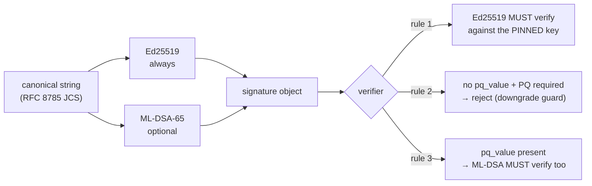

# Post-quantum signatures — what is deployed, and how to finish the migration

> Languages: **EN** · [RU](pqc-migration.ru.md) · [ES](pqc-migration.es.md) · [FR](pqc-migration.fr.md) · [ZH](pqc-migration.zh.md)

Every signature this ecosystem issues is **hybrid-capable**: an Ed25519 signature that MAY carry a
second, post-quantum signature next to it. This document says exactly what is switched on today,
what it does and does not buy, and what remains before the federation is actually
post-quantum-secure rather than post-quantum-ready.

## The wire format

A signature object always carries the classical fields, and optionally three more:

| field | required | meaning |
| --- | --- | --- |
| `algorithm` | yes | `ed25519` |
| `public_key` | yes | base64 Ed25519 public key |
| `value` | yes | base64 Ed25519 signature over the canonical string |
| `pq_algorithm` | no | `ml-dsa-65` (FIPS 204, ML-DSA at security category 3) |
| `pq_public_key` | no | base64 ML-DSA-65 public key |
| `pq_value` | no | base64 ML-DSA-65 signature over the **same** canonical string |

The `pq_*` keys are **additive**. Both signatures cover one identical canonical string, so a
verifier that has never heard of ML-DSA reads `algorithm` and `value`, ignores the rest, and
verifies exactly as before. Nothing signed before this work stops verifying, and no
[canonicalization](localization-glossary.md) changed.



## Why hybrid instead of replacement

Ed25519 stays authoritative and is checked **first, always**. Three reasons, in order of weight:

1. **A young implementation must not become a forgery path.** If the ML-DSA library had a
   verification bug, a PQ-only scheme would turn that bug into accepted forgeries. Under hybrid,
   an attacker still has to defeat Ed25519 as well.
2. **The threat is retrospective.** A signature is a claim about the past: a receipt signed today
   may be disputed years from now, when a quantum adversary is plausible. Signatures therefore
   need PQ protection *before* the adversary exists, not after.
3. **Federation is third parties.** Peers are hubs we do not control. Any scheme that requires
   every peer to upgrade simultaneously is not deployable.

## The honest limitation

**Hybrid signing without a require-policy buys migration ability, not post-quantum security.**

While the absence of `pq_value` is acceptable, an adversary who can forge Ed25519 simply deletes
the `pq_*` fields and presents a classical-only document — which every verifier accepts. That is
the *downgrade attack*, and only phase 3 closes it.

There is a second, subtler limit. Ed25519 is verified against a key the verifier **pinned** out of
band. The PQ key, unless pinned as well, is read out of the signature object itself. Against the
only adversary the PQ layer exists for, a self-asserted PQ key is worthless: they forge the
classical signature with the broken pinned key and attach an ML-DSA keypair of their own. So:

> A post-quantum signature is only as good as the pinning of its public key.

`verify_signature_object` and the hub's `verify_hybrid` therefore take an optional
`pq_public_key_b64` / `pinned_pq_public_key`. It is optional today because nothing pins PQ keys
yet — see [Before phase 3](#before-phase-3) — and the test suites assert both behaviours, so the
gap is recorded rather than implied away.

## The three phases, and why the order is forced

| phase | action | switch |
| --- | --- | --- |
| 1 | install the library on **verifiers** | `aimarket-oracle-core[pqc]`, `aimarket-hub[pqc]` (i.e. `dilithium-py`) |
| 2 | turn on PQ **signing** on signers | `ORACLE_PQC=1` |
| 3 | **require** PQ on verifiers | `ORACLE_PQC_REQUIRE=1`, `AIMARKET_PQC_REQUIRE=1` |

The order is not a preference — it is forced by a deliberate asymmetry. Verification **fails
closed**: a verifier that sees a `pq_value` it cannot evaluate returns `false` rather than
shrugging and accepting the classical signature. A verifier that *could* be fooled by a PQ
signature it does not understand is worse than one that refuses.

The consequence is that a signer which gets ahead of the verifiers **de-federates itself**: its
documents are rejected by everyone who has not installed the library yet.

This was measured, not assumed. Before phase 1, two production verifiers rejected a hybrid
document signed by a third. After phase 1, all twelve accepted it — and all twelve rejected the
same document with a tampered `pq_value`.

## Settings

| variable | side | default | effect |
| --- | --- | --- | --- |
| `ORACLE_PQC` | signer (`oracle_core`) | off | sign hybrid: add `pq_*` to every signature object |
| `ORACLE_PQC_REQUIRE` | verifier (`oracle_core`) | off | refuse a document that carries no `pq_value` |
| `AIMARKET_PQC_REQUIRE` | verifier (hub) | off | the same rule, hub side |

Requiring a proof you cannot evaluate is a broken verifier, not a strict one, so
`ORACLE_PQC_REQUIRE=1` without the library raises **`PQCMisconfigured`** loudly instead of
rejecting traffic silently.

Per-call overrides (`require_pq=...`) exist so a tier or a single issuer can be held to a stricter
policy than the federation, which is how phase 3 can be rolled out gradually instead of globally.

### The ML-DSA key is a FILE, and `ORACLE_SIGNING_SEED_B64` does not cover it

The PQ keypair lives beside the classical one, at **`{key_path}_mldsa`**, and is generated on
first use. `ORACLE_SIGNING_SEED_B64` sets the **Ed25519** identity from the environment and has no
effect on the ML-DSA one.

So a service that derives its classical identity from a seed variable and runs without a
persistent volume for its key path gets a **new ML-DSA identity on every restart**, while its
Ed25519 identity stays stable. Nothing breaks today, because nothing pins PQ keys — and everything
breaks in phase 3. Give every signer a persistent key path *before* phase 2, not during it.

## Where the federation stands (2026-09-06)

Phase 1 is complete; **no signer emits `pq_value` yet** and no verifier requires it.

| node | kind | deploy | state |
| --- | --- | --- | --- |
| `modelmarket.dev` | hub (APEX) | bare container | phase 1 |
| `uni.modelmarket.dev` | hub (UNI bubble) | bare container | phase 1 |
| `independentai.network/hub` | independent federation node | systemd + venv | phase 1 |
| Signal Hunt hub | hub | compose (`build:`) | phase 1 |
| second hub on the hunt host | hub | bare container | phase 1 |
| ecosystem hub `:9083` | hub (not promoted) | bare container | phase 1 |
| MOMUS backend / Treasury / verifier | oracle-core | compose (`build:`) | phase 1 |
| BASANOS · LOGOS · GAIA · PRAXIS (×2) · SKOPOS remediation · oracle-family · chronos · MOMUS canary | oracle-core | mixed | phase 1 |

Verified on each node: a hybrid document signed elsewhere is accepted, a tampered `pq_value` is
refused, a classical-only document is refused when PQ is required, and the pinned-classical-key
rule still holds.

### Not in scope

**On-chain signatures.** Base — like every EVM chain — verifies secp256k1, and that is the chain's
choice, not ours. The escrow policy signer (HORKOS) signs `debitChannel` calls with secp256k1 and
cannot be made post-quantum from our side. What *is* in scope is everything the ecosystem itself
verifies: manifests, receipts, attestations, verdicts, work receipts.

### Before phase 3

1. **Pin PQ keys per peer.** The hub's `PeerRecord` stores `public_key` only. It needs a
   `pq_public_key` field, recorded on first sight — *now*, while classical signatures can still
   authenticate it. This is the whole reason phase 2 is urgent and not merely cosmetic.
2. **Persistent key paths for every signer** (see the file-key gotcha above).
3. **Then** phase 2 on signers, node by node, watching peer acceptance.
4. **Then** phase 3, per tier before globally.

## Verifying a node

```bash
# oracle-core service (container)
docker exec <name> python -c "from oracle_core.signing import pqc_available, pqc_required; print(pqc_available(), pqc_required())"

# hub (container)
docker exec <name> python -c "from aimarket_hub.signing import pqc_available, pqc_required; print(pqc_available(), pqc_required())"

# hub (systemd + venv)
/opt/independentai/venvs/hub-*/bin/python -c "from aimarket_hub.signing import pqc_available; print(pqc_available())"
```

`True False` is phase 1: able to check a PQ signature, not yet requiring one.

## Rollback

Phase 1 is additive, so rolling back is only ever needed if a node misbehaves for an unrelated
reason.

- **Compose-managed** (MOMUS trio, Signal Hunt hub): the pre-change Dockerfile and compose file
  are kept as `*.pre-pqc` beside the originals; restore and rebuild.
- **Bare containers** (the three `modelmarket-hub` variants, ecosystem `:9083`): the previous
  container is preserved, stopped, as `<name>-rollback-<timestamp>`; `docker start` it after
  removing the new one. The previous image tag is also still present.
- **systemd node**: the pre-change `signing.py` copies are under `/root/pqc-backup/`; restore and
  `systemctl restart independentai-hub.service`.

## Source of truth

- `oracles/core/oracle_core/signing.py` — hybrid sign/verify, the 4-rule policy, phases.
- `aimarket-hub/aimarket_hub/signing.py` — the hub side, `verify_hybrid`.
- `oracles/core/docs/SIGNING.md` — the signing contract in detail.
- `oracles/core/tests/test_pqc_hybrid.py`, `aimarket-hub/tests/test_pqc_hybrid_hub.py` — 34 tests
  covering the phases, the downgrade attack, and PQ-key substitution.
