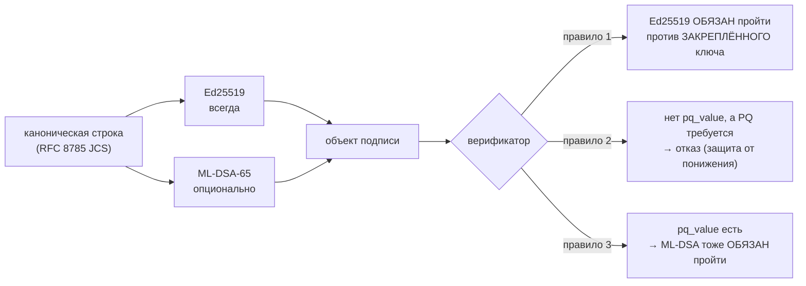

# Постквантовые подписи — что развёрнуто и как завершить миграцию

> Языки: [EN](pqc-migration.md) · **RU** · [ES](pqc-migration.es.md) · [FR](pqc-migration.fr.md) · [ZH](pqc-migration.zh.md)

Каждая подпись, которую выпускает экосистема, **способна быть гибридной**: это подпись Ed25519,
рядом с которой может стоять вторая, постквантовая. Этот документ говорит точно, что включено
сегодня, что это даёт и чего не даёт, и что осталось сделать, чтобы федерация стала
постквантово **защищённой**, а не только готовой к постквантовому переходу.

## Формат на проводе

Объект подписи всегда несёт классические поля и опционально ещё три:

| поле | обязательно | значение |
| --- | --- | --- |
| `algorithm` | да | `ed25519` |
| `public_key` | да | открытый ключ Ed25519 в base64 |
| `value` | да | подпись Ed25519 над канонической строкой, base64 |
| `pq_algorithm` | нет | `ml-dsa-65` (FIPS 204, ML-DSA категории 3) |
| `pq_public_key` | нет | открытый ключ ML-DSA-65 в base64 |
| `pq_value` | нет | подпись ML-DSA-65 над **той же** канонической строкой |

Поля `pq_*` **аддитивны**. Обе подписи покрывают одну и ту же каноническую строку, поэтому
верификатор, который про ML-DSA ничего не знает, читает `algorithm` и `value`, остальное
игнорирует и проверяет ровно как раньше. Ничего из подписанного ранее не перестаёт проверяться, и
[канонизация](localization-glossary.md) не менялась.



## Почему гибрид, а не замена

Ed25519 остаётся главным и проверяется **первым, всегда**. Три причины по убыванию весомости:

1. **Молодая реализация не должна стать путём подделки.** Если бы в библиотеке ML-DSA была ошибка
   проверки, схема «только PQ» превратила бы эту ошибку в принимаемые подделки. При гибриде
   атакующему всё равно нужно сломать и Ed25519.
2. **Угроза направлена в прошлое.** Подпись — утверждение о прошлом: квитанцию, подписанную
   сегодня, могут оспорить через годы, когда квантовый противник станет правдоподобен. Значит,
   защищать подписи нужно **до** появления противника, а не после.
3. **Федерация — это третьи стороны.** Пиры это хабы, которыми мы не управляем. Схема, требующая
   одновременного обновления всех пиров, не разворачивается в принципе.

## Честное ограничение

**Гибридная подпись без политики требования даёт возможность миграции, а не постквантовую
безопасность.**

Пока отсутствие `pq_value` допустимо, противник, умеющий подделать Ed25519, просто удаляет поля
`pq_*` и предъявляет чисто классический документ — который принимает любой верификатор. Это и есть
*атака понижения* (downgrade), и закрывает её только фаза 3.

Есть и второе, менее очевидное ограничение. Ed25519 проверяется против ключа, который верификатор
**закрепил** вне канала связи. PQ-ключ, если он не закреплён, читается из самого объекта подписи.
Против единственного противника, ради которого PQ-слой существует, незакреплённый PQ-ключ
бесполезен: он подделает классическую подпись сломанным закреплённым ключом и приложит собственную
пару ML-DSA. Отсюда:

> Постквантовая подпись стоит ровно столько, сколько стоит закрепление её открытого ключа.

Поэтому `verify_signature_object` и `verify_hybrid` на стороне хаба принимают необязательный
`pq_public_key_b64` / `pinned_pq_public_key`. Необязательный он сегодня потому, что PQ-ключи пока
нигде не закрепляются — см. [Перед фазой 3](#перед-фазой-3) — и наборы тестов фиксируют **оба**
поведения, так что пробел записан, а не замазан.

## Три фазы и почему порядок жёсткий

| фаза | действие | переключатель |
| --- | --- | --- |
| 1 | поставить библиотеку на **верификаторы** | `aimarket-oracle-core[pqc]`, `aimarket-hub[pqc]` (то есть `dilithium-py`) |
| 2 | включить PQ-**подпись** у подписантов | `ORACLE_PQC=1` |
| 3 | **требовать** PQ на верификаторах | `ORACLE_PQC_REQUIRE=1`, `AIMARKET_PQC_REQUIRE=1` |

Порядок — не предпочтение, он навязан сознательной асимметрией. Проверка работает **fail-closed
(отказ по умолчанию)**: верификатор, увидевший `pq_value`, который не может вычислить, возвращает
`false`, а не пожимает плечами и принимает классическую подпись. Верификатор, которого можно
обмануть непонятной ему PQ-подписью, хуже того, который отказывает.

Следствие: подписант, обогнавший верификаторов, **сам себя выводит из федерации** — его документы
отвергнут все, кто ещё не поставил библиотеку.

Это измерено, а не предположено. До фазы 1 два боевых верификатора отвергли гибридный документ,
подписанный третьим. После фазы 1 его приняли все двенадцать — и все двенадцать отвергли тот же
документ с испорченным `pq_value`.

## Настройки

| переменная | сторона | по умолчанию | эффект |
| --- | --- | --- | --- |
| `ORACLE_PQC` | подписант (`oracle_core`) | выкл | подписывать гибридно: добавлять `pq_*` в каждый объект подписи |
| `ORACLE_PQC_REQUIRE` | верификатор (`oracle_core`) | выкл | отказывать документу без `pq_value` |
| `AIMARKET_PQC_REQUIRE` | верификатор (хаб) | выкл | то же правило со стороны хаба |

Требовать доказательство, которое не умеешь вычислить, — это сломанный верификатор, а не строгий,
поэтому `ORACLE_PQC_REQUIRE=1` без библиотеки громко поднимает **`PQCMisconfigured`**, а не тихо
режет трафик.

Переопределение на вызов (`require_pq=...`) существует, чтобы держать отдельный уровень или
отдельного эмитента под более строгой политикой, чем вся федерация: именно так фазу 3 можно
раскатывать постепенно, а не глобально.

### Ключ ML-DSA — это ФАЙЛ, и `ORACLE_SIGNING_SEED_B64` его не покрывает

PQ-пара лежит рядом с классической, по пути **`{key_path}_mldsa`**, и создаётся при первом
обращении. `ORACLE_SIGNING_SEED_B64` задаёт из окружения **Ed25519**-личность и на ML-DSA не влияет
никак.

Значит служба, которая берёт классическую личность из seed-переменной и работает без постоянного
тома под свой путь к ключу, получает **новую личность ML-DSA при каждом перезапуске**, тогда как
её Ed25519-личность неизменна. Сегодня ничего не ломается, потому что PQ-ключи нигде не
закрепляются, — и всё ломается в фазе 3. Дайте каждому подписанту постоянный путь к ключу **до**
фазы 2, а не во время неё.

## Где сейчас федерация (2026-09-06)

Фаза 1 завершена; **ни один подписант ещё не выпускает `pq_value`**, ни один верификатор его не
требует.

| узел | тип | развёртывание | состояние |
| --- | --- | --- | --- |
| `modelmarket.dev` | хаб (APEX) | голый контейнер | фаза 1 |
| `uni.modelmarket.dev` | хаб (пузырь UNI) | голый контейнер | фаза 1 |
| `independentai.network/hub` | независимый узел федерации | systemd + venv | фаза 1 |
| хаб Signal Hunt | хаб | compose (`build:`) | фаза 1 |
| второй хаб на hunt-хосте | хаб | голый контейнер | фаза 1 |
| экосистемный хаб `:9083` | хаб (не продвинут) | голый контейнер | фаза 1 |
| MOMUS backend / Treasury / verifier | oracle-core | compose (`build:`) | фаза 1 |
| BASANOS · LOGOS · GAIA · PRAXIS (×2) · SKOPOS remediation · oracle-family · chronos · MOMUS canary | oracle-core | смешанно | фаза 1 |

На каждом узле проверено: гибридный документ, подписанный в другом месте, принимается; испорченный
`pq_value` отвергается; чисто классический документ отвергается при требовании PQ; правило
закреплённого классического ключа по-прежнему действует.

### Вне охвата

**Ончейн-подписи.** Base, как и любая EVM-цепочка, проверяет secp256k1 — это выбор цепочки, не
наш. Подписант политики эскроу (HORKOS) подписывает вызовы `debitChannel` через secp256k1, и
сделать его постквантовым с нашей стороны нельзя. В охвате — всё, что проверяет сама экосистема:
манифесты, квитанции, аттестации, вердикты, рабочие расписки.

### Перед фазой 3

1. **Закрепить PQ-ключи по каждому пиру.** `PeerRecord` хаба хранит только `public_key`. Нужно поле
   `pq_public_key`, записываемое при первом появлении — **сейчас**, пока классические подписи ещё
   могут его аутентифицировать. Именно поэтому фаза 2 срочна, а не косметична.
2. **Постоянные пути к ключам для каждого подписанта** (см. ловушку с файловым ключом выше).
3. **Затем** фаза 2 у подписантов, узел за узлом, следя за принятием у пиров.
4. **Затем** фаза 3 — сначала по уровням, потом глобально.

## Как проверить узел

```bash
# служба на oracle-core (контейнер)
docker exec <name> python -c "from oracle_core.signing import pqc_available, pqc_required; print(pqc_available(), pqc_required())"

# хаб (контейнер)
docker exec <name> python -c "from aimarket_hub.signing import pqc_available, pqc_required; print(pqc_available(), pqc_required())"

# хаб (systemd + venv)
/opt/independentai/venvs/hub-*/bin/python -c "from aimarket_hub.signing import pqc_available; print(pqc_available())"
```

`True False` — это фаза 1: умеет проверить PQ-подпись, но пока её не требует.

## Откат

Фаза 1 аддитивна, поэтому откат нужен только если узел ведёт себя плохо по несвязанной причине.

- **Под управлением compose** (трио MOMUS, хаб Signal Hunt): Dockerfile и compose-файл до правки
  лежат рядом как `*.pre-pqc`; восстановить и пересобрать.
- **Голые контейнеры** (три варианта `modelmarket-hub`, экосистемный `:9083`): предыдущий
  контейнер сохранён остановленным как `<name>-rollback-<метка времени>`; удалить новый и
  запустить его через `docker start`. Прежний тег образа тоже на месте.
- **Узел на systemd**: копии `signing.py` до правки лежат в `/root/pqc-backup/`; восстановить и
  выполнить `systemctl restart independentai-hub.service`.

## Источник истины

- `oracles/core/oracle_core/signing.py` — гибридные подпись/проверка, политика из 4 правил, фазы.
- `aimarket-hub/aimarket_hub/signing.py` — сторона хаба, `verify_hybrid`.
- `oracles/core/docs/SIGNING.md` — контракт подписи подробно.
- `oracles/core/tests/test_pqc_hybrid.py`, `aimarket-hub/tests/test_pqc_hybrid_hub.py` — 34 теста
  на фазы, атаку понижения и подстановку PQ-ключа.
