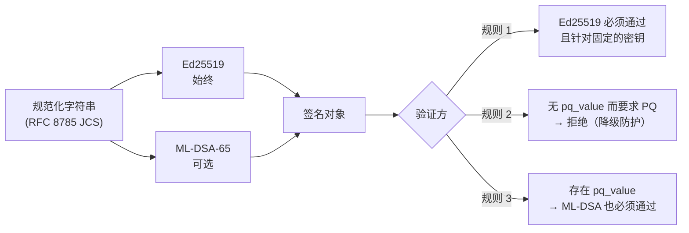

# 后量子签名——已部署的内容，以及如何完成迁移

> 语言：[EN](pqc-migration.md) · [RU](pqc-migration.ru.md) · [ES](pqc-migration.es.md) · [FR](pqc-migration.fr.md) · **ZH**

本生态签发的每一个签名都**具备混合签名能力**：一个 Ed25519 签名，旁边可以再带一个后量子签名。本文
准确说明今天开启了什么、它带来什么、不带来什么，以及要让联邦真正达到后量子**安全**（而不仅是具备
后量子迁移能力）还差什么。

## 线上格式

签名对象始终携带经典字段，并可选地再带三个：

| 字段 | 必需 | 含义 |
| --- | --- | --- |
| `algorithm` | 是 | `ed25519` |
| `public_key` | 是 | base64 编码的 Ed25519 公钥 |
| `value` | 是 | 对规范化字符串的 Ed25519 签名，base64 |
| `pq_algorithm` | 否 | `ml-dsa-65`（FIPS 204，ML-DSA 安全类别 3） |
| `pq_public_key` | 否 | base64 编码的 ML-DSA-65 公钥 |
| `pq_value` | 否 | 对**同一条**规范化字符串的 ML-DSA-65 签名 |

`pq_*` 字段是**增量**的。两个签名覆盖同一条规范化字符串，因此从未听说过 ML-DSA 的验证方只读
`algorithm` 与 `value`，忽略其余部分，验证行为与此前完全一致。此前签署过的任何内容都不会失效，
[规范化](localization-glossary.md)也没有改动。



## 为何采用混合而非替换

Ed25519 仍是权威，并且**始终最先**校验。三条理由，按重要性排列：

1. **年轻的实现不该成为伪造通道。** 若 ML-DSA 库存在验证缺陷，纯 PQ 方案会把该缺陷直接变成被接受
   的伪造。在混合方案下，攻击者仍必须同时攻破 Ed25519。
2. **威胁指向过去。** 签名是关于过去的断言：今天签署的收据可能在若干年后被争议，那时量子对手已属
   合理假设。因此必须在对手出现**之前**保护签名，而不是之后。
3. **联邦意味着第三方。** 对等节点是我们不掌控的 Hub。任何要求所有对等节点同时升级的方案都无法
   落地。

## 诚实的局限

**没有强制策略的混合签名带来的是迁移能力，不是后量子安全。**

只要缺少 `pq_value` 仍被接受，能够伪造 Ed25519 的对手只需删掉 `pq_*` 字段，出示一份纯经典文档
——而任何验证方都会接受它。这就是*降级攻击*，只有阶段 3 才能封堵。

还有第二个更隐蔽的局限。Ed25519 是针对验证方在带外**固定**下来的密钥校验的。而 PQ 公钥若未同样被
固定，就取自签名对象自身。面对 PQ 层唯一要防的那个对手，自我声明的 PQ 密钥毫无价值：他用已被攻破
的固定密钥伪造经典签名，再附上自己的一对 ML-DSA 密钥。由此：

> 后量子签名的价值，等于其公钥固定机制的价值。

因此 `verify_signature_object` 与 Hub 的 `verify_hybrid` 都接受可选的 `pq_public_key_b64` /
`pinned_pq_public_key`。今天之所以是可选的，是因为目前还没有任何地方固定 PQ 密钥——参见
[阶段 3 之前](#阶段-3-之前)——而两套测试对**两种**行为都做了断言，因此这一缺口被记录在案，而不是被
掩盖过去。

## 三个阶段，以及顺序为何是被迫的

| 阶段 | 动作 | 开关 |
| --- | --- | --- |
| 1 | 在**验证方**安装库 | `aimarket-oracle-core[pqc]`、`aimarket-hub[pqc]`（即 `dilithium-py`） |
| 2 | 在签名方开启 PQ **签名** | `ORACLE_PQC=1` |
| 3 | 在验证方**要求** PQ | `ORACLE_PQC_REQUIRE=1`、`AIMARKET_PQC_REQUIRE=1` |

这个顺序不是偏好，而是由一处刻意的不对称所强制。验证是 **fail-closed（默认拒绝）**：验证方看到自己
无法评估的 `pq_value` 时返回 `false`，而不是耸耸肩接受经典签名。一个会被自己看不懂的 PQ 签名骗过的
验证方，比一个直接拒绝的验证方更糟。

其后果是：跑在验证方前面的签名方**会把自己踢出联邦**——凡是尚未安装该库的节点都会拒绝它的文档。

这是实测结果，不是假设。阶段 1 之前，两个生产验证方拒绝了由第三个节点签署的混合文档；阶段 1 之后，
全部十二个都接受了它——并且全部十二个都拒绝了同一份被篡改 `pq_value` 的文档。

## 配置项

| 变量 | 侧 | 默认 | 效果 |
| --- | --- | --- | --- |
| `ORACLE_PQC` | 签名方（`oracle_core`） | 关 | 混合签名：为每个签名对象加上 `pq_*` |
| `ORACLE_PQC_REQUIRE` | 验证方（`oracle_core`） | 关 | 拒绝不带 `pq_value` 的文档 |
| `AIMARKET_PQC_REQUIRE` | 验证方（Hub） | 关 | Hub 侧的同一规则 |

要求一份自己无法评估的证明，是坏掉的验证方，而不是严格的验证方：所以在缺库的情况下
`ORACLE_PQC_REQUIRE=1` 会高声抛出 **`PQCMisconfigured`**，而不是静默地切断流量。

按调用覆盖（`require_pq=...`）的存在，是为了让某一层级或某一签发方受到比整个联邦更严格的策略约束：
阶段 3 正是靠它得以逐步推进而非一次性全局启用。

### ML-DSA 密钥是一个**文件**，且 `ORACLE_SIGNING_SEED_B64` 管不到它

PQ 密钥对与经典密钥并列存放于 **`{key_path}_mldsa`**，首次使用时生成。
`ORACLE_SIGNING_SEED_B64` 从环境变量确定 **Ed25519** 身份，对 ML-DSA 身份毫无影响。

因此，凡是从种子变量派生经典身份、又没有为密钥路径挂载持久卷的服务，**每次重启都会得到一个新的
ML-DSA 身份**，而其 Ed25519 身份保持不变。今天不会出问题，因为还没有任何地方固定 PQ 密钥；而到了
阶段 3 就会全面出问题。请在阶段 2 **之前**、而不是过程中，为每个签名方准备好持久化的密钥路径。

## 联邦现状（2026-09-06）

阶段 1 已完成；**尚无签名方签发 `pq_value`**，也没有验证方要求它。

| 节点 | 类型 | 部署方式 | 状态 |
| --- | --- | --- | --- |
| `modelmarket.dev` | Hub（APEX） | 裸容器 | 阶段 1 |
| `uni.modelmarket.dev` | Hub（UNI 气泡） | 裸容器 | 阶段 1 |
| `independentai.network/hub` | 独立联邦节点 | systemd + venv | 阶段 1 |
| Signal Hunt Hub | Hub | compose（`build:`） | 阶段 1 |
| hunt 主机上的第二个 Hub | Hub | 裸容器 | 阶段 1 |
| 生态 Hub `:9083` | Hub（未晋升） | 裸容器 | 阶段 1 |
| MOMUS backend / Treasury / verifier | oracle-core | compose（`build:`） | 阶段 1 |
| BASANOS · LOGOS · GAIA · PRAXIS（×2）· SKOPOS 修复器 · oracle-family · chronos · MOMUS canary | oracle-core | 混合 | 阶段 1 |

已在每个节点验证：接受由别处签署的混合文档；拒绝被篡改的 `pq_value`；在要求 PQ 时拒绝纯经典文档；
且固定经典密钥的规则依然成立。

### 不在范围内

**链上签名。** 与所有 EVM 链一样，Base 验证的是 secp256k1，这是链的选择，不是我们的选择。托管策略
签名服务（HORKOS）用 secp256k1 签署 `debitChannel` 调用，我们这一侧无法把它改成后量子的。在范围内
的是生态自身验证的一切：清单、收据、证明（attestation）、裁定、工作收据。

### 阶段 3 之前

1. **按对等节点固定 PQ 密钥。** Hub 的 `PeerRecord` 只存 `public_key`，需要新增 `pq_public_key`
   字段，并在**首次见到**时记录——就是**现在**，趁经典签名还能为它做身份认证。这正是阶段 2 之所以
   紧迫、而非装饰性的全部原因。
2. **为每个签名方准备持久化的密钥路径**（见上文密钥文件陷阱）。
3. **然后**在签名方逐节点推进阶段 2，同时观察对等节点的接受情况。
4. **然后**推进阶段 3，先按层级，再全局。

## 如何验证一个节点

```bash
# 基于 oracle-core 的服务（容器）
docker exec <name> python -c "from oracle_core.signing import pqc_available, pqc_required; print(pqc_available(), pqc_required())"

# Hub（容器）
docker exec <name> python -c "from aimarket_hub.signing import pqc_available, pqc_required; print(pqc_available(), pqc_required())"

# Hub（systemd + venv）
/opt/independentai/venvs/hub-*/bin/python -c "from aimarket_hub.signing import pqc_available; print(pqc_available())"
```

`True False` 即阶段 1：能够校验 PQ 签名，但尚未要求它。

## 回滚

阶段 1 是增量的，因此只有当某节点因无关原因出现异常时才需要回滚。

- **由 compose 管理**（MOMUS 三件套、Signal Hunt Hub）：改动前的 Dockerfile 与 compose 文件以
  `*.pre-pqc` 保存在原文件旁；恢复后重新构建。
- **裸容器**（三个 `modelmarket-hub` 变体、生态 `:9083`）：先前的容器以
  `<name>-rollback-<时间戳>` 名称保留为已停止状态；删除新容器后用 `docker start` 启动它。先前的
  镜像标签同样仍然存在。
- **systemd 节点**：改动前的 `signing.py` 副本位于 `/root/pqc-backup/`；恢复后执行
  `systemctl restart independentai-hub.service`。

## 权威来源

- `oracles/core/oracle_core/signing.py`——混合签名/验证、四条规则的策略、各阶段。
- `aimarket-hub/aimarket_hub/signing.py`——Hub 侧，`verify_hybrid`。
- `oracles/core/docs/SIGNING.md`——签名契约详解。
- `oracles/core/tests/test_pqc_hybrid.py`、`aimarket-hub/tests/test_pqc_hybrid_hub.py`——34 项测试，
  覆盖各阶段、降级攻击与 PQ 密钥替换。
