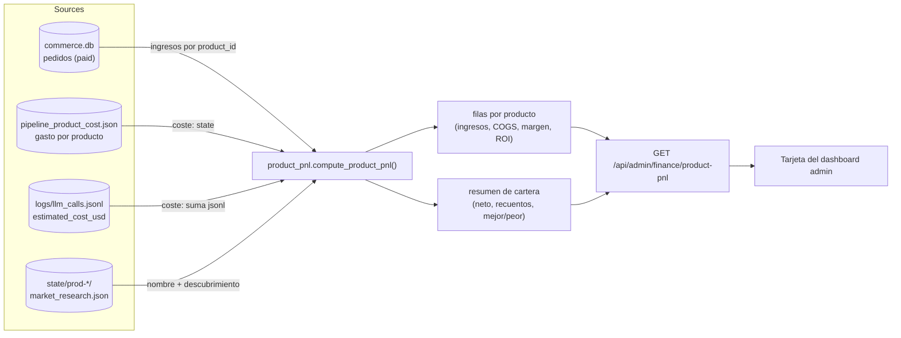
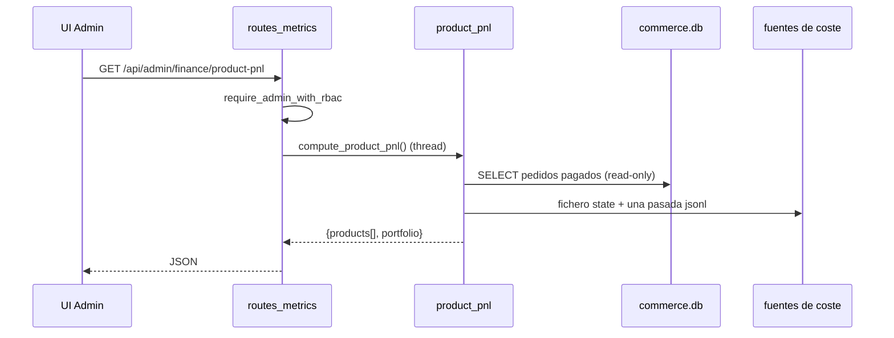

# Product P&L — unit-economics en tiempo real

> 🌐 Idiomas: [English](./product-pnl.md) · [Русский](./product-pnl.ru.md) · [Français](./product-pnl.fr.md) · **Español** · [中文](./product-pnl.zh.md)

Cuenta de pérdidas y ganancias (P&L) por producto para la factory autónoma. Une
las dos mitades que la factory ya registra — los **ingresos** (pedidos pagados) y
el **COGS de inferencia** (gasto en LLM por producto) — en una vista de
unit-economics en tiempo real y de solo lectura: ingresos, coste, beneficio/margen
bruto, ROI y recuperación del coste por producto, más un resumen de la cartera.

> Honestidad antes que precisión. El coste es una *estimación* (tarificación de
> tokens) y el FX se configura por env. Esto es visibilidad operativa, no
> contabilidad de facturación. Los productos pre-ingresos y en números rojos
> también se muestran — el cementerio es lo que da credibilidad.

- **Módulo:** [`product_pnl.py`](../product_pnl.py)
- **Endpoint:** `GET /api/admin/finance/product-pnl` (admin RBAC, solo lectura)
- **Tests:** [`tests/test_product_pnl.py`](../tests/test_product_pnl.py)
- **Véase también:** [factory-metrics-reference.md](./factory-metrics-reference.md), [admin-guide.md](./admin-guide.md)

## Flujo de datos



### Cómo se atiende una petición



## Fuentes de datos

| Mitad | Fuente | Notas |
|-------|--------|-------|
| Ingresos | `data/store/commerce.db` → `orders` donde `status='paid'` | Los pedidos ya llevan `product_id`; se abren en **solo lectura**. Importes convertidos a USD aproximado con el mismo helper de FX que [`finance_stats`](../finance_stats.py) (`AIFACTORY_ETH_USD`, `AIFACTORY_SOL_USD`). |
| COGS de inferencia | `state/pipeline_product_cost.json` **y** `logs/llm_calls.jsonl` | Coste = `max(persisted_state, jsonl_sum)` por producto — refleja `pipeline_cost_guard.product_spend_usd(reconcile_jsonl=True)`, pero en una sola pasada JSONL. |
| Metadatos | `state/prod-*/market_research.json` | Nombre visible derivado del campo `idea` (primeras 6 palabras); recurre a `product_id`. |

**Universo de productos** = unión de los productos con ingresos ∪ los productos con
coste registrado ∪ los directorios state `prod-*`. Así, un producto recién construido
sin ventas aparece igualmente (como `pre_revenue`), y un producto que quemó
presupuesto LLM pero nunca vendió aparece en números rojos.

Todas las rutas derivan de una única data root resuelta, por lo que la función es
completamente parametrizable (`compute_product_pnl(data_root=...)`) y sin efectos
secundarios.

## Campos por producto

| Campo | Significado |
|-------|-------------|
| `product_id` | Id de la factory (`prod-…`). |
| `name` | Nombre legible derivado de la idea del market research. |
| `status` | `profitable` (ingresos ≥ coste), `recovering` (0 < ingresos < coste), `pre_revenue` (sin ingresos). |
| `revenue_usd` | Suma de los pedidos pagados (≈ USD). |
| `units_sold` | Número de pedidos pagados. |
| `paying_customers` | `customer_id` distintos entre los pedidos pagados. |
| `arpu_usd` | `revenue_usd / paying_customers`. |
| `inference_cost_usd` | Gasto en LLM acumulado (COGS). |
| `gross_profit_usd` | `revenue_usd − inference_cost_usd`. |
| `gross_margin_pct` | `gross_profit / revenue × 100` (null sin ingresos). |
| `roi_pct` | `gross_profit / cost × 100` (null sin coste). |
| `cost_recovery_pct` | `revenue / cost × 100` — qué parte del coste de build se ha recuperado. |
| `is_profitable` | `gross_profit_usd > 0`. |
| `first_sale_at` / `last_sale_at` | Timestamps Unix del primer/último pedido pagado. |

## Resumen de cartera

`product_count`, `products_profitable`, `products_recovering`, `products_pre_revenue`,
`total_revenue_usd`, `total_inference_cost_usd`, `net_profit_usd`,
`blended_margin_pct`, `blended_roi_pct`, `cost_recovery_pct`, `best_product`,
`worst_product` (ordenados por beneficio neto).

## Fórmulas

```
gross_profit       = revenue − inference_cost
gross_margin_pct   = gross_profit / revenue × 100      # null if revenue = 0
roi_pct            = gross_profit / inference_cost × 100  # null if cost = 0
cost_recovery_pct  = revenue / inference_cost × 100     # null if cost = 0
arpu               = revenue / paying_customers
```

## Ejemplo de respuesta

```json
{
  "generated_at": 1780000000.0,
  "fx_note": "Inference cost & FX are estimates (ops visibility, not billing).",
  "products": [
    {
      "product_id": "prod-07ed6c837090",
      "name": "Smart document processing platform with",
      "status": "profitable",
      "revenue_usd": 297.0,
      "units_sold": 3,
      "paying_customers": 2,
      "arpu_usd": 148.5,
      "inference_cost_usd": 41.2,
      "gross_profit_usd": 255.8,
      "gross_margin_pct": 86.1,
      "roi_pct": 620.9,
      "cost_recovery_pct": 720.9,
      "is_profitable": true,
      "first_sale_at": 1779900000.0,
      "last_sale_at": 1779990000.0
    }
  ],
  "portfolio": {
    "product_count": 11,
    "products_profitable": 1,
    "products_recovering": 0,
    "products_pre_revenue": 10,
    "total_revenue_usd": 297.0,
    "total_inference_cost_usd": 48.2,
    "net_profit_usd": 248.8,
    "blended_margin_pct": 83.8,
    "blended_roi_pct": 516.2,
    "cost_recovery_pct": 616.2,
    "best_product": "prod-07ed6c837090",
    "worst_product": "prod-1"
  }
}
```

## Salvedades

- **Estimaciones, no facturación.** `inference_cost_usd` usa la tarificación de
  tokens ([`llm/pricing_estimate.py`](../llm/pricing_estimate.py)); el FX cripto usa
  tasas de env. Trátese como orientativo.
- **Solo inferencia.** El COGS por ahora solo cuenta el gasto en LLM, no la infra
  (hosting, dominios). Añade una segunda línea de coste si necesitas el COGS
  completo.
- **La atribución de ingresos** depende de que los pedidos lleven un `product_id`
  correcto.

## Tests

```bash
python -m pytest tests/test_product_pnl.py -q
```

Cubre la unión de ingresos, el reconcile del coste (`max`), la unit-economics por
producto, el resumen de cartera y la exclusión de los pedidos pending/failed.
