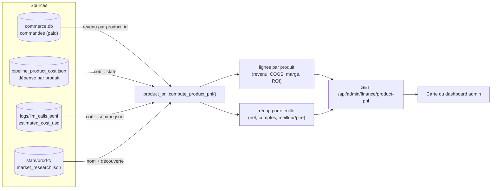
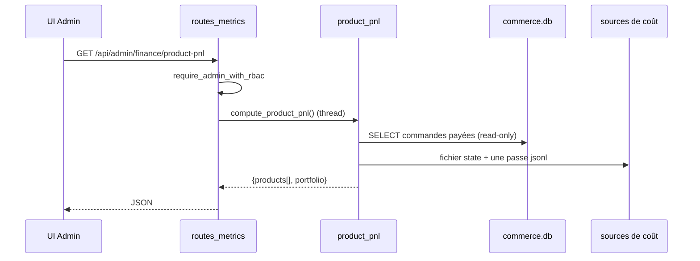

# Product P&L — unit-economics live

> 🌐 Langues : [English](./product-pnl.md) · [Русский](./product-pnl.ru.md) · **Français** · [中文](./product-pnl.zh.md)

Compte de résultat (P&L) par produit pour la factory autonome. Il joint les deux
moitiés que la factory enregistre déjà — le **revenu** (commandes payées) et le
**COGS d'inférence** (dépense LLM par produit) — dans une vue d'unit-economics
live, en lecture seule : revenu, coût, profit/marge brute, ROI et recouvrement du
coût par produit, plus un récap de portefeuille.

> L'honnêteté avant la précision. Le coût est une *estimation* (tarification des
> tokens) et le FX est configuré via env. C'est de la visibilité opérationnelle,
> pas de la comptabilité de facturation. Les produits pré-revenu et dans le rouge
> sont eux aussi affichés — le cimetière fait la crédibilité.

- **Module :** [`product_pnl.py`](../product_pnl.py)
- **Endpoint :** `GET /api/admin/finance/product-pnl` (admin RBAC, lecture seule)
- **Tests :** [`tests/test_product_pnl.py`](../tests/test_product_pnl.py)
- **Voir aussi :** [factory-metrics-reference.md](./factory-metrics-reference.md), [admin-guide.md](./admin-guide.md)

## Flux de données



### Comment une requête est servie



## Sources de données

| Moitié | Source | Notes |
|--------|--------|-------|
| Revenu | `data/store/commerce.db` → `orders` où `status='paid'` | Les commandes portent déjà `product_id` ; ouvertes en **lecture seule**. Montants convertis en USD approximatif avec le même helper FX que [`finance_stats`](../finance_stats.py) (`AIFACTORY_ETH_USD`, `AIFACTORY_SOL_USD`). |
| COGS d'inférence | `state/pipeline_product_cost.json` **et** `logs/llm_calls.jsonl` | Coût = `max(persisted_state, jsonl_sum)` par produit — reflète `pipeline_cost_guard.product_spend_usd(reconcile_jsonl=True)`, mais en une seule passe JSONL. |
| Métadonnées | `state/prod-*/market_research.json` | Nom d'affichage dérivé du champ `idea` (6 premiers mots) ; se rabat sur `product_id`. |

**Univers des produits** = union des produits avec revenu ∪ des produits avec coût
enregistré ∪ des répertoires state `prod-*`. Ainsi un produit fraîchement construit
sans vente apparaît quand même (en `pre_revenue`), et un produit qui a brûlé du
budget LLM sans jamais vendre apparaît dans le rouge.

Tous les chemins dérivent d'une unique data root résolue, donc la fonction est
entièrement paramétrable (`compute_product_pnl(data_root=...)`) et sans effet de
bord.

## Champs par produit

| Champ | Signification |
|-------|---------------|
| `product_id` | Id factory (`prod-…`). |
| `name` | Nom lisible dérivé de l'idée du market research. |
| `status` | `profitable` (revenu ≥ coût), `recovering` (0 < revenu < coût), `pre_revenue` (aucun revenu). |
| `revenue_usd` | Somme des commandes payées (≈ USD). |
| `units_sold` | Nombre de commandes payées. |
| `paying_customers` | `customer_id` distincts parmi les commandes payées. |
| `arpu_usd` | `revenue_usd / paying_customers`. |
| `inference_cost_usd` | Dépense LLM cumulée (COGS). |
| `gross_profit_usd` | `revenue_usd − inference_cost_usd`. |
| `gross_margin_pct` | `gross_profit / revenue × 100` (null sans revenu). |
| `roi_pct` | `gross_profit / cost × 100` (null sans coût). |
| `cost_recovery_pct` | `revenue / cost × 100` — quelle part du coût de build a été remboursée. |
| `is_profitable` | `gross_profit_usd > 0`. |
| `first_sale_at` / `last_sale_at` | Timestamps Unix de la première/dernière commande payée. |

## Récap de portefeuille

`product_count`, `products_profitable`, `products_recovering`, `products_pre_revenue`,
`total_revenue_usd`, `total_inference_cost_usd`, `net_profit_usd`,
`blended_margin_pct`, `blended_roi_pct`, `cost_recovery_pct`, `best_product`,
`worst_product` (classés par profit net).

## Formules

```
gross_profit       = revenue − inference_cost
gross_margin_pct   = gross_profit / revenue × 100      # null if revenue = 0
roi_pct            = gross_profit / inference_cost × 100  # null if cost = 0
cost_recovery_pct  = revenue / inference_cost × 100     # null if cost = 0
arpu               = revenue / paying_customers
```

## Exemple de réponse

```json
{
  "generated_at": 1780000000.0,
  "fx_note": "Inference cost & FX are estimates (ops visibility, not billing).",
  "products": [
    {
      "product_id": "prod-07ed6c837090",
      "name": "Smart document processing platform with",
      "status": "profitable",
      "revenue_usd": 297.0,
      "units_sold": 3,
      "paying_customers": 2,
      "arpu_usd": 148.5,
      "inference_cost_usd": 41.2,
      "gross_profit_usd": 255.8,
      "gross_margin_pct": 86.1,
      "roi_pct": 620.9,
      "cost_recovery_pct": 720.9,
      "is_profitable": true,
      "first_sale_at": 1779900000.0,
      "last_sale_at": 1779990000.0
    }
  ],
  "portfolio": {
    "product_count": 11,
    "products_profitable": 1,
    "products_recovering": 0,
    "products_pre_revenue": 10,
    "total_revenue_usd": 297.0,
    "total_inference_cost_usd": 48.2,
    "net_profit_usd": 248.8,
    "blended_margin_pct": 83.8,
    "blended_roi_pct": 516.2,
    "cost_recovery_pct": 616.2,
    "best_product": "prod-07ed6c837090",
    "worst_product": "prod-1"
  }
}
```

## Réserves

- **Des estimations, pas de la facturation.** `inference_cost_usd` utilise la
  tarification des tokens ([`llm/pricing_estimate.py`](../llm/pricing_estimate.py)) ;
  le FX crypto utilise des taux env. À considérer comme indicatif.
- **Inférence seulement.** Le COGS ne compte pour l'instant que la dépense LLM, pas
  l'infra (hébergement, domaines). Ajouter une deuxième ligne de coût si vous avez
  besoin du COGS complet.
- **L'attribution du revenu** dépend de commandes portant un `product_id` correct.

## Tests

```bash
python -m pytest tests/test_product_pnl.py -q
```

Couvre la jointure du revenu, le reconcile du coût (`max`), l'unit-economics par
produit, le récap de portefeuille et l'exclusion des commandes pending/failed.
