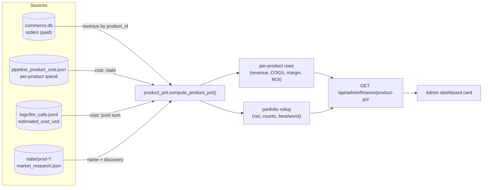
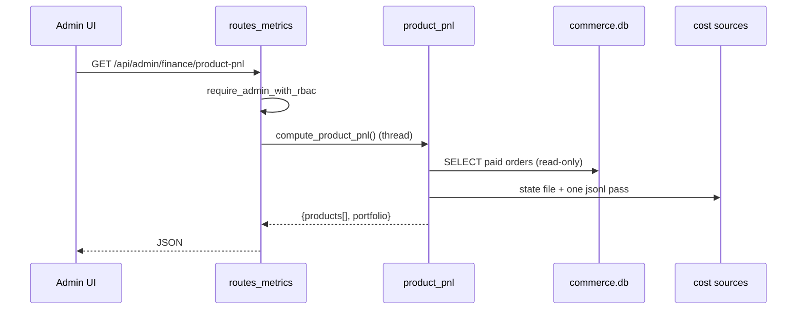

# Product P&L — Live Unit Economics

> 🌐 Languages: **English** · [Русский](./product-pnl.ru.md) · [Français](./product-pnl.fr.md) · [中文](./product-pnl.zh.md)

Per-product profit & loss for the autonomous factory. It joins the two halves the
factory already records — **revenue** (paid orders) and **inference COGS** (LLM
spend per product) — into a live, read-only unit-economics view: revenue, cost,
gross profit/margin, ROI and cost-recovery per product, plus a portfolio rollup.

> Honesty over precision. Cost is an *estimate* (token pricing) and FX is
> env-configured. This is operations visibility, not billing-grade accounting.
> Pre-revenue and in-the-red products are surfaced too — the graveyard is the
> credibility.

- **Module:** [`product_pnl.py`](../product_pnl.py)
- **Endpoint:** `GET /api/admin/finance/product-pnl` (admin RBAC, read-only)
- **Tests:** [`tests/test_product_pnl.py`](../tests/test_product_pnl.py)
- **Related:** [factory-metrics-reference.md](./factory-metrics-reference.md), [admin-guide.md](./admin-guide.md)

## Data flow



### How a request is served



## Data sources

| Half | Source | Notes |
|------|--------|-------|
| Revenue | `data/store/commerce.db` → `orders` where `status='paid'` | Orders already carry `product_id`; opened **read-only**. Amounts converted to approximate USD with the same FX helper as [`finance_stats`](../finance_stats.py) (`AIFACTORY_ETH_USD`, `AIFACTORY_SOL_USD`). |
| Inference COGS | `state/pipeline_product_cost.json` **and** `logs/llm_calls.jsonl` | Cost = `max(persisted_state, jsonl_sum)` per product — mirrors `pipeline_cost_guard.product_spend_usd(reconcile_jsonl=True)`, but in a single JSONL pass. |
| Metadata | `state/prod-*/market_research.json` | Display name derived from the `idea` field (first 6 words); falls back to `product_id`. |

**Product universe** = union of products with revenue ∪ products with recorded
cost ∪ `prod-*` state directories. So a freshly-built product with no sales still
appears (as `pre_revenue`), and a product that burned LLM budget but never sold
appears in the red.

All paths derive from a single resolved data root, so the function is fully
parameterizable (`compute_product_pnl(data_root=...)`) and side-effect free.

## Per-product fields

| Field | Meaning |
|-------|---------|
| `product_id` | Factory id (`prod-…`). |
| `name` | Human name derived from market research idea. |
| `status` | `profitable` (revenue ≥ cost), `recovering` (0 < revenue < cost), `pre_revenue` (no revenue). |
| `revenue_usd` | Sum of paid orders (approx USD). |
| `units_sold` | Count of paid orders. |
| `paying_customers` | Distinct `customer_id` among paid orders. |
| `arpu_usd` | `revenue_usd / paying_customers`. |
| `inference_cost_usd` | Accumulated LLM spend (COGS). |
| `gross_profit_usd` | `revenue_usd − inference_cost_usd`. |
| `gross_margin_pct` | `gross_profit / revenue × 100` (null when no revenue). |
| `roi_pct` | `gross_profit / cost × 100` (null when no cost). |
| `cost_recovery_pct` | `revenue / cost × 100` — how much of the build cost has been repaid. |
| `is_profitable` | `gross_profit_usd > 0`. |
| `first_sale_at` / `last_sale_at` | Unix timestamps of first/last paid order. |

## Portfolio rollup

`product_count`, `products_profitable`, `products_recovering`, `products_pre_revenue`,
`total_revenue_usd`, `total_inference_cost_usd`, `net_profit_usd`,
`blended_margin_pct`, `blended_roi_pct`, `cost_recovery_pct`, `best_product`,
`worst_product` (ranked by net profit).

## Formulas

```
gross_profit       = revenue − inference_cost
gross_margin_pct   = gross_profit / revenue × 100      # null if revenue = 0
roi_pct            = gross_profit / inference_cost × 100  # null if cost = 0
cost_recovery_pct  = revenue / inference_cost × 100     # null if cost = 0
arpu               = revenue / paying_customers
```

## Example response

```json
{
  "generated_at": 1780000000.0,
  "fx_note": "Inference cost & FX are estimates (ops visibility, not billing).",
  "products": [
    {
      "product_id": "prod-07ed6c837090",
      "name": "Smart document processing platform with",
      "status": "profitable",
      "revenue_usd": 297.0,
      "units_sold": 3,
      "paying_customers": 2,
      "arpu_usd": 148.5,
      "inference_cost_usd": 41.2,
      "gross_profit_usd": 255.8,
      "gross_margin_pct": 86.1,
      "roi_pct": 620.9,
      "cost_recovery_pct": 720.9,
      "is_profitable": true,
      "first_sale_at": 1779900000.0,
      "last_sale_at": 1779990000.0
    }
  ],
  "portfolio": {
    "product_count": 11,
    "products_profitable": 1,
    "products_recovering": 0,
    "products_pre_revenue": 10,
    "total_revenue_usd": 297.0,
    "total_inference_cost_usd": 48.2,
    "net_profit_usd": 248.8,
    "blended_margin_pct": 83.8,
    "blended_roi_pct": 516.2,
    "cost_recovery_pct": 616.2,
    "best_product": "prod-07ed6c837090",
    "worst_product": "prod-1"
  }
}
```

## Caveats

- **Estimates, not billing.** `inference_cost_usd` uses token pricing
  ([`llm/pricing_estimate.py`](../llm/pricing_estimate.py)); crypto FX uses env
  rates. Treat as directional.
- **Inference only.** COGS currently counts LLM spend, not infra (hosting, domains).
  Add a second cost line if you need full COGS.
- **Revenue attribution** depends on orders carrying a correct `product_id`.

## Testing

```bash
python -m pytest tests/test_product_pnl.py -q
```

Covers revenue join, cost reconcile (`max`), per-product unit economics, the
portfolio rollup, and exclusion of pending/failed orders.
