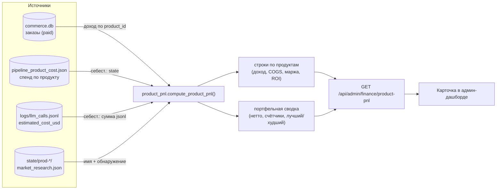
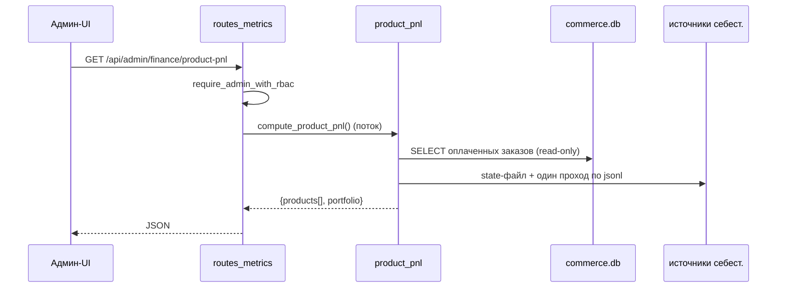

# P&L по продуктам — живая unit-экономика

Прибыль и убытки по каждому продукту автономной фабрики. Соединяет две половины,
которые фабрика и так пишет, — **доход** (оплаченные заказы) и **себестоимость
инференса** (LLM-затраты на продукт) — в живое read-only представление
unit-экономики: доход, себестоимость, валовая прибыль/маржа, ROI и окупаемость по
каждому продукту, плюс портфельная сводка.

> Честность важнее точности. Себестоимость — *оценка* (по ценам токенов), курс
> валют берётся из env. Это операционная видимость, а не бухгалтерия. Продукты до
> выручки и убыточные тоже показываются — «кладбище» и есть доверие.

- **Модуль:** [`product_pnl.py`](../product_pnl.py)
- **Эндпоинт:** `GET /api/admin/finance/product-pnl` (admin RBAC, read-only)
- **Тесты:** [`tests/test_product_pnl.py`](../tests/test_product_pnl.py)
- **Связано:** [factory-metrics-reference.md](./factory-metrics-reference.md), [admin-guide.md](./admin-guide.md)

## Поток данных



### Как обрабатывается запрос



## Источники данных

| Половина | Источник | Примечание |
|----------|----------|-----------|
| Доход | `data/store/commerce.db` → `orders` где `status='paid'` | В заказах уже есть `product_id`; открывается **read-only**. Суммы → приблизительные USD тем же FX-хелпером, что и [`finance_stats`](../finance_stats.py) (`AIFACTORY_ETH_USD`, `AIFACTORY_SOL_USD`). |
| Себестоимость инференса | `state/pipeline_product_cost.json` **и** `logs/llm_calls.jsonl` | Себест. = `max(state, сумма_jsonl)` по продукту — повторяет `pipeline_cost_guard.product_spend_usd(reconcile_jsonl=True)`, но за один проход по JSONL. |
| Метаданные | `state/prod-*/market_research.json` | Имя выводится из поля `idea` (первые 6 слов); фолбэк — `product_id`. |

**Вселенная продуктов** = объединение продуктов с доходом ∪ продуктов с
себестоимостью ∪ директорий `prod-*` в `state`. Поэтому свежесобранный продукт без
продаж всё равно показывается (`pre_revenue`), а продукт, сжёгший LLM-бюджет, но не
продавший ничего, виден в минусе.

Все пути выводятся из одного `data_root`, поэтому функция полностью
параметризуема (`compute_product_pnl(data_root=...)`) и без побочных эффектов.

## Поля по продукту

| Поле | Значение |
|------|----------|
| `product_id` | Идентификатор фабрики (`prod-…`). |
| `name` | Человеческое имя из идеи market research. |
| `status` | `profitable` (доход ≥ себест.), `recovering` (0 < доход < себест.), `pre_revenue` (нет дохода). |
| `revenue_usd` | Сумма оплаченных заказов (≈ USD). |
| `units_sold` | Число оплаченных заказов. |
| `paying_customers` | Уникальные `customer_id` среди оплаченных. |
| `arpu_usd` | `revenue_usd / paying_customers`. |
| `inference_cost_usd` | Накопленный LLM-спенд (COGS). |
| `gross_profit_usd` | `revenue_usd − inference_cost_usd`. |
| `gross_margin_pct` | `прибыль / доход × 100` (null без дохода). |
| `roi_pct` | `прибыль / себест. × 100` (null без себест.). |
| `cost_recovery_pct` | `доход / себест. × 100` — сколько стоимости разработки отбито. |
| `is_profitable` | `gross_profit_usd > 0`. |
| `first_sale_at` / `last_sale_at` | Unix-таймстемпы первого/последнего оплаченного заказа. |

## Портфельная сводка

`product_count`, `products_profitable`, `products_recovering`, `products_pre_revenue`,
`total_revenue_usd`, `total_inference_cost_usd`, `net_profit_usd`,
`blended_margin_pct`, `blended_roi_pct`, `cost_recovery_pct`, `best_product`,
`worst_product` (ранжирование по чистой прибыли).

## Формулы

```
gross_profit       = доход − себестоимость
gross_margin_pct   = gross_profit / доход × 100         # null если доход = 0
roi_pct            = gross_profit / себестоимость × 100  # null если себест. = 0
cost_recovery_pct  = доход / себестоимость × 100         # null если себест. = 0
arpu               = доход / paying_customers
```

## Пример ответа

```json
{
  "generated_at": 1780000000.0,
  "fx_note": "Inference cost & FX are estimates (ops visibility, not billing).",
  "products": [
    {
      "product_id": "prod-07ed6c837090",
      "name": "Smart document processing platform with",
      "status": "profitable",
      "revenue_usd": 297.0,
      "units_sold": 3,
      "paying_customers": 2,
      "arpu_usd": 148.5,
      "inference_cost_usd": 41.2,
      "gross_profit_usd": 255.8,
      "gross_margin_pct": 86.1,
      "roi_pct": 620.9,
      "cost_recovery_pct": 720.9,
      "is_profitable": true,
      "first_sale_at": 1779900000.0,
      "last_sale_at": 1779990000.0
    }
  ],
  "portfolio": {
    "product_count": 11,
    "products_profitable": 1,
    "products_recovering": 0,
    "products_pre_revenue": 10,
    "total_revenue_usd": 297.0,
    "total_inference_cost_usd": 48.2,
    "net_profit_usd": 248.8,
    "blended_margin_pct": 83.8,
    "blended_roi_pct": 516.2,
    "cost_recovery_pct": 616.2,
    "best_product": "prod-07ed6c837090",
    "worst_product": "prod-1"
  }
}
```

## Оговорки

- **Оценка, не бухгалтерия.** `inference_cost_usd` считается по ценам токенов
  ([`llm/pricing_estimate.py`](../llm/pricing_estimate.py)); крипто-FX берётся из
  env. Считать ориентиром.
- **Только инференс.** COGS сейчас учитывает LLM-спенд, без инфры (хостинг,
  домены). Если нужен полный COGS — добавить вторую статью затрат.
- **Атрибуция дохода** зависит от корректного `product_id` в заказах.

## Тестирование

```bash
python -m pytest tests/test_product_pnl.py -q
```

Покрывает джойн дохода, reconcile себестоимости (`max`), unit-экономику по
продукту, портфельную сводку и исключение pending/failed заказов.
