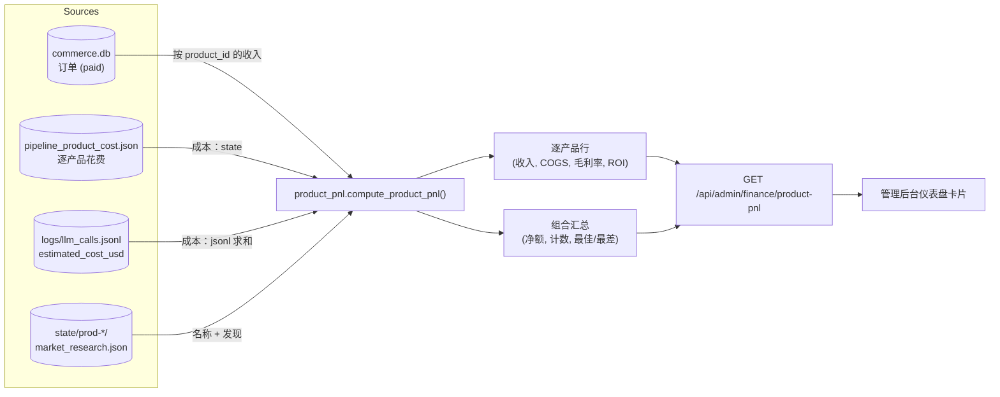
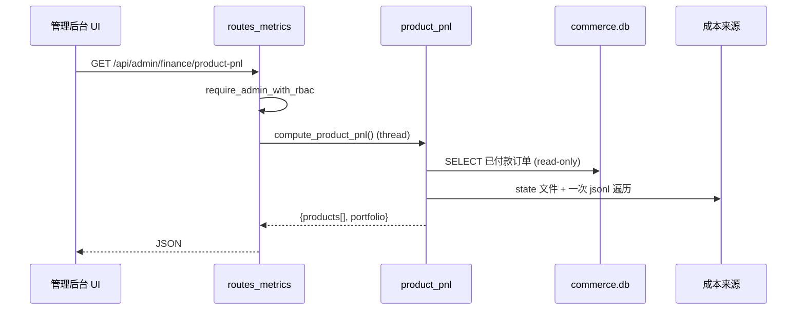

# Product P&L — 实时单位经济

> 🌐 语言： [English](./product-pnl.md) · [Русский](./product-pnl.ru.md) · [Français](./product-pnl.fr.md) · **中文**

自主工厂的逐产品盈亏（P&L）。它把工厂本就记录的两半 — **收入**（已付款订单）与
**推理 COGS**（每个产品的 LLM 花费）— 合并为一个实时、只读的单位经济视图：逐产品的
收入、成本、毛利/毛利率、ROI 和成本回收，外加一份组合汇总。

> 诚实优先于精确。成本是一个*估算值*（按 token 定价），FX 由 env 配置。这是运营层面的
> 可见性，而非计费级别的会计。尚未产生收入的产品和亏损产品也会一并呈现 — 「坟场」正是
> 可信度所在。

- **模块：** [`product_pnl.py`](../product_pnl.py)
- **Endpoint：** `GET /api/admin/finance/product-pnl`（admin RBAC，只读）
- **测试：** [`tests/test_product_pnl.py`](../tests/test_product_pnl.py)
- **另见：** [factory-metrics-reference.md](./factory-metrics-reference.md), [admin-guide.md](./admin-guide.md)

## 数据流



### 一次请求如何被处理



## 数据来源

| 一半 | 来源 | 备注 |
|------|------|------|
| 收入 | `data/store/commerce.db` → `orders` 中 `status='paid'` | 订单本就带有 `product_id`；以**只读**方式打开。金额用与 [`finance_stats`](../finance_stats.py) 相同的 FX 助手（`AIFACTORY_ETH_USD`、`AIFACTORY_SOL_USD`）换算为近似 USD。 |
| 推理 COGS | `state/pipeline_product_cost.json` **和** `logs/llm_calls.jsonl` | 成本 = 逐产品的 `max(persisted_state, jsonl_sum)` — 与 `pipeline_cost_guard.product_spend_usd(reconcile_jsonl=True)` 一致，但只做一次 JSONL 遍历。 |
| 元数据 | `state/prod-*/market_research.json` | 展示名称取自 `idea` 字段（前 6 个词）；回退为 `product_id`。 |

**产品全集** = 有收入的产品 ∪ 有已记录成本的产品 ∪ `prod-*` state 目录之并集。因此一个
刚构建、尚无销售的产品仍会出现（标为 `pre_revenue`），而一个烧掉了 LLM 预算却从未售出的
产品会以负值出现。

所有路径都从单一已解析的 data root 派生，因此该函数完全可参数化
（`compute_product_pnl(data_root=...)`）且无副作用。

## 逐产品字段

| 字段 | 含义 |
|------|------|
| `product_id` | 工厂 id（`prod-…`）。 |
| `name` | 从 market research 的 idea 派生的可读名称。 |
| `status` | `profitable`（收入 ≥ 成本）、`recovering`（0 < 收入 < 成本）、`pre_revenue`（无收入）。 |
| `revenue_usd` | 已付款订单之和（≈ USD）。 |
| `units_sold` | 已付款订单数。 |
| `paying_customers` | 已付款订单中不重复的 `customer_id`。 |
| `arpu_usd` | `revenue_usd / paying_customers`。 |
| `inference_cost_usd` | 累计 LLM 花费（COGS）。 |
| `gross_profit_usd` | `revenue_usd − inference_cost_usd`。 |
| `gross_margin_pct` | `gross_profit / revenue × 100`（无收入时为 null）。 |
| `roi_pct` | `gross_profit / cost × 100`（无成本时为 null）。 |
| `cost_recovery_pct` | `revenue / cost × 100` — 已偿还多少构建成本。 |
| `is_profitable` | `gross_profit_usd > 0`。 |
| `first_sale_at` / `last_sale_at` | 首次/最近一次已付款订单的 Unix 时间戳。 |

## 组合汇总

`product_count`、`products_profitable`、`products_recovering`、`products_pre_revenue`、
`total_revenue_usd`、`total_inference_cost_usd`、`net_profit_usd`、
`blended_margin_pct`、`blended_roi_pct`、`cost_recovery_pct`、`best_product`、
`worst_product`（按净利润排序）。

## 公式

```
gross_profit       = revenue − inference_cost
gross_margin_pct   = gross_profit / revenue × 100      # null if revenue = 0
roi_pct            = gross_profit / inference_cost × 100  # null if cost = 0
cost_recovery_pct  = revenue / inference_cost × 100     # null if cost = 0
arpu               = revenue / paying_customers
```

## 响应示例

```json
{
  "generated_at": 1780000000.0,
  "fx_note": "Inference cost & FX are estimates (ops visibility, not billing).",
  "products": [
    {
      "product_id": "prod-07ed6c837090",
      "name": "Smart document processing platform with",
      "status": "profitable",
      "revenue_usd": 297.0,
      "units_sold": 3,
      "paying_customers": 2,
      "arpu_usd": 148.5,
      "inference_cost_usd": 41.2,
      "gross_profit_usd": 255.8,
      "gross_margin_pct": 86.1,
      "roi_pct": 620.9,
      "cost_recovery_pct": 720.9,
      "is_profitable": true,
      "first_sale_at": 1779900000.0,
      "last_sale_at": 1779990000.0
    }
  ],
  "portfolio": {
    "product_count": 11,
    "products_profitable": 1,
    "products_recovering": 0,
    "products_pre_revenue": 10,
    "total_revenue_usd": 297.0,
    "total_inference_cost_usd": 48.2,
    "net_profit_usd": 248.8,
    "blended_margin_pct": 83.8,
    "blended_roi_pct": 516.2,
    "cost_recovery_pct": 616.2,
    "best_product": "prod-07ed6c837090",
    "worst_product": "prod-1"
  }
}
```

## 注意事项

- **是估算，不是计费。** `inference_cost_usd` 使用 token 定价
  （[`llm/pricing_estimate.py`](../llm/pricing_estimate.py)）；加密 FX 使用 env 汇率。
  仅作方向性参考。
- **仅推理。** COGS 目前只计入 LLM 花费，不含基础设施（托管、域名）。若需要完整
  COGS，请增加第二条成本行。
- **收入归因**取决于订单是否带有正确的 `product_id`。

## 测试

```bash
python -m pytest tests/test_product_pnl.py -q
```

覆盖收入 join、成本 reconcile（`max`）、逐产品单位经济、组合汇总，以及对
pending/failed 订单的排除。
