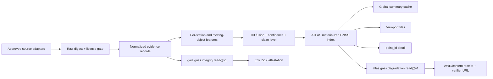

# ATLAS x GAIA GNSS/PNT Integrity and Signal-Degradation Capability

**Status:** launch slice implemented; credentialed/context phases remain gated  
**Date:** 2026-08-13  
**Owners:** GAIA data plane, ATLAS map/products, Hub discovery/settlement  
**Source policy:** only sources with verified free commercial use are allowed here. Anything else is in [GNSS/PNT source quarantine](./05a-gnss-pnt-source-quarantine.md).

### Implementation record — 2026-08-13

The first production-safe vertical slice is present in this repository:

- strict positive source registry and endpoint-host gate in `gaia/gaia/source_policy.py`;
- EUREF EPN station inventory/delivery-health adapter with official EPN Open Data
  Portal fallback, persistent last-good cache, stable station IDs, attribution and
  Ed25519 attestation;
- Geoscience Australia public station inventory adapter with persistent last-good
  cache and deliberately `unknown` integrity state (metadata presence is not an RF
  measurement);
- `gaia.gnss.integrity.read@v1` for a whole source inventory or one exact EUREF/GA
  station;
- ATLAS `GNSS integrity` map layer, real clickable station counts, exact point
  handoff, source/license detail and calm score-driven field rendering; H3-r4
  cells (explicit coarse fallback when H3 is unavailable) are materialized as
  clickable polygons with their own `gnss-cell:*` point IDs and station ledger;
- `atlas.gnss.degradation.read@v1` for point, antimeridian-safe bbox and route
  queries, with signed receipt, coverage, confidence and a contribution ledger;
- CyberNews reported interference remains separate from station-derived
  degradation. A nearby report is never substituted for a station measurement.

Not activated in this launch slice: account/credential-gated MIRAI and EarthScope
streams, SouthPAN, CYGNSS, ADSB.lol, Fintraffic AIS and Kystverket AIS. Their policy
entries reserve reviewed semantics; there are no dormant network calls or runtime
fallbacks to them. They remain later phases until credentials, source-specific
parsers, quota controls and their additional license obligations are configured and
tested. Quarantine sources remain entirely outside runtime code.

## 1. Outcome

Build a commercially usable, source-attributed GNSS/PNT integrity product that answers two practical questions:

1. **Human in ATLAS:** “Where is satellite navigation degraded, what real objects support that assessment, and what can I click?”
2. **Agent through GAIA/ATLAS:** “What is the current GNSS/PNT state at this exact station, point, cell, bounding box, or route, and what evidence produced it?”

The shipped product must provide:

- a world map of actual GNSS reference stations, observed degradation cells, aircraft/vessel corroboration, and curated interference events;
- a stable `point_id` for every clickable station, cell, event, aircraft, or vessel observation exposed by ATLAS;
- a source-anchored GAIA read for every addressable GNSS station supported by its upstream source;
- a fused ATLAS decision artifact with source-level evidence, confidence, freshness, licensing, and an attributable receipt;
- no mock LIVE values, no decorative station counts, and no inference presented as confirmed jamming or spoofing.

This product may be sold per call. The customer pays for normalization, computation, fusion, provenance, delivery, and the receipt—not for an exclusive right to the underlying open data.

## 2. Product boundary and terminology

### 2.1 Existing and new capabilities

| Capability | Role | Decision |
|---|---|---|
| `gaia.jamming.read@v1` | Relay ACTIVE/MONITORING records from the CyberNews GNSS registry | Keep. Semantics remain “source-attributed curated incident,” not raw RF sensing. |
| `gaia.gnss.integrity.read@v1` | Read one source-addressable GNSS/PNT observation or a short observation window | Add. Source/station anchored; no arbitrary client URL. |
| `atlas.gnss.degradation.read@v1` | Query the fused degradation surface by point, bbox, or route | Add. This is the new paid decision artifact. |
| `atlas.point.read@v1` | Read the exact object clicked in ATLAS | Extend to every new GNSS station, cell, event, aircraft, and vessel object. |
| `atlas.nearest.read@v1` | Find nearest LIVE ATLAS evidence by coordinate | Extend allowlist with `gnss-integrity` and `jamming`. |

### 2.2 State and claim vocabulary

`state` describes practical severity. Its allowed values are:

| State | Allowed meaning |
|---|---|
| `normal` | Fresh evidence exists and the implemented metrics are within their learned/reference bounds. |
| `mild_degradation` | A weak anomaly exists, but evidence or magnitude is insufficient for `degraded`. |
| `degraded` | One or more measured or inferred integrity metrics are materially anomalous. Cause is not established. |
| `severe_degradation` | Strong degradation score with enough support; still not automatically “jamming.” |
| `unknown` | No sufficiently fresh evidence. `unknown` must never be rendered as green/normal. |

`claim_level` describes what the evidence can support. Its allowed values are:

| Claim level | Allowed meaning |
|---|---|
| `observed_metric` | A source supplied a measurement; AIMarket has not inferred the cause. |
| `derived_degradation` | AIMarket derived degradation from approved observations and a versioned algorithm. |
| `historical_proxy` | Delayed or indirect evidence is context only and cannot make a cell LIVE by itself. |
| `rfi_observed` | A direct RF/spectrum source observed radio-frequency interference. None of the launch sources may emit this claim unless the upstream measurement actually contains it. |
| `jamming_reported` | An approved upstream source explicitly reports jamming. |
| `spoofing_suspected` | Multiple signals are consistent with spoofing, but the product does not claim confirmation. |
| `spoofing_reported` | An approved upstream record explicitly reports spoofing. |

ATLAS copy must use **“GNSS signal degradation”** or **“PNT integrity anomaly”** for derived cells. “Jamming” and “spoofing” are reserved for upstream-reported events or future direct RF evidence.

### 2.3 Non-goals

- No safety-of-life, navigation, flight-dispatch, maritime-routing, military, or emergency-response guarantee.
- No claim that an Ed25519 signature proves physical truth. It proves who signed the returned computation/envelope.
- No silent mixing of licenses or removal of source attribution.
- No new verifier. Use the existing receipt/verifier rails.
- No fallback to a source in the quarantine document.

## 3. Approved commercial-use source allowlist

Only these external data sources may contribute to the production capability at launch. Each adapter must be pinned to one source identity; provider fallback is forbidden.

For this specification, **free commercial use** means that the exact enabled dataset/stream can be used in a paid AIMarket-derived product without a source fee, trial period, partner negotiation, or paid seat. Free self-service registration, required attribution, share-alike obligations, and source-specific access limits are acceptable and must be implemented. Approval is dataset- and endpoint-specific, never a blanket approval of every product offered by the same organization.

The evidence below was rechecked on 2026-08-13. Terms must be revalidated before first production enablement and at least quarterly afterward; a material change disables the adapter until reviewed.

| ID | Source and official access | Evidence contribution | Commercial-use basis | Required handling |
|---|---|---|---|---|
| `cybernews_gnss` | [CyberNews GNSS API](https://www.cybernews.space/api/data/gnss) | Curated ACTIVE/MONITORING interference, jamming, and spoofing records | Feed metadata declares CC BY 4.0 | Use only fields licensed/authored by the feed; do not mirror third-party attachments. Preserve record URL, source list, upstream claim type, confidence, license, and `cybernews.space` attribution. Fail closed if the license metadata disappears or changes. Already integrated. |
| `mirai_gnss` | [MIRAI real-time NTRIP](https://go.gnss.go.jp/mirai/realtime/) and [archive](https://go.gnss.go.jp/mirai/miraiarchive/) | Global reference-station observations: RTCM 3.x MSM7, ephemeris, receiver/antenna metadata | [MIRAI terms](https://go.gnss.go.jp/terms/disclaimer.html) explicitly include commercial users; access is free and attribution is required | Free account/NTRIP authorization is an access credential, not a partnership. Use is limited to peaceful purposes. Attribute MIRAI and contributing organizations. Respect caster connection limits discovered during the spike. |
| `euref_epn` | [EUREF Permanent GNSS Network](https://epncb.oma.be/_documentation/faq.php) and [real-time streams](https://www.epncb.oma.be/_productsservices/realtimecorrections/) | European reference-station RINEX/real-time observations and products | EPN data/products are CC BY 4.0, free of charge, including commercial use | Attribute EPN and station/data provider; cite the resource DOI when available; mark transformations. Free broadcaster registration is allowed. |
| `ga_gnss` | [Geoscience Australia GNSS archive and streams](https://www.ga.gov.au/scientific-topics/positioning-navigation/positioning-australia/geodesy/gnss-networks/data-and-site-logs) and [data API](https://data.gnss.ga.gov.au/docs/home/gnss-data.html) | Public ARGN/SPRGN/AuScope RINEX archives; public ARGN/SPRGN RTCM streams | CC BY 3.0 Australia | Attribute Geoscience Australia. Ingest only records the API marks public. Real-time is limited to freely subscribed ARGN/SPRGN streams; exclude AuScope real-time streams that require case-by-case negotiation. |
| `earthscope_unlimited` | [EarthScope real-time GNSS](https://www.earthscope.org/data/gnss-realtime/) `UNLIMITED` mountpoints, notably legacy BINEX on port 2105 | North American reference-station observations where the current caster marks the stream unrestricted by seat | EarthScope offers a free zero-seat commercial license; the [commercial license](https://www.earthscope.org/user/CommercialLicenseAgreement.pdf) places accessed data/streams under CC BY 4.0 | Self-service account/license acceptance and annual renewal are allowed; no partnership request. Connect only to sourcetable rows explicitly marked `UNLIMITED`; reject `SEAT_REQUIRED`. Attribute EarthScope in all used/sold derivatives. |
| `southpan` | [SouthPAN Data Access Services SDD](https://www.ga.gov.au/scientific-topics/positioning-navigation/positioning-australia/about-the-program/southpan/SBAS-STN-0002_01_SouthPAN-SDD-for-DAS.pdf) | GPS/Galileo augmentation and integrity context for Australia/New Zealand | Services are free of charge; SouthPAN data are CC BY 4.0 | Use current L1/DFMC/PVS DAS only. Do not assume the old “future” OS-GOBS service exists. Register normally and attribute GA/LINZ/SouthPAN. |
| `nasa_cygnss` | [NASA PO.DAAC CYGNSS L1 v3.2](https://podaac.jpl.nasa.gov/dataset/CYGNSS_L1_V3.2) | Delayed satellite-observed L-band RFI proxy using geolocated DDM noise/SNR/quality variables | NASA-led Earth science data are CC0 unless a restriction is explicitly marked; [NASA Earthdata use policy](https://www.earthdata.nasa.gov/engage/open-data-services-software/data-use-policy) | Not LIVE: dataset latency is about six days. Emit `evidence_class=satellite_rfi_proxy_historical` and `claim_level=historical_proxy`; cite dataset/DOI and NASA; no endorsement claim. Fail closed if the dataset becomes marked restricted. |
| `adsb_lol` | [ADSB.lol open API](https://www.adsb.lol/docs/open-data/api/) | Aircraft-derived navigation-quality proxy and spatial corroboration | API is ODbL 1.0 and available to everyone; [ODbL](https://opendatacommons.org/licenses/odbl/1-0/) explicitly permits commercial use | Pin only `api.adsb.lol`; never fall through to other providers. Preserve ODbL notice. Isolate the ADSB-derived database and publish the required derivative database or alteration method when publicly used. |
| `fintraffic_ais` | [Fintraffic Digitraffic marine API](https://www.digitraffic.fi/en/marine-traffic/) | Baltic AIS navigation proxy and track-consistency corroboration | [Fintraffic terms](https://www.digitraffic.fi/en/terms-of-service/) are CC BY 4.0 and explicitly permit commercial use | Use required `Digitraffic-User` header. Display: “Source: Fintraffic / digitraffic.fi, license CC 4.0 BY.” Preserve documented omissions/modifications. |
| `kystverket_ais` | [Norwegian Coastal Administration AIS access](https://www.kystverket.no/en/sea-transport-and-ports/ais/access-to-ais-data/) via BarentsWatch | Norwegian/Svalbard/Jan Mayen AIS navigation proxy | Data are free and universally accessible under [NLOD 2.0](https://data.norge.no/nlod/en/2.0), which allows any purpose | Free BarentsWatch API-client registration is allowed. Attribute Kystverket/BarentsWatch and NLOD; preserve coverage/exclusion notes. |
| `noaa_swpc` | Existing GAIA `gaia.spacewx.read@v1` source | Ionospheric/space-weather context used to avoid over-attributing degradation to terrestrial interference | NOAA internal source data are intended for CC0/public-domain release; see [NOAA data licensing guidance](https://nosc.noaa.gov/EDMC/documents/NAO_212-15B-Data_Mgt_Handbook-2024-Oct-1_remediated.pdf) | Context only. Attribute NOAA/SWPC, do not imply endorsement, and do not convert high Kp/auroral activity into a jamming claim. |

### 3.1 Source policy gate

Create one machine-readable registry, for example `gaia/gaia/source_policy.py`:

```python
APPROVED_SOURCES = {
    "mirai_gnss": {
        "commercial_use": "allowed",
        "license_spdx": "LicenseRef-MIRAI-Terms",
        "attribution_required": True,
        "raw_payload_delivery": "disabled",
        "derived_product_use": "allowed_with_attribution",
    },
    "adsb_lol": {
        "commercial_use": "allowed",
        "license_spdx": "ODbL-1.0",
        "attribution_required": True,
        "derivative_database_policy": "share_alike",
    },
}
```

An adapter must not start unless:

- its ID exists in the approved registry;
- `commercial_use == "allowed"`;
- its current endpoint host is allowlisted;
- required attribution and license URL are present;
- a changed upstream license has passed a deliberate registry update.

There is no automatic provider fallback. If `adsb_lol` fails, the ADS-B contribution becomes stale/unknown; it must not silently switch to any provider outside the approved registry.

## 4. User-visible ATLAS model

### 4.1 Layer composition

Add a top-level **GNSS integrity** layer with four independently toggleable sublayers:

1. **Degradation surface** — H3 cells computed by ATLAS.
2. **Reference stations** — every discovered approved MIRAI/EPN/GA/EarthScope station, including `fresh`, `stale`, or `no recent observation` state.
3. **Reported interference** — current CyberNews ACTIVE/MONITORING events.
4. **Corroboration** — anomalous aircraft/vessel observations and delayed CYGNSS samples; hidden by default at low zoom to avoid noise.

Keep the existing **GNSS jamming** compatibility layer as an alias/view of “Reported interference,” not as the entire integrity product.

### 4.2 Counts must represent practical map objects

Never render `1` because one upstream API exists. The sidebar must expose separate counters:

```json
{
  "stations_total": 812,
  "stations_reporting_now": 641,
  "degraded_cells": 38,
  "severe_cells": 7,
  "reported_interference_zones": 22,
  "aircraft_supporting_observations": 114,
  "vessel_supporting_observations": 29,
  "historical_satellite_samples": 205,
  "unknown_coverage_cells": 1840
}
```

The numbers above are schema examples, not seed data. Production values must come from the materialized live index.

### 4.3 Click behavior

Every map object must open a detail panel containing:

- plain-language state and claim level;
- score, confidence, freshness, observation window, and coverage status;
- measured metrics and missing-metric disclosure;
- source name, source URL, license, exact attribution, and modification notice;
- why the state was assigned, with per-evidence contribution;
- `Inspect + run`, `Open receipt`, `Verify`, and `Copy point_id` actions;
- safety disclaimer: “This indicates observed or inferred GNSS/PNT degradation; it is not a safety-of-life navigation advisory.”

Animations must be calm and informative:

- one short arrival ripple for newly degraded/severe objects;
- a slow, low-opacity breathing halo only on current severe cells/events;
- no synchronized blinking, full-row pulsing, or continuous border flashing;
- honor `prefers-reduced-motion` by removing nonessential movement.

### 4.4 Lazy loading without an empty globe

- Ship station inventory and coarse global H3 state from a cached summary immediately.
- Load detailed stations, cells, aircraft, vessels, and event observations for the viewport.
- Cluster station/observation points at low zoom; render individual clickable points at useful zoom.
- Preserve last-good viewport tiles as `stale` during upstream failures.
- Global counters come from the server index, not from objects currently loaded by the browser.
- The browser may evict off-screen geometry, but the server must keep point IDs addressable for the evidence window.

## 5. Identity and addressability

Use stable, namespaced IDs:

```text
gnss-station:mirai:<rinex9>
gnss-station:euref:<rinex9>
gnss-station:ga:<site_id>
gnss-station:earthscope:<station_id>
gnss-service:southpan:<service_id>
gnss-cell:<h3_index>
gnss-event:cybernews:<event_id>
gnss-aircraft:adsb_lol:<icao24>
gnss-vessel:fintraffic:<mmsi>
gnss-vessel:kystverket:<mmsi>
gnss-satellite:cygnss:<spacecraft>:<sample_time>:<sample_index>
```

Rules:

- `point_id` identifies the logical map object/location.
- `snapshot_id` identifies a time-bounded observation and is content-addressed.
- A fused H3 cell keeps the same `point_id`; its receipt and `snapshot_id` change when evidence changes.
- Source station identifiers are never normalized so aggressively that different networks collide.
- The same physical station in multiple networks may be linked with `same_as[]`, but its source records stay separate.

Every point shown in ATLAS must be callable through `atlas.point.read@v1`. Source-addressable stations must additionally expose a `parent_capability` handoff to `gaia.gnss.integrity.read@v1`.

## 6. GAIA capability contract

### 6.1 Capability declaration

```text
capability_id: gaia.gnss.integrity.read@v1
product_id:   gaia.gateway
price:        $0.002 per call (launch proposal)
semantics:    one source-anchored observation or short observation window
```

### 6.2 Input

```json
{
  "device_id": "gnss-station:euref:BRUX00BEL",
  "window_s": 300,
  "fresh": false,
  "include_satellites": false
}
```

Requirements:

- `device_id` is required and must resolve through GAIA’s operator-controlled source registry.
- `window_s`: default `300`, min `30`, max `3600`.
- `fresh`: bypasses the normal cache only under the existing cache-bypass rate budget.
- `include_satellites`: opt-in compact per-constellation/per-band summary; never dump an unbounded RTCM/RINEX payload.
- Buyers cannot pass arbitrary URLs, caster hosts, mountpoints, or credentials.

### 6.3 Output

```json
{
  "reading": {
    "device_id": "gnss-station:euref:BRUX00BEL",
    "seq": 18421,
    "ts": "2026-08-13T10:15:00Z",
    "location": {"lat": 50.798, "lon": 4.359},
    "window": {"start": "2026-08-13T10:10:00Z", "end": "2026-08-13T10:15:00Z"},
    "claim_level": "derived_degradation",
    "state": "degraded",
    "degradation_score": 67.4,
    "confidence": 0.81,
    "metrics": {
      "availability_pct": 98.4,
      "satellites_tracked": 26,
      "constellations": ["GPS", "GAL", "GLO"],
      "cn0_median_db_hz": 36.8,
      "cn0_drop_db": 5.1,
      "cycle_slips_per_min": 2.4,
      "position_residual_m": 4.2,
      "clock_residual_ns": 18.0
    },
    "metric_availability": {
      "cn0": true,
      "cycle_slips": true,
      "position_residual": true,
      "spectrum": false
    },
    "explanation": [
      {"signal": "cn0_drop", "contribution": 0.32},
      {"signal": "neighbor_concurrence", "contribution": 0.21}
    ],
    "source": {
      "id": "euref_epn",
      "station_id": "BRUX00BEL",
      "url": "https://epncb.oma.be/",
      "license_spdx": "CC-BY-4.0",
      "attribution": "EUREF Permanent GNSS Network and station data provider",
      "modified": true
    },
    "algorithm": {"id": "aimarket-gnss-station-score", "version": "1.0.0"}
  },
  "attestation": {
    "alg": "ed25519",
    "signature": "...",
    "public_key": "..."
  }
}
```

The example contains illustrative values only. Tests must reject hard-coded production readings.

### 6.4 GAIA fleet semantics

- Discover all approved source stations as virtual, source-addressable devices.
- Inventory objects remain visible when the live observation is unavailable, but their mode is `unknown/offline`, not LIVE.
- `fleet.status` reports both `devices_total` and `devices_reporting_now`.
- A station becomes LIVE only after a successful, fresh upstream read with source/provenance metadata.

## 7. ATLAS capability contract

### 7.1 Capability declaration

```text
capability_id: atlas.gnss.degradation.read@v1
product_id:   atlas.products
price:        $0.04 per call (launch proposal)
semantics:    fused, cited GNSS/PNT integrity artifact for a point, bbox, or route
```

### 7.2 Input modes

Exactly one selector is required:

```json
{"point_id":"gnss-cell:85283473fffffff","max_age_s":900,"include_evidence":true}
```

```json
{"lat":59.91,"lon":10.75,"radius_km":100,"max_age_s":900,"include_evidence":true}
```

```json
{"west":20,"south":52,"east":32,"north":61,"max_cells":500,"max_age_s":1800}
```

```json
{
  "route":[[24.94,60.17],[18.07,59.33],[10.75,59.91]],
  "corridor_km":50,
  "max_age_s":900
}
```

Validation:

- latitude `[-90, 90]`, longitude normalized to `[-180, 180]`;
- antimeridian bboxes supported;
- route max 500 vertices and 10,000 km after simplification;
- `max_cells` default 200, hard max 2,000;
- `max_age_s` is a refusal/coverage boundary, not permission to relabel stale data as live.

### 7.3 Output envelope

```json
{
  "ok": true,
  "capability_id": "atlas.gnss.degradation.read@v1",
  "generated_at": "2026-08-13T10:16:00Z",
  "query": {"lat":59.91,"lon":10.75,"radius_km":100},
  "summary": {
    "state": "degraded",
    "score": 61.2,
    "confidence": 0.78,
    "coverage": "partial",
    "claim_level": "derived_degradation"
  },
  "cells": [],
  "evidence": [],
  "source_attributions": [],
  "limitations": [
    "Derived degradation is not proof of jamming or spoofing.",
    "Not for safety-of-life navigation."
  ],
  "receipt": {},
  "receipt_url": "https://...",
  "verifier_url": "https://verify.modelmarket.dev/?receipt_url=..."
}
```

If no fresh evidence exists, return `ok: false`, `state: unknown`, explicit coverage, and `refuse_reason`. Do not return a fake zero score.

## 8. Normalized evidence model

All adapters emit the same internal record:

```json
{
  "evidence_id": "source-specific immutable id",
  "point_id": "stable ATLAS object id",
  "source_id": "euref_epn",
  "evidence_class": "ground_gnss_station",
  "claim_level": "observed_metric",
  "observed_at": "ISO-8601",
  "received_at": "ISO-8601",
  "expires_at": "ISO-8601",
  "geometry": {"type":"Point","coordinates":[4.359,50.798]},
  "measurements": {},
  "quality": {"completeness":0.94,"latency_s":2.1},
  "source": {
    "url":"...",
    "license_spdx":"CC-BY-4.0",
    "license_url":"...",
    "attribution":"...",
    "modified":true
  },
  "raw_digest":"sha256:...",
  "parser_version":"..."
}
```

Allowed `evidence_class` values for v1:

- `ground_gnss_station`
- `sbas_integrity_context`
- `space_weather_context`
- `aircraft_navigation_proxy`
- `vessel_navigation_proxy`
- `curated_interference_event`
- `satellite_rfi_proxy_historical`

## 9. Degradation computation

### 9.1 Ground-station features

Calculate only features supported by the available upstream messages:

- observation availability/gap rate;
- tracked satellites per constellation and band;
- median and lower-percentile C/N0, plus change from station baseline;
- loss-of-lock/cycle-slip rate;
- pseudorange/carrier/Doppler residuals after common clock/model correction;
- position and clock residual against the surveyed station reference;
- constellation/band asymmetry;
- neighbor concurrence within a configurable radius;
- source latency and missing-message rate.

Do not output an absent metric as zero. Use `metric_availability` and exclude it from the weight denominator.

### 9.2 Baselines

- Maintain per-station, per-constellation, per-band, local-time baselines.
- Bootstrap with seven days when available; target 30 rolling days.
- Use robust median/MAD statistics, not global mean/standard deviation alone.
- During bootstrap, lower confidence and compare against nearby stations/source-network norms.
- Version every baseline and algorithm; store their digests in the receipt.

### 9.3 Station score

For each available normalized feature `x_j` in `[0,1]`:

```text
station_score = 100 * sum(w_j * x_j) / sum(w_j for available j)
```

Recommended launch weights before calibration:

| Feature | Weight |
|---|---:|
| C/N0 loss | 0.25 |
| satellite-count loss | 0.15 |
| cycle-slip/loss-of-lock anomaly | 0.20 |
| position/clock residual | 0.20 |
| constellation/band divergence | 0.10 |
| neighbor concurrence | 0.10 |

Thresholds are provisional and must be calibrated against replay fixtures:

- `0–24`: normal
- `25–49`: `mild_degradation`
- `50–74`: degraded
- `75–100`: severe degradation

A high station score is still `derived_degradation`, never automatically `jamming_reported`.

### 9.4 Aircraft and vessel proxies

Aircraft-derived features may include position freshness, NIC/NACp/NACv/RC/SIL where present, repeated position loss, geometric-vs-barometric altitude divergence, and coherent multi-aircraft anomalies in one area. AIS features may include position age, impossible jumps, frozen positions with changing motion, track discontinuity, and multi-vessel concurrence.

Guardrails:

- single aircraft/vessel anomalies do not create a public degradation cell;
- require a minimum denominator and affected-object count;
- de-duplicate repeated hub overlap by ICAO24/MMSI and observation time;
- do not infer spoofing solely from altitude divergence, poor NIC/NACp, or an impossible jump;
- provider coverage gaps must not become signal-degradation areas.

### 9.5 Cell fusion

Primary map resolution is H3 resolution 5 (roughly regional/city-scale cells). Aggregate to resolution 4 at world zoom and optionally refine to resolution 6 where evidence density supports it.

For evidence contribution `i`:

```text
q_i = anomaly_i * source_reliability_i * freshness_i * spatial_fit_i
freshness_i = exp(-age_seconds / source_half_life_seconds)
cell_score = 100 * (1 - product(1 - q_i))
```

Controls:

- cap correlated observations from one source/class so thousands of aircraft cannot overpower independent ground evidence;
- confidence increases with freshness, sample count, coverage, and independent evidence-class diversity;
- direct ground GNSS evidence outranks moving-object proxies;
- CyberNews records set an upstream-reported event overlay and may influence risk context, but do not fabricate local RF measurements;
- CYGNSS is historical corroboration only and never makes a cell LIVE;
- SWPC/SouthPAN context can explain or reduce causal confidence, not erase an observed degradation metric.

Each returned cell must include a contribution ledger so the score is reproducible.

## 10. Processing architecture



### 10.1 Sampling strategy

Showing every station does not require keeping an unrestricted 1 Hz stream open to every mountpoint.

- Cache complete station inventories for 24 hours and refresh with conditional requests where supported.
- Maintain a bounded pool of NTRIP workers per source.
- Rotate short observation windows across the global inventory so every station receives a recent state within the source quota.
- Prioritize active viewport stations, degraded neighbors, subscribed watchboxes, and explicit agent requests.
- Keep an on-demand single-flight read for a clicked/called station.
- Mark inventory-only stations as `unknown`, never `normal` or LIVE.
- Record and expose actual source sampling coverage.

Connection/concurrency limits discovered during source spikes become configuration, not hard-coded assumptions.

## 11. Cache, retry, and failure behavior

### 11.1 Required caches

| Cache | Suggested TTL | Stale-if-error | Purpose |
|---|---:|---:|---|
| Station inventory | 24 h | 7 d | Keep all clickable source stations visible. |
| Station observation window | 30–300 s | 30 min | Reuse data across viewport/click/agent calls. |
| ADS-B/AIS regional snapshot | 30–180 s | 10 min | Avoid provider hammering. |
| CyberNews events | 30 min | 24 h | Preserve last known incidents with explicit stale label. |
| SWPC/SouthPAN context | source-specific, 1–5 min | 30 min | Causal context. |
| CYGNSS products | 24 h | 30 d | Historical layer. |
| H3 degradation tile | 30–60 s | 15 min | Fast world/viewport rendering. |
| Point registry | >= 24 h | n/a | Keep shared/clicked evidence addressable longer than a browser session. |

Reuse the existing ATLAS single-flight reading cache and viewport orchestration. Add a GNSS materialized index rather than inserting thousands of dynamic stations into the static `STATION_CATALOG`.

### 11.2 Retries

- Retry timeouts, transport failures, HTTP `429`, `502`, `503`, and `504`.
- Honor `Retry-After`; otherwise use exponential backoff with jitter.
- Default REST attempts: initial + 2 retries; maximum retry wall clock 45 seconds for background jobs and 15 seconds for interactive requests.
- NTRIP reconnect: exponential backoff capped at 60 seconds, then circuit-break per mountpoint.
- Never retry `400`, `401`, `403`, or schema-invalid responses without a configuration change.
- Serve last-good data as `stale` while retrying in the background; never replace it with a fabricated empty/zero state.

### 11.3 No blank map

ATLAS must render, in this order:

1. cached station inventory;
2. cached coarse degradation tiles;
3. fresh viewport results as they arrive;
4. explicit source/coverage status.

An upstream outage changes freshness/coverage styling; it does not erase legitimate cached objects.

## 12. Provenance, licensing, and receipts

Every response must carry:

- upstream source ID and canonical URL;
- license identifier and URL;
- exact attribution text;
- upstream observation time and AIMarket receipt time;
- whether and how the data were modified;
- raw payload digest, parser version, baseline version, and fusion version;
- evidence class and claim level;
- Ed25519 attribution for the GAIA/ATLAS envelope;
- `receipt_url` and `verifier_url` where Hub provenance is available.

The verifier copy must say **“Verify who signed this computation/invoke”**, not “verify that the GNSS condition is physically true.”

### 12.1 ODbL isolation

For ADSB.lol:

- store source records in a logically separate `adsb_lol_odbl` database/table namespace;
- keep its notice and source timestamp on derived observations;
- publish an ODbL-compliant machine-readable derivative database or the alteration algorithm/file when required by public use;
- keep AIMarket proprietary scoring/business data in a collective database boundary rather than silently relicensing ADSB.lol data;
- have release automation verify that the attribution and download/method link are present.

## 13. Security and abuse controls

- Keep NTRIP, BarentsWatch, and SouthPAN credentials server-side only.
- Never accept a buyer-supplied endpoint URL, NTRIP caster, or mountpoint.
- Allowlist schemes, hosts, ports, and redirect targets to prevent SSRF.
- Validate decompressed size, record count, coordinate bounds, timestamps, and JSON/CSV/RTCM framing.
- Bound route, bbox, window, satellite-detail, and result sizes.
- Apply per-visitor and per-channel budgets to fresh/cache-bypass reads.
- Hash or omit unnecessary aircraft/vessel identifiers in public long-term history if the source terms or privacy review require it; retain the minimum needed for de-duplication and evidence.
- Never expose source API credentials or raw authorization headers in receipts/logs.

## 14. Repository work breakdown

### 14.1 GAIA

1. Add `gaia/gaia/source_policy.py` with the production allowlist and attribution templates.
2. Add GNSS source adapters under `gaia/gaia/devices/gnss/`:
   - `mirai.py`
   - `euref.py`
   - `geoscience_australia.py`
   - `earthscope_unlimited.py`
   - `southpan.py`
   - `cygnss.py`
3. Add provider-pinned contextual adapters:
   - `adsb_lol.py`
   - reuse/port Fintraffic and BarentsWatch adapters without fallback.
4. Add RTCM/RINEX parsers and station feature extraction behind a common adapter interface.
5. Register virtual GNSS station devices without expanding them into static source code constants.
6. Declare `gaia.gnss.integrity.read@v1` in `gaia/gaia/capabilities.py` and manifest/MCP surfaces.
7. Preserve `gaia.jamming.read@v1` semantics and current CyberNews attribution.
8. Add fixtures and tests under `gaia/tests/`.

### 14.2 ATLAS

1. Add `atlas/atlas/gnss_index.py` for normalized evidence, station inventory, H3 cells, contribution ledger, and counts.
2. Extend `atlas/atlas/aggregator.py` with GNSS lazy viewport loading and last-good caches.
3. Extend `atlas/atlas/map_objects.py`, `layer_counts.py`, and detail formatters for the new IDs/classes.
4. Add `atlas.gnss.degradation.read@v1` to `atlas/atlas/products.py` and the Hub-compatible invoke path.
5. Extend `atlas.point.read@v1` and `atlas.nearest.read@v1` to the new layers.
6. Update both frontend asset copies through the repository’s normal source/build path; do not hand-edit only one generated copy.
7. Add GNSS layer controls, calm status animation, details, attributions, receipt actions, and reduced-motion behavior.
8. Add tests under `atlas/tests/` for global counts, viewport paging, point addressability, antimeridian queries, and product receipts.

### 14.3 Hub/discovery

1. Advertise both new capabilities in the signed manifest and MCP gateway.
2. Register launch pricing and provenance policy.
3. Ensure successful invokes emit `receipt_id`, `receipt_url`, and `verifier_url` through the existing provenance plugin.
4. Include source attribution arrays in the AWR claims without asserting physical truth.

## 15. Test plan

### 15.1 License/source tests

- production adapters cannot import or call a quarantine source;
- every emitted record has source ID, URL, license, attribution, and modification flag;
- endpoint host mismatch fails closed;
- ADSB.lol failure never invokes another ADS-B provider;
- ODbL notice/derivative-method link is present in public output;
- source license-registry snapshot is covered by a change-review test.

### 15.2 Data honesty tests

- `unknown` is never serialized/rendered as score `0` or `normal`;
- missing metrics are absent/declared missing, not zero-filled;
- an aircraft-only anomaly cannot become `jamming_reported`;
- CYGNSS cannot make a cell LIVE;
- SWPC context cannot create a terrestrial-jamming claim;
- resolved/historical CyberNews records are excluded from the current event count;
- no fixture/sample value is reachable from a LIVE production branch.

### 15.3 Map and addressing tests

- every returned viewport object has a valid stable `point_id`;
- every visible `point_id` resolves through `atlas.point.read@v1` during the evidence window;
- every station point exposes a valid parent GAIA handoff;
- global counts are independent of browser viewport and clustering;
- station inventory remains visible during source failure as stale/unknown;
- bbox and route queries work across the antimeridian;
- low zoom aggregates and high zoom points represent the same underlying index.

### 15.4 Reliability/performance tests

- warm global summary P95 <= 200 ms;
- warm viewport P95 <= 1.5 s;
- warm point read P95 <= 800 ms;
- cold source reads respect the declared timeout and do not block the whole snapshot;
- `429/502/503/504` retry behavior honors `Retry-After` and jitter;
- one upstream outage does not erase other sources or the last-good tile;
- concurrent clicks share a single source read;
- mobile rendering has no horizontal page overflow at 360 px CSS width.

## 16. Acceptance criteria

The work is complete only when all statements below are true:

1. ATLAS opens with a non-empty cached world view and shows real station/object counts, not source counts.
2. The user can zoom to every approved reference station and click it.
3. The clicked station can be invoked by an agent through `gaia.gnss.integrity.read@v1`.
4. Every degradation cell, station, and reported event is callable through `atlas.point.read@v1`.
5. `atlas.gnss.degradation.read@v1` answers point, bbox, and route queries with coverage, confidence, evidence, attribution, and receipt.
6. Derived cells say “degradation,” not “jamming,” unless an upstream approved record explicitly reports jamming.
7. Only sources in Section 3 appear in production network calls, enabled configuration, production source fixtures, or UI attribution; quarantine names may appear only in negative policy tests.
8. Quarantine sources are absent from runtime fallbacks.
9. All license obligations are visible and machine-readable.
10. A third party can open the receipt URL and verify who signed the artifact without access to the original browser session.
11. Upstream failure produces stale/unknown UI, not a blank map, zero values, or mock data.
12. Desktop and mobile map/detail flows pass accessibility, reduced-motion, and no-overflow checks.

## 17. Delivery sequence

### Phase 0 — legal and source-policy guardrail

- Ship source registry and quarantine test first.
- Remove/disable any current provider fallback that can reach a non-approved source.
- Pin attribution text and license URLs.

### Phase 1 — useful ground truth

- MIRAI + EUREF + Geoscience Australia + EarthScope `UNLIMITED` station inventories.
- Rotating/on-demand GNSS observations.
- CyberNews current events and existing NOAA SWPC context.
- GAIA station read, ATLAS station map, exact point invoke, real counters.

### Phase 2 — degradation surface

- Station baselines/features, H3 cells, confidence, contribution ledger.
- `atlas.gnss.degradation.read@v1` point/bbox/route queries.
- Cached global tiles and viewport refinement.

### Phase 3 — transport corroboration

- ADSB.lol with ODbL boundary.
- Fintraffic and Kystverket/BarentsWatch AIS.
- Moving-object proxy thresholds and coverage correction.

### Phase 4 — regional/system context and history

- SouthPAN open-service integrity context.
- NASA CYGNSS delayed historical RFI proxy.
- Historical replay/calibration and false-positive evaluation.

## 18. Launch decision

The minimal high-value release is **Phase 0 + Phase 1 + the station-only part of Phase 2**. It already gives users a real world GNSS station map, exact clickable/queryable objects, current curated interference zones, and an honest first degradation surface. Aircraft/AIS and delayed satellite corroboration improve coverage later without blocking the core capability.
