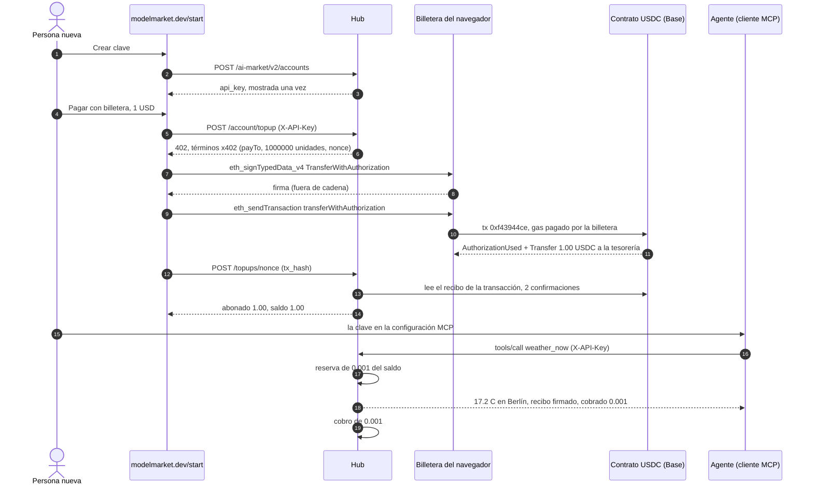
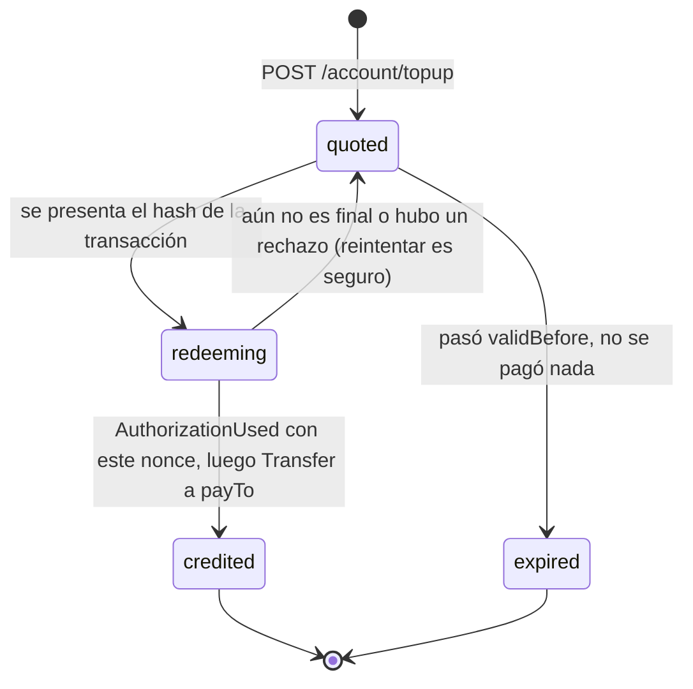
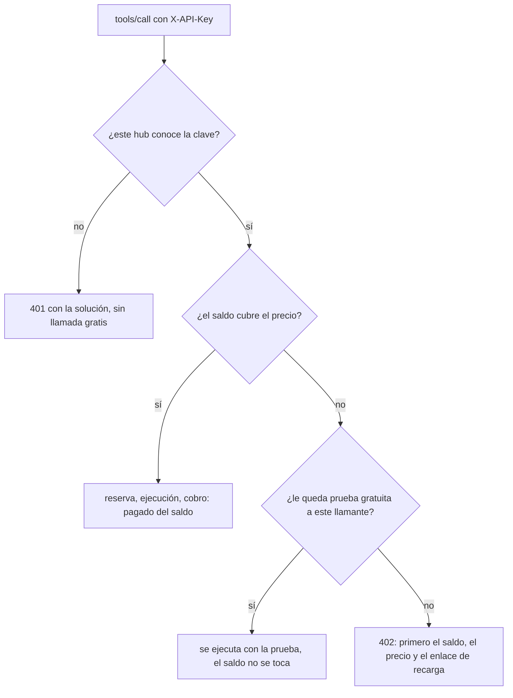
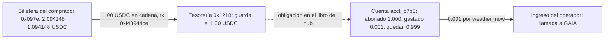

# Una clave, un dólar — el flujo de `/start` con dinero real

> 🌐 [English](start-onboarding-demo.md) · [Русский](start-onboarding-demo.ru.md) · **Español** · [Français](start-onboarding-demo.fr.md) · [中文](start-onboarding-demo.zh.md)

Base mainnet, 2026-10-06 18:42–18:43 UTC, hub modelmarket.dev 3.15.17. Una persona nueva abrió
[modelmarket.dev/start](https://modelmarket.dev/start), obtuvo una clave API, la recargó con
**1.00 USDC** desde una billetera del navegador, puso la clave en una conexión MCP, y la siguiente
llamada de pago del agente se cobró de ese saldo. Una sola transacción en cadena, sin paso de
billetera por llamada. Cómo funcionan las piezas: [hosted-mcp-endpoint.md](hosted-mcp-endpoint.md) ·
[credits-topup.es.md](https://github.com/alexar76/aimarket-hub/blob/main/docs/credits-topup.es.md).

## Quién es quién — lee esto primero

- **El pagador es nuestro.** La billetera `0x097e3F339D0b023605e12A6B81E2d6Cb7571475a` es el comprador
  de demostración de Pay-on-Verified, financiado por el dueño de modelmarket.dev. Esta ejecución
  prueba el mecanismo, no demanda externa; el contador de demanda cuenta esta billetera y esta cuenta
  como nuestras.
- **La página la manejó un script; la billetera, su clave real.** Una prueba de navegador abrió la
  página `/start` en producción y pulsó sus botones; las llamadas de la página a la billetera iban a
  un firmante con la clave del comprador que rechaza todo salvo un `transferWithAuthorization` de USDC
  de 1.00 USDC como máximo hacia la tesorería del hub. Los typed data y el calldata son los de la propia página.
- **El beneficiario es la tesorería del operador del hub** `0x1218ff36C5d2e3B6A565CdB1A8B1AcCFc606Ad0a`,
  la misma dirección a la que se pagan las ventas x402 de este hub.
- **El vendedor de la llamada de pago también es nuestro:** `weather_now` es `gaia.weather.read@v1` de GAIA.

## El flujo en seis pasos

| # | Paso | Qué pasó |
|---|---|---|
| 1 | Clave | «Crear clave» en `/start` → `POST /ai-market/v2/accounts` → cuenta de crédito `acct_b7b8a6a0babe6077`, saldo $0, clave mostrada una vez. |
| 2 | Oferta | «Pagar con billetera», $1 → `POST /ai-market/v2/account/topup` con la clave → `402` con términos x402 ligados a esa cuenta por un nonce nuevo. |
| 3 | Firma | La billetera firma un EIP-3009 `TransferWithAuthorization` (EIP-712): 1.00 USDC a la tesorería, sobre el nonce de la oferta. Fuera de cadena, gratis. |
| 4 | Envío | La billetera envía ella misma `USDC.transferWithAuthorization(…)` y paga el gas. **La única transacción en cadena del flujo.** |
| 5 | Abono | La página envía el hash; el hub lee la cadena y abona **$1.00** a la cuenta de la oferta. |
| 6 | Uso | MCP `weather_now {"city":"Berlin"}` con `X-API-Key` → cobrado **$0.001** del saldo, sin usar la prueba gratuita. |

## El flujo completo

## Cada registro, uno por uno

### Fuera de cadena, en el hub

| Cuándo (UTC) | Registro | Detalles |
|---|---|---|
| 18:42 | cuenta de crédito `acct_b7b8a6a0babe6077` | Creada con `POST /ai-market/v2/accounts`, etiqueta `start-page`, saldo $0 (este hub no regala crédito al registrarse). Solo se guarda el hash de la clave. |
| 18:42:26 | oferta `0xc392eaec…0072` | **Sin usar.** Primer intento: la billetera firmó la autorización, pero el cliente RPC del script fue rechazado (HTTP 403) antes de enviarla. No se movió nada; la firma murió al caducar la oferta a las 18:57:26. |
| 18:42:55 | oferta `0x2abe9ae8…7e7d` | Pagar 1 000 000 unidades base (1.00 USDC) a `0x1218…Ad0a`, válida hasta las 18:57:55. Dominio EIP-712: `USD Coin`, versión `2`, chainId 8453, contrato `0x833589fC…02913`. |
| 18:43:04 | libro: `topup` +$1.00 | Reference `topup:base:0x2abe…7e7d`, nota `USDC top-up 0xf43944ce… from 0x097e3f33…`. |
| 18:43:26 | libro: `hold` (reserva) $0.001 | Recibo `rcpt_7d17010bdf2cb80a9078d4d51c7e5b30`: el precio se reserva antes de ejecutar la llamada. |
| 18:43:28 | libro: `capture` (cobro) $0.001 | La llamada entregó, así que la reserva pasó a cobro. Saldo $0.999. |

### La firma (fuera de cadena)

La billetera firmó los typed data EIP-712 `TransferWithAuthorization`:
`from` = `0x097e…475a`, `to` = `0x1218…Ad0a`, `value` = `1000000`, `validAfter` = `0`,
`validBefore` = `1791313075` (caducidad de la oferta), `nonce` = `0x2abe9ae8…7e7d`.
Firmar no cuesta nada ni mueve nada; quien tenga la firma puede enviarla hasta `validBefore`,
y solo puede pagar ese importe a esa dirección.

### La transacción (en cadena)

[`0xf43944ce33179d4635c9e4fed0ad12fa3e64c707fe3c435a74519f37979ad661`](https://basescan.org/tx/0xf43944ce33179d4635c9e4fed0ad12fa3e64c707fe3c435a74519f37979ad661)

| Campo | Valor |
|---|---|
| Bloque | [52 261 416](https://basescan.org/block/52261416), estado success |
| De → a | `0x097e…475a` (nonce de la billetera 14) → contrato USDC `0x833589fC…02913` |
| Función | `transferWithAuthorization(from, to, value, validAfter, validBefore, nonce, v, r, s)`, selector `0xe3ee160e`, nueve palabras fijas |
| Gas | 83 252 a 0.006 gwei = 0.000000499 ETH, más la tarifa de datos L1 0.000000015 ETH — **≈ 0.000000515 ETH (≈ $0.0014)** |
| Log 1 | `AuthorizationUsed(authorizer = 0x097e…475a, nonce = 0x2abe…7e7d)` — el nonce de la oferta queda gastado para siempre |
| Log 2 | `Transfer(from = 0x097e…475a, to = 0x1218…Ad0a, value = 1 000 000)` — 1.00 USDC a la tesorería |

El hub no guarda ninguna clave y no envió nada: la billetera del comprador firmó y envió.

### Cómo el hub convirtió la transacción en crédito

Al canjear, el hub comprueba en orden: la transacción tuvo éxito y tiene 2 confirmaciones; el token
registró `AuthorizationUsed` para **el nonce de esta oferta**; el log siguiente es un `Transfer` de al
menos el importe ofertado a `payTo`. Después reserva la transacción en el registro de depósitos de un
solo uso (ninguna otra puerta podrá usarla), anota la autorización como gastada y abona
`min(pagado, ofertado)` a **la cuenta para la que se emitió la oferta**, no a quien presenta el hash.
Cada paso es idempotente sobre el nonce, así que un segundo canje del mismo pago solo responde «ya abonado».

## Cómo se paga una llamada MCP con clave

La ejecución de arriba tomó la rama izquierda: el saldo era $1.00, así que `weather_now` cobró
$0.001 y la prueba gratuita no se tocó (`trial: none` en la respuesta).

## Dónde está ahora el dólar

| Quién | Antes | Después |
|---|---|---|
| Billetera del comprador `0x097e…475a` | 2.094148 USDC, 0.00036258 ETH | 1.094148 USDC, 0.00036207 ETH |
| Tesorería `0x1218…Ad0a` | — | +1.00 USDC (log Transfer de arriba); 2.037519 USDC en el bloque 52 261 649 |
| Cuenta `acct_b7b8a6a0babe6077` | $0 | recargada $1.00, gastado $0.001, **saldo $0.999** |

El 1.00 USDC es dinero del operador en cadena; los $0.999 son lo que el operador le debe en llamadas
a quien tenga la clave. El crédito no usado no se reembolsa automáticamente.

## Repetirlo

- En un navegador: [modelmarket.dev/start](https://modelmarket.dev/start) — hace falta una billetera con
  USDC en Base y unos céntimos de ETH para el gas.
- Desde código: `aimarket-agent` (`topup_quote`, `topup_redeem`, `aimarket_agent.topup.typed_data` /
  `calldata`) construye los mismos typed data y calldata, byte a byte.
- Solo se abona una autorización sobre el nonce de la oferta; una transferencia simple a la tesorería
  no (este hub no tiene vigilante de depósitos). Quien tenga la clave puede gastar su saldo.
