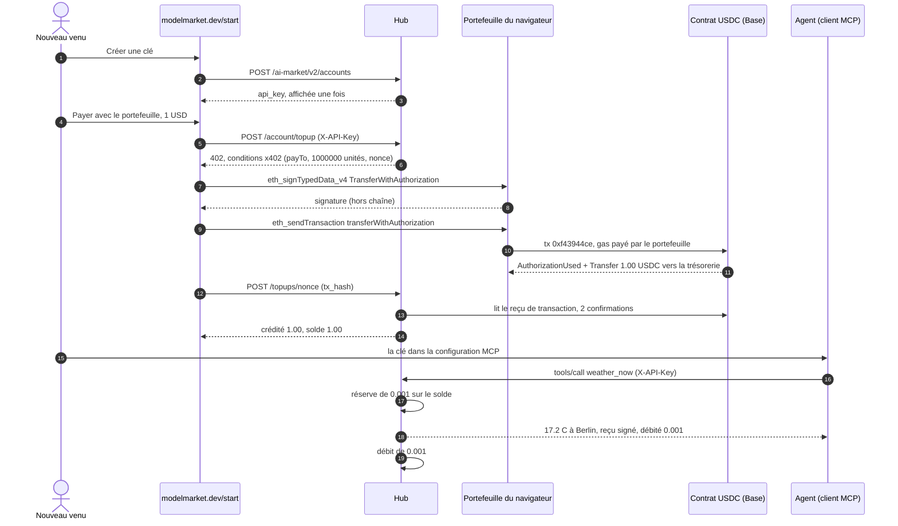
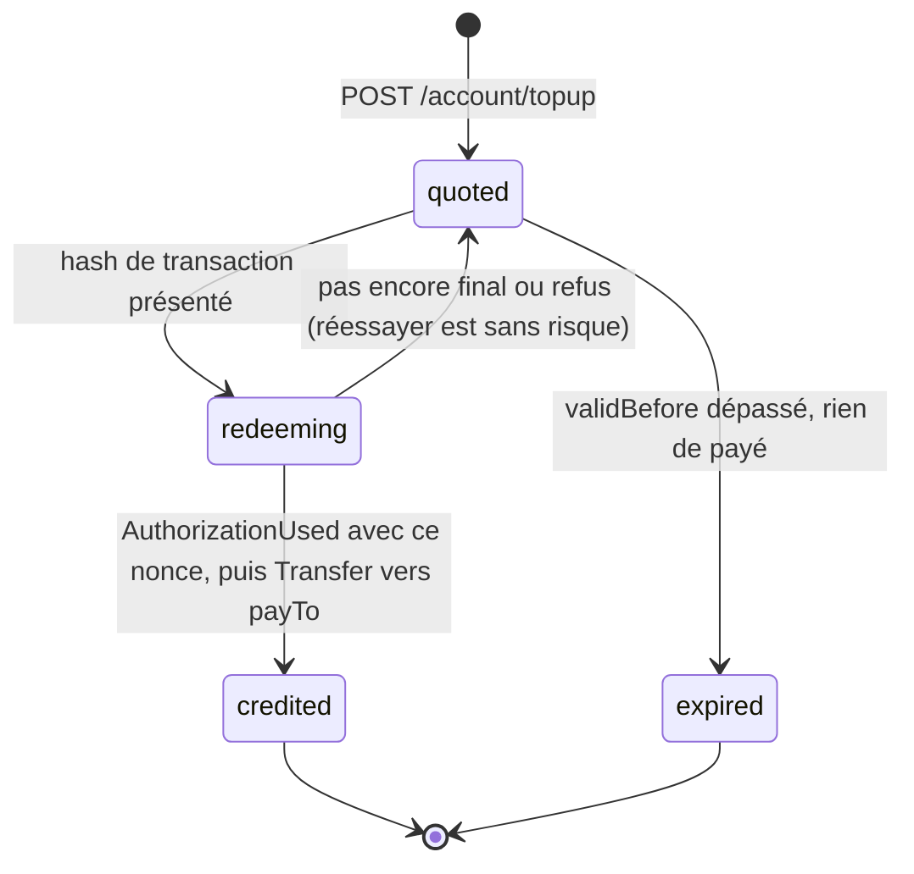
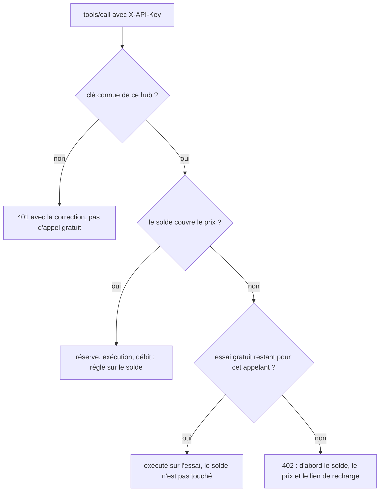
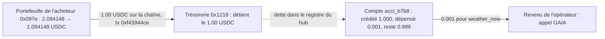

# Une clé, un dollar — le parcours `/start` avec de l'argent réel

> 🌐 [English](start-onboarding-demo.md) · [Русский](start-onboarding-demo.ru.md) · [Español](start-onboarding-demo.es.md) · **Français** · [中文](start-onboarding-demo.zh.md)

Base mainnet, 2026-10-06 18:42–18:43 UTC, hub modelmarket.dev 3.15.17. Un nouveau venu a ouvert
[modelmarket.dev/start](https://modelmarket.dev/start), obtenu une clé API, l'a rechargée de
**1.00 USDC** depuis un portefeuille de navigateur, a mis la clé dans une connexion MCP, et l'appel
payant suivant de l'agent a été réglé sur ce solde. Une seule transaction sur la chaîne, aucune
étape de portefeuille par appel. Le fonctionnement des pièces : [hosted-mcp-endpoint.md](hosted-mcp-endpoint.md) ·
[credits-topup.fr.md](https://github.com/alexar76/aimarket-hub/blob/main/docs/credits-topup.fr.md).

## Qui est qui — à lire d'abord

- **Le payeur est à nous.** Le portefeuille `0x097e3F339D0b023605e12A6B81E2d6Cb7571475a` est l'acheteur
  de démonstration de Pay-on-Verified, alimenté par le propriétaire de modelmarket.dev. Ce passage
  prouve le mécanisme, pas une demande extérieure ; le compteur de demande range ce portefeuille et
  ce compte parmi les nôtres.
- **La page a été pilotée par un script, le portefeuille par sa vraie clé.** Un test de navigateur a
  ouvert la page `/start` en production et cliqué sur ses boutons ; les appels de la page au
  portefeuille allaient à un signataire détenant la clé de l'acheteur, qui refuse tout sauf un
  `transferWithAuthorization` USDC d'au plus 1.00 USDC vers la trésorerie du hub. Les typed data et le
  calldata sont ceux de la page elle-même.
- **Le bénéficiaire est la trésorerie de l'opérateur du hub** `0x1218ff36C5d2e3B6A565CdB1A8B1AcCFc606Ad0a`,
  la même adresse que celle des ventes x402 de ce hub.
- **Le vendeur de l'appel payant est aussi à nous :** `weather_now` est `gaia.weather.read@v1` de GAIA.

## Le parcours en six étapes

| # | Étape | Ce qui s'est passé |
|---|---|---|
| 1 | Clé | « Créer une clé » sur `/start` → `POST /ai-market/v2/accounts` → compte de crédit `acct_b7b8a6a0babe6077`, solde 0 $, clé affichée une seule fois. |
| 2 | Offre | « Payer avec le portefeuille », 1 $ → `POST /ai-market/v2/account/topup` avec la clé → `402` avec des conditions x402 liées à ce compte par un nonce neuf. |
| 3 | Signature | Le portefeuille signe un EIP-3009 `TransferWithAuthorization` (EIP-712) : 1.00 USDC vers la trésorerie, sur le nonce de l'offre. Hors chaîne, gratuit. |
| 4 | Envoi | Le portefeuille envoie lui-même `USDC.transferWithAuthorization(…)` et paie le gas. **La seule transaction sur la chaîne du parcours.** |
| 5 | Crédit | La page transmet le hash ; le hub lit la chaîne et crédite **1.00 $** au compte de l'offre. |
| 6 | Usage | MCP `weather_now {"city":"Berlin"}` avec `X-API-Key` → réglé **0.001 $** sur le solde, sans toucher à l'essai gratuit. |

## Le parcours complet

## Chaque enregistrement, un par un

### Hors chaîne, sur le hub

| Quand (UTC) | Enregistrement | Détails |
|---|---|---|
| 18:42 | compte de crédit `acct_b7b8a6a0babe6077` | Créé par `POST /ai-market/v2/accounts`, libellé `start-page`, solde 0 $ (ce hub n'offre pas de crédit à l'inscription). Seul le hash de la clé est conservé. |
| 18:42:26 | offre `0xc392eaec…0072` | **Inutilisée.** Premier essai : le portefeuille a signé l'autorisation, mais le client RPC du script a été refusé (HTTP 403) avant l'envoi. Rien n'a bougé ; la signature est morte à l'expiration de l'offre, à 18:57:26. |
| 18:42:55 | offre `0x2abe9ae8…7e7d` | Payer 1 000 000 unités de base (1.00 USDC) à `0x1218…Ad0a`, valable jusqu'à 18:57:55. Domaine EIP-712 : `USD Coin`, version `2`, chainId 8453, contrat `0x833589fC…02913`. |
| 18:43:04 | registre : `topup` +1.00 $ | Reference `topup:base:0x2abe…7e7d`, note `USDC top-up 0xf43944ce… from 0x097e3f33…`. |
| 18:43:26 | registre : `hold` (réserve) 0.001 $ | Reçu `rcpt_7d17010bdf2cb80a9078d4d51c7e5b30` : le prix est réservé avant l'exécution de l'appel. |
| 18:43:28 | registre : `capture` (débit) 0.001 $ | L'appel a livré, la réserve est devenue un débit. Solde 0.999 $. |

### La signature (hors chaîne)

Le portefeuille a signé les typed data EIP-712 `TransferWithAuthorization` :
`from` = `0x097e…475a`, `to` = `0x1218…Ad0a`, `value` = `1000000`, `validAfter` = `0`,
`validBefore` = `1791313075` (expiration de l'offre), `nonce` = `0x2abe9ae8…7e7d`.
Signer ne coûte rien et ne déplace rien ; qui détient la signature peut la soumettre jusqu'à
`validBefore`, et elle ne peut payer que ce montant à cette adresse.

### La transaction (sur la chaîne)

[`0xf43944ce33179d4635c9e4fed0ad12fa3e64c707fe3c435a74519f37979ad661`](https://basescan.org/tx/0xf43944ce33179d4635c9e4fed0ad12fa3e64c707fe3c435a74519f37979ad661)

| Champ | Valeur |
|---|---|
| Bloc | [52 261 416](https://basescan.org/block/52261416), statut success |
| De → à | `0x097e…475a` (nonce du portefeuille 14) → contrat USDC `0x833589fC…02913` |
| Fonction | `transferWithAuthorization(from, to, value, validAfter, validBefore, nonce, v, r, s)`, sélecteur `0xe3ee160e`, neuf mots de taille fixe |
| Gas | 83 252 à 0.006 gwei = 0.000000499 ETH, plus les frais de données L1 0.000000015 ETH — **≈ 0.000000515 ETH (≈ 0.0014 $)** |
| Log 1 | `AuthorizationUsed(authorizer = 0x097e…475a, nonce = 0x2abe…7e7d)` — le nonce de l'offre est dépensé pour toujours |
| Log 2 | `Transfer(from = 0x097e…475a, to = 0x1218…Ad0a, value = 1 000 000)` — 1.00 USDC vers la trésorerie |

Le hub ne détient aucune clé et n'a rien soumis : le portefeuille de l'acheteur a signé et envoyé.

### Comment le hub a transformé la transaction en crédit

À l'encaissement, le hub vérifie dans l'ordre : la transaction a réussi et compte 2 confirmations ; le
jeton a enregistré `AuthorizationUsed` pour **le nonce de cette offre** ; le log suivant est un
`Transfer` d'au moins le montant de l'offre vers `payTo`. Il réserve ensuite la transaction dans le
registre des dépôts à usage unique (aucune autre porte ne pourra la réutiliser), inscrit l'autorisation
comme dépensée et crédite `min(payé, offert)` **au compte pour lequel l'offre a été émise**, et non à
qui présente le hash. Chaque étape est idempotente sur le nonce : un second encaissement du même
paiement répond seulement « déjà crédité ».

## Comment un appel MCP avec clé est réglé

Le passage ci-dessus a pris la branche de gauche : le solde était de 1.00 $, `weather_now` a donc été
débité de 0.001 $ et l'essai gratuit n'a pas été touché (`trial: none` dans la réponse).

## Où est le dollar maintenant

| Qui | Avant | Après |
|---|---|---|
| Portefeuille de l'acheteur `0x097e…475a` | 2.094148 USDC, 0.00036258 ETH | 1.094148 USDC, 0.00036207 ETH |
| Trésorerie `0x1218…Ad0a` | — | +1.00 USDC (log Transfer ci-dessus) ; 2.037519 USDC au bloc 52 261 649 |
| Compte `acct_b7b8a6a0babe6077` | 0 $ | rechargé 1.00 $, dépensé 0.001 $, **solde 0.999 $** |

Le 1.00 USDC est l'argent de l'opérateur sur la chaîne ; les 0.999 $ sont ce que l'opérateur doit en
appels au détenteur de la clé. Le crédit non utilisé n'est pas remboursé automatiquement.

## Le refaire

- Dans un navigateur : [modelmarket.dev/start](https://modelmarket.dev/start) — il faut un portefeuille
  avec des USDC sur Base et quelques centimes d'ETH pour le gas.
- Depuis le code : `aimarket-agent` (`topup_quote`, `topup_redeem`, `aimarket_agent.topup.typed_data` /
  `calldata`) construit les mêmes typed data et calldata, octet pour octet.
- Seule une autorisation sur le nonce de l'offre est créditée ; un simple virement vers la trésorerie
  ne l'est pas (ce hub n'a pas de surveillant de dépôts). Quiconque détient la clé peut dépenser son solde.
