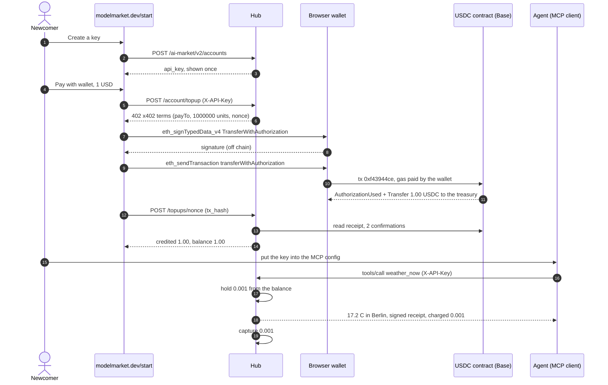
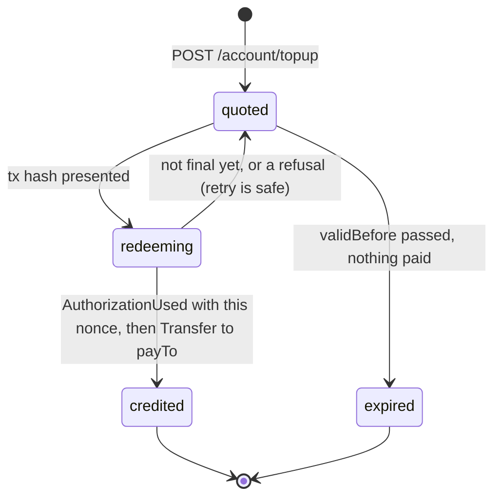
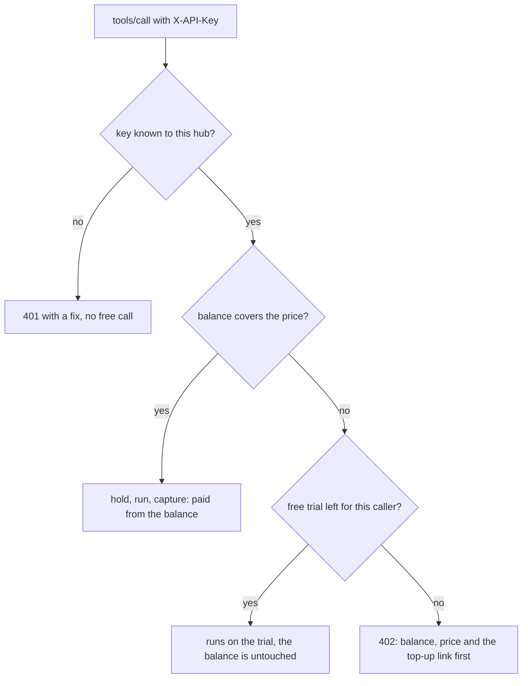
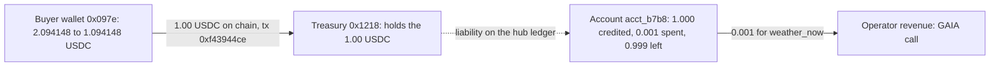

# One key, one dollar — the `/start` flow on real money

> 🌐 **English** · [Русский](start-onboarding-demo.ru.md) · [Español](start-onboarding-demo.es.md) · [Français](start-onboarding-demo.fr.md) · [中文](start-onboarding-demo.zh.md)

Base mainnet, 2026-10-06 18:42–18:43 UTC, hub modelmarket.dev 3.15.17. A newcomer opened
[modelmarket.dev/start](https://modelmarket.dev/start), got an API key, topped it up with
**1.00 USDC** from a browser wallet, put the key into an MCP connection, and the agent's next
priced call was paid from that balance. One on-chain transaction, no wallet step per call.
How the pieces work: [hosted-mcp-endpoint.md](hosted-mcp-endpoint.md) ·
[credits-topup.md](https://github.com/alexar76/aimarket-hub/blob/main/docs/credits-topup.md).

## Who is who — read this first

- **The payer is ours.** Wallet `0x097e3F339D0b023605e12A6B81E2d6Cb7571475a` is the
  Pay-on-Verified demo buyer, funded by the modelmarket.dev owner. This run proves the
  mechanism, not outside demand; the demand counter lists this wallet and this account as our own.
- **The page was driven by a script, the wallet by its real key.** A browser test opened the live
  `/start` page and clicked its buttons; the page's wallet calls went to a signer that held the
  buyer's key and refused anything except a USDC `transferWithAuthorization` of at most 1.00 USDC
  to the hub treasury. The typed data and calldata are the page's own.
- **The payee is the hub operator's treasury** `0x1218ff36C5d2e3B6A565CdB1A8B1AcCFc606Ad0a` — the
  same address x402 sales on this hub are paid to.
- **The seller of the paid call is ours too:** `weather_now` is GAIA's `gaia.weather.read@v1`.

## The flow in six steps

| # | Step | What happened |
|---|---|---|
| 1 | Key | "Create a key" on `/start` → `POST /ai-market/v2/accounts` → account `acct_b7b8a6a0babe6077`, balance $0, key shown once. |
| 2 | Quote | "Pay with wallet", $1 → `POST /ai-market/v2/account/topup` with the key → `402` with x402 terms bound to that account by a fresh nonce. |
| 3 | Sign | The wallet signs an EIP-3009 `TransferWithAuthorization` (EIP-712): 1.00 USDC to the treasury, over the quote's nonce. Off chain, free. |
| 4 | Send | The wallet sends `USDC.transferWithAuthorization(…)` itself and pays the gas. **The only on-chain transaction of the flow.** |
| 5 | Credit | The page posts the tx hash; the hub reads the chain and credits **$1.00** to the quoted account. |
| 6 | Use | MCP `weather_now {"city":"Berlin"}` with `X-API-Key` → paid **$0.001** from the balance, no free trial used. |

## The whole flow

## Every record, one by one

### Off chain, on the hub

| When (UTC) | Record | Details |
|---|---|---|
| 18:42 | account `acct_b7b8a6a0babe6077` | Created by `POST /ai-market/v2/accounts`, label `start-page`, balance $0 (this hub gives no signup grant). Only the key's hash is stored. |
| 18:42:26 | quote `0xc392eaec…0072` | **Unused.** The first attempt: the wallet signed the authorization, but the script's RPC client was refused (HTTP 403) before broadcast. Nothing moved; the signature died when the quote expired at 18:57:26. |
| 18:42:55 | quote `0x2abe9ae8…7e7d` | Pay 1 000 000 base units (1.00 USDC) to `0x1218…Ad0a`, valid until 18:57:55. EIP-712 domain: `USD Coin`, version `2`, chainId 8453, contract `0x833589fC…02913`. |
| 18:43:04 | ledger `topup` +$1.00 | Reference `topup:base:0x2abe…7e7d`, note `USDC top-up 0xf43944ce… from 0x097e3f33…`. |
| 18:43:26 | ledger `hold` $0.001 | Receipt `rcpt_7d17010bdf2cb80a9078d4d51c7e5b30`: the price is reserved before the call runs. |
| 18:43:28 | ledger `capture` $0.001 | The call delivered, so the hold became a charge. Balance $0.999. |

### The signature (off chain)

The wallet signed EIP-712 typed data `TransferWithAuthorization`:
`from` = `0x097e…475a`, `to` = `0x1218…Ad0a`, `value` = `1000000`, `validAfter` = `0`,
`validBefore` = `1791313075` (the quote's expiry), `nonce` = `0x2abe9ae8…7e7d`.
Signing costs nothing and moves nothing; whoever holds the signature can submit it until
`validBefore`, and it can pay only that amount to that address.

### The transaction (on chain)

[`0xf43944ce33179d4635c9e4fed0ad12fa3e64c707fe3c435a74519f37979ad661`](https://basescan.org/tx/0xf43944ce33179d4635c9e4fed0ad12fa3e64c707fe3c435a74519f37979ad661)

| Field | Value |
|---|---|
| Block | [52 261 416](https://basescan.org/block/52261416), status success |
| From → to | `0x097e…475a` (wallet nonce 14) → USDC contract `0x833589fC…02913` |
| Function | `transferWithAuthorization(from, to, value, validAfter, validBefore, nonce, v, r, s)`, selector `0xe3ee160e`, nine fixed words |
| Gas | 83 252 at 0.006 gwei = 0.000000499 ETH, plus L1 data fee 0.000000015 ETH — **≈ 0.000000515 ETH (≈ $0.0014)** |
| Log 1 | `AuthorizationUsed(authorizer = 0x097e…475a, nonce = 0x2abe…7e7d)` — the quote's nonce is now spent forever |
| Log 2 | `Transfer(from = 0x097e…475a, to = 0x1218…Ad0a, value = 1 000 000)` — 1.00 USDC to the treasury |

The hub holds no key and submitted nothing: the buyer's wallet both signed and sent.

### How the hub turned the transaction into credit

On redemption the hub checks, in order: the transaction succeeded and has 2 confirmations; the
token logged `AuthorizationUsed` for **this quote's nonce**; the very next log is a `Transfer` of
at least the quoted amount to `payTo`. Then it claims the transaction in the single-use deposit
registry (no other door can use it again), records the authorization as spent, and credits
`min(paid, quoted)` to **the account the quote was minted for** — not to whoever presents the
hash. Every step is idempotent on the nonce, so a second redemption of the same payment only
reports "already credited".

## How a keyed MCP call is paid

The run above took the left branch: the balance was $1.00, so `weather_now` was charged
$0.001 and the free trial was not touched (`trial: none` in the answer).

## Where the dollar is now

| Who | Before | After |
|---|---|---|
| Buyer wallet `0x097e…475a` | 2.094148 USDC, 0.00036258 ETH | 1.094148 USDC, 0.00036207 ETH |
| Treasury `0x1218…Ad0a` | — | +1.00 USDC (Transfer log above); 2.037519 USDC at block 52 261 649 |
| Account `acct_b7b8a6a0babe6077` | $0 | topped up $1.00, spent $0.001, **balance $0.999** |

The 1.00 USDC is the operator's money on chain; the $0.999 is what the operator owes the key's
holder in calls. Unused credit is not refunded automatically.

## Repeat it

- In a browser: [modelmarket.dev/start](https://modelmarket.dev/start) — needs a wallet with USDC on Base
  and a few cents of ETH for gas.
- From code: `aimarket-agent` (`topup_quote`, `topup_redeem`, `aimarket_agent.topup.typed_data` /
  `calldata`) builds the same typed data and calldata, byte for byte.
- Only an authorization over the quote's nonce is credited; a plain transfer to the treasury is
  not (this hub runs no deposit watcher). Anyone holding the key can spend its balance.
