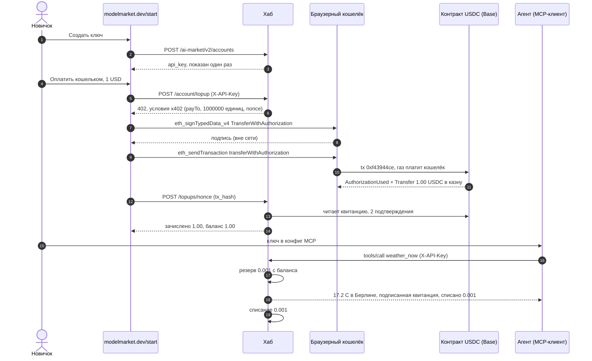
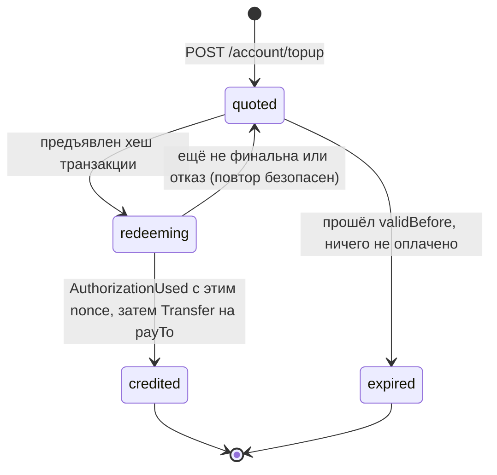
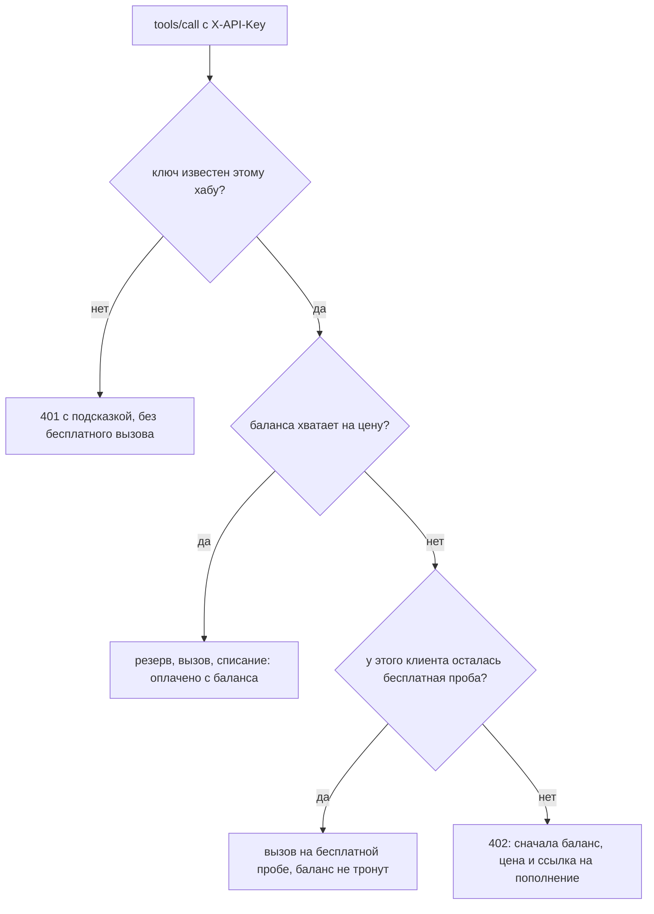
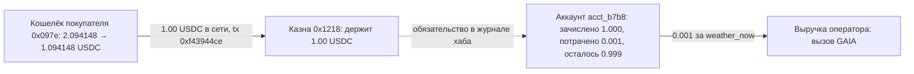

# Один ключ, один доллар — флоу `/start` на настоящих деньгах

> 🌐 [English](start-onboarding-demo.md) · **Русский** · [Español](start-onboarding-demo.es.md) · [Français](start-onboarding-demo.fr.md) · [中文](start-onboarding-demo.zh.md)

Сеть Base, 2026-10-06 18:42–18:43 UTC, хаб modelmarket.dev 3.15.17. Новичок открыл
[modelmarket.dev/start](https://modelmarket.dev/start), получил API-ключ, пополнил его на
**1.00 USDC** из браузерного кошелька, добавил ключ в MCP-подключение — и следующий платный
вызов агента оплатился с этого баланса. Одна транзакция в сети, никакого кошелька на каждый вызов.
Как устроены части: [hosted-mcp-endpoint.md](hosted-mcp-endpoint.md) ·
[credits-topup.ru.md](https://github.com/alexar76/aimarket-hub/blob/main/docs/credits-topup.ru.md).

## Кто есть кто — прочтите сначала

- **Плательщик — наш.** Кошелёк `0x097e3F339D0b023605e12A6B81E2d6Cb7571475a` — демо-покупатель
  Pay-on-Verified, его пополняет владелец modelmarket.dev. Прогон доказывает механизм, а не внешний
  спрос; счётчик теста спроса числит этот кошелёк и этот аккаунт своими.
- **Страницей управлял скрипт, кошельком — его настоящий ключ.** Браузерный тест открыл живую
  страницу `/start` и нажимал её кнопки; запросы страницы к кошельку уходили в подписанта с ключом
  покупателя, который отказывает во всём, кроме `transferWithAuthorization` USDC не больше 1.00 USDC
  в казну хаба. Typed data и calldata собрала сама страница.
- **Получатель — казна оператора хаба** `0x1218ff36C5d2e3B6A565CdB1A8B1AcCFc606Ad0a` — тот же адрес,
  на который приходят продажи x402 этого хаба.
- **Продавец платного вызова тоже наш:** `weather_now` — это `gaia.weather.read@v1` от GAIA.

## Флоу в шесть шагов

| # | Шаг | Что произошло |
|---|---|---|
| 1 | Ключ | «Создать ключ» на `/start` → `POST /ai-market/v2/accounts` → кредитный аккаунт `acct_b7b8a6a0babe6077`, баланс $0, ключ показан один раз. |
| 2 | Счёт | «Оплатить кошельком», $1 → `POST /ai-market/v2/account/topup` с ключом → `402` с условиями x402, привязанными к этому аккаунту свежим nonce. |
| 3 | Подпись | Кошелёк подписывает EIP-3009 `TransferWithAuthorization` (EIP-712): 1.00 USDC в казну, над nonce счёта. Вне сети, бесплатно. |
| 4 | Отправка | Кошелёк сам отправляет `USDC.transferWithAuthorization(…)` и платит газ. **Единственная транзакция флоу в сети.** |
| 5 | Зачисление | Страница передаёт хеш транзакции; хаб читает сеть и зачисляет **$1.00** на аккаунт из счёта. |
| 6 | Использование | MCP `weather_now {"city":"Berlin"}` с `X-API-Key` → оплачено **$0.001** с баланса, бесплатная проба не тронута. |

## Весь флоу

## Каждая запись по очереди

### Вне сети, на хабе

| Когда (UTC) | Запись | Подробности |
|---|---|---|
| 18:42 | кредитный аккаунт `acct_b7b8a6a0babe6077` | Создан `POST /ai-market/v2/accounts`, метка `start-page`, баланс $0 (подарочного кредита при регистрации этот хаб не даёт). Хранится только хеш ключа. |
| 18:42:26 | счёт `0xc392eaec…0072` | **Не использован.** Первая попытка: кошелёк подписал авторизацию, но RPC-клиент скрипта получил отказ (HTTP 403) до отправки. Ничего не сдвинулось; подпись умерла, когда счёт истёк в 18:57:26. |
| 18:42:55 | счёт `0x2abe9ae8…7e7d` | Заплатить 1 000 000 базовых единиц (1.00 USDC) на `0x1218…Ad0a`, действует до 18:57:55. Домен EIP-712: `USD Coin`, версия `2`, chainId 8453, контракт `0x833589fC…02913`. |
| 18:43:04 | журнал: `topup` +$1.00 | Reference `topup:base:0x2abe…7e7d`, пометка `USDC top-up 0xf43944ce… from 0x097e3f33…`. |
| 18:43:26 | журнал: `hold` (резерв) $0.001 | Квитанция `rcpt_7d17010bdf2cb80a9078d4d51c7e5b30`: цена резервируется до запуска вызова. |
| 18:43:28 | журнал: `capture` (списание) $0.001 | Вызов выполнен, резерв стал списанием. Баланс $0.999. |

### Подпись (вне сети)

Кошелёк подписал typed data EIP-712 `TransferWithAuthorization`:
`from` = `0x097e…475a`, `to` = `0x1218…Ad0a`, `value` = `1000000`, `validAfter` = `0`,
`validBefore` = `1791313075` (срок счёта), `nonce` = `0x2abe9ae8…7e7d`.
Подпись ничего не стоит и ничего не двигает; кто её держит, может отправить её до `validBefore`,
и заплатить она может только эту сумму только на этот адрес.

### Транзакция (в сети)

[`0xf43944ce33179d4635c9e4fed0ad12fa3e64c707fe3c435a74519f37979ad661`](https://basescan.org/tx/0xf43944ce33179d4635c9e4fed0ad12fa3e64c707fe3c435a74519f37979ad661)

| Поле | Значение |
|---|---|
| Блок | [52 261 416](https://basescan.org/block/52261416), статус success |
| От → кому | `0x097e…475a` (nonce кошелька 14) → контракт USDC `0x833589fC…02913` |
| Функция | `transferWithAuthorization(from, to, value, validAfter, validBefore, nonce, v, r, s)`, селектор `0xe3ee160e`, девять слов фиксированной длины |
| Газ | 83 252 по 0.006 gwei = 0.000000499 ETH плюс плата за данные L1 0.000000015 ETH — **≈ 0.000000515 ETH (≈ $0.0014)** |
| Лог 1 | `AuthorizationUsed(authorizer = 0x097e…475a, nonce = 0x2abe…7e7d)` — nonce счёта израсходован навсегда |
| Лог 2 | `Transfer(from = 0x097e…475a, to = 0x1218…Ad0a, value = 1 000 000)` — 1.00 USDC в казну |

Хаб не держит ключей и ничего не отправлял: кошелёк покупателя и подписал, и отправил.

### Как хаб превратил транзакцию в кредит

При погашении хаб проверяет по порядку: транзакция успешна и имеет 2 подтверждения; токен записал
`AuthorizationUsed` для **nonce этого счёта**; следующий же лог — `Transfer` не меньше суммы счёта
на `payTo`. Затем хаб занимает транзакцию в реестре одноразовых депозитов (никакая другая дверь её
больше не примет), записывает авторизацию как израсходованную и зачисляет `min(оплачено, по счёту)`
**на аккаунт, для которого выписан счёт**, а не тому, кто предъявил хеш. Каждый шаг идемпотентен по
nonce, поэтому повторное погашение того же платежа лишь сообщает «уже зачислено».

## Как оплачивается MCP-вызов с ключом

Прогон выше пошёл по левой ветке: на балансе было $1.00, поэтому `weather_now` списал $0.001,
а бесплатная проба не тронута (`trial: none` в ответе).

## Где сейчас доллар

| Кто | До | После |
|---|---|---|
| Кошелёк покупателя `0x097e…475a` | 2.094148 USDC, 0.00036258 ETH | 1.094148 USDC, 0.00036207 ETH |
| Казна `0x1218…Ad0a` | — | +1.00 USDC (лог Transfer выше); 2.037519 USDC на блоке 52 261 649 |
| Аккаунт `acct_b7b8a6a0babe6077` | $0 | пополнено $1.00, потрачено $0.001, **баланс $0.999** |

1.00 USDC — деньги оператора в сети; $0.999 — то, что оператор должен держателю ключа вызовами.
Неиспользованный остаток автоматически не возвращается.

## Повторить

- В браузере: [modelmarket.dev/start](https://modelmarket.dev/start) — нужен кошелёк с USDC в сети
  Base и парой центов в ETH на газ.
- Из кода: `aimarket-agent` (`topup_quote`, `topup_redeem`, `aimarket_agent.topup.typed_data` /
  `calldata`) собирает те же typed data и calldata байт в байт.
- Зачисляется только авторизация над nonce счёта; простой перевод в казну — нет (на этом хабе нет
  наблюдателя депозитов). Кто знает ключ, тот может тратить его баланс.
