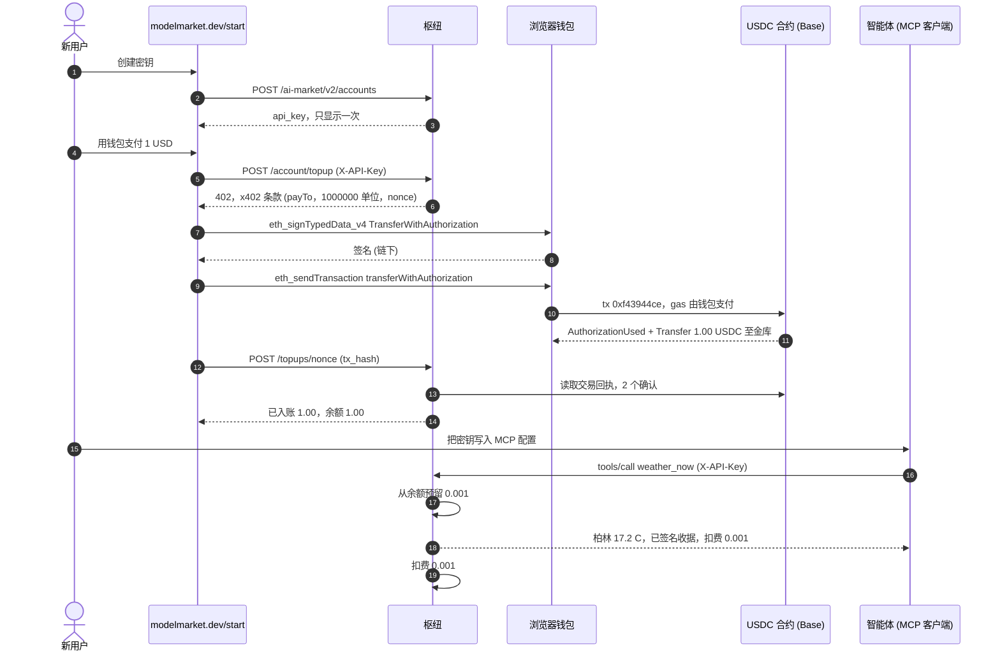
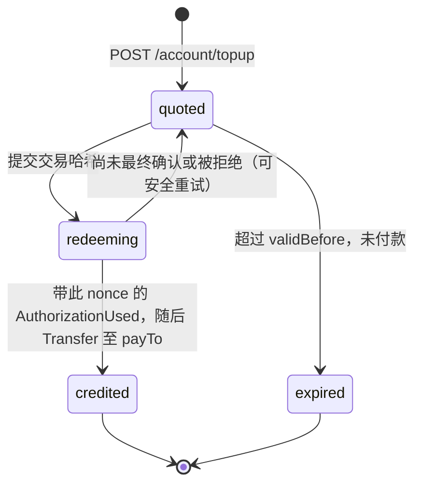
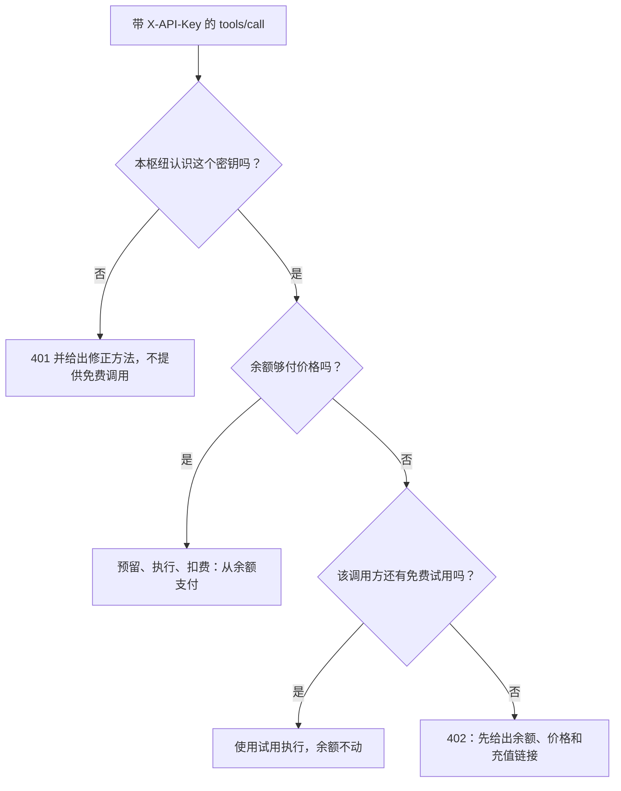
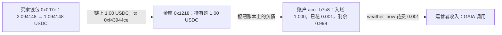

# 一个密钥，一美元 —— 真金白银走一遍 `/start` 流程

> 🌐 [English](start-onboarding-demo.md) · [Русский](start-onboarding-demo.ru.md) · [Español](start-onboarding-demo.es.md) · [Français](start-onboarding-demo.fr.md) · **中文**

Base 主网，2026-10-06 18:42–18:43 UTC，枢纽 modelmarket.dev 3.15.17。一位新用户打开
[modelmarket.dev/start](https://modelmarket.dev/start)，拿到 API 密钥，用浏览器钱包为它充值
**1.00 USDC**，把密钥放进 MCP 连接——智能体的下一次付费调用就从这笔余额中扣除。整个流程只有一笔链上交易，
不需要每次调用都操作钱包。各部分如何工作：[hosted-mcp-endpoint.md](hosted-mcp-endpoint.md) ·
[credits-topup.zh.md](https://github.com/alexar76/aimarket-hub/blob/main/docs/credits-topup.zh.md)。

## 谁是谁——请先读这里

- **付款方是我们自己的。** 钱包 `0x097e3F339D0b023605e12A6B81E2d6Cb7571475a` 是 Pay-on-Verified 的演示买家，
  由 modelmarket.dev 的所有者充值。本次运行证明的是机制，而不是外部需求；需求计数器把这个钱包和这个账户记为我们自己的。
- **页面由脚本操作，钱包使用其真实密钥。** 浏览器测试打开线上的 `/start` 页面并点击按钮；页面对钱包的请求
  交给一个持有买家密钥的签名器，它只接受向枢纽金库转账、最多 1.00 USDC 的 USDC `transferWithAuthorization`，
  其余一律拒绝。typed data 和 calldata 都由页面自己生成。
- **收款方是枢纽运营者的金库** `0x1218ff36C5d2e3B6A565CdB1A8B1AcCFc606Ad0a`，与本枢纽 x402 销售的收款地址相同。
- **付费调用的卖家也是我们自己的：** `weather_now` 即 GAIA 的 `gaia.weather.read@v1`。

## 六步流程

| # | 步骤 | 发生了什么 |
|---|---|---|
| 1 | 密钥 | 在 `/start` 点击“创建密钥” → `POST /ai-market/v2/accounts` → 额度账户 `acct_b7b8a6a0babe6077`，余额 $0，密钥只显示一次。 |
| 2 | 报价 | “用钱包支付”，$1 → 带密钥调用 `POST /ai-market/v2/account/topup` → `402`，x402 条款通过新的 nonce 绑定到该账户。 |
| 3 | 签名 | 钱包签署 EIP-3009 `TransferWithAuthorization`（EIP-712）：向金库支付 1.00 USDC，签在报价的 nonce 上。链下完成，免费。 |
| 4 | 发送 | 钱包自己发送 `USDC.transferWithAuthorization(…)` 并支付 gas。**这是整个流程中唯一的链上交易。** |
| 5 | 入账 | 页面提交交易哈希；枢纽读取链上数据，向报价对应的账户充入 **$1.00**。 |
| 6 | 使用 | 带 `X-API-Key` 调用 MCP `weather_now {"city":"Berlin"}` → 从余额扣除 **$0.001**，未动用免费试用。 |

## 完整流程

## 逐条记录

### 链下，在枢纽上

| 时间 (UTC) | 记录 | 详情 |
|---|---|---|
| 18:42 | 额度账户 `acct_b7b8a6a0babe6077` | 由 `POST /ai-market/v2/accounts` 创建，标签 `start-page`，余额 $0（本枢纽注册不赠送额度）。只保存密钥的哈希。 |
| 18:42:26 | 报价 `0xc392eaec…0072` | **未使用。** 第一次尝试：钱包已签署授权，但脚本的 RPC 客户端在广播前被拒绝（HTTP 403）。没有任何资金移动；报价于 18:57:26 过期，签名随之失效。 |
| 18:42:55 | 报价 `0x2abe9ae8…7e7d` | 向 `0x1218…Ad0a` 支付 1 000 000 基本单位（1.00 USDC），有效期至 18:57:55。EIP-712 域：`USD Coin`，版本 `2`，chainId 8453，合约 `0x833589fC…02913`。 |
| 18:43:04 | 账本：`topup` +$1.00 | Reference `topup:base:0x2abe…7e7d`，备注 `USDC top-up 0xf43944ce… from 0x097e3f33…`。 |
| 18:43:26 | 账本：`hold`（预留）$0.001 | 收据 `rcpt_7d17010bdf2cb80a9078d4d51c7e5b30`：调用运行前先预留价格。 |
| 18:43:28 | 账本：`capture`（扣费）$0.001 | 调用已交付，预留转为扣费。余额 $0.999。 |

### 签名（链下）

钱包签署了 EIP-712 typed data `TransferWithAuthorization`：
`from` = `0x097e…475a`，`to` = `0x1218…Ad0a`，`value` = `1000000`，`validAfter` = `0`，
`validBefore` = `1791313075`（报价过期时间），`nonce` = `0x2abe9ae8…7e7d`。
签名不花钱，也不移动任何资金；持有签名的人可以在 `validBefore` 之前提交它，而且它只能把这笔金额付给这个地址。

### 交易（链上）

[`0xf43944ce33179d4635c9e4fed0ad12fa3e64c707fe3c435a74519f37979ad661`](https://basescan.org/tx/0xf43944ce33179d4635c9e4fed0ad12fa3e64c707fe3c435a74519f37979ad661)

| 字段 | 值 |
|---|---|
| 区块 | [52 261 416](https://basescan.org/block/52261416)，状态 success |
| 从 → 到 | `0x097e…475a`（钱包 nonce 14）→ USDC 合约 `0x833589fC…02913` |
| 函数 | `transferWithAuthorization(from, to, value, validAfter, validBefore, nonce, v, r, s)`，选择器 `0xe3ee160e`，九个定长字 |
| Gas | 83 252，单价 0.006 gwei = 0.000000499 ETH，另加 L1 数据费 0.000000015 ETH——**约 0.000000515 ETH（约 $0.0014）** |
| 日志 1 | `AuthorizationUsed(authorizer = 0x097e…475a, nonce = 0x2abe…7e7d)`——该报价的 nonce 永久作废 |
| 日志 2 | `Transfer(from = 0x097e…475a, to = 0x1218…Ad0a, value = 1 000 000)`——1.00 USDC 转入金库 |

枢纽不持有任何密钥，也没有提交任何交易：签名和发送都由买家的钱包完成。

### 枢纽如何把交易变成额度

兑现时，枢纽依次检查：交易成功且已有 2 个确认；代币为**此报价的 nonce** 记录了 `AuthorizationUsed`；紧随其后的日志是一笔
不少于报价金额、转给 `payTo` 的 `Transfer`。然后枢纽在一次性存款登记表中占用该交易（其他入口再也无法使用它），把授权记为已花费，
并把 `min(实付, 报价)` 充入**报价所属的账户**，而不是提交哈希的人。每一步都以 nonce 为幂等键，因此对同一笔付款的第二次兑现只会返回“已入账”。

## 带密钥的 MCP 调用如何付费

上面的运行走的是左侧分支：余额为 $1.00，因此 `weather_now` 扣费 $0.001，免费试用未被动用（回答中 `trial: none`）。

## 这一美元现在在哪里

| 谁 | 之前 | 之后 |
|---|---|---|
| 买家钱包 `0x097e…475a` | 2.094148 USDC，0.00036258 ETH | 1.094148 USDC，0.00036207 ETH |
| 金库 `0x1218…Ad0a` | — | +1.00 USDC（见上方 Transfer 日志）；区块 52 261 649 时为 2.037519 USDC |
| 账户 `acct_b7b8a6a0babe6077` | $0 | 充值 $1.00，花费 $0.001，**余额 $0.999** |

这 1.00 USDC 是运营者在链上的资金；$0.999 是运营者以调用形式欠密钥持有者的部分。未用完的额度不会自动退还。

## 自己重复一遍

- 在浏览器中：[modelmarket.dev/start](https://modelmarket.dev/start)——需要一个持有 Base 网络 USDC 和少量用于 gas 的 ETH 的钱包。
- 在代码中：`aimarket-agent`（`topup_quote`、`topup_redeem`、`aimarket_agent.topup.typed_data` / `calldata`）
  生成逐字节相同的 typed data 和 calldata。
- 只有签在报价 nonce 上的授权才会入账；直接转账到金库不会入账（本枢纽没有运行存款监视器）。持有密钥的任何人都可以花费其余额。
