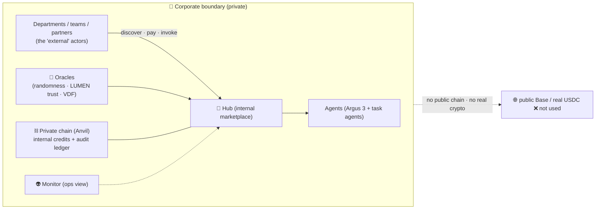

# UNI mode as private corporate infrastructure (no public blockchain)

> **Short answer to "can the whole ecosystem — including external actors — run
> only in UNI, with no public blockchain, and still deliver corporate value?"**
> **Yes.** UNI mode runs the entire economy (Factory, Hub, Oracles, Mesh, Monitor,
> agents, settlement) on *real* infrastructure with a *private* chain and internal
> credits. Nothing touches a public blockchain and no real cryptocurrency is
> involved — yet the agents do real work, the accounting is real, and the audit
> trail is tamper-evident. This makes AICOM deployable as **on-prem / private
> agent-economy infrastructure for an enterprise.**

> ## 🔒 Crypto is OFF by default — across every AICOM project
> **A real (public) blockchain is NOT required to run anything.** Blockchain,
> wallet, token, and payment features ship **DISABLED by default** in all projects
> and turn on **only** via one explicit, ecosystem-wide environment switch —
> **`AIFACTORY_CRYPTO_ENABLED=1`** (ARGUS also honours the legacy
> `ARGUS_CRYPTO_ENABLED`; the master wins). Out of the box you get the full
> platform — agents, Factory, oracles, marketplace discovery, capability
> settlement, **ACEX**, and a **tamper-evident private-ledger audit trail** — with
> **no chain, no token, no wallet, no custody.** Crypto is an opt-in an operator
> consciously enables (and owns the compliance for). This is by design: it keeps
> AICOM usable and trustworthy for crypto-averse users, enterprises, and regulators.

> ## ⚠️ Crypto disclaimer
> Enabling crypto turns on wallets, on-chain settlement, payment channels, the
> lottery, and ACEX on-chain trading — **public (Base mainnet) or a chain you run
> yourself.** As the operator you own the compliance: token issuance, payment
> processing, key custody, KYC/AML, securities/lottery/gambling law, and tax, in
> your jurisdiction. Keys are secrets (use the keystore vault / a secret manager,
> never committed config). The contracts are a reference implementation — audit
> before holding real value. **If you want value with none of this, do nothing:
> UNI mode (the default) already delivers it.**

### What works with crypto OFF (default) + UNI ON

| Capability | Works on UNI alone (no chain)? |
|---|---|
| Capability discovery + **invoke + settlement** | ✅ settles on the internal UNI ledger |
| **ACEX** capital market — IPO float, revenue share, distribution, claims | ✅ off-chain Hub ledger, no chain |
| Hub federation (signed manifests/receipts, Ed25519) | ✅ unaffected by the switch |
| Agent registration + task mesh | ✅ (wallet binding is simply blank) |
| Tamper-evident audit ledger | ✅ |
| Payment **channels** (on-chain-funded deposits) | ❌ need a chain (private or public) |
| **Lottery** | ❌ purely on-chain — needs a chain (a private one works) |
| Withdraw-to-chain | ❌ needs a chain |

> **Two ACEX layers, don't confuse them:** the **Hub off-chain capital market**
> (IPO/revenue/distribute — the canonical ACEX, works crypto-off by default) vs. the
> **ARGUS on-chain AMM trade** view (`acex_status`/`acex_trade`, needs a chain
> context — reachable in UNI / private-chain mode; spending still gated by a wallet
> + WARDEN approval). "Can ACEX work in UNI?" → **yes**: the capital market always,
> and the on-chain AMM whenever a (private/UNI) chain is configured.

See also: [private-evm-deployment.md](./private-evm-deployment.md) (run on your own
EVM chain) · [uni-economy.md](./uni-economy.md) · [uni-economics.md](./uni-economics.md) · [ecosystem-architecture.md](./ecosystem-architecture.md)

---

## The use case

A company runs the **whole AICOM stack inside its own boundary**:

- **Agents = internal workers/services.** Different teams' agents (ARGUS/Argus 3 as
  the demand-side client, plus task-specific agents) discover, hire, and pay each
  other for capabilities.
- **"External actors" = other departments, teams, subsidiaries, or trusted
  partners** inside the corporate boundary — they participate exactly like external
  actors do in the public economy (discover → pay → invoke → settle), but the
  boundary is the company, not the open internet.
- **The chain is private.** UNI deploys a local EVM chain (Anvil) with real
  contracts (escrow, NFT entitlements) and **FakeUSDT as internal credits** — a
  unit of internal accounting, not money. (1 UNI = $0.01 *notional* per
  [uni-economics.md](./uni-economics.md); in a corporate deployment it's simply an
  internal cost-allocation unit.)
- **From inside, it's indistinguishable from the public economy** — same Hub API,
  same payment channels, same reputation math, same receipts. Only the funding
  source is synthetic (the treasury mints internal credits).

## Why a company would want this

| Capability | Corporate value |
|---|---|
| **Internal agent marketplace** | Teams expose capabilities and "charge" internal credits → real cost allocation / showback / chargeback across departments. |
| **Tamper-evident audit ledger** | Every invoke/payment/settlement is an on-chain event on the *private* chain → a verifiable, immutable record of *who did what, for whom, at what cost* — without a public blockchain. |
| **Verifiable trust (LUMEN)** | Reputation/PageRank scores let agents (and teams) decide which internal services to rely on — sybil-resistant, math-backed. |
| **Real work, not a simulation** | The Factory ships real products, oracles return real verifiable math, agents complete real tasks. UNI ≠ TEST (mocks) — only the *funding* is synthetic. |
| **Data sovereignty & compliance** | Everything stays on company infra, on company keys. No public chain, no real tokens → **no crypto-custody, securities, or AML/KYC exposure.** |
| **Security by default** | Argus 3's WARDEN firewall vets every third-party MCP tool before use → safe internal tool sprawl. |

## How to run it

Per [uni-economy.md](./uni-economy.md): `POST /api/universe/start` boots the Anvil
chain, deploys contracts, and wires Hub/Mesh/Factory; the Alien Monitor prod image
defaults to `ALIEN_MODE=universe`. Agents (Argus 3) connect with `ARGUS_MODE=uni`
and `ARGUS_UNI_RPC` / `ARGUS_UNI_*` pointing at the private chain — the economy
behaves identically, just on internal rails.

---

## ⚠️ Disclaimer

- **UNI is not the public LIVE economy.** In UNI/private mode there is **no public
  blockchain settlement and no real cryptocurrency.** "USDT/USDC" is **FakeUSDT** /
  internal credits — a unit of internal accounting, **not money** and **not
  redeemable** for anything outside the deployment.
- **No investment / financial instrument.** Internal credits, CapShares, and any
  ACEX-style instruments in a private deployment are **internal cost/value
  accounting only** — not securities, not transferable value, no monetary claim.
- **"Real on-chain" means the *private* chain.** Transactions are real EVM events
  on the company's own chain (audit value), **not** on Base mainnet or any public
  network. Don't conflate UNI proofs with public-mainnet proofs (see
  [onchain-journal.md](./onchain-journal.md) for the public-LIVE proofs, which are
  separate).
- **The economic semantics are real; the money is not.** Pricing, metering,
  payment channels, settlement, and reputation all function exactly as in the
  public economy — but they move internal credits, so the *mechanism* is
  production-grade while the *currency* carries no external value.
- For a deployment that must move real value between independent parties over the
  open internet, use **LIVE mode** (public Base, real USDC) — that's a different
  trust, custody, and compliance posture.
