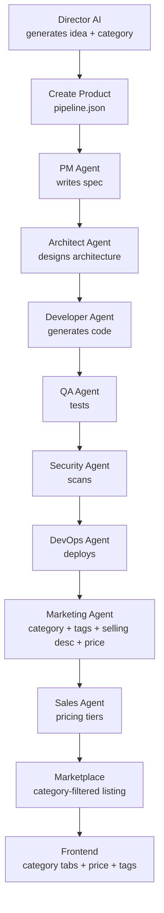

# Product Categorization & Marketplace Enhancements Plan

## Overview

Extend the AI-Factory to support product categorization (grouping by theme), Director + Marketer collaboration on categories, and a richer marketplace with selling descriptions, pricing, and category-based browsing.

---

## 1. Data Model Changes

### 1.1 Product Fields (pipeline.json)

Add to each product in pipeline.json:
```json
{
  "category": "ai_ml|devtools|fintech|saas|ecommerce|iot|security|productivity",
  "tags": ["ai", "analytics", "dashboard"],
  "selling_description": "Short compelling marketplace description",
  "price_usd": 49.99,
  "price_tier": "starter|professional|enterprise"
}
```

### 1.2 Category Taxonomy

Predefined categories managed in config or hardcoded:
- `ai_ml` — AI/ML tools, chatbots, prediction engines
- `devtools` — Developer tools, CI/CD, code analysis
- `fintech` — Finance, crypto, payments
- `saas` — General SaaS platforms
- `ecommerce` — Online stores, marketplaces
- `iot` — IoT, embedded systems
- `security` — Security tools, scanners
- `productivity` — Productivity apps, collaboration

---

## 2. Director AI Changes

### 2.1 DirectorWorker._auto_create_product() — Add Category Assignment

In [`director/worker.py:238`](/director/worker.py:238) `_auto_create_product()`:

- Add a `category` field to the product idea list
- Each idea gets a predefined category:
  ```python
  product_ideas = [
      ("AI-powered analytics dashboard...", "ai_ml"),
      ("Automated code review assistant...", "devtools"),
      ("Smart document processing...", "ai_ml"),
      ("Multi-cloud cost optimization...", "devtools"),
      ("Real-time collaborative whiteboard...", "productivity"),
      ("Automated social media content...", "saas"),
      ("Intelligent customer support chatbot...", "saas"),
      ("API monitoring and observability...", "devtools"),
      ("DevSecOps pipeline automation...", "security"),
      ("Personalized learning platform...", "productivity"),
  ]
  ```
- Store `category` in the product dict
- Store initial `tags` based on category + idea keywords

### 2.2 Director DecisionEngine — Categorization Recommendations

In [`director/decision_engine.py`](/director/decision_engine.py:73) `generate_decisions()`:

- Add logic to suggest re-categorization if a product doesn't fit its category
- Track which categories have most products (portfolio balance)

---

## 3. Marketing Agent Enhancements

### 3.1 Add Marketplace Fields to MarketingAgent

In [`agents/marketing.py:20`](/agents/marketing.py:20) `MARKETING_SYSTEM_PROMPT`:

Add to the output format:
```json
{
  "category": "ai_ml",
  "tags": ["ai", "analytics"],
  "selling_description": "Short compelling description for marketplace listing",
  "price_recommendation": {
    "starter": 9.99,
    "professional": 49.99,
    "enterprise": 199.99
  }
}
```

### 3.2 Marketing Agent Output

The Marketing agent's `execute()` should now output:
- `category` — assigned/verified category
- `tags` — relevant tags
- `selling_description` — marketplace-friendly description
- `price_recommendation` — suggested pricing tiers

### 3.3 Save Enhanced Marketing Data

In the artifact `state/{product_id}/marketing_content.json`:
```json
{
  "product_id": "...",
  "marketing": {
    "product_name": "...",
    "tagline": "...",
    "short_description": "...",
    "category": "ai_ml",
    "tags": ["ai", "analytics"],
    "selling_description": "...",
    "price_recommendation": {...},
    ...
  }
}
```

---

## 4. Pipeline Changes

### 4.1 New Pipeline State: MARKETPLACE_READY

Add after `SALES_ACTIVE` in the pipeline flow:
```
... → MARKET_CONTENT_READY → SALES_ACTIVE → **MARKETPLACE_READY** → SANDBOX_RUNNING → ...
```

### 4.2 New Task for Marketplace Preparation

In [`pipeline_worker.py`](/pipeline_worker.py:474) `_create_next_task()`:

After SALES_ACTIVE completes, create a `marketplace_prep` task that:
1. Takes marketing output (category, selling_description, tags)
2. Takes sales output (pricing)
3. Combines them into a marketplace entry
4. Saves to product data

This can be a lightweight step (not a full agent) or handled by the Marketing agent's enhanced output.

**Simpler approach:** Skip the new state. Instead, the Marketing agent already outputs everything needed. The product page just needs to render these fields. The category can be assigned at creation time by Director + refined by Marketing.

---

## 5. Backend API Changes

### 5.1 Products API — Add Category & Marketplace Fields

In [`web/backend/api/products.py:22`](/web/backend/api/products.py:22) `list_products()`:

Add to the response:
```python
products.append({
    "id": pid,
    "name": product_name,
    "category": marketing.get("category") or product.get("category", "uncategorized"),
    "tags": marketing.get("tags", []),
    "selling_description": marketing.get("selling_description", ""),
    "price_usd": price_usd,
    "price_tier": sales_config.get("pricing", {}).get("tier", "professional"),
    ...
})
```

### 5.2 New Endpoint: GET /api/products/categories

```python
@router.get("/categories")
async def list_categories():
    """List all product categories with counts."""
    # Aggregate categories from pipeline products + marketing data
    return {"categories": [...]}
```

### 5.3 New Endpoint: GET /api/products?category=ai_ml

```python
@router.get("")
async def list_products(category: str = None):
    """List products, optionally filtered by category."""
```

---

## 6. Frontend Marketplace Changes

### 6.1 Product Interface Update

In [`web/frontend/lib/api.ts:11`](/web/frontend/lib/api.ts:11) `Product`:

```typescript
export interface Product {
  id: string;
  name: string;
  category: string;
  tags: string[];
  selling_description: string;
  price_usd: number;
  price_tier: string;
  ...
}
```

### 6.2 Marketplace Page — Category Tabs

In [`web/frontend/app/page.tsx:348`](/web/frontend/app/page.tsx:348) `ProductsSection`:

- Add **category tabs/filter bar** at the top (All | AI/ML | DevTools | FinTech | SaaS | etc.)
- Group products by category when viewing "All"
- Show category badge on each product card
- Show price on the card

### 6.3 Product Card — Rich Display

Each card shows:
```
┌──────────────────────────────────┐
│ [Category Badge]  [Price: $49]  │
│ Product Name                     │
│ Selling description (2 lines)    │
│ [tag1] [tag2] [tag3]             │
│ Status: Completed  •  2d ago     │
└──────────────────────────────────┘
```

### 6.4 Product Detail Page — Marketplace Info

In [`web/frontend/app/product/[id]/page.tsx`](/web/frontend/app/product/[id]/page.tsx):

Add a **Marketplace Info** section showing:
- Category badge
- Selling description
- Price (with tier options)
- Tags
- "Purchase" button with price

---

## 7. Admin Panel Changes

### 7.1 Pipeline Tab — Category Grouping

In [`web/frontend/app/admin/page.tsx:463`](/web/frontend/app/admin/page.tsx:463) `PipelineTab`:

- Add category filter dropdown
- Group products by category in the list
- Show category on each product row

### 7.2 Director Tab — Portfolio Overview

Add a portfolio view showing:
- Products per category (pie/bar chart)
- Category balance recommendations

---

## 8. Browser Testing Tool

### 8.1 Option: Playwright MCP Server

Set up a lightweight MCP server using Playwright that can:
- Open Chrome
- Navigate to localhost:8080/admin
- Take screenshots
- Run E2E tests on the admin panel

### 8.2 Implementation

```bash
npm install -g @anthropic/browser-action  # or Playwright
```

Create a simple test script at `tests/browser/`:

```typescript
// tests/browser/admin_test.ts
import { chromium } from 'playwright';

async function test() {
  const browser = await chromium.launch();
  const page = await browser.newPage();
  await page.goto('http://localhost:8080/admin/login');
  // ...test login, providers, pipeline...
  await browser.close();
}
```

### 8.3 MCP Server for Browser

Create an MCP server at `mcp-servers/browser-server/` that exposes:
- `open_url` — open URL in browser
- `click_element` — click by selector
- `fill_form` — fill form fields
- `screenshot` — take screenshot
- `assert_text` — check text exists on page

---

## Implementation Order

| Step | File | Change | Complexity |
|------|------|--------|-----------|
| 1 | [`director/worker.py`](/director/worker.py:238) | Add category to product ideas | Easy |
| 2 | [`agents/marketing.py`](/agents/marketing.py:20) | Add category/tags/selling_description/price to prompt+output | Medium |
| 3 | [`web/backend/api/products.py`](/web/backend/api/products.py:22) | Add category, tags, selling_description, price to response | Easy |
| 4 | [`web/frontend/lib/api.ts`](/web/frontend/lib/api.ts:11) | Update Product interface | Easy |
| 5 | [`web/frontend/app/page.tsx`](/web/frontend/app/page.tsx:348) | Add category tabs, price, tags to ProductsSection | Medium |
| 6 | [`web/frontend/app/product/[id]/page.tsx`](/web/frontend/app/product/[id]/page.tsx) | Add marketplace info section | Medium |
| 7 | [`web/frontend/app/admin/page.tsx`](/web/frontend/app/admin/page.tsx:463) | Add category filter in PipelineTab | Medium |
| 8 | New: `tests/browser/` | Set up Playwright browser testing | Medium |

---

## Mermaid Diagram: Data Flow



---

## Mermaid Diagram: Marketplace UI Layout

```mermaid
flowchart LR
    subgraph Marketplace
        CAT[Category Tabs<br/>All | AI/ML | DevTools | ...]
        GRID[Product Grid]
    end
    
    CAT --> GRID
    
    subgraph ProductCard
        CARD[Glass Card]
        CARD --> BADGE[Category Badge]
        CARD --> PRICE[Price: $49]
        CARD --> NAME[Product Name]
        CARD --> DESC[Selling Description]
        CARD --> TAGS[Tag1 Tag2 Tag3]
        CARD --> STATUS[Status + Time]
    end
    
    GRID --> CARD
```
