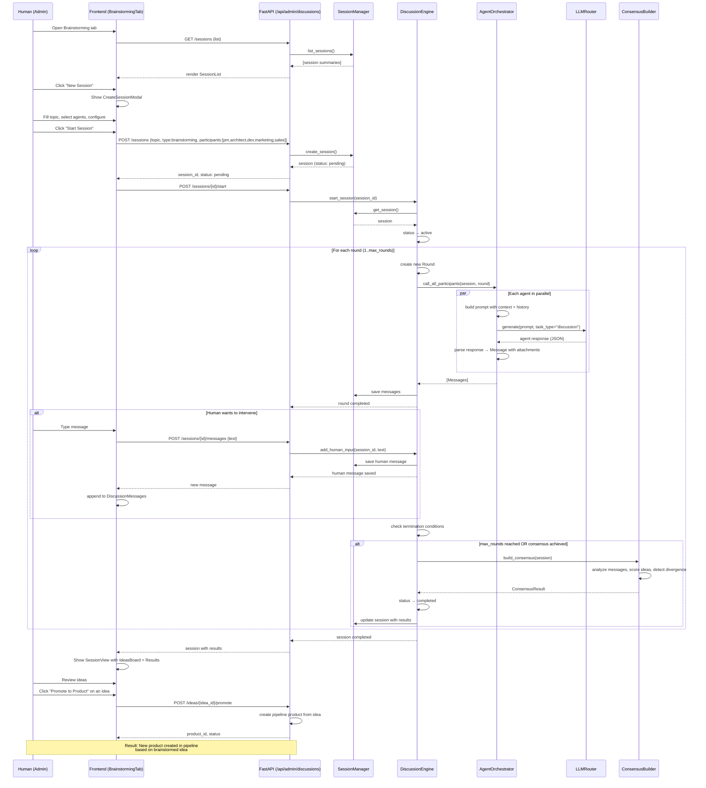

# Corporate AI-Agent Chat — Architecture

## 1. Overview

**Corporate AI-agent chat** is a system where existing AI agents (analyst, architect, dev, devops, evolution_analyst, marketing, pm, qa, sales, security) run structured multi-agent discussions while a human can start sessions, participate, and consume results.

It integrates into the existing admin UI as a new **Brainstorming** tab and reuses the same FastAPI backend, LLM router, and JWT authentication.

---

## 2. Data structures (JSON Schema)

### 2.1 Session

Stored at `/app/data/discussions/sessions/{session_id}.json`

```json
{
  "session_id": "uuid-string",
  "topic": "Topic title or problem under discussion",
  "session_type": "brainstorming | feature_discussion | strategy_session | product_idea",
  "status": "pending | active | paused | completed | cancelled",
  "created_by": "admin",
  "created_at": 1714512345.678,
  "updated_at": 1714512345.678,
  "completed_at": null,
  "participants": ["pm", "architect", "dev", "marketing", "sales"],
  "context": {
    "product_id": "prod-xxx" | null,
    "product_context": "string — current product, roadmap, features",
    "additional_instructions": "string — extra instructions from the user",
    "history_summary": "string — short history of prior discussions on this topic"
  },
  "config": {
    "max_rounds": 5,
    "max_tokens_per_agent": 4000,
    "temperature": 0.8,
    "model_role": "heavy" | "light",
    "allow_human_interrupt": true,
    "consensus_threshold": 0.7,
    "auto_conclude": true
  },
  "rounds": [
    {
      "round_number": 1,
      "started_at": 1714512345.678,
      "completed_at": 1714512350.123,
      "messages": ["msg-uuid-1", "msg-uuid-2", "msg-uuid-3"]
    }
  ],
  "results": {
    "summary": "Final discussion summary",
    "ideas": ["idea-1", "idea-2"],
    "consensus_topics": ["Topic 1", "Topic 2"],
    "divergence_points": ["Topic where opinions diverged"],
    "action_items": ["Action 1", "Action 2"],
    "aggregated_rating": 0.85
  }
}
```

### 2.2 Message

Stored at `/app/data/discussions/messages/{message_id}.json`

```json
{
  "message_id": "uuid-string",
  "session_id": "session-uuid",
  "round_number": 1,
  "agent_type": "pm" | "architect" | "dev" | "human" | "system",
  "sender_name": "Alex (human)" | "PM Agent" | "Architect Agent",
  "content": "Agent or human message text",
  "timestamp": 1714512345.678,
  "metadata": {
    "tokens_used": 450,
    "model": "deepseek-chat",
    "provider": "deepseek_api",
    "latency_ms": 2300,
    "prompt_tokens": 2000,
    "completion_tokens": 450,
    "parent_message_id": null | "uuid"  // for threading
  },
  "attachments": [
    {
      "type": "idea" | "proposal" | "code_snippet" | "architecture_diagram" | "analysis",
      "title": "Attachment title",
      "data": {}  // structured data
    }
  ]
}
```

### 2.3 Idea (brainstorm output)

Stored at `/app/data/discussions/ideas/{idea_id}.json`

```json
{
  "idea_id": "uuid-string",
  "session_id": "session-uuid",
  "title": "Idea title",
  "description": "Idea description",
  "author_agent": "pm" | "architect" | "marketing" | "human",
  "supporters": ["pm", "architect"],
  "opposers": ["dev"],
  "score": {
    "overall": 8.5,
    "feasibility": 7.0,
    "innovation": 9.0,
    "market_potential": 8.5,
    "effort_estimate": "M" | "L" | "XL"
  },
  "tags": ["ai", "automation", "ux"],
  "created_at": 1714512345.678,
  "converted_to_product": false,
  "product_id": null
}
```

### 2.4 Discussion Summary (cache for fast list loading)

Stored at `/app/data/discussions/summary_index.json`

```json
{
  "sessions": [
    {
      "session_id": "uuid",
      "topic": "Topic",
      "session_type": "brainstorming",
      "status": "completed",
      "participants": ["pm", "architect"],
      "message_count": 24,
      "idea_count": 5,
      "created_at": 1714512345.678,
      "completed_at": 1714512350.123,
      "last_message_at": 1714512350.123,
      "summary_preview": "Short summary..."
    }
  ],
  "total_count": 42
}
```

---

## 3. Backend components

### 3.1 New files

```
web/backend/
├── discussion/
│   ├── __init__.py
│   ├── engine.py              # DiscussionEngine — main discussion orchestrator
│   ├── session_manager.py     # SessionManager — session CRUD
│   ├── brainstorming.py       # BrainstormingSessionManager — brainstorming logic
│   ├── agent_orchestrator.py  # AgentOrchestrator — agent calls via LLM
│   ├── consensus.py           # ConsensusBuilder — aggregate results, find consensus
│   ├── context_provider.py    # ContextProvider — gather context (product, roadmap, history)
│   └── models.py              # Pydantic models for API
├── api/
│   └── admin/
│       └── discussions.py     # Discussion API endpoints
```

### 3.2 DiscussionEngine (`web/backend/discussion/engine.py`)

**Main class** managing the discussion lifecycle:

```python
class DiscussionEngine:
    """
    Orchestrates multi-agent discussions.
    
    Lifecycle:
    1. Create session via SessionManager
    2. Start discussion → run rounds
    3. Each round:
       a. ContextProvider gathers relevant context
       b. AgentOrchestrator calls each participant agent via LLM
       c. Collect responses → store as Messages
       d. Check termination conditions
    4. ConsensusBuilder aggregates results
    5. Save results to session
    """
    
    async def create_session(self, request: CreateSessionRequest) -> Session
    async def start_session(self, session_id: str) -> Session
    async def run_round(self, session_id: str) -> Round
    async def add_human_input(self, session_id: str, message: str) -> Message
    async def pause_session(self, session_id: str) -> Session
    async def resume_session(self, session_id: str) -> Session
    async def conclude_session(self, session_id: str) -> Session
    async def get_session(self, session_id: str) -> Session
    async def list_sessions(self, filters: SessionFilter) -> List[SessionSummary]
    async def delete_session(self, session_id: str)
```

### 3.3 AgentOrchestrator (`web/backend/discussion/agent_orchestrator.py`)

```python
class AgentOrchestrator:
    """
    Manages LLM calls to each participating agent in a discussion round.
    
    - Uses LLMRouter for provider selection and failover
    - Constructs agent-specific prompts with context + discussion history
    - Enforces max_tokens, temperature per session config
    - Handles timeouts and retries
    - Parses structured output (ideas, proposals, etc.)
    """
    
    def __init__(self, llm_router: LLMRouter)
    
    async def call_agent(
        self,
        agent_type: str,
        session: Session,
        round_history: List[Message],
        context: dict
    ) -> Message
    
    async def call_all_participants(
        self,
        session: Session,
        round_number: int
    ) -> List[Message]
```

**Agent prompt** (template):

```
SYSTEM: You are the {agent_type} agent in the AI team corporate chat.
Your role: {role_description}

Session context:
- Topic: {topic}
- Session type: {session_type}
- Product context: {context}

Discussion history (round {round_number - 1}):
{discussion_history}

Your task this round:
{brainstorming_prompt}

Rules:
1. Answer in character for your role
2. If you agree with the previous agent, say so
3. If you disagree, argue your case
4. Propose concrete ideas
5. Response format: JSON with fields: response_text, ideas[], proposed_action, agreement_level
```

### 3.4 BrainstormingSessionManager (`web/backend/discussion/brainstorming.py`)

```python
class BrainstormingSessionManager:
    """
    Specialized manager for brainstorming sessions.
    
    Features:
    - Idea generation phase: all agents propose ideas
    - Discussion phase: agents debate ideas
    - Voting phase: agents score/vote on ideas
    - Consolidation phase: top ideas selected and refined
    - Result: structured list of ideas with scores
    """
    
    async def generate_ideas(self, session: Session) -> List[Idea]
    async def run_discussion_round(self, session: Session, ideas: List[Idea]) -> List[Message]
    async def score_ideas(self, session: Session, ideas: List[Idea]) -> List[ScoredIdea]
    async def consolidate_results(self, session: Session, scored_ideas: List[ScoredIdea]) -> SessionResults
```

### 3.5 ConsensusBuilder (`web/backend/discussion/consensus.py`)

```python
class ConsensusBuilder:
    """
    Analyzes discussion messages and builds consensus.
    
    Methods:
    - Detect agreement/disagreement patterns
    - Calculate consensus score for each topic
    - Identify divergence points
    - Generate summary
    - Extract action items
    """
    
    async def build_consensus(self, session: Session) -> ConsensusResult
    async def detect_divergence(self, messages: List[Message]) -> List[DivergencePoint]
    async def generate_summary(self, session: Session) -> str
    async def extract_action_items(self, session: Session) -> List[str]
```

### 3.6 ContextProvider (`web/backend/discussion/context_provider.py`)

```python
class ContextProvider:
    """
    Gathers relevant context for a discussion session.
    
    Sources:
    - Product specification (if product_id is provided)
    - Current architecture
    - Recent evolution reports
    - Marketing analysis
    - Pipeline state
    - Previous discussion history
    - Director AI reports/decisions
    """
    
    async def get_product_context(self, product_id: str) -> dict
    async def get_roadmap_context(self) -> dict
    async def get_discussion_history(self, topic: str) -> List[SessionSummary]
    async def get_full_context(self, session: Session) -> dict
```

### 3.7 SessionManager (`web/backend/discussion/session_manager.py`)

```python
class SessionManager:
    """
    CRUD operations for discussion sessions.
    
    - Persists sessions to filesystem (JSON)
    - Manages summary index
    - Provides query/filter capabilities
    """
    
    async def create(self, request: CreateSessionRequest) -> Session
    async def get(self, session_id: str) -> Session
    async def update(self, session: Session) -> Session
    async def delete(self, session_id: str)
    async def list(self, filters: SessionFilter) -> List[SessionSummary]
    async def update_summary_index(self, session: Session)
```

---

## 4. API contracts

All endpoints are under `/api/admin/discussions` and protected with JWT authentication (`Depends(get_current_admin)`).

### 4.1 Session management

| Method | Path | Description |
|--------|------|-------------|
| POST | `/api/admin/discussions/sessions` | Create a new session |
| GET | `/api/admin/discussions/sessions` | List sessions (with filters) |
| GET | `/api/admin/discussions/sessions/{session_id}` | Get session |
| PATCH | `/api/admin/discussions/sessions/{session_id}` | Update session (pause/resume/config) |
| DELETE | `/api/admin/discussions/sessions/{session_id}` | Delete session |
| POST | `/api/admin/discussions/sessions/{session_id}/start` | Start session |
| POST | `/api/admin/discussions/sessions/{session_id}/pause` | Pause |
| POST | `/api/admin/discussions/sessions/{session_id}/resume` | Resume |
| POST | `/api/admin/discussions/sessions/{session_id}/conclude` | Conclude session |

### 4.2 Messages

| Method | Path | Description |
|--------|------|-------------|
| GET | `/api/admin/discussions/sessions/{session_id}/messages` | Get session messages |
| POST | `/api/admin/discussions/sessions/{session_id}/messages` | Send human message |
| DELETE | `/api/admin/discussions/sessions/{session_id}/messages/{message_id}` | Delete message |

### 4.3 Results and ideas

| Method | Path | Description |
|--------|------|-------------|
| GET | `/api/admin/discussions/sessions/{session_id}/results` | Get session results |
| GET | `/api/admin/discussions/sessions/{session_id}/ideas` | Get generated ideas |
| POST | `/api/admin/discussions/sessions/{session_id}/ideas/{idea_id}/promote` | Promote idea to product (create pipeline entry) |

### 4.4 Additional

| Method | Path | Description |
|--------|------|-------------|
| GET | `/api/admin/discussions/agents` | List agents available to participate |
| GET | `/api/admin/discussions/history?topic={topic}` | Search discussions by topic |
| GET | `/api/admin/discussions/stats` | Session statistics |

### 4.5 Pydantic models (request/response)

```python
# ── Session ──

class CreateSessionRequest(BaseModel):
    topic: str = Field(..., min_length=3, max_length=500)
    session_type: SessionType  # brainstorming | feature_discussion | strategy_session | product_idea
    participants: list[AgentType]  # which agents participate
    product_id: Optional[str] = None
    additional_instructions: Optional[str] = None
    config: Optional[SessionConfig] = None

class SessionConfig(BaseModel):
    max_rounds: int = Field(default=5, ge=1, le=20)
    max_tokens_per_agent: int = Field(default=4000, ge=500, le=16000)
    temperature: float = Field(default=0.8, ge=0.0, le=2.0)
    model_role: str = Field(default="heavy", pattern="^(heavy|light)$")
    allow_human_interrupt: bool = True
    consensus_threshold: float = Field(default=0.7, ge=0.0, le=1.0)
    auto_conclude: bool = True

class SessionResponse(BaseModel):
    session_id: str
    topic: str
    session_type: str
    status: str
    participants: list[str]
    config: SessionConfig
    round_count: int
    message_count: int
    created_at: float
    updated_at: float
    completed_at: Optional[float]
    results: Optional[SessionResults]

class SessionSummary(BaseModel):
    session_id: str
    topic: str
    session_type: str
    status: str
    participants: list[str]
    message_count: int
    idea_count: int
    created_at: float
    completed_at: Optional[float]
    summary_preview: Optional[str]

class SessionListResponse(BaseModel):
    sessions: list[SessionSummary]
    total_count: int
    page: int
    page_size: int

# ── Message ──

class SendMessageRequest(BaseModel):
    text: str = Field(..., min_length=1, max_length=10000)

class MessageResponse(BaseModel):
    message_id: str
    session_id: str
    round_number: int
    agent_type: str
    sender_name: str
    content: str
    timestamp: float
    attachments: list[Attachment]

class MessagesListResponse(BaseModel):
    messages: list[MessageResponse]
    total_count: int

# ── Results ──

class SessionResults(BaseModel):
    summary: str
    ideas: list[IdeaResponse]
    consensus_topics: list[str]
    divergence_points: list[str]
    action_items: list[str]
    aggregated_rating: Optional[float]

class IdeaResponse(BaseModel):
    idea_id: str
    title: str
    description: str
    author_agent: str
    score: Optional[dict]
    tags: list[str]
    created_at: float

# ── Other ──

class AvailableAgent(BaseModel):
    agent_type: str
    display_name: str
    description: str
    icon: str
    color: str
    is_available: bool

class DiscussionStats(BaseModel):
    total_sessions: int
    active_sessions: int
    completed_sessions: int
    total_messages: int
    total_ideas: int
    sessions_by_type: dict[str, int]
```

---

## 5. Frontend components

### 5.1 New layout

```
web/frontend/
├── app/
│   └── admin/
│       ├── page.tsx                              # existing file — add 'brainstorming' tab
│       └── components/
│           └── brainstorming/                     # new components
│               ├── BrainstormingTab.tsx           # main tab
│               ├── SessionList.tsx                # session list
│               ├── CreateSessionModal.tsx         # create-session modal
│               ├── SessionView.tsx                # session view
│               ├── DiscussionMessages.tsx         # discussion message feed
│               ├── AgentMessage.tsx               # agent message (avatar, color)
│               ├── HumanMessageInput.tsx          # human input field
│               ├── IdeasBoard.tsx                 # ideas board (kanban-style)
│               ├── IdeaCard.tsx                   # idea card
│               ├── SessionControls.tsx            # controls (pause/resume/conclude)
│               ├── AgentSelector.tsx              # participant agent picker
│               └── SessionResults.tsx             # results display
└── lib/
    └── api.ts                                     # extend with discussion API methods
```

### 5.2 Main components

#### BrainstormingTab
- Main container for the Brainstorming tab
- Two modes: session list / single session view
- "New Brainstorming Session" button

#### SessionList
- Table or list of all sessions
- Filters: type, status, date
- Quick preview (summary)
- Search by topic

#### CreateSessionModal
- "Topic" field
- Session type (radio buttons with icons)
- `AgentSelector` — multi-select agents
- Optional: link to product, extra instructions
- "Start Session" button

#### AgentSelector
- Agent grid with avatars
- Checkbox selection
- UI hints per role

#### SessionView
- Header with topic and status
- `DiscussionMessages` — message feed
- `HumanMessageInput` — at bottom
- `SessionControls` — control bar
- `IdeasBoard` — right or bottom

#### DiscussionMessages
- Auto-scrolling feed
- Each row rendered by `AgentMessage`
- Distinct colors/icons per agent
- Near real-time updates via polling or SSE

#### AgentMessage
- Agent avatar (unique per type)
- Color scheme: one color per agent
- Icon + agent name
- Attachments (ideas, proposals — expandable cards)
- Timestamp

#### IdeasBoard
- Columns: Proposed / Discussing / Scored / Selected
- Drag & drop (or buttons)
- Each idea as `IdeaCard`

#### SessionControls
- Start / Pause / Resume
- Conclude session
- Status indicator (round progress bar)

### 5.3 Agent color scheme

```typescript
const AGENT_DISPLAY_CONFIG = {
  pm:      { label: 'PM',           icon: '📋', color: '#60a5fa',  bg: 'bg-blue-500/20' },
  analyst: { label: 'Analyst',      icon: '🔍', color: '#a78bfa',  bg: 'bg-purple-500/20' },
  architect: { label: 'Architect',  icon: '🏗️', color: '#818cf8', bg: 'bg-indigo-500/20' },
  dev:     { label: 'Developer',    icon: '💻', color: '#34d399',  bg: 'bg-emerald-500/20' },
  qa:      { label: 'QA',           icon: '🧪', color: '#fbbf24',  bg: 'bg-amber-500/20' },
  devops:  { label: 'DevOps',       icon: '🚀', color: '#f472b6',  bg: 'bg-pink-500/20' },
  security: { label: 'Security',    icon: '🛡️', color: '#ef4444', bg: 'bg-red-500/20' },
  marketing: { label: 'Marketing',  icon: '📢', color: '#2dd4bf',  bg: 'bg-teal-500/20' },
  sales:   { label: 'Sales',        icon: '💰', color: '#fb923c',  bg: 'bg-orange-500/20' },
  evolution_analyst: { label: 'Evolution', icon: '📈', color: '#22d3ee', bg: 'bg-cyan-500/20' },
  human:   { label: 'You',          icon: '👤', color: '#e2e8f0',  bg: 'bg-white/10' },
};
```

### 5.4 Adding the tab to the sidebar

To the existing `tabs` array in [`web/frontend/app/admin/page.tsx`](web/frontend/app/admin/page.tsx:73) add:

```typescript
{ id: 'brainstorming', label: 'Brainstorming', icon: Sparkles }
```

And in [`renderTab()`](web/frontend/app/admin/page.tsx:3887):

```typescript
case 'brainstorming':
  return <BrainstormingTab />;
```

---

## 6. Data flow (typical scenario)

### 6.1 Scenario: brainstorm a new product idea



### 6.2 Termination options

```mermaid
flowchart TD
    A[Check termination] --> B{Any condition met?}
    B -->|max_rounds reached| C[Conclude session]
    B -->|consensus_threshold achieved| C
    B -->|all agents agree on top ideas| C
    B -->|human clicked Conclude| C
    B -->|timeout (30min inactivity)| C
    B -->|no| D[Continue to next round]
    C --> E[Build consensus, save results]
    E --> F[status = completed]
```

---

## 7. Integration with existing agents

### 7.1 Agents as discussion participants

Any existing agent (subclass of [`BaseAgent`](agents/base_agent.py:81)) can join a discussion. The chat does **not** need a full pipeline `execute()` call: `AgentOrchestrator` calls the LLM directly with a custom prompt built from the agent role.

**How it works:**
1. Read `agent_type`, role_description, and system_prompt from each agent config
2. `AgentOrchestrator` builds a prompt from that data plus session context
3. Call the LLM via [`LLMRouter.generate()`](llm/router.py:141)
4. Parse the reply into a structured Message

**Direct wiring to existing agent classes** is not required — use `agent_type` and description to build the right prompt.

### 7.2 Pulling context from the existing system

`ContextProvider` reads:

| Source | Data |
|----------|--------|
| [`data/state/pipeline.json`](data/state/pipeline.json) | Current products and statuses |
| `data/specs/{product_id}/specification.json` | Product specification |
| `data/arch/{product_id}/architecture.json` | Architecture |
| `data/state/{product_id}/market_research.json` | Market research |
| `data/state/{product_id}/evolution_report.json` | Evolution reports |
| [`data/state/director_decisions.json`](data/state/director_decisions.json) | Director AI decisions |
| `data/logs/*.jsonl` | Agent activity history |

### 7.3 Persisting results for Director/Pipeline

After the session ends:
1. Results are saved under `/app/data/discussions/`
2. An entry is appended to `summary_index`
3. If an idea is promoted to a product, a `pipeline.json` entry is created (same as [`admin_create_product`](web/backend/main.py:243))
4. Director AI can consume discussion results as an extra signal

---

## 8. Anti-loops and avoiding endless discussions

### 8.1 Safeguards

| Mechanism | Description |
|----------|----------|
| **max_rounds** | Hard cap on rounds (default 5, max 20) |
| **consensus_threshold** | End when agreement exceeds the threshold |
| **auto_conclude** | If true, auto-end when consensus is reached |
| **timeout** | 30 minutes idle → auto-conclude |
| **boredom detection** | If the last N messages repeat the same points → conclude |
| **human interrupt** | Human can stop or steer the discussion anytime |
| **diversity penalty** | Penalise agents that echo others without adding value |
| **max_tokens** | Per-agent response limit |

### 8.2 Boredom detection (optional)

```python
async def check_boredom(self, round_history: List[Message]) -> bool:
    """
    Detect if discussion is stuck in a loop.
    Returns True if last N messages show no new ideas.
    """
    # 1. Check semantic similarity of last 3-4 messages
    # 2. Check if new ideas were proposed in last 2 rounds
    # 3. If no new ideas in 2+ rounds → conclude
```

---

## 9. Implementation checklist (order of work)

### Step 1: Data Layer
1. Add Pydantic models (`web/backend/discussion/models.py`)
2. Implement `SessionManager` with JSON persistence
3. Create on-disk directory layout

### Step 2: Core Engine
4. Implement `ContextProvider` — gather context from existing data
5. Implement `AgentOrchestrator` — prompt builder and LLM call
6. Implement `DiscussionEngine` — session lifecycle

### Step 3: Brainstorming Logic
7. Implement `BrainstormingSessionManager` — brainstorm phases
8. Implement `ConsensusBuilder` — aggregation and analysis

### Step 4: API Layer
9. Implement endpoints in `web/backend/api/admin/discussions.py`
10. Register the router in `web/backend/main.py`
11. Add client methods in `web/frontend/lib/api.ts`

### Step 5: Frontend
12. Build `AgentSelector` with visual agent picking
13. Build `CreateSessionModal`
14. Build `SessionList`
15. Build `AgentMessage` with color scheme
16. Build `DiscussionMessages` with auto-scroll
17. Build `HumanMessageInput`
18. Build `SessionControls` (pause/resume/conclude)
19. Build `IdeasBoard` and `IdeaCard`
20. Build `SessionView` composing the pieces
21. Build `BrainstormingTab` and add to sidebar
22. Build `SessionResults` for final display

### Step 6: Integration & Polish
23. Add near real-time updates (poll every 3–5 s or SSE)
24. Implement promote idea → pipeline product
25. Add validation, error handling, timeouts
26. E2E tests

---

## 10. Notes

- **LLM task_type**: Add a `"discussion"` task type to routing config [`model_providers.yaml`](data/config/model_providers.yaml)
- **Rate limiting**: Parallel calls to N agents can burst LLM usage — use a semaphore (e.g. max 3 concurrent LLM calls)
- **Streaming**: Optionally stream agent replies over SSE for a live UX
- **Storage consideration**: JSON files may not scale with huge session volume — consider SQLite later (like [`pipeline.db`](data/state/pipeline.db))
