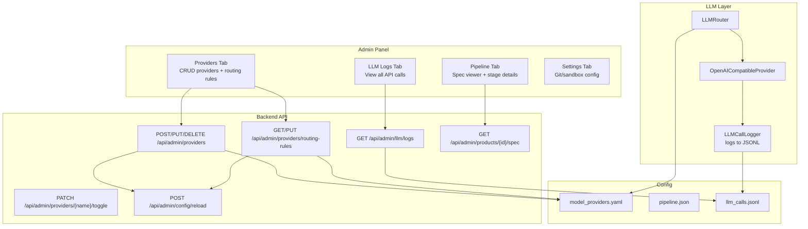

# AI-Factory Overhaul Plan

## Problem Analysis

### Root Cause: LLM Timeouts → Mock Data
- `qwen/qwen3.6-35b-a3b` responds in 60s+, but routing rules set `timeout_sec: 30`
- Routing rules reference `local_ollama` (disabled provider) → fallback chain breaks
- `BaseAgent._generate()` catches timeout exception → calls `_fallback_generate()` → template data with `0 files`, `0 bugs`, `0.0s`
- User sees fabricated output → thinks it's mock data

### Root Cause: No Provider Management UI
- PATCH endpoint only updates model names, not full config
- No way to add new providers (DeepSeek, etc.), toggle enable/disable, configure base URL/API key/timeout
- User explicitly rejected direct YAML editing

### Additional Gaps
- No LLM call logging (requests/responses invisible to user)
- No specification/TZ viewer per product
- Storefront truncates product names at 40 chars
- Pipeline stages not visible in detail
- No Git integration for generated code
- Sandbox deployment untested

---

## Architecture Diagram



---

## Phase 1: Provider Management UI (CRUD)

### Backend: [`web/backend/api/admin/dashboard.py`](/web/backend/api/admin/dashboard.py)

New endpoints:

| Method | Path | Purpose |
|--------|------|---------|
| `POST` | `/api/admin/providers` | Add new provider |
| `PUT` | `/api/admin/providers/{name}` | Update full provider config |
| `DELETE` | `/api/admin/providers/{name}` | Remove provider |
| `PATCH` | `/api/admin/providers/{name}/toggle` | Enable/disable provider |
| `GET` | `/api/admin/providers/routing-rules` | Get routing rules |
| `PUT` | `/api/admin/providers/routing-rules` | Update routing rules |

Each endpoint:
1. Reads/writes [`data/config/model_providers.yaml`](/data/config/model_providers.yaml)
2. Calls `llm_router.reload_config()` to hot-reload

### Frontend: [`web/frontend/app/admin/page.tsx`](/web/frontend/app/admin/page.tsx) (ProvidersTab)

Enhanced ProvidersTab with:

**Provider CRUD:**
- "Add Provider" button → modal form
- Form fields: Name, Type (openai_compatible/ollama), Base URL, API Key env, Heavy Model, Light Model, Context Window, Max Tokens, Priority, Enabled toggle
- "Test Connection" button → calls health check endpoint
- Edit button on each provider card → opens same form pre-filled
- Delete with confirmation
- Enable/disable toggle per provider

**Routing Rules Editor:**
- Table of routing rules
- Each row: task_type (select), preferred_provider (select from active), model_role (heavy/light), timeout_sec (number), fallback_provider (select)
- Add/remove rules

### API Client: [`web/frontend/lib/api.ts`](/web/frontend/lib/api.ts)

Add methods:
- `createProvider(data)` → POST
- `updateProvider(name, data)` → PUT
- `deleteProvider(name)` → DELETE
- `toggleProvider(name)` → PATCH toggle
- `getRoutingRules()` → GET
- `updateRoutingRules(rules)` → PUT

### Apply Working Config

After UI is ready, user will configure:
- `lm_studio` → heavy: `qwen/qwen3-coder-30b`, light: `qwen/qwen3-coder-30b`
- All routing rules → `preferred_provider: lm_studio`, `timeout_sec: 120`

---

## Phase 2: LLM Call Logging

### Backend: [`llm/openai_compatible.py`](/llm/openai_compatible.py) (lines 76-125)

Add logging wrapper in `generate()`:

```python
async def generate(self, prompt: str, config=None) -> str:
    cfg = config or GenerationConfig()
    start_time = time.time()
    try:
        # existing logic...
        response_text = result["choices"][0]["message"]["content"]
        self._log_llm_call(prompt, response_text, latency, success=True)
        return response_text
    except Exception as e:
        self._log_llm_call(prompt, str(e), latency, success=False, error=str(e))
        raise

def _log_llm_call(self, prompt, response, latency, success, error=None):
    """Log LLM call to JSONL file."""
    log_entry = {
        "timestamp": datetime.utcnow().isoformat(),
        "provider": self.name,
        "model": self.model,
        "prompt_preview": prompt[:500],
        "response_preview": response[:500] if isinstance(response, str) else response,
        "latency_ms": round(latency, 2),
        "success": success,
        "error": error,
        "tokens_used": ...,
    }
    with open("/app/data/logs/llm_calls.jsonl", "a") as f:
        f.write(json.dumps(log_entry) + "\n")
```

### Backend: New endpoint in [`web/backend/api/admin/dashboard.py`](/web/backend/api/admin/dashboard.py)

```python
@router.get("/llm/logs")
async def get_llm_logs(limit: int = 100, provider: str = None, success: bool = None):
    """Get LLM call logs from JSONL file."""
    log_file = Path("/app/data/logs/llm_calls.jsonl")
    logs = []
    if log_file.exists():
        with open(log_file, "r") as f:
            for line in f:
                entry = json.loads(line)
                if provider and entry.get("provider") != provider:
                    continue
                if success is not None and entry.get("success") != success:
                    continue
                logs.append(entry)
    return {"logs": logs[-limit:]}
```

### Frontend: New [`LLMLogsTab`](/web/frontend/app/admin/page.tsx)

- Add "LLM Logs" entry to sidebar tabs
- Fetch from `GET /api/admin/llm/logs`
- Table: Timestamp | Provider | Model | Latency | Status (success/fail)
- Click row → expand to show full prompt and response in a modal
- Filter by provider dropdown, success/fail toggle
- Auto-refresh every 5s

---

## Phase 3: Specification Viewer & Full Product Names

### Backend: New endpoint in [`web/backend/api/admin/dashboard.py`](/web/backend/api/admin/dashboard.py)

```python
@router.get("/products/{product_id}/spec")
async def get_product_spec(product_id: str):
    """Get full specification for a product."""
    spec_file = Path(f"/app/data/specs/{product_id}/specification.json")
    if spec_file.exists():
        with open(spec_file) as f:
            return json.load(f)
    # Also check task output data
    state_file = Path("/app/data/state/pipeline.json")
    ...
```

### Frontend: PipelineTab Enhancement

In [`PipelineTab`](/web/frontend/app/admin/page.tsx:438):

- Each product card gets a "View Spec" button
- Click → modal showing:
  - Product name, description, target audience
  - Core features list
  - User stories
  - Technical risks
  - Architecture overview
  - All completed task outputs

### Frontend: Storefront Fix

In [`web/frontend/app/page.tsx`](/web/frontend/app/page.tsx:415):

Change:
```tsx
{product.idea?.slice(0, 40) || 'Product'}
```
To:
```tsx
{product.spec?.product_name || product.idea || 'Product'}
```

---

## Phase 4: Pipeline Stage Visibility

### Frontend: PipelineTab Enhancement

Current: shows product name + progress bar + badge only.

Enhanced view per product card:
- Timeline showing all stages completed/pending/current
- Each completed stage is clickable → shows output summary
- Expandable detail per stage (what the agent produced)
- Color-coded by state (green=done, yellow=running, gray=pending)

---

## Phase 5: Git Integration & Sandbox

### Backend: Git Endpoints

```python
@router.post("/products/{product_id}/git/init")
async def init_git_repo(product_id: str):
    """Initialize git repo for a product and commit code artifacts."""
    
@router.post("/products/{product_id}/git/push")
async def push_to_remote(product_id: str, body: {remote_url, branch}):
    """Push code to remote git repository."""
```

### Backend: Sandbox Enhancement

Verify/improve existing sandbox endpoints in [`web/backend/api/sandbox.py`](/web/backend/api/sandbox.py):
- `POST /api/admin/sandbox/start/{product_id}` - start sandbox with generated code
- `POST /api/admin/sandbox/stop/{sandbox_id}` - stop sandbox
- `GET /api/admin/sandbox/status/{sandbox_id}` - get sandbox status

### Frontend: Sandbox Tab

- New "Sandbox" tab or embed in PipelineTab
- "Launch Sandbox" button per completed product
- Shows sandbox status (running/stopped)
- Link to sandbox URL

---

## File Change Summary

| File | Changes |
|------|---------|
| [`llm/openai_compatible.py`](/llm/openai_compatible.py) | Add LLM call logging to generate() |
| [`web/backend/api/admin/dashboard.py`](/web/backend/api/admin/dashboard.py) | Add provider CRUD, routing rules mgmt, LLM logs endpoint, spec endpoint, git endpoints |
| [`web/backend/main.py`](/web/backend/main.py) | Register new routers if needed |
| [`web/frontend/lib/api.ts`](/web/frontend/lib/api.ts) | Add API methods for provider CRUD, routing rules, LLM logs, spec, git |
| [`web/frontend/app/admin/page.tsx`](/web/frontend/app/admin/page.tsx) | Enhanced ProvidersTab, new LLMLogsTab, enhanced PipelineTab, new Sandbox features |
| [`web/frontend/app/page.tsx`](/web/frontend/app/page.tsx) | Fix product name truncation at line 415 |

---

## Implementation Order

1. Provider CRUD backend (dashboard.py) + API client (api.ts)
2. Enhanced ProvidersTab UI with CRUD + routing rules editor
3. Apply working config via UI to fix LLM timeouts
4. LLM call logging in openai_compatible.py
5. LLM logs backend endpoint + frontend tab
6. Specification viewer backend + frontend
7. Storefront name truncation fix
8. Pipeline stage visibility enhancements
9. Git integration backend + frontend
10. Sandbox verification/enhancement

Each phase builds on the previous one and is independently testable.
