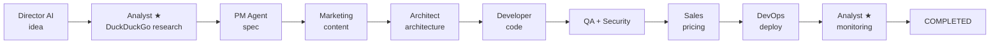

# Plan: New "Market Research Analyst" agent

## Problem

Products end up too shallow — there is no proper market research before the specification is written:

1. **Director AI** generates an idea (without market analysis)
2. **PM Agent** writes the spec from a raw idea
3. **Marketing Agent** does superficial market research **after** the product is already designed
4. **Evolution Analyst** retrospects without tying back to market data

## Solution

A new **Market Research Analyst** agent with DuckDuckGo access for real market research.
It runs in **two stages**:
1. **Early stage** (after idea): deep market research → informs the specification
2. **Late stage**: monitors outcomes and market fit (replaces Evolution Analyst)

Marketing Agent is simplified — content creation only.

### New pipeline

### Analyst responsibilities (stage 1 — Research)

1. **DuckDuckGo search** on the product topic
2. Competitor and market trend analysis
3. TAM/SAM sizing
4. Feature prioritisation (MVP vs competitive advantage)
5. Monetisation strategy
6. Product naming & positioning

### Analyst responsibilities (stage 2 — Monitoring)

1. Analyses telemetry and outcomes
2. Compares against initial research
3. Proposes improvements based on market shifts

### Files to change

| File | Change |
|------|--------|
| `agents/analyst.py` | **New** — MarketResearchAgent with DuckDuckGo search |
| `agents/__init__.py` | Export MarketResearchAgent |
| `pipeline_worker.py` | Init + mapping IDEA_RECEIVED→analyst, TELEMETRY_COLLECTING→analyst, daily revision for COMPLETED |
| `orchestrator/state_machine.py` | MARKET_RESEARCHED state, analyst in transitions + `_create_next_task` |
| `agents/pm.py` | Load research.json into prompt context |
| `agents/marketing.py` | Remove Stage A, content only |
| `web/frontend/app/admin/page.tsx` | `evolution_analyst` → `analyst` in pipeline visualization |
| `requirements.txt` | Add `duckduckgo_search` |

### Daily market revision

For every product in COMPLETED, every 24 hours a monitoring task for Analyst (stage 2) is created:
- Analyse current market position
- Compare with original research
- Suggest improvements / new features
- After completion the product stays COMPLETED

## Execution order

1. ✅ Update `requirements.txt` — add `duckduckgo_search`
2. ✅ Create `agents/analyst.py` — DuckDuckGo search + two-stage agent
3. ✅ Update `agents/__init__.py`
4. ✅ Update `pipeline_worker.py`
5. ✅ Update `orchestrator/state_machine.py`
6. ✅ Update `agents/pm.py`
7. ✅ Simplify `agents/marketing.py`
8. ✅ Update `web/frontend/app/admin/page.tsx` — evolution_analyst→analyst
9. ✅ Add daily market revision for COMPLETED products
10. ⬜ Rebuild container
