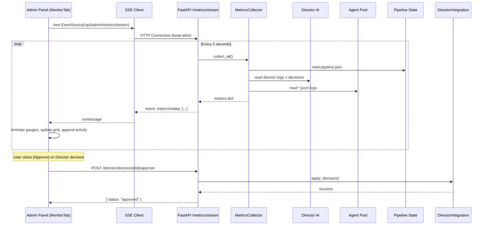

# Real-Time Monitoring Dashboard + Project Audit Plan

## 1. Current State Audit — Issues Found

### Critical Issues

| # | Issue | Location | Severity |
|---|-------|----------|----------|
| 1 | **Container never rebuilt** — all code changes from Phases 1-5 are on host filesystem only; running container has old code | Docker | CRITICAL |
| 2 | **DashboardTab polls ONCE on mount** — no auto-refresh, no real-time updates | `web/frontend/app/admin/page.tsx:138` | HIGH |
| 3 | **No WebSocket/SSE** — frontend cannot receive live metrics pushes | Architecture gap | HIGH |
| 4 | **Director decisions stored but invisible to admin** — `director_integration.py` writes to file but no UI to view/approve/reject | `orchestrator/director_integration.py` | HIGH |
| 5 | **Revenue metrics hardcoded to 0** — placeholder in dashboard endpoint | `web/backend/api/admin/dashboard.py:70-73` | MEDIUM |

### Medium Issues

| # | Issue | Location | Severity |
|---|-------|----------|----------|
| 6 | **No pipeline flow visualization** — PipelineTab shows static product list, no real-time DAG | `web/frontend/app/admin/page.tsx:452` | MEDIUM |
| 7 | **Agent metrics not in dashboard endpoint** — MetricsCollector collects agent data but `GET /dashboard` only returns pipeline + resources | `web/backend/api/admin/dashboard.py:22` | MEDIUM |
| 8 | **Director metrics not in dashboard** — no Director activity data served to frontend | `web/backend/api/admin/dashboard.py` | MEDIUM |
| 9 | **Escalation logs not exposed via API** — `escalation.py` stores logs in memory only (lost on restart) | `orchestrator/escalation.py:31` | MEDIUM |
| 10 | **No time-series metrics history** — data is point-in-time only, no charting capability | Architecture gap | MEDIUM |

### Low Issues / Observations

| # | Issue | Location | Severity |
|---|-------|----------|----------|
| 11 | `model_providers.yaml` has `local_ollama` as provider but `lm_studio` is the active one — stale config leftovers | `data/config/model_providers.yaml:9` | LOW |
| 12 | `config.yaml` agent defaults `timeout_sec: 30` conflicts with routing rules that specify 120s for architecture | `config.yaml:44` vs routing rules | LOW |
| 13 | `EvolutionEntry` TypeScript interface has `timestamp` field but JSON uses `created_at` — fixed in page.tsx but interface still wrong | `web/frontend/lib/api.ts:25` | LOW |

---

## 2. Architecture: Real-Time Monitoring Dashboard

### High-Level Design

```
┌─────────────────────────────────────────────────────────────┐
│                    Admin Panel (page.tsx)                     │
│  ┌─────────────┐ ┌──────────────┐ ┌──────────────────────┐  │
│  │  DashboardTab │ │  MonitorTab  │ │   DirectorTab (enh) │  │
│  │  (existing)   │ │  (NEW!)      │ │   (existing)        │  │
│  └─────────────┘ └──────────────┘ └──────────────────────┘  │
│         │               │                     │              │
│         ▼               ▼                     ▼              │
│  ┌──────────────────────────────────────────────────────┐   │
│  │           SSE Client (EventSource)                    │   │
│  │     Auto-polls /api/admin/metrics/stream              │   │
│  └──────────────────────────────────────────────────────┘   │
└─────────────────────────────────┬───────────────────────────┘
                                  │ SSE stream
                                  ▼
┌─────────────────────────────────────────────────────────────┐
│              FastAPI Backend (dashboard.py)                   │
│  ┌─────────────────────┐  ┌──────────────────────────────┐  │
│  │ GET /dashboard       │  │ GET /metrics/stream (SSE)   │  │
│  │ (enhanced)           │  │ (NEW!)                      │  │
│  └─────────────────────┘  └──────────────────────────────┘  │
│         │                           │                        │
│         ▼                           ▼                        │
│  ┌──────────────────────────────────────────────────────┐   │
│  │  MetricsCollector (reuse) + Director metrics +       │   │
│  │  Agent logs stream + Pipeline state + Escalation     │   │
│  └──────────────────────────────────────────────────────┘   │
└─────────────────────────────────────────────────────────────┘
```

### Backend Components

#### A. Enhanced `GET /api/admin/dashboard` (Modify existing)
Add to the current response:
- `agent_metrics` — per-agent status (active/idle/error, last activity, task count) from MetricsCollector
- `director_status` — last analysis time, report count, pending decisions count
- `escalation_summary` — recent failures, timeouts per agent
- `metrics_window` — 24h time-series snapshot for sparklines

#### B. New SSE Endpoint `GET /api/admin/metrics/stream` (NEW)
Server-Sent Events endpoint that pushes:
- **Full payload every 5 seconds**: all dashboard metrics
- **Agent activity events** (when agent starts/completes/fails a task)
- **Director events** (when analysis completes, decisions generated)
- **Pipeline state changes** (new products, state transitions)
- Uses `MetricsCollector` for data collection + file watching for log changes

### Frontend Components

#### C. New MonitorTab (primary deliverable)
A full-screen live monitoring dashboard replacing/enhancing DashboardTab:

**Layout:**
```
┌─────────────────────────────────────────────────────────────┐
│ 🟢 LIVE  |  Last updated: 2s ago  |  [⏸ Pause] [⟳ Refresh] │
├─────────────────┬─────────────────┬─────────────────────────┤
│  Pipeline Gauge  │  Agent Grid      │  Activity Feed         │
│  (animated ring)  │  (6 agent cards)  │  (scrolling log)       │
├─────────────────┼─────────────────┼─────────────────────────┤
│  Director Card   │  System Health   │  Escalations           │
│  (last analysis)  │  (CPU/Mem/Disk)  │  (failure timeline)    │
├─────────────────┴─────────────────┴─────────────────────────┤
│  24h Metrics Sparkline Chart (requests, latency, errors)     │
└─────────────────────────────────────────────────────────────┘
```

**Key Features:**
1. **Live indicator** — green pulsing dot, shows "LIVE", time since last update
2. **Pause/Resume** — freeze auto-refresh to inspect specific moment
3. **Animated pipeline gauge** — ring chart showing completed/active/failed/total with smooth transitions
4. **Agent activity grid** — 6-8 agent cards showing:
   - Agent name + icon
   - Status dot (green=running, yellow=idle, red=error, gray=offline)
   - Last activity time (relative, updating live)
   - Recent task count
   - Error count badge
5. **Activity feed** — scrolling list of latest events:
   - "PM started spec for prod-xxx"
   - "Architect completed architecture for prod-xxx"
   - "Director: analysis complete, 3 decisions generated"
   - "QA failed test for prod-xxx (retry 2/3)"
6. **Director live card** — last analysis time, report count, pending decisions
7. **System health** — CPU/Memory/Disk gauge bars with color thresholds
8. **Escalations** — list of recent failures/timeouts with agent type badge
9. **24h sparkline** — small inline chart showing request volume, avg latency, error rate over last 24 points (2 min cadence)

#### D. Director Decisions Panel (NEW in DirectorTab)
Add decision management to existing [`DirectorTab`](web/frontend/app/admin/page.tsx:2257):
- **Pending Decisions section** — cards showing each pending decision with:
  - Action type (increase timeout, switch provider, etc.)
  - Target agent
  - Reason
  - [Approve] [Reject] buttons
- **Decision History** — scrollable list of past decisions with status (applied/rejected/pending)
- Backend needs new endpoints:
  - `GET /api/admin/director/decisions` — list pending + recent decisions
  - `POST /api/admin/director/decisions/{id}/approve`
  - `POST /api/admin/director/decisions/{id}/reject`

#### E. Pipeline Flow Visualization (ENHANCE PipelineTab)
Add to existing [`PipelineTab`](web/frontend/app/admin/page.tsx:452):
- **Live pipeline status bar** — horizontal flow showing each stage:
  ```
  [Idea] → [Spec] → [Arch] → [Code] → [QA] → [DevOps] → [Market] → [Sales] → [Evolve]
  ```
  Each stage box shows:
  - Stage name
  - Count of products currently in that stage
  - Color-coded (green=done, blue=active, gray=pending, red=failed)
- **Auto-refresh** every 5 seconds
- Connected to SSE stream for real-time updates

---

## 3. Implementation Steps

### Phase A: Backend — Metrics Hub
1. **Enhance `GET /api/admin/dashboard`** to include agent_metrics, director_status, escalation_summary from MetricsCollector
2. **Create SSE endpoint** `GET /api/admin/metrics/stream` that pushes full metrics payload every 5s
3. **Add Director decisions endpoints**: GET decisions, POST approve, POST reject
4. **Add escalation endpoint** `GET /api/admin/escalations` (persist escalation log to file so it survives restarts)
5. **Add metrics history endpoint** `GET /api/admin/metrics/history` — stores last 24h of metrics in a rolling JSONL file

### Phase B: Frontend — MonitorTab
1. **Create `MonitorTab` component** with:
   - SSE connection (EventSource) to `/api/admin/metrics/stream`
   - Animated pipeline gauge (SVG ring chart with Arc progress)
   - Agent activity grid (6-8 cards with status dots and live timestamps)
   - Activity feed (scrolling event log, capped at 50 items)
   - Director live card
   - System health gauges
   - Escalation timeline
   - 24h sparkline chart (inline SVG/Canvas)
2. **Add to sidebar tabs** — between Dashboard and Pipeline
3. **Add `renderTab` case** for `'monitor'`

### Phase C: Director Decisions UI
1. **Add API methods** to `api.ts`: `getDirectorDecisions()`, `approveDecision()`, `rejectDecision()`
2. **Enhance DirectorTab** with pending decisions section + decision history list
3. **Add approve/reject buttons** with confirmation

### Phase D: Pipeline Flow Enhancement
1. **Add API method** `getPipelineFlowMetrics()` or reuse SSE stream
2. **Add flow visualization** to PipelineTab — horizontal stage bar with counts
3. **Auto-refresh** connected to SSE stream

### Phase E: Critical Fixes
1. **Fix `EvolutionEntry` interface** — change `timestamp` to `created_at` in [`web/frontend/lib/api.ts:25`](web/frontend/lib/api.ts:25)
2. **Persist escalation log** to file in [`orchestrator/escalation.py`](orchestrator/escalation.py) (survive restarts)
3. **Clean up stale provider config** if `local_ollama` is unused

### Phase F: Docker Rebuild
1. `docker compose build` or `docker build -t aicom .`
2. `docker compose down && docker compose up -d`
3. Verify all changes are live

---

## 4. Data Flow Diagram



## 5. Frontend Component Tree

```
AdminPage
├── Sidebar (existing — add 'Monitor' tab)
├── MonitorTab (NEW)
│   ├── LiveIndicator — pulsing green dot + pause/resume
│   ├── PipelineGauge — SVG ring chart (completed/active/failed)
│   ├── AgentGrid
│   │   └── AgentCard × 8 (icon, status dot, last active, task count)
│   ├── ActivityFeed — scrolling event log (capped to 50)
│   ├── DirectorCard — last analysis, report count, pending decisions
│   ├── SystemHealth — CPU, Memory, Disk gauges
│   ├── EscalationTimeline — recent failures per agent
│   └── SparklineChart — 24h volume/latency/errors
│
├── DirectorTab (enhanced)
│   ├── AnalysisReports (existing)
│   ├── PendingDecisions (NEW)
│   │   └── DecisionCard × N (action, target, reason, approve/reject)
│   └── DecisionHistory (NEW)
│
├── PipelineTab (enhanced)
│   ├── StageFlowBar (NEW) — horizontal product pipeline visualization
│   └── ProductList (existing)
│
└── Other tabs (unchanged)
```

## 6. Backend Endpoints Summary

| Method | Path | Status | Purpose |
|--------|------|--------|---------|
| GET | `/api/admin/dashboard` | ENHANCE | Add agent_metrics, director_status, escalations |
| GET | `/api/admin/metrics/stream` | NEW | SSE — live metrics push every 5s |
| GET | `/api/admin/metrics/history` | NEW | 24h time-series data for sparklines |
| GET | `/api/admin/escalations` | NEW | Recent escalation events |
| GET | `/api/admin/director/decisions` | NEW | List pending + applied decisions |
| POST | `/api/admin/director/decisions/{id}/approve` | NEW | Approve decision |
| POST | `/api/admin/director/decisions/{id}/reject` | NEW | Reject decision |
| GET | `/api/admin/agent/logs` | EXISTS | Agent JSONL logs |
| GET | `/api/admin/director/analysis` | EXISTS | Director analysis reports |
| GET | `/api/admin/director/reports` | EXISTS | Director report archive |
