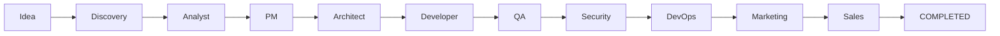

# Architecture

> **Primary Mermaid hub:** [`docs/architecture-diagrams.md`](http://5.129.212.122/Superowner/aicom/src/branch/main/docs/architecture-diagrams.md)  
> Orchestrator split: [`docs/architecture-orchestrator.md`](http://5.129.212.122/Superowner/aicom/src/branch/main/docs/architecture-orchestrator.md)

## Runtime (one container)

```
┌─────────────────────────────────────────────┐
│  Next.js :9080  (storefront + /admin SPA)   │
│       ↓ proxy /api/*                        │
│  FastAPI :8081  (REST + admin routes)       │
│  Pipeline worker + Director                 │
│  SQLite / JSON state under /app/data        │
└─────────────────────────────────────────────┘
```

## Pipeline (simplified)



Conditional gates (not every product): Methodologist, Design Critic, Hardening.

## State persistence

| Store | Path |
|-------|------|
| Pipeline DB | `data/state/pipeline.db` (when SQLite mode on) |
| Per-product | `data/state/products/`, `data/state/pipeline.json` |
| Sandbox builds | `data/sandbox/` |
| LLM audit | `data/logs/llm_calls.jsonl` |

Admin routes split under `web/backend/api/admin/dashboard/routes_*.py` (SRP modules).

## Storefront flow

Public vitrine reads filtered **ready** products; sandbox serves generated HTML/JS via `/api/sandbox/file/...`.

## Comparison positioning

Self-hosted MIT pipeline vs hosted builders — transparency, own keys, forkable gates. See [[Home]] Positioning section.

## Grafana

Metrics map in architecture-diagrams doc; enable compose monitoring profile.
